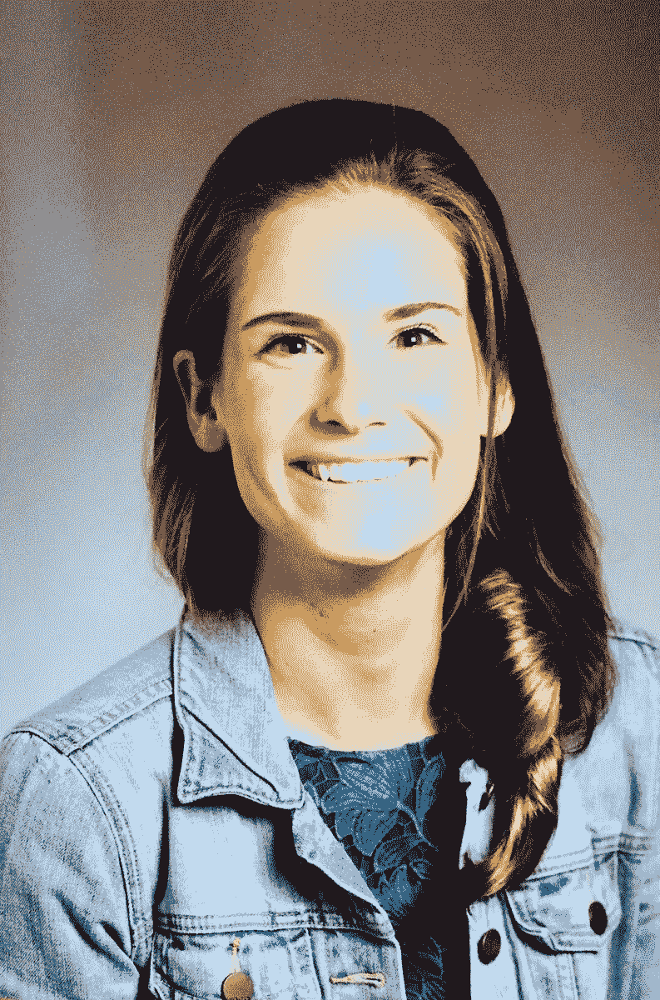

# 2018 年 Rev 的多样性和包容性

> 原文：<https://www.dominodatalab.com/blog/diversity-and-inclusion-at-rev-2018>

By Grace Chuang, Manager of Sales Development, Domino Data Lab on September 04, 2018 in

[Rev](https://rev.dominodatalab.com/) 2018 年是多米诺数据科学领袖峰会的开幕日，[我们很高兴通过我们的多米诺多样性&包容性俱乐部旅行资助将新鲜的想法](https://www.dominodatalab.com/blog/domino-diversity-inclusion-club-providing-rev-travel-grants/)带到这次活动中。我们的目标是通过为不同的申请者提供旅行和住宿，为打破阻碍数据科学专业多元化和包容性的障碍做出贡献。

我们询问了我们的 Domino 多样性和包容性赠款接受者关于 Rev 的一些收获，以及是什么让他们来参加会议。你可以在下面读到它们(为了篇幅和清晰起见，编辑了一些摘录):

## 玛丽琳·费雷拉

## 关于玛丽莲

Marielen 是巴西跨国软件公司 TOTVS 的数据科学家，之前曾与 CERN 合作，研究神经网络应用、3D 声音的开发以及通过蓝牙低能量处理通信信号以感知人类存在。她共同创立了圣保罗机器学习和数据科学女性分会。

## 玛丽琳的 Rev 体验

> 数据责任(通过道德数据科学产生积极的社会影响)小组让我思考我的工作，以及我真的希望我的同事们开始讨论这样的话题。很荣幸能和韦斯·麦金尼(熊猫的创造者)在一起，这让我对开源项目有了更多的思考。我等不及明年去了！

## 拉蒙·耶佩斯

## 关于雷蒙

Ramon 正在加州萨克拉门托的太平洋大学攻读数据科学硕士学位。他最近以统计学家的身份在美国农业部工作，对数据科学的基本概念感兴趣(创建算法、利用大型信息数据库以及在公司内部应用经济概念)。他有着广泛的生活经验，之前曾在墨西哥领事馆和美国驻西班牙马德里大使馆工作。

## 拉蒙的牧师经历

> 作为数据科学专业的研究生，参加 Rev 大会是一次宝贵的经历。我能够了解数据科学社区的当前问题。例如，一个持续的主题是，我们需要标准化数据科学领域的一些流程，以提高公司的生产力。总的来说，会议很棒。我以后一定会以数据科学家的身份参加。

## 特里萨·格伯特

## 关于特里萨

Theresa 目前正在卡内基梅隆大学攻读统计学和机器学习博士学位。她的研究侧重于从照片中了解癌前细胞的特征，长期目标是开发完全预防癌症的药物。她特别热衷于让非统计研究人员理解和探索他们的数据。在空闲时间，她为非营利组织提供免费的统计咨询。

## 特里萨的牧师经历

> Rev 是少有的兑现承诺的会议。作为一名学者，我希望从行业领导者那里了解行业挑战和可行的解决方案，并与现任和有抱负的领导者讨论数据科学文化。演讲人平易近人，话题从数据科学中的伦理问题到特征选择的蒙特卡罗方法。我能与之交往的与会者的素质给我留下了深刻的印象。我的亮点是与谷歌首席数据科学家 Cassie Kozyrkov 讨论数据科学培训。

[Twitter](/#twitter) [Facebook](/#facebook) [Gmail](/#google_gmail) [Share](https://www.addtoany.com/share#url=https%3A%2F%2Fwww.dominodatalab.com%2Fblog%2Fdiversity-and-inclusion-at-rev-2018%2F&title=Diversity%20and%20Inclusion%20at%20Rev%202018)