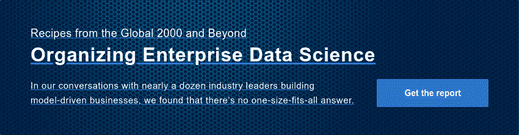

# 优秀需要一个中心吗？

> 原文：<https://www.dominodatalab.com/blog/do-you-need-a-center-to-be-excellent>

云分析主管 Brian Loyal 和拜耳作物科学公司数据科学副总裁 Naveen Singla

*编者按:这是分享开发企业数据科学战略的公司最佳实践的系列文章的一部分。一些文章将包含关于他们使用 Domino 的信息。*

几年前，我们加入了越来越多为数据科学创建卓越中心(COE)的公司行列。德勤的一项调查发现，超过三分之一的大公司有卓越中心或能力中心。[麦肯锡认为，在成功扩展高级分析的公司中，这一数字高达 60%。](https://www.mckinsey.com/industries/financial-services/our-insights/building-an-effective-analytics-organization)

当时，数据科学工作正在拜耳作物科学蓬勃发展，业务部门正在培养自己的从业人员骨干，以便他们可以利用高级分析和机器学习能力。但是，随着越来越多的数据科学用例出现在业务的不同角落，我们希望确保我们有正确的防护栏。这让我们从组织的角度重新评估我们如何管理数据科学，并最终创建一个 COE 来帮助制定治理数据科学的企业战略。从那时起，我们的 COE 扩展了其章程，以培养通用能力和最佳实践来实现大规模数据科学。

最终，我们学到的是，让一个团队专注于跨越组织和最佳实践的问题有很多好处。

听听 Brian Loyal 讨论拜耳作物科学为何推出 COE。

[https://www.youtube.com/embed/JvcNujw3fzw](https://www.youtube.com/embed/JvcNujw3fzw)

## 有什么优势？

对我们来说，这些优势包括:

*   数据科学团队之间更好地共享知识。例如，我们观察到从业者对代码和模型的重用增加，这有助于加速新数据科学产品的开发。
*   COE 致力于解决跨多个业务部门的重大挑战，例如让从业者更容易挖掘基因组数据，从而提高数据科学的效率。
*   将数据科学和业务战略更好地与侧重于数据科学能力的投资结合起来，这是领导者们正在努力实现的。
*   改善人才获取，重点关注数据科学社区和知识共享，吸引高性能数据科学家的关注。

## 一路走来，我们学到了什么？

建立一个 COE 或任何类型的中心都不容易。在我们与致力于实施或扩展其企业数据战略的其他人的交谈中，我们通常会提出以下建议:

### 等到你达到临界质量

虽然我们认为“中心”(在我们的案例中，COE)对于从企业角度治理数据科学很重要，但不要从第一天就设置它。让实践成长一点，然后看看什么时候你达到了需要一个管理机构的临界质量。

在 Bayer Crop Science，当我们开始构建 COE 时，有 200 多名数据科学从业人员在业务部门工作。我们最初的战略直接聚焦于公司领导日益增长的担忧，这使我们能够比其他方式更快地获得关注。

### 思考如何增加价值

一旦我们的 COE 解决了眼前的治理问题，我们就将注意力转向确定加速数据科学价值的方法。我们称之为“COE 重启”,并成立了两个关键运营团队来支持我们的工作:

*   与研发、供应链和商业等关键业务部门保持一致的垂直团队，帮助他们实现收入和成本削减目标。在这里，我们的 COE 员工主要识别和交付总体数据科学功能，如预测定价模型或基因组学模型，这可能有利于多个业务部门或职能部门。如果业务线还没有数据科学和分析团队，我们的卓越中心将填补空白，帮助开展特定于业务线的数据科学项目，同时业务线领导开始组建自己的数据科学团队。
*   一个横向团队，其任务是构建可以惠及所有人的基础能力和实践。这包括实现 [Domino 数据科学平台](https://www.dominodatalab.com/)以使孤立的团队更容易共享数据、代码和模型，并建立社区建设实践以进一步鼓励协作。我们认为这种对社区的强调是至关重要的，并产生了倍增效应。例如，全公司从业者之间自发的聚会和论坛现在已经变得司空见惯，创造了一个自我维持的协作和知识共享循环。

### 听听那些在战壕里的人

通常，集中式团队和业务之间会有一些摩擦，因为联合团队担心公司法令会阻碍业务目标的实现。为了解决这个问题，我们采取了自上而下和自下而上的方法。这包括创建一个数据科学委员会，将整个公司的数据科学领导者和高级数据科学员工聚集在一起，以塑造组织内数据科学的未来。该委员会确保每个企业的数据科学团队在新流程中拥有发言权，并在决策中感受到主人翁感，这有助于确保采用新功能，并克服在标准化流程和实践方面出现的不可避免的障碍。

### 衡量你的成功

这对于提升数据科学的总体价值，尤其是卓越中心的工作价值至关重要。我们跟踪许多不同的指标，包括:

*   采用数据科学来推动更好的业务成果，例如为推动业务决策而部署的模型数量，以及基于数据科学做出的业务决策数量。
*   模型的财务影响。在一些地区，比如 R&D，一个新产品可能需要长达 7 年的时间才能上市并产生财务回报，我们不仅仅关注传统的投资回报。例如，我们经常关注 R&D 项目的“命中率”——每一步有多少产品成功进入管道——着眼于持续改进。我们希望这个数字逐年上升，过去几年我们已经看到了积极的趋势。

我们还对公司中从事或支持数据科学工作的任何人进行年度调查，以了解哪些工作有效，哪些工作无效。这些调查揭示了令人惊讶的见解，这些见解导致了我们做事方式的改变。

没有让数据科学规模化的灵丹妙药。尽管如此，我们发现拥有企业数据科学战略有助于我们更快实现这一目标。这些实践，还有其他的，可以帮助铺平道路。

观看名为“利用最佳科学推动成果的最佳实践”的网络研讨会，我(Brian)将与一家领先保险解决方案提供商的数据科学总监 Matt Cornett 和一家全球金融情报公司的人工智能工程总监 Patrick Harrison 一起讨论更多最佳实践。

