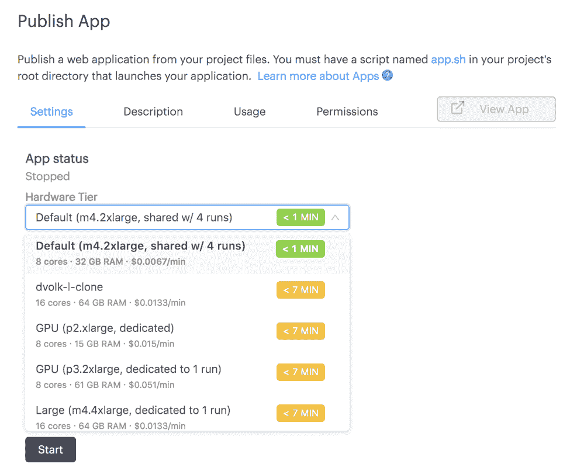

# Domino 3.0:帮助世界运行在模型上的新特性和用户体验

> 原文：<https://www.dominodatalab.com/blog/domino-3-0-new-features-and-user-experiences-to-help-the-world-run-on-models>

*这篇博文介绍了 Domino 3.0 的新特性。Akansh Murthy 是 Domino 的技术产品经理，之前在 Domino 和 Kareo 担任软件工程师。*

## 介绍

Domino 3.0 通过消除模型操作瓶颈、加速研究和生产力，简化了数据科学家的生活。正如去年 5 月我们的数据科学领袖峰会 [Rev](https://blog.dominodatalab.com/model-management-era-model-driven-business/) 所述，将数据科学集成到组织中需要一个平台，该平台不仅要支持数据科学家的需求，还要支持使用数据科学家工作的业务利益相关者和支持数据科学家基础架构的 it 人员的需求。

为此，我们很高兴发布 Domino 3.0！

此版本包括两个主要的新功能领域，可满足客户的普遍要求:

*   发布和发现数据科学“应用”的简单方法(例如，Shiny、Flask、Dash 等。)
*   用于了解数据科学组织中跨工作负载的计算使用情况的工具。

我们还改进了 UI，使导航和搜索更加高效，并扩展了平台 API，使 Domino 更容易集成到专有工作流中。最终，这些新功能使我们更接近于我们更广阔的愿景[模型管理](https://blog.dominodatalab.com/model-management-era-model-driven-business/)。

## 应用发布和启动板

在与我们的 data scientist 用户进行多次访谈后，我们意识到他们被迫经历许多内部障碍，只是为了扩展他们工作的基础架构，延长了让他们的工作可见并可获得反馈的时间。

有了 Domino 3.0，数据科学家可以完全控制应用的发布，而不需要 IT 和 DevOps 团队的参与。具体来说，新的发布流程支持对应用运行的硬件进行定制，以根据应用所需的资源、标题和描述、应用的使用统计数据以及查看应用的精细权限进行适当扩展。

应用程序发布后，可以在 Launchpad 中查看，launch pad 是一个门户网站，业务利益相关方可以在其中发现和访问您发布的应用程序。这样可以将应用快速交付给利益相关方，从而获得快速反馈。

我们建立了灵活的许可机制，因此您可以控制谁可以访问您的应用程序，或者是否应该公开发布。

Domino 还可以跟踪您的应用程序被使用的频率以及谁在使用它们。这可以让您了解您的数据科学工作是否以您期望的方式得到利用，并提供一种方式来展示其在您的组织中的影响。

我们认为 Launchpad 将成为游戏规则的改变者，让数据科学的工作对组织中的其他人可见，加速协作和模型迭代。

## 控制中心

我们还不断听说，IT 管理员和数据科学领导者希望获得粒度级别的成本信息，这将有助于他们做出决策，例如在哪里分配更多硬件，以及查看哪些项目的成本最高。基于这一认识，我们希望整合这些信息，使其易于查找和分析；于是，控制中心诞生了。

控制中心可让您了解整个数据科学组织的计算支出和使用情况，以便做出更明智的资源分配和成本控制决策。

此信息还可以按用户、项目或硬件类型进行筛选，以获得更精细的成本分配。

为了允许更多的定制，我们[通过一个 API](https://support.dominodatalab.com/hc/en-us/articles/360017477692) 公开这些数据，该 API 设计用于与商业智能工具一起工作，因此用户可以将数据集成到现有的工作流和仪表板中。现在，管理员可以使用 Tableau 等工具分析平台活动，甚至可以将数据拉回到 Domino，在 Jupyter 中进行分析或用 Shiny 显示。

这仅仅是 Domino 自动捕获的迷人的元数据类型的开始，我们很高兴能够继续致力于揭示更多的元数据，以帮助我们的用户管理他们的数据科学组织。

## 新的用户体验和用户界面

我们更新了用户界面的外观，以简洁的外观简化了工作流，让我们的数据科学家用户更容易看到关键产品领域和工具。

新的导航位于侧面而不是顶部，可折叠以允许更多的屏幕空间，这对数据科学家来说是宝贵的，它定义了 Domino 的三个不同区域(实验室、启动板和控制中心)。这允许不同的用户在 Domino 产品中有各自的家——实验室中的数据科学家、Launchpad 中的模型消费者和控制中心中的 IT 管理员。

我们还重新设计了我们的搜索界面，使得搜索结果可以从产品的任何部分的导航栏中访问。查找和重用过去工作的能力对数据科学家来说非常重要，因此我们希望在不离开当前环境的情况下更快地找到有用的内容。我们的搜索引擎索引了平台中所有工作的文件、评论、结果和实验元数据。

我们对收到的早期反应感到兴奋，并相信我们的重新设计朝着为最终用户提供更流畅体验的方向迈出了一步。

## 公共 API

最近，我们看到一种趋势，即客户构建自己的用户界面，但仍然希望与 Domino 交互。为了便于 API 访问关键的 Domino 功能，我们发布了许多新的 API，可供客户或任何感兴趣的开发人员使用。这些 API 为 Domino 提供了一个全新的生态系统，我们计划公开提供更多的 API。[查看我们的 API 文档](https://dominodatalab.github.io/api-docs/)了解更多信息。

## 今后

通过减少模型操作瓶颈和提高数据科学家的工作效率，使模型产品对业务利益相关者更加可见，并向 IT 管理员和数据科学领导者公开重要的计算支出数据，Domino 3.0 成为一个端到端平台，可帮助组织构建[模型管理](https://blog.dominodatalab.com/model-management-era-model-driven-business/)功能。在接下来的几个月里，我们将发布对上述新特性的增强，并提供模型监控和治理的新功能。

如果您是一名数据科学家或数据科学领导者，正在构建您的组织，并且对此感兴趣，[请观看演示](https://www.dominodatalab.com/demo/?utm_source=blog&utm_medium=post&utm_campaign=domino-3-0-new-features-and-user-experiences-to-help-the-world-run-on-models)并与我们聊天。如果你是一名对解决这样的问题(以及更多)感到兴奋的工程师，请查看我们的[职业页面](https://www.dominodatalab.com/careers/?utm_source=blog&utm_medium=post&utm_campaign=domino-3-0-new-features-and-user-experiences-to-help-the-world-run-on-models)。为让世界靠模型运转干杯！