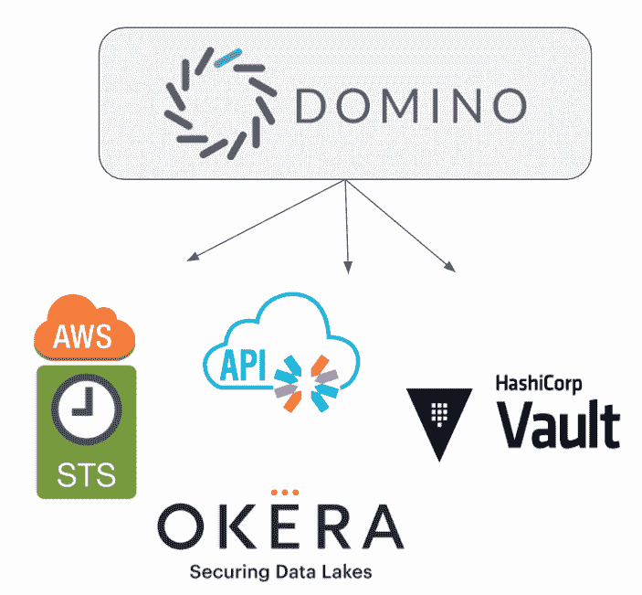

# Domino 4.3 反映了我们对企业级安全性的专注

> 原文：<https://www.dominodatalab.com/blog/domino-4-3-reflects-our-dedication-to-enterprise-grade-security>

By John Brunn, Chief Information Security Officer, Domino on September 09, 2020 in [Product Updates](/blog/product-updates/)

上周我们[宣布了](https://www.dominodatalab.com/news/domino-4-3-embraces-red-hat-openshift-making-it-easier-for-enterprises-to-scale-secure-data-science-workloads-on-any-platform/)Domino 的数据科学平台 Domino 4.3 的最新版本，这代表着企业数据科学家和支持他们的 IT 团队向前迈进了一大步。新特性包括一个新的 Domino 身份验证服务，它将帮助 IT 团队在保持安全性和控制力的同时进行扩展。

### Domino 身份验证服务

我们的客户使用 Domino 作为数据科学的记录系统，因此对用户管理有严格的要求。他们希望根据数据科学家在 Domino 系统中的地位，授予或限制对数据科学系统(如数据源或外部服务)的访问权限，这类似于您在 SSO(单点登录)系统中看到的情况。

Domino 正在扩展其企业级身份验证功能，包括通过一个短暂的 [Domino 令牌](https://docs.dominodatalab.com/en/4.3/reference/users/JWT_tokens.html) (OpenID)身份与 Domino APIs 和第三方服务建立信任的选项。任何接受 JSON Web 令牌(JWT)令牌和 Domino 的 JSON Web 密钥集(JWKS)的外部服务都可以使用这些身份令牌进行身份验证。这个功能有效地将 Domino 的身份扩展到了第三方服务。

可能利用该身份服务的一些服务包括:

*   [Okera](https://www.okera.com/) ，负责[的数据治理](https://blog.dominodatalab.com/choosing-a-data-governance-framework)
*   AWS[AssumeRoleWithWebIdentity](https://docs.aws.amazon.com/STS/latest/APIReference/API_AssumeRoleWithWebIdentity.html)，用于与 OpenID Connect 兼容的身份提供者协同工作的安全凭证
*   [保险库](https://www.vaultproject.io/)，用于对令牌、密码、证书、加密密钥和其他敏感数据进行安全访问控制
*   自定义 API

当与 Domino 健壮的 SSO 功能结合使用时，这些增强使得 Domino 管理员可以更容易地授予或撤销用户访问权，同时限制用户可以从哪里进行连接。Domino 为其客户提供了创建 API 来扩展 Domino 身份的基础，因此它对其企业数据科学工作流有更多的安全性和控制。

### 关注安全性

Domino 致力于在我们平台的各个方面提供企业级的安全性、控制和可靠性。自从五月份加入 Domino 以来，我关注的一个领域就是建立一个主动的信息安全扫描过程。今天，我很高兴地向大家报告，Domino 已经通过并超过了世界上一些最有安全意识的组织的严格审查。

作为该流程的一部分，我们对内部流程和工具进行了重大改进，以符合企业应用程序监控和安全报告要求，例如:

*   Domino 日志可以暴露给兼容 [Fluentd](https://www.fluentd.org/) 的聚合工具
*   应用健康指标可以集成到普罗米修斯监控系统中
*   容器和依赖项支持漏洞扫描和补救

财富 100 强中超过 20%的公司都是达美乐的客户。与这些公司的 IT 部门密切合作，帮助我们调整了发展路线图，以满足他们支持大规模企业数据科学的独特需求。Domino 4.3 是这种不懈努力的最新成果，它确保满足最苛刻的安全和控制要求，并且经常超出这些要求。

### 了解更多信息

*   了解达美乐 [SOC 2 Type II 认证](https://www.dominodatalab.com/blog/domino-receives-soc-2-type-ii-certification/)。

[Twitter](/#twitter) [Facebook](/#facebook) [Gmail](/#google_gmail) [Share](https://www.addtoany.com/share#url=https%3A%2F%2Fwww.dominodatalab.com%2Fblog%2Fdomino-4-3-reflects-our-dedication-to-enterprise-grade-security%2F&title=Domino%204.3%20Reflects%20our%20Dedication%20to%20Enterprise-Grade%20Security)