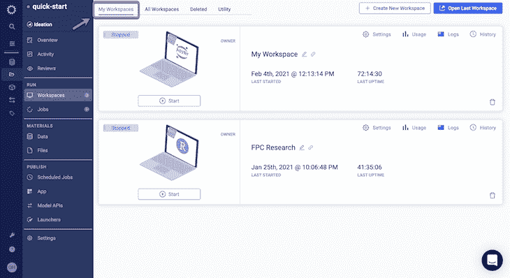
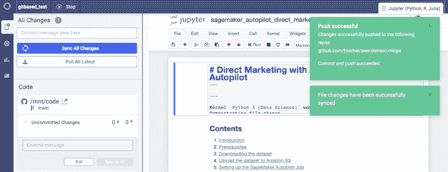
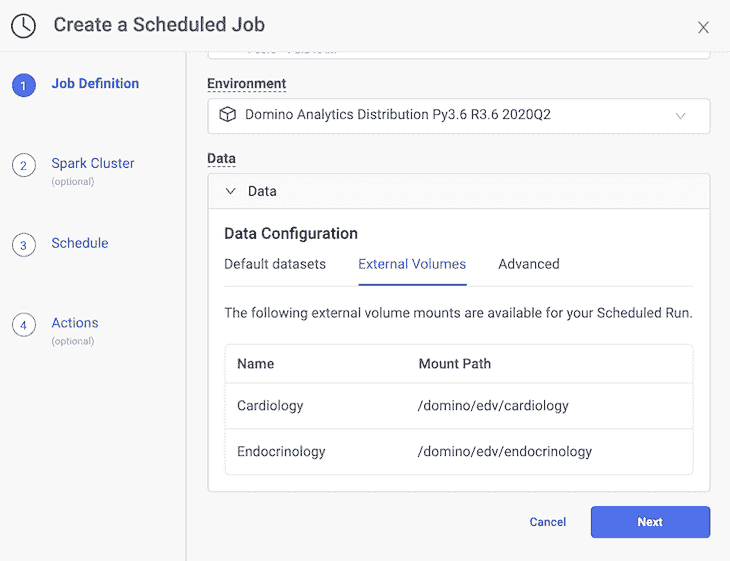

# Domino 4.4 解放了数据科学家，以最大限度地提高生产力

> 原文：<https://www.dominodatalab.com/blog/domino-4-4-liberates-data-scientists-to-maximize-productivity>

By Bob Laurent, Sr. Director of Product Marketing, Domino on June 21, 2021 in [Product Updates](/blog/product-updates/)

去年 3 月，当新冠肺炎效应刚刚开始影响企业时，数据科学家站在许多公司的第一线，快速重建模型，帮助高管在前所未有的时期导航。现在，随着世界重新开放，公司正在适应新常态，数据科学家再次分析数据，构建(和重建)模型，并帮助进步的公司利用新的数据科学用例，在某些情况下，全新的商业模式。

如果 15 个月前不清楚，现在当然清楚了。数据科学家正在推动世界上最复杂的公司解决世界上最重要的问题。11 月，我写了为什么数据科学家仍然是“21 世纪最性感的工作”，这是在托马斯·达文波特和 D.J .帕蒂尔[在《哈佛商业评论》发表这一观点](https://hbr.org/2012/10/data-scientist-the-sexiest-job-of-the-21st-century)近十年后。Glassdoor 将“数据科学家”列为 2016-2019 年的“全美最佳工作”，在 2020 年初跌至第三位后，[在 2021 年又回到了第二位](https://www.glassdoor.com/List/Best-Jobs-in-America-LST_KQ0,20.htm)。

## 数据科学家是特殊的

为什么？他们所做的事情需要独特的技能、见解和经验，这是一项高度复杂的工作，部分是科学，部分是艺术。他们需要深入的业务领域专业知识，还需要使用最新的数据科学工具和技术进行创新的自由和灵活性。他们还需要访问强大的基础设施，包括 GPU 和分布式计算框架，以执行复杂的分析，这是他们日常工作的一部分。

许多公司，尤其是拥有大型数据科学团队的公司，理解这一需求，但不知不觉地给数据科学家设置了障碍，限制了他们的生产力。例如:

*   数据科学家无法获得他们需要的工具和计算，并且经常花更多的时间来解决 DevOps 挑战，而不是进行高效的数据科学工作。
*   他们无法找到并重用过去的工作。数据科学家浪费宝贵的时间在每个项目上“重新发明轮子”,因为数据科学没有既定的标准或最佳实践。
*   模型和模型工件(例如，应用程序/API)需要迭代，但是使用不同的工具、语言和包(以及每种的不同版本)使得很难与其他数据科学家和业务利益相关者协作。
*   当没有一致的工作方式时，将模型投入生产是缓慢而困难的。如果一个模型幸运地进入生产，不一致或不存在的模型监控实践会消耗大量数据科学家的时间。

数据科学家想要的自由和灵活性往往与其坚持的控制和治理相冲突。公司必须做出权衡，因此，数据科学家经常被迫使用功能有限的解决方案，并且不能自由地在手头工作的最佳工具之间切换。

## 多米诺倡导数据科学家

我们知道，当数据科学家不必考虑如何让技术发挥作用，从而可以专注于手头的业务问题时，他们处于最佳状态。我们的平台一直为数据科学家提供自助工具和可扩展计算，帮助他们提高工作效率。我们相信让他们以自己喜欢的方式工作，这样他们可以更快地开始工作并立即提高工作效率，而不必再浪费时间在开发运维问题上来解决基础架构挑战。

> “有了 Domino Data Lab，他们可以自由地做他们需要做的事情，而且他们从来不会对技术有任何疑问——因为他们只是继续做下去。就像音乐家弹钢琴，或者拿起小提琴。”–Topdanmark 机器学习主管 Stig Pedersen

**今天，我们自豪地[宣布](https://www.dominodatalab.com/news/domino-4-4-boosts-data-scientists-ability-to-work-the-way-they-want-and-maximize-productivity/)多米诺 4.4。**此版本以这一愿景为基础，提供了重新想象的工作空间体验——面向数据科学的下一代数据科学工作台，数据科学家最大限度提高工作效率所需的最重要功能触手可及。你可以把这想象成一架现代 F-35 战斗机的驾驶舱，信息随时可用，飞行员需要的所有最重要的能力都触手可及。

")

## 新功能有助于最大限度地提高工作效率

大多数供应商强迫数据科学家进入一个连续的工作流，包括打开一个工作区，完成工作，提交结果，然后在进入下一个任务之前关闭工作区。使用 Domino 4.4 中的持久工作区，数据科学家可以在并行工作流中操作，在并行工作流中可以同时打开多个开发环境，以获得最大的生产率。用户可以根据需要启动、停止和恢复工作区会话(以节省基础设施成本)，工作在会话之间持续进行。这确保了他们永远不会丢失工作，并且能够在任何他们想要的时候将他们的工作提交给版本控制。

Domino 自动跟踪实验的所有工件，因此数据科学工作是可再现的、可发现的和可重用的——增加了数据科学团队的吞吐量并降低了监管风险。这些工件被记录为 Domino 文件系统(DFS)的一部分，但许多公司更喜欢使用基于 Git 的集中式代码存储库(例如， [GitHub](https://github.com/) 、 [GitLab](https://about.gitlab.com/) 、 [Bitbucket](https://bitbucket.org/) )，以便数据科学代码可以与其公司 CI/CD 工作流的其余部分集成，从而提高合规性和治理。

Domino 市场领先的再现能力现在通过 CodeSync 得到了增强，因此数据科学家可以在他们业务中使用的现代 IT 堆栈中无缝工作。CodeSync 支持所有的[通用 Git 工作流](https://www.atlassian.com/git/tutorials/comparing-workflows/feature-branch-workflow),比如创建分支、提交代码、推送更改等等——所有这些都可以在 Domino 工作区内与您选择的 Git 服务提供商进行交互。这种 Git-first 的体验让用户能够更好地控制复杂工作流的同步和版本控制，并使他们能够轻松地与其他团队成员进行版本控制、基于代码的协作。

数据科学家希望利用来自多个来源的各种不同类型的数据来进行更好的实验。基于云的解决方案需要将数据复制到云中，这带来了安全性和同步问题。在 Domino 4.4 中，我们让连接到外部 NFS 卷变得更加容易，这样数据科学家就可以在 Domino 之外使用更多类型的数据进行更多的实验。而且，他们不必像使用不灵活的云供应商工具那样移动数据。

但是，有时有必要在站点之间移动数据，如果通信被拦截，这将使数据面临风险。我要提到的最后一个特性本身并不是生产力的提高，但它会让数据科学家和 it 团队睡得更香。Domino 4.4 支持传输中的[加密和传输层安全性(TLS)——一种保护传输中数据的行业标准方法。](https://admin.dominodatalab.com/en/latest/kubernetes/encryption-in-transit.html)

## 包裹

这些新功能使有经验的数据科学家更容易最大限度地提高他们的工作效率，但它们也使新的和新手数据科学家受益，因此他们可以更快地加入进来，并更快地以有意义的方式做出贡献。我们的新工作空间体验消除了许多新数据科学家在其他平台上面临的关于设置环境、管理库、启动工作空间等的“冷启动”障碍。我们向 IT 团队展示了这一点，让他们意识到他们可以为新用户提供受监管的安全访问，并在适当的位置安装护栏，以防止丢失工作、意外运行和巨额云计算账单。

现有的 Domino 客户现在可以升级到新版本。如果您不是 Domino 客户，请考虑一下 Forrester Consulting 在分析 Domino Enterprise MLOps Platform 的[总体经济影响时得出的结论。](https://www.dominodatalab.com/domino-business-impact-forrester-tei-report/)

[Twitter](/#twitter) [Facebook](/#facebook) [Gmail](/#google_gmail) [Share](https://www.addtoany.com/share#url=https%3A%2F%2Fwww.dominodatalab.com%2Fblog%2Fdomino-4-4-liberates-data-scientists-to-maximize-productivity%2F&title=Domino%204.4%20Liberates%20Data%20Scientists%20to%20Maximize%20Productivity)