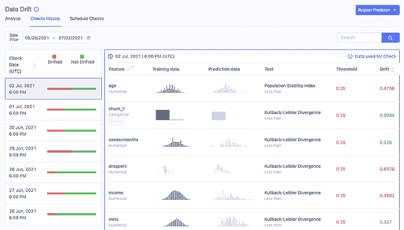

# Domino 4.6:模型驱动业务的更大信心和灵活性

> 原文：<https://www.dominodatalab.com/blog/domino-4.6-delivers-greater-confidence-and-flexibility-for-the-model-driven-business>

By Bob Laurent, Sr. Director of Product Marketing at Domino on September 16, 2021 in [Product Updates](/blog/tag/product-updates)

在过去五年中，数据科学变得越来越复杂:

*   数据科学家必须处理的数据量呈指数级增长

*   数据科学家使用的技术已经变得如此计算密集，以至于他们需要多核 CPU、GPU 和分布式计算

*   人们依赖模型来支持最关键的业务决策，每天都有大量的预测

尽管数据科学家曾经能够在笔记本电脑上本地开发和运行代码，但如今他们通常需要更多基础架构才能取得成功。更多的基础架构通常意味着对复杂开发运维工作的更多要求，以及数据科学家的时间浪费。而且，随着越来越多的公司变得以模型为导向，数据科学家发现他们需要分配更多的时间来监控生产中的模型，否则就有可能让他们的首席信息官以各种错误的理由登上华尔街日报的封面。

## Domino 4.6 简介

幸运的是，Domino 用户可能无法理解他们的同行每天面临的基础设施和模型监控挑战。我们在 [Domino 4.4](https://www.dominodatalab.com/news/domino-4-4-boosts-data-scientists-ability-to-work-the-way-they-want-and-maximize-productivity/) 中介绍了我们的下一代数据科学工作台，今天我们将推出 [Domino 4.6](/news/domino-data-lab-upgrades-enterprise-mlops-platform-to-support-model-monitoring-at-100x-scale-across-all-major-public-clouds) ，它提供了企业级模型监控的附加选项、分布式计算的选择以及许多其他创新和改进，我很高兴能够与大家分享。您马上就会看到，Domino 4.6 提供了:

*   *对运营您业务的模型更有信心，*在每天数百个功能和数十亿次预测的规模上

*   *提高灵活性*数据科学家可以自助访问手头任务/项目的最佳工具和基础设施，包括 Ray.io 和 Dask 分布式计算

*   *无缝的用户体验*以一致、完全集成并符合最佳实践的方式完成数据科学家需要完成的重要工作

## 企业级模型监控

最近由韦克菲尔德研究公司和多米诺数据实验室 进行的一项 [调查显示，82%的美国大公司(年收入超过 10 亿美元)的数据高管表示，他们的公司领导层应该担心糟糕或失败的模型可能会给公司带来严重后果。然而，DataIQ](https://www.dominodatalab.com/resources/data-science-needs-to-grow-up/) 最近的另一项 [调查显示，近 27%的商业领袖依赖于特定的流程进行模型监控，或者只是不知道模型是如何被审查的。只有 10%的人使用自动化模型监控功能来帮助他们确保运行关键业务功能的模型反映当今快速变化的业务环境。](https://www.dominodatalab.com/resources/dataiq-survey-how-to-scale-data-science/)

正是考虑到这些挑战，我们很兴奋地宣布我们新的 *Domino 弹性监控引擎*。这一突破性的技术进步使 [多米诺模型监视器(DMM)](https://www.dominodatalab.com/product/domino-model-monitor) 能够在数十亿次每日预测中计算数据漂移和模型质量——是以前版本的 100 倍以上！

DMM 现在可以无限扩展模型监控容量，以支持最苛刻的监控要求。它可以接收和分析来自亚马逊 S3 和 Hadoop 兼容文件系统(HCFS)的海量数据，其中包括 Azure Blob Store、Azure Data Lake (Gen1 和 Gen2)、谷歌云存储和 HDFS。不需要在存储位置之间复制数据，因此可以立即分析数据，而不用担心版本控制、安全性和其他可能会质疑模型准确性的问题。

如果您一直在推迟添加自动化模型监控，您会危及您公司的声誉、竞争力，最重要的是，它的底线。这是另一个诱因。有了 Domino 4.6，DMM 可以与我们的核心产品一起安装在任何环境中，包括所有主要的云平台(AWS、GCP 和 Azure)，如果您更喜欢的话，还可以安装在本地。通过单点登录(SSO)和跨整个 Domino Enterprise MLOps 平台的其他集成，用户可以获得从模型开发到部署再到监控的无缝体验。

## 分布式计算选择

对于数据科学家来说，为特定工作选择和使用最佳工具的能力极其重要。这就是为什么多年来 Domino 的一个指导原则是拥抱最好的开源和商业工具、包、语言、数据源等等——并以消除典型 DevOps 挑战的方式将它们合并到 Domino 中。这一理念延伸到了分布式计算环境，在这种环境中，我们已经支持了短暂的 Spark 一年多，为数据科学家提供了一种极其简单的方式来将 Spark 添加到他们的工作环境中。

在 Domino 4.6 中，我们增加了对按需和 [Dask](https://dask.org/) 的支持——这是开源社区中出现的两种最热门的分布式计算形式。如果你不熟悉分布式计算，它允许数据科学家处理大量数据，用于机器学习和其他复杂的数学计算，如深度学习。这两个框架都利用了最先进的机器学习库，可以轻松地扩展单机应用程序，以解决更强大的机器学习问题，而对底层代码几乎没有或根本没有更改。

Ray 的核心是一组核心低级原语( [Ray Core](https://docs.ray.io/en/latest/walkthrough.html) )，它们为分布式训练、超参数调整和强化学习提供了巨大的价值。Ray 已经被 [许多开源 ML 框架](https://docs.ray.io/en/latest/ray-libraries.html#ray-oss-list) 采用为基础框架，这些框架现在有社区维护的 Ray 集成。Dask 还提供了许多与现有数据科学库的集成，使其成为并行化现有基于 Python 的数据科学代码的最佳选择，只需进行最小的调整。对于使用 [Pandas](https://docs.dask.org/en/latest/dataframe-best-practices.html) 和 [NumPy](https://docs.dask.org/en/latest/array-best-practices.html) 库或 [Scikit-learn](https://docs.dask.org/en/latest/gpu.html) 训练接口大量操作大量数据的计算来说，这是一个特别好的选择。更多关于 Ray 和 Dask 相比 Spark 的优缺点的信息，请查看 [最近的博客](https://blog.dominodatalab.com/spark-dask-ray-choosing-the-right-framework) 。

在 Domino 中创建工作区时，添加 Ray 和 Dask 集群(或者 Spark)非常容易。用户所要做的就是指定一些参数，比如工人的数量和每个工人的能力。从那里开始，Domino 将在后台完成所有繁重的工作，在底层 Domino 基础设施上建立集群，建立网络和安全规则，并在集群的整个生命周期中自动管理集群。不需要 DevOps 经验！

Domino 在真正的企业规模上对三个最流行的分布式计算框架的免开发平台支持是行业首创。这是我们对数据科学团队承诺的一部分，让他们能够为手头的工作选择最佳框架(和一般工具),而不局限于其他平台规定的单一选择，也不需要依赖 It 来创建和管理集群。

## 更多激动人心的企业 MLOps 功能

我们感到自豪和荣幸的是，超过 20%的财富 100 强企业依靠 Domino 来帮助他们克服基础设施摩擦，更轻松地协作，并帮助更快地将模型投入生产。但随之而来的是，我们有责任继续创新，以满足我们企业客户的许多独特需求。

Domino 4.6 中的其他特性包括:

*   亚马逊 EKS 的多米诺认证。我们已经将亚马逊的托管 Kubernetes 产品 [【亚马逊 EKS](https://aws.amazon.com/eks/) 整合到我们高度安全、经过全面测试和性能优化的“认证”Domino 产品系列中。在这个版本中，我们让云原生客户能够利用亚马逊 EKS 以最高的信心和操作性能运行 Domino。他们已经在人员培训、建立基础设施管理最佳实践等方面进行了投资。都可以用来简化 Domino 的安装和未来的升级。

*   **Git 库创建&浏览。**在 [Domino 4.4](https://www.dominodatalab.com/blog/domino-4-4-liberates-data-scientists-to-maximize-productivity) 中，我们宣布用户能够 [将数据科学代码](https://docs.dominodatalab.com/en/latest/reference/projects/git/index.html) 与 Git 支持的存储库(例如 GitHub、GitLab 和 Bitbucket)同步，并使他们的工作与现有 CI/CD 工作流保持一致，以改善合规性和治理。我们将这种能力提升到了一个新的水平，为创建新的 Git 存储库提供了原生支持。用户可以上下浏览 Git 树的内容并查看提交历史——所有这些都不需要离开熟悉的 Domino GUI 环境。

*   **用快照读/写 Domino 数据集。** [Domino 数据集](https://docs.dominodatalab.com/en/latest/reference/data/data_in_domino/datasets.html) 在整个 Domino 平台上提供高性能、版本化和结构化的文件系统存储。用户现在可以创建“快照”——一个项目的大量数据的精选集合——并与同事无缝共享，以保持实验的可重复性。

## 包裹

Domino 4.6 是大量用户研究和开发工作的顶点，我迫不及待地想让您使用它。如果您是现有的 Domino 客户，可以立即升级到 Domino 4.6。如果没有，您可以在为期 14 天的免费试用中体验 Domino 提供的所有企业级多点操作功能。