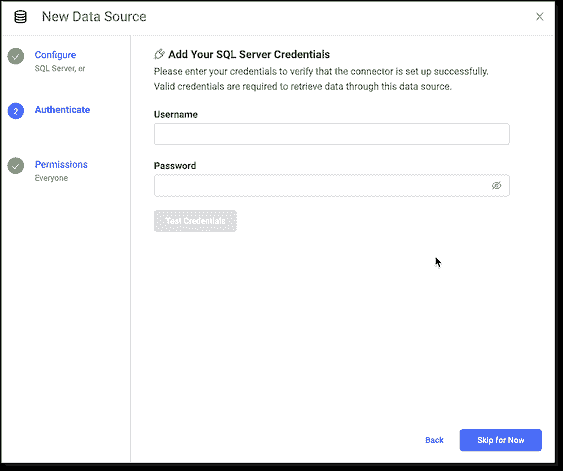

# Domino 5.1 简化了对数据源的访问，从而提高了建模速度

> 原文：<https://www.dominodatalab.com/blog/domino-5.1-simplifies-access-to-data-sources-to-improve-model-velocity>

建立一个伟大的机器学习模型通常始于获取关键数据——关于临床试验中的患者、拖欠的贷款、个体商店的交易等。尽管人们大肆宣传要创建一个“数据湖”来存放公司的所有数据，但对大多数公司来说，现实情况是数据通常位于各种不同的位置，包括内部和云中。而且，在拥有许多不同部门、不同需求和不同存储要求的大型组织中，这些位置的数量增长很快。

这就是为什么我们在 Domino 5.1 中为更多种类的数据源添加了连接器。今天发布的这个版本建立在我们在一月份将 Domino 5.0 推向市场的创新之上，为我们的许多客户提高了模型速度。通过消除常见的 DevOps 障碍，包括需要编写代码来安装驱动程序和特定库，我们使数据科学团队更容易访问重要数据。

### 它是如何工作的

上个月，Andrew Coleman 写了一篇详细的[博客](/blog/data-connectors),解释数据科学家如何使用预建的连接器作为基于表格和基于文件的数据的一致访问模式的一部分。在 Domino 5.0 中，我们为[雪花](https://www.snowflake.com/)、[亚马逊 S3](https://aws.amazon.com/s3/) 和[亚马逊红移](https://aws.amazon.com/redshift/)开发了原生数据源连接器。

|  |  |  |

今天，作为 Domino 5.1 发布的一部分，我很兴奋地宣布为[微软 Azure 数据湖存储](https://azure.microsoft.com/en-us/services/storage/data-lake-storage/)、[谷歌云存储](https://cloud.google.com/storage)、 [Oracle 数据库](https://www.oracle.com/database/)、[微软 SQL Server](https://www.microsoft.com/en-us/sql-server) 、[PostgreSQL](https://www.postgresql.org/)和 [MySQL](https://www.mysql.com/) 增加了六个连接器:

|  |  |  |
|  |  |  |

用户不用花时间编写访问数据的脚本，只需进入 Domino 中的“data”部分，单击“Connect to External Data ”,选择合适的数据源，填写基本信息，包括他们的登录凭证。就是这样！连接属性作为访问密钥和秘密密钥安全地存储在与 Domino 一起部署的 [Hashicorp Vault](https://www.vaultproject.io/) 的实例中。

Domino 5.1 还简化了对通用外部数据卷(EDV)的访问，以便在远程文件系统上装载和访问数据——允许数据科学家使用更多类型的数据进行更好的实验。Domino 列出了使用每个注册 EDV 的项目，以深入了解数据是如何使用的，以及用于什么目的。

### 结论

如果你还记得的话，我们现在已经为所有三个主要的云提供商以及雪花提供了预构建的连接器。此外，如果有一个数据源我们还没有为其构建本机连接器，用户可以创建新的连接器并与同事共享，以帮助民主化对重要数据的访问。

关于如何在 Domino 中配置数据源的详细信息，可以查看我们的[文档](https://docs.dominodatalab.com/en/5.1/reference/data/external_data/external_sources/index.html)。如果你错过了我们的 **Domino 5.0 发布会**，Atul Gawande(著名外科医生、作家和性能改进专家)和 Najat Khan 博士(首席数据科学官和强生公司让桑制药公司研发战略&运营全球负责人&，你可以在这里观看重播[。](/resources/unleashing-exceptional-performance)