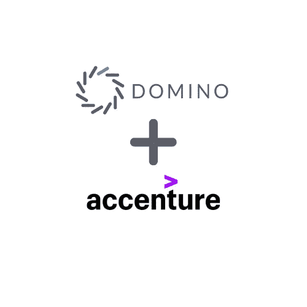

# 多米诺+埃森哲携手加速临床研究

> 原文：<https://www.dominodatalab.com/blog/domino-accenture-accelerate-clinical-research-together>

By Thomas Robinson, VP of Strategic Partnerships & Initiatives, Domino on December 02, 2020 in [Company Updates](/blog/company-updates/)

在这个疫情的关键时期，人们对如何发现和开发药物治疗的兴趣增加了——人们对科学背后的科学感兴趣。

我们在 [Domino Data Lab](https://www.dominodatalab.com/) ，领先的开放式企业数据科学管理平台的提供商，受到超过 20%的财富 100 强企业的信任，加入了埃森哲的 INTIENT Network [合作伙伴生态系统](https://www.accenture.com/us-en/services/life-sciences/intient-network)，该生态系统旨在与软件和生命科学组织合作，加速药物发现和开发工作，以改善患者结果。这意味着现在，通过 FDA 认证的 Accenture INTIENT 临床管理分析环境构建在 Domino 数据科学平台上，作为核心工作台，为制药公司提供端到端的临床试验解决方案。

INTIENT 网络是埃森哲 INTIENT 平台的组成部分。它支持整个生命科学企业的洞察力和协作，以提高从药物发现到临床研究的生产率、效率和创新。埃森哲与选定的独立软件供应商(ISV)和组织(包括 Domino 数据实验室)合作，将其技术和内容集成到 INTIENT 临床产品套件中。在 Domino 数据科学平台的帮助下，生命科学团队现在可以通过协作和完全可再现性成功测试数万个假设。

正如许多人现在通过观看和等待新冠肺炎疫苗的开发而知道的那样，在开发一种治疗方法时，需要进行大量的数据建模和统计分析。需要简化对这些数据的管理。为了解决这个问题，Domino 平台现在将在一个通用的信息学框架内提供给生命科学公司，该框架处理核心基础设施需求，如数据接收和清理、安全和 IP 管理、请求管理工作流、企业搜索、[数据治理](https://blog.dominodatalab.com/choosing-a-data-governance-framework)和协作环境。通过在 INTIENT 内部提供 Domino 数据科学平台，我们将与全球健康和生命科学研究机构在临床试验工作流程方面的专业知识带给了一批新的制药公司，推动研究创新。客户获得了一个集中化的研究平台，该平台通过技术和工具选择提供了安全性和可扩展性。

我们相信，我们在生态系统中的参与以及与 INTIENT 的集成将为科学家提供一个至关重要的工作台，支持他们解释药物开发中产生的越来越多的丰富多样的数据。

Domino 平台集中了整个企业的数据科学工作和基础设施，用于协作模型开发、培训、部署和整体生命周期管理——具有敏捷性和效率。有了 Domino，科学家和临床研究人员可以更快地创新，团队协作，并在安全性、监督和合规性方面建立在以前的工作基础上。数据科学领导者可以更好地了解项目，IT 团队可以管理和控制基础架构的使用和成本。有关该平台的更多信息，请访问[网站](https://www.dominodatalab.com/partners/accenture-intient/)。

[Twitter](/#twitter) [Facebook](/#facebook) [Gmail](/#google_gmail) [Share](https://www.addtoany.com/share#url=https%3A%2F%2Fwww.dominodatalab.com%2Fblog%2Fdomino-accenture-accelerate-clinical-research-together%2F&title=Domino%20%2B%20Accenture%20Accelerate%20Clinical%20Research%20Together)