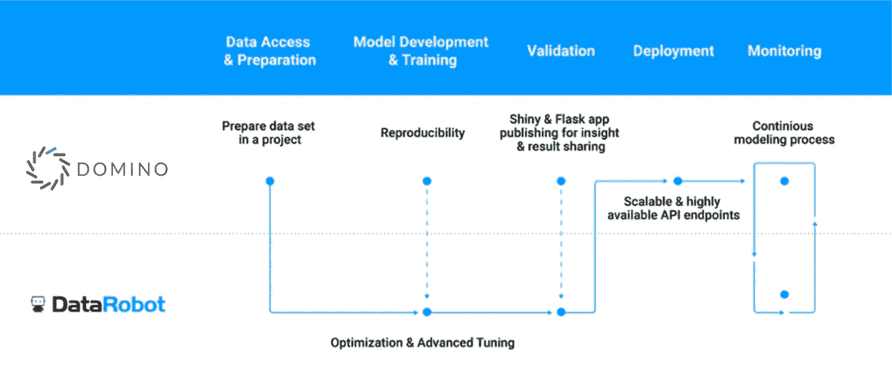

# Domino 和 DataRobot 一起提供更多价值

> 原文：<https://www.dominodatalab.com/blog/domino-and-datarobot-deliver-more-value-together>

By Karina Babcock and Dan Ganancial on March 08, 2018 in [Product Updates](/blog/product-updates/)

我们很兴奋地宣布 [DataRobot](https://www.datarobot.com/?utm_medium=techalliance&utm_source=domino) 成为 [**Rev 的**白金赞助商**，多米诺数据科学拉力赛**](//rev.dominodatalab.com) 将于 5 月 30 日至 31 日在三藩市举行！为了提供更多关于 Domino 和 DataRobot 之间合作关系的背景，下面是 DataRobot 全球合作伙伴营销总监 Dan Ganancial 写的一篇文章，最初发布在 DataRobot 博客[上。](https://www.datarobot.com/blog/domino-and-datarobot-deliver-more-value-together/?utm_medium=techalliance&utm_source=domino)

* * *

今天的预测分析项目需要大量的协作和团队合作才能成长和成功。然而，有限的资源——例如没有足够的可用的和熟练的数据科学家以及不提供高度自动化的工具——正在阻碍着即使是最优秀的团队。这是伙伴关系和协作介入解决这些限制的时刻，因为公司联合起来提供确保成功所需的资源。就像俗话说的，“三个臭皮匠，顶个诸葛亮。”两个预测分析平台协同工作比一个平台单独工作要好。这种合作体现了两家公司如何实现平衡，并在共享项目和机会方面同步合作。

DataRobot 拥有来自世界各地的各种合作伙伴，并重视这些联系。一个有效和成功合作的例子是与 Domino 数据实验室的合作。DataRobot 和 Domino 共同提供了一种独特的工具组合，使预测分析团队、数据科学家和其他领域专家能够提高工作效率，并提供项目成功所需的资源。这种合作体现了两家公司如何实现平衡，并在共享项目和机会方面同步合作。他们相互取长补短，并基于他们的共同点成功地联合起来。

### 预测建模变得更加简单

预测分析的一个主要限制是手动创建模型，这是一个耗时且充满挑战的过程，阻碍了许多公司的进步和生产力。Domino 正在申请专利的可再现性和协作引擎为您提供了一个协作编码环境，在这个环境中，您的数据科学团队可以一起工作来准备数据、开发或使用重要的模型，以及部署您的模型。

接下来是 DataRobot。我们提供自动化机器学习，帮助您的团队快速开发几十个模型来考虑，同时提供理解这些模型如何工作的透明度。DataRobot 内置的高级透明度和可视化功能使技术熟练的用户能够准确地看到某个模型是如何执行的，以及如何更好地理解底层数据。DataRobot 在其排行榜上按准确度对所有模型进行排名，允许您快速评估模型。DataRobot 的高级自动化确保您可以找到最适合手头任务的型号。

一旦选择了模型，就有多个部署选项可供选择。DataRobot 提供了[三个选项](https://www.datarobot.com/blog/data-professional-persona-how-to-deploy-ai-solutions-to-production/?utm_medium=techalliance&utm_source=domino)，Domino 允许 API 端点发布< /a >。Domino 还提供了额外的项目协作和共享，这是一种很好的方式，可以用每个参与人员的输入来完成项目。将选定的模型从 DataRobot 引入 Domino 为更多的协作和进一步的细化提供了机会。

使用 Domino 和 DataRobot 时的端到端工作流:

1.  准备数据，进行手工特征工程，并在 Domino 中构建模型
2.  将数据发送给 DataRobot，以自动构建、验证和调整更多模型供用户考虑
3.  模型验证和模型洞察可以在 DataRobot 和 Domino 中完成
4.  可以对模型进行比较，然后使用 DataRobot 部署最佳、最准确的模型，或者通过 Domino 进行额外的项目协作和共享
5.  使用 Domino 上的 Shiny 和 Flask 应用程序，可以将模型预测转化为可视化和业务决策，并且可以在 Domino 中部署完整的管道，这可以通过 API 获得

几个主要企业已经在一起使用 Domino 和 DataRobot。Domino 允许这些组织的数据科学家编写用于提取数据的脚本、特性工程，然后保存文件或使用 DataRobot API 以编程方式使用 DataRobot 构建模型。然后，数据科学家可以在 DataRobot 中探索可能模型的排行榜，发现数据中揭示的重要模式。他们还可以调整如何将预测转化为商业决策，并创建有洞察力的可视化。

从那里，数据科学家可以在 Domino 的编码器友好的笔记本环境中迭代地手工调整最佳模型，这提供了无限的库支持、版本控制和完全的可再现性——一个真正的端到端数据科学平台。

Domino Data Lab 和 DataRobot 使数据科学家能够加速模型的开发和交付。通过这种协作，两种解决方案的用户都能够获得快速模型开发、自动化机器学习、无缝协作和一键式模型部署等关键功能。这极大地提高了生产率，消除了预测建模过程中的瓶颈。

* * *

关于作者:

Dan Ganancial 领导 DataRobot 的合作伙伴营销，他负责推动与联盟和渠道合作伙伴的联合营销计划。Dan 是一名营销专家，在合作伙伴、产品和战略营销方面拥有超过 10 年的经验。在他的职业生涯中，他担任过与咨询销售、业务开发和营销相关的多个职位，在推动客户和收入增长方面取得了骄人的成绩。在推特上关注他: [@datarobotdan](http://twitter.com/datarobotdan)

[Twitter](/#twitter) [Facebook](/#facebook) [Gmail](/#google_gmail) [Share](https://www.addtoany.com/share#url=https%3A%2F%2Fwww.dominodatalab.com%2Fblog%2Fdomino-and-datarobot-deliver-more-value-together%2F&title=Domino%20and%20DataRobot%20Deliver%20More%20Value%20Together)