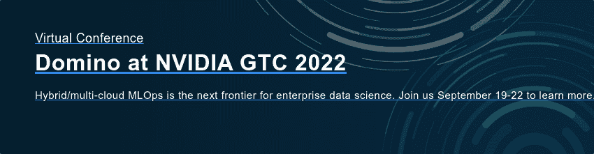

# 为什么“云”不再足够:Domino 在 NVIDIA GTC 展示混合/多云平台

> 原文：<https://www.dominodatalab.com/blog/domino-at-gtc-sept-2022>

更新日期:2022 年 9 月 23 日:参见[我们在英伟达 GTC 发布的消息:](/news/domino-data-lab-announces-new-ecosystem-solutions-with-nvidia-to-accelerate-hybrid-and-multi-cloud-mlops-journey)“Domino 数据实验室宣布与英伟达合作推出新的生态系统解决方案，以加速混合和多云端 MLOps 之旅”

人工智能和机器学习是否像最近的 [协议](https://www.protocol.com/enterprise/ai-machine-learning-cloud-data) 文章所暗示的那样，“正在远离云端”？这是最近一个流行的问题，最近 VentureBeat 的一篇文章 中也提出了这个问题，文章指出“云生态系统最大的弱点之一是难以抓住本地机会。”另一个数据点与前两个数据点一致:挑战性的宏观经济条件和日益激烈的竞争使得网飞这样的公司——曾经是通过采用云来扩大规模的典型——重新评估云成本(正如《华尔街日报》最近报道的)。

Domino 与 NVIDIA 和 Ventana Research 合作编写了一份新的白皮书，探索未来的变化。在 [*首席数据和分析高管的 5 大 AI 考虑事项*](https://www.dominodatalab.com/resources/top-5-ai-considerations-for-data-and-analytics-executives) *、* 中，我们探讨了下一代 AI 基础设施的关键因素，以有效管理复杂、混合/多云环境中的 AI/ML 工作负载。这些也是下周在 2022 年 9 月 19 日至 22 日 NVIDIA 的免费虚拟 GTC 会议上 [Domino 会议](https://www.nvidia.com/gtc/exhibitors/#/exhibitor/1598048030102001eNcv)的核心话题。

### 混合/云计算数据科学控制成本，提升性能

云的采用——特别是可扩展的按需计算的即时可用性——推动了机器学习(ML)的民主化。但随着数据科学领域的发展，云计算本身的承诺不再满足训练计算密集型人工智能和深度学习模型的复杂公司的需求。 [凯特凯耶来自礼宾](https://www.protocol.com/enterprise/ai-machine-learning-cloud-data) 备注:

> “云计算不会去任何地方，但一些公司正在将他们的机器学习数据和模型转移到他们自己内部管理的机器上。采纳者花更少的钱，获得更好的性能。”

Domino 的 [Kjell Carlsson](https://www.dominodatalab.com/blog/why-hybrid-cloud-is-the-next-frontier-for-scaling-enterprise-data-science) 补充道，模型训练计算需求会根据数据量、模型类型、超参数优化的程度 — 以及数据科学家的工作时间表而大幅波动。一种混合方法将内部计算与“突发”到云以获得额外容量的能力相结合，为不同工作负载提供了规模合适的环境的终极成本控制措施。

### 数据主权和模型延迟推动了数据和计算的共存

控制计算成本并不是这一趋势的唯一驱动力。Ventana Research 指出，数据输入和输出引入了另一个成本考虑因素，因为提取和分析 1pb 的数据可能会花费高达 50，000 美元。除此之外， [数据主权](https://www.techtarget.com/whatis/definition/data-sovereignty) 和隐私法规通常会将数据集锁定在单个地理区域内，同时需要考虑数据重力性能(例如在分布式或边缘用例中协同定位数据和计算以进行实时预测)。正如 Ventana Research 的 SVP &研究主管大卫·门宁格所说:

> “到 2026 年，几乎所有的跨国组织都将投资本地数据处理基础设施和服务，以减轻与数据传输相关的风险。”

###  

### Domino 在 GTC 英伟达展示混合/多云平台

去年六月， [Domino 宣布了](https://www.dominodatalab.com/news/domino-data-lab-announces-hybrid-mlops-architecture-to-future-proof-model-driven-business-at-scale) 其新的 Nexus 混合企业 MLOps 平台，由 NVIDIA 提供支持。从那以后，Domino 一直在努力工作，以实现无缝混合/多云 MLOps，我们渴望在 NVIDIA GTC 大会上展示令人兴奋的创新，这是人工智能和元宇宙时代的领先开发者大会。

[多米诺是钻石级赞助商](https://www.nvidia.com/gtc/exhibitors/#/exhibitor/1598048030102001eNcv) ，在 NVIDIA GTC，从 9 月 19 日至 22 日的免费虚拟会议。不要错过我们的会议:

*AI Anywhere:Johnson 如何在混合和多云计算环境中扩展数据科学*
*9 月 20 日星期二下午 2:00-2:50 PDT*

通过基于聊天的问答机会，直接与来自 Johnson & Johnson、Domino 和 NVIDIA 的专家进行实时交流。强生公司云项目办公室全球负责人 Vikash Varma 将与 Domino 战略合作伙伴和企业发展副总裁托马斯·罗宾逊以及 NVIDIA 业务开发、医疗保健和生命科学总监兼全球负责人 Rory Kelleher 一起，深入探讨在混合和云计算环境中协调数据科学工作负载的关键考虑因素。[点击此处](/resources/videos/how-jnj-scales-data-science-hybrid)查看会议点播。

*面向混合云未来的下一代人工智能基础设施(与 NetApp 和 NVIDIA 共同展示)* *按需提供 9 月 19 日*

Domino、NetApp 和 NVIDIA 一直在合作，为企业范围的数据科学治理、跨团队协作和运营效率提供所需的人工智能卓越中心和整体解决方案。我们将展示我们的最新解决方案，以帮助在混合环境中实现无缝数据科学和数据管理，因此不要错过与产品专家的这次会议。[点击此处查看专题讲座点播。](/resources/videos/netapp-domino-next-generation-ai-infrastructure)。

想知道更多我们将在 NVIDIA GTC 发布的预览吗？下载 Ventana Research 的 [*首席数据和分析高管的 5 大 AI 考虑事项*](https://www.dominodatalab.com/resources/top-5-ai-considerations-for-data-and-analytics-executives) ，了解在混合/多云中扩展企业数据科学的关键考虑事项。