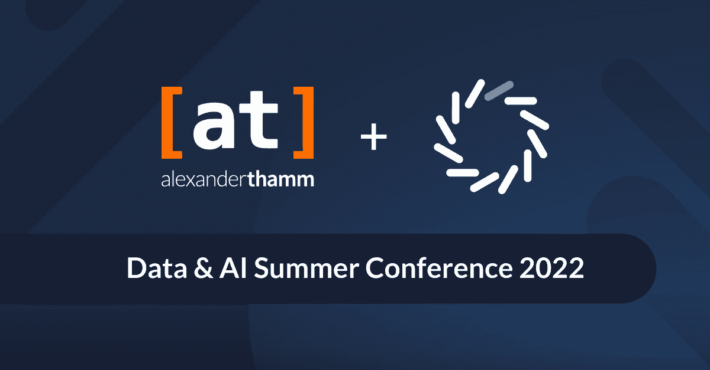

# Domino 数据实验室和 Alexander Thamm 在数据和人工智能夏季会议上推出数据科学之旅加速器

> 原文：<https://www.dominodatalab.com/blog/domino-data-lab-and-alexander-thamm-debut-data-science-journey-accelerator-at-data-ai-summer-conference>

Domino Data Lab 和[Alexander Thamm](https://www.alexanderthamm.com/en/)GmbH[at]是德语国家数据驱动创新和商业模式战略开发和实施的领导者，将于今天在 Alexander Thamm 的数据和人工智能夏季会议上首次推出独家联合服务产品——数据科学之旅加速器(DSJA)。

旨在帮助德国、澳大利亚和瑞士的客户加快建立模型驱动的竞争优势，DSJA 将 Domino 的企业 MLOps 平台与 Alexander Thamm 的数据科学和人工智能咨询专业知识相结合，提供一套涵盖数据运营和数据科学生命周期的基础元素，企业可以在不牺牲数据科学或 IT 团队需求的情况下扩展数据科学，以满足严格的数据隐私法规的需求。

**打造 DACH 梦之队**

虽然大多数公司了解数据科学的前景，但知道从哪里开始是一项挑战。根据商业应用研究中心 的 [最近的一项研究，数据运营和 MLOps 被广泛认为是解决常见 ML 挑战和问题的相关概念，但只有 50%已经使用 ML 的公司开始实施它们。](https://barc-research.com/press-release-dataops-mlops-ml-challenges/)

Domino Data Lab 允许数据科学和 IT 团队使用其企业 MLOps 平台更快地开发和部署更多模型，从而帮助公司成为模型驱动的公司。今天，超过 20%的《财富 100 强》信任 Domino 来帮助他们克服实验数据科学的共同挑战:不灵活的基础设施、浪费的工作和生产陷阱。

[at]已经为 100 多家客户完成了超过 1，500 个项目，涵盖 5，000 多个使用案例，采用了久经考验的咨询方法:对当前数据能力进行基准测试、制定路线图、设计数据运营模型以及执行数据科学项目。Domino 和[at]共同致力于使用 Domino 的企业 MLOps 平台，为德语市场和关键垂直市场(汽车和工程、金融服务、保险和制药)的客户快速定制数据科学解决方案。

**关于 Alexander Thamm 的数据& AI 夏季大会 2022**

[数据&人工智能夏季会议](https://www.alexanderthamm.com/en/daisc2022-registration/) 是为期一天的活动，来自人工智能、数据科学、机器学习和数据工程等领域的专家和公司交流有关当前技术和未来趋势的信息。目的是将德国和欧洲的数据社区联网，以便学习经验、传递知识和交流关于未来发展的想法。

有兴趣了解更多信息吗？如果你正在慕尼黑参加 AT 的数据和人工智能夏季会议，Domino 数据实验室是白金赞助商，并将在会议上展示 DSJA。不能按时到达吗？[点击此处](https://6816846.fs1.hubspotusercontent-na1.net/hubfs/6816846/Alexander%20Thamm/Solution%20Brief%20-%20Domino%20_%20Alexander%20Thamm.pdf)下载我们的解决方案简介，敬请关注我们的最新消息！