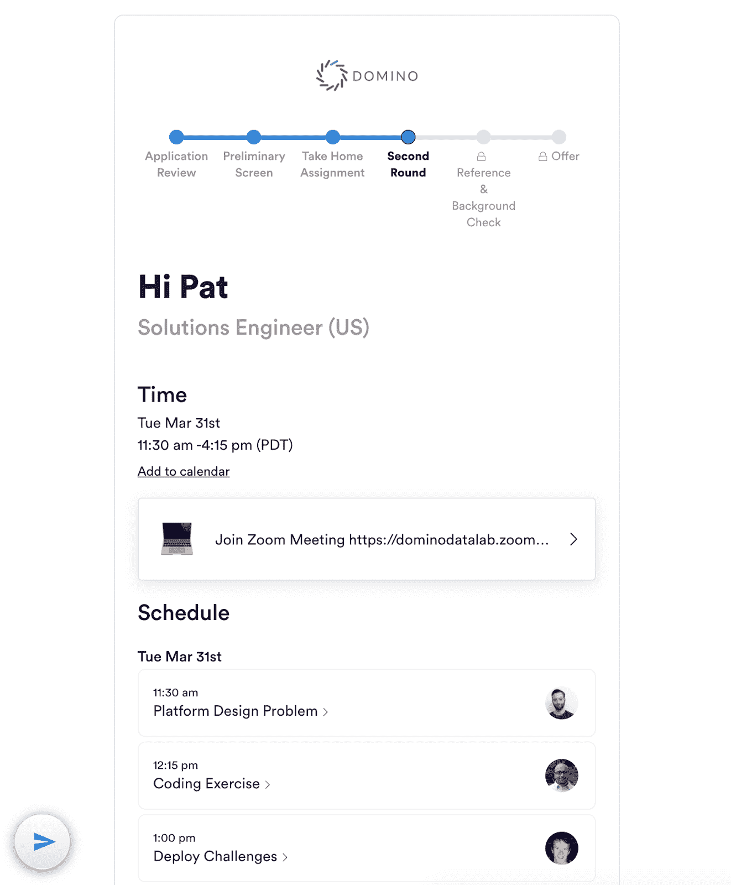

# 多米诺在招人

> 原文：<https://www.dominodatalab.com/blog/domino-is-hiring>

By Thomas Robinson, VP of Strategic Partnerships & Initiatives, Domino on April 16, 2020 in [Company Updates](/blog/company-updates/)

世界正在经历一个充满挑战的时代。我们都有朋友和家人直接或间接地受到了新冠肺炎病的影响。

幸运的是，尽管经济困难，达美乐仍能继续我们的增长；我们正在招聘所有团队和所有办公室的员工。如果你有兴趣在 Domino 工作，[访问我们的职业页面](//dominodatalab.com/careers)申请职位。

在招聘和入职继续进行的同时，我们已经对我们的流程进行了更改，以反映我们新的工作现实。

## 远程首次面试流程

甚至在封锁在美国实施之前，我们就主动将我们的采访过程 100%远程化了。多米诺现在通过 Zoom 进行我们所有的采访。鉴于这是人们通常面试方式的一个重大变化，我们推出了面试指南，帮助候选人了解他们在何时会见谁，如何连接到他们的 Zoom 面试，并为他们提供了一个聊天框，让他们可以实时直接与我们的招聘团队联系。

`Interview guide for a candidate with all the information they need for their remote interview process`

## 新员工多米诺学院

对于新员工，Domino 在新员工被移交给他们的团队开始他们特定角色的入职培训之前，会提供一周的“Domino 学院”。在这一周里，我们不仅要进行标准的账户设置和福利登记，还要就我们的公司战略和文化、如何使用我们的产品、我们的市场定位以及我们如何优先考虑和执行产品和工程工作进行培训。在我们的人员团队的带领下，在我们的管理人员和经验丰富的员工的教导下，我们花时间与新员工在一起，以确保他们具备进入角色的所有背景。

现在我们是 100%远程的，我们已经将 Domino Academy 移动到 Zoom。我们所有的新员工在开始工作之前都会通过联邦快递收到他们的欢迎包，里面有礼品和笔记本电脑。新员工每隔一周的周一加入他们的新员工团队，开始他们的入职和培训。

`Kayla, our recent BDR hire, celebrating her new hire kit`

## 社区走到一起

我们的社区已经在我们新发现的互动方式中团结起来。我们的社区团队一直在努力让我们的员工在这些偏远时间保持联系，反过来，我们的员工也开始了他们自己的远程友好活动和聚会。无论是虚拟锻炼会议、宾果之夜，还是我们的 moms & pops 支持小组，该团队已经找到了保持我们社区繁荣的新方法。

`The Domino community getting a virtual workout in together`

## 了解更多信息

查看我们的空缺职位。在 [LinkedIn](https://www.linkedin.com/company/domino-data-lab) 、 [Twitter](https://twitter.com/DominoDataLab) 或[脸书](https://www.facebook.com/dominodatalab)上关注我们。

[Twitter](/#twitter) [Facebook](/#facebook) [Gmail](/#google_gmail) [Share](https://www.addtoany.com/share#url=https%3A%2F%2Fwww.dominodatalab.com%2Fblog%2Fdomino-is-hiring%2F&title=Domino%20Is%20Hiring)