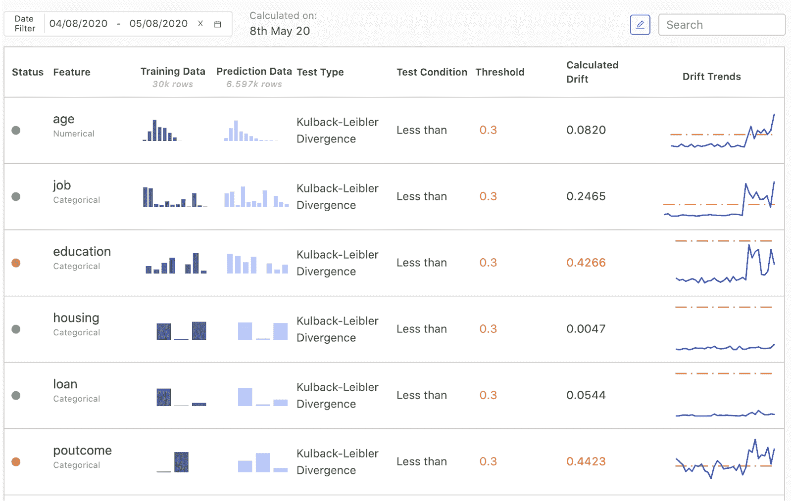
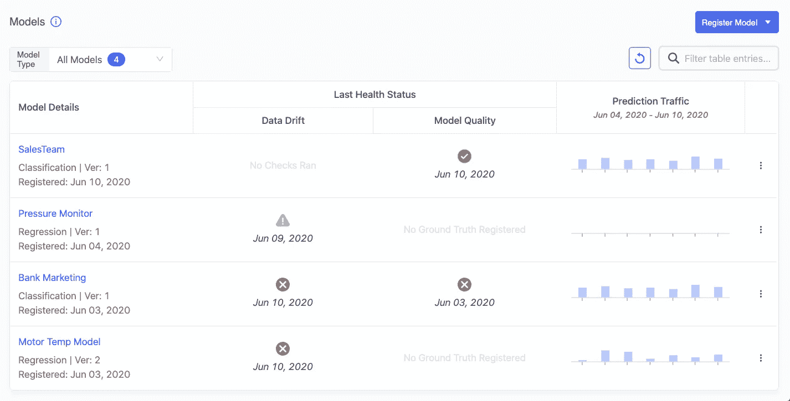
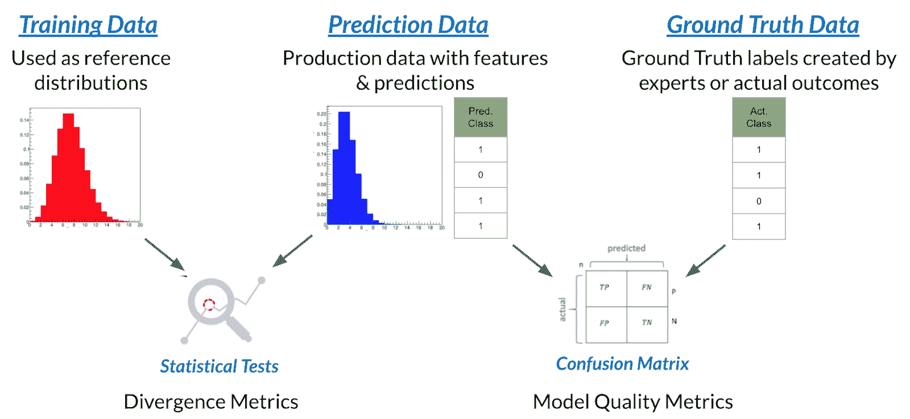
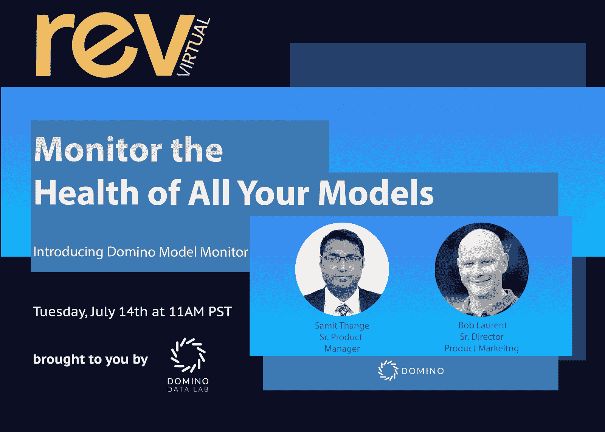

# Domino 模型监视器现已推出

> 原文：<https://www.dominodatalab.com/blog/domino-model-monitor-a-single-place-to-monitor-the-health-of-all-your-models>

上周， [我们宣布了](https://www.dominodatalab.com/news/domino-expands-leading-enterprise-data-science-platform-with-groundbreaking-new-technology-announces-43M-in-new-funding/)Domino 数据科学平台的最新发布，这代表着企业数据科学团队向前迈进了一大步。我们还宣布了一款激动人心的新产品—[Domino 模型监视器(DMM)](//www.dominodatalab.com/product/domino-model-monitor/)—它创建了一个“单一平台”来监视整个组织中所有模型的性能。DMM 让公司安心地知道他们的战略决策所基于的模型是健康的，因此对业务、客户满意度等没有负面影响。

在当今前所未有的时代，模型监控尤其重要；当人类行为“正常”时，公司的重要模型是根据来自完全不同的经济环境的数据训练出来的。借助 DMM，您可以识别与培训数据不同的生产数据(即数据漂移)、缺失信息和其他问题，并在更大的问题出现之前采取纠正措施。

### Domino Model Monitor 将端到端的模型管理过程与模型操作和治理统一起来。

数据科学团队的工作价值只有在他们构建的模型投入运营后才能完全实现，这样他们才能真正影响业务。一旦投入生产，监控其性能至关重要，以便在需要时对其进行重新培训或改造。在许多组织中，这项责任要么落在 IT 团队身上，因为他们没有足够的工具来评估模型性能，要么落在数据科学团队身上，因为他们占用了重要的增值项目的时间。Domino 致力于用一个对两个团队都有帮助的解决方案来帮助数据科学生命周期的这一方面。

DMM 提供了对跨多个平台的所有生产模型运行状况的全面洞察和可见性。担心生产模型未被跟踪的日子已经一去不复返了；DMM 防止了当生产模型没有得到适当照顾时可能发生的财务损失和不赞成的客户体验。

DMM 允许公司在单个门户中查看跨其组织的所有部署模型，而不管语言、部署基础设施或它们是如何创建的(例如，使用或不使用 Domino)。它为跨团队和模型的监控建立了一致的方法，因此您可以打破部门孤岛，消除不一致或不频繁的监控实践，为整个组织的模型健康指标建立标准，并方便您的 IT/Ops 团队负责监控生产模型。

它首先监控作为模型输入提供的生产数据，并将单个特征与最初用于训练模型的对应特征进行比较。这种对数据漂移的分析是一种很好的方式，可以确定客户偏好是否发生了变化，经济或竞争因素是否影响了您的业务，或者数据管道是否出现了故障，以及是否有空值正在提供给期望更多有用信息的模型。

您还可以上传实时预测数据，或者任何真实数据，以便分析预测准确性。如果 DMM 使用您控制的阈值检测到数据漂移或[模型精度](/blog/4-ways-to-maintain-model-accuracy-with-model-monitoring)下降，它可以发出警报，以便数据科学家可以评估模型并决定最佳纠正措施。通过让数据科学团队专注于监控潜在的“风险”模型，他们有更多的时间进行实验和解决问题。IT 团队可以高枕无忧，因为他们知道在一个易于理解的仪表板中，他们拥有深入了解模型性能所需的一切。

### 数字多用表的工作原理

要监控任何进行批量预测或部署为 API 端点的模型，您需要在 DMM 上注册模型，配置检查并设置数据接收系统。您可以计划每天、每周或每月对每个型号进行检查，并配置检查失败时谁将收到电子邮件提醒。DMM 接收生产数据，并将其与原始训练数据进行比较，以查看是否有任何特征发生了显著变化。还可以定期获取和评估基础数据和标签数据的预测质量。

使用 Domino 模型监视器，您可以监视:

*   对输入要素的更改。
*   对输出预测的更改。
*   分类和回归模型的模型质量度量跟踪。
*   生产模式的历史趋势。

### 防止财务损失和降低客户体验

我们周围的世界在不断变化，用于训练模型的历史数据可能无法反映我们今天生活的世界。在这种时候尤其如此。使用 2018-2019 年的数据建立的模型能够很好地预测 2020 年疫情期间会发生什么吗？现在，公司比以往任何时候都更需要意识到买家偏好的变化、经济变化以及其他超出他们控制的外部因素，这些因素会使他们的模型过时。

内部变化也会导致模型降级，在某些情况下，降级的程度相当严重。例如，在一家全球保险公司，上游数据管道中的意外变化导致欺诈检测模型做出次优预测，并在数周内增加索赔支付。DMM 帮助他们检测数据漂移，以便他们能够根据最新的管道变化更新模型，并防止进一步的超额赔付。

DMM 使公司能够检测变化，而不必投入昂贵而稀缺的数据科学资源来不断检查每个模型。他们可以拥有一个仪表板，显示生产中所有模型的运行状况的详细信息，并深入了解详细信息。即使他们不想监控仪表板，他们也可以设置阈值，以便发出主动通知，通知关键人员(包括最初构建模型的数据科学家)是时候使用当今世界的更新数据重新训练它，或者使用新算法完全重建它。DMM 让公司安心地知道，他们的战略决策所基于的模型反映了当今的世界，而不是模型建立时的世界——最大限度地减少对其业务的经济影响，保持客户的满意度和参与度等。

### 后续步骤

Domino 的团队在设计和开发 DMM 方面投入了大量精力，我们很高兴将这一新产品带给致力于优化其模型健康和流程的数据科学团队。我们感谢客户和朋友在整个开发过程中不断的反馈，并鼓励我们继续改进 Domino，巩固其作为企业中数据科学最佳记录系统的地位。从 Domino 模型监视器的[免费试用开始。](https://go.dominodatalab.com/dmm-trial)

要了解更多关于模型监控和 Domino 模型监控器的最佳实践，[请参加我们 7 月 14 日的网络研讨会](https://go.dominodatalab.com/dmm-monitor-the-health-of-all-your-models)。

[Twitter](/#twitter) [Facebook](/#facebook) [Gmail](/#google_gmail) [Share](https://www.addtoany.com/share#url=https%3A%2F%2Fwww.dominodatalab.com%2Fblog%2Fdomino-model-monitor-a-single-place-to-monitor-the-health-of-all-your-models%2F&title=Domino%20Model%20Monitor%3A%20A%20Single%20Place%20to%20Monitor%20the%20Health%20of%20All%20Your%20Models)