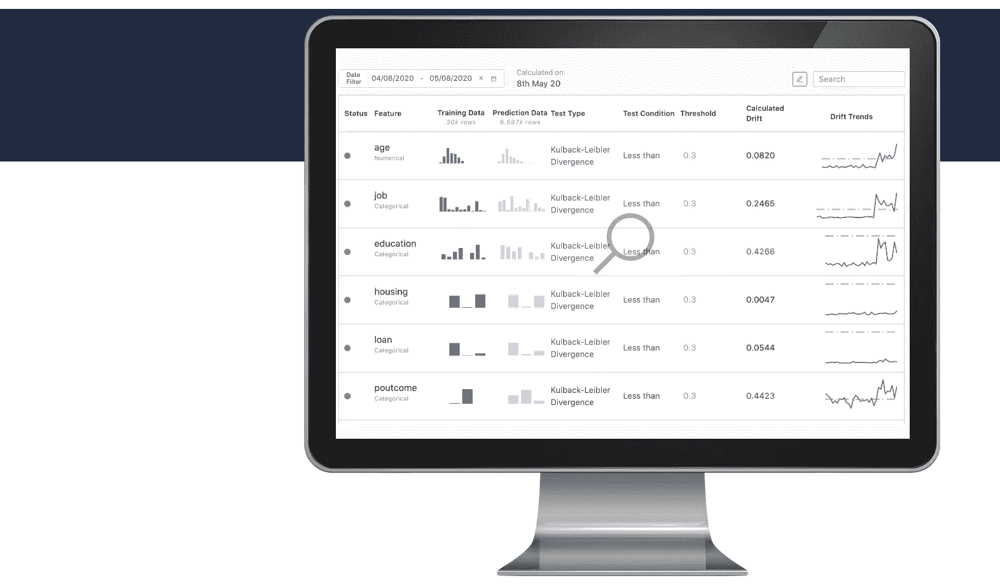

# Domino 模型监视器:您的问题，已回答

> 原文：<https://www.dominodatalab.com/blog/domino-model-monitor-your-questions-answered-1>

By Samit Thange, Senior Product Manager, Domino on July 31, 2020 in [Product Updates](/blog/product-updates/)

在我们最近的[Rev 虚拟网络研讨会**Monitor Your All Models**](https://www.dominodatalab.com/resources/monitor-the-health-of-all-your-models-introducing-domino-model-monitor/)中，我们讨论了许多组织在确定何时需要重新培训甚至重建关键业务决策所依赖的模型时所面临的挑战。这是我经常听到的一个问题，毫不奇怪，这个活动吸引了众多行业的数百名与会者。

我还在网上研讨会上展示了我们的最新产品， [Domino 模型监视器](https://www.dominodatalab.com/product/domino-model-monitor/) (DMM)。与会者的兴趣和提问量如此之大，以至于我们无法在现场活动中回答所有问题。这个博客提供了一些最常见问题的答案。我们鼓励[阅读白皮书](https://www.dominodatalab.com/resources/model-monitoring-best-practices/)了解模型监控的最佳实践，或者[注册试用 DMM](https://go.dominodatalab.com/dmm-trial) 。

## 1)可以在 DMM 中注册在 Domino Data Science 平台之外创建的模型吗？

是的，您可以注册和监控在 Domino 平台之外构建的模型。DMM 的一个关键价值主张是，它使您能够监控业务关键型模型，而不管用于构建它们的技术或平台，也不管它们部署在哪里。例如，您可以让不同部门的数据科学家团队使用 R Studio、SAS Studio、MATLAB、AWS SageMaker 和其他工具构建模型，他们生成的所有模型都可以在 DMM 中的一个仪表板上进行监控。

## 2)这是一个可以在协调环境中按需扩展的容器化解决方案吗？

是的，DMM 是一个 Kubernetes-native 应用程序。这使得添加更多基础设施变得容易，以便在工作负载需要时运行更多容器。

## DMM 可以监控哪些类型的型号？

DMM 可用于监控回归模型，以及二元和多类分类模型。在回归模型的情况下，不是准确度或精确度，而是诸如均方根误差、平均绝对误差等度量。用于跟踪模型的预测质量。DMM 还可以用于监控文本和图像分类模型的输出预测漂移和模型预测质量。

## 4)可以监控的型号数量有限制吗？

不需要。DMM 可以处理的模型和数据数量取决于部署规模。

## 5)漂移趋势图衡量的是什么？如何将它与漂移量并列解释？

当您在 DMM 中分析漂移时，漂移趋势图会显示某个特性的漂移在所选时间段的每一天是如何变化的。总漂移数反映了该时间段所有数据的整体漂移。

## 6)漂移是如何计算的——是累计还是仅比较开始和结束时间？

DMM 计算聚合数据的漂移。例如，如果您正在查看过去七天的数据，它将为所有七天内的所有输入要素和输出预测构建聚合直方图，并将它们与训练数据进行比较以计算漂移。

## 7)关于预测正确性的用户输入如何与 DMM 挂钩？

在 DMM 中，您可以采用与预测数据相同的方式获取基本事实标签。假设您有一个每周生成一次这些标签的流程(使用人类专家或系统生成)。您可以将它们放在 AWS S3 存储桶中的 CSV 文件中(您需要 2 列–GT 标签和预测 ID ),并使用该文件的路径对 DMM 进行 API 调用。DMM 会完成剩下的工作。

## 8)对于数据接收，我们能否直接链接到本地数据源，例如任何 SQL Server 环境？

今天不是开箱即用。根据您使用的特定本地 SQL 数据库，Domino 将添加一个数据连接器，允许您直接接收数据。请让您的 Domino 客户成功经理在 DMM 路线图中优先考虑您的特定数据库连接器。

## 9)我们的数据集大小以 TB 为单位。DMM 能够支持他们吗？

数据大小限制取决于为 DMM 调配的群集的大小。如果您的数据大小超过了集群所能支持的范围，您可以对数据进行降采样，并将其接收到 DMM 中。例如，如果一个原始数据流有超过 1000 万个预测，我们的观察是，每天摄取 100 万个预测就足以为模型提供可靠的漂移信号。作为部署的一部分，Domino 将与您一起评估一个良好的基线集群大小，如果需要，以后可以添加更多的计算资源。

## 10)数据源如何连接到 DMM？

DMM 中有一个专用的 UI，通过它可以添加新的数据源和管理现有的数据源。在添加新数据源时，DMM 会要求提供必要的元数据和身份验证细节，作为数据源添加的一部分。每当从这个源读取数据时，提供的信息将用于建立连接和读取数据集。

## 11)对于实时模型，可以从 Apache Kafka 流中读入输入和输出数据吗？

如今，数据只能使用 REST APIs 获取。然而，通过 Kafka 摄取数据是我们正在考虑的事情。如果 Kafka 用例对您很重要，请联系您的 Domino 客户成功经理来登记反馈。

## 额外资源

要了解更多关于 DMM 或模型监控的信息，我鼓励您[阅读我们的新白皮书](https://www.dominodatalab.com/resources/model-monitoring-best-practices/)了解模型监控的最佳实践。如果您错过了网上研讨会，您可以观看点播会议:[监控您所有模型的健康状况](https://www.dominodatalab.com/resources/monitor-the-health-of-all-your-models-introducing-domino-model-monitor/)。如果你喜欢你所看到的，你可以[注册试用 DMM](https://go.dominodatalab.com/dmm-trial) 。

[Twitter](/#twitter) [Facebook](/#facebook) [Gmail](/#google_gmail) [Share](https://www.addtoany.com/share#url=https%3A%2F%2Fwww.dominodatalab.com%2Fblog%2Fdomino-model-monitor-your-questions-answered-1%2F&title=Domino%20Model%20Monitor%3A%20%20Your%20Questions%2C%20Answered)