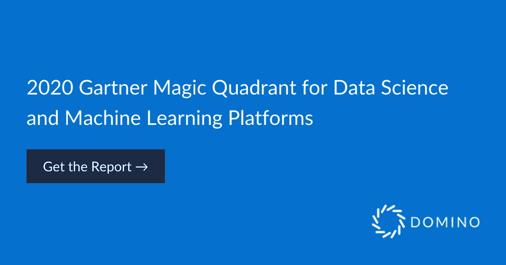

# 多米诺在 Gartner 魔力象限中任命了一位远见者

> 原文：<https://www.dominodatalab.com/blog/domino-named-a-visionary-in-gartner-magic-quadrant-for-completeness-of-vision-and-ability-to-execute>

By Domino Data Lab on February 19, 2020 in [Company Updates](/blog/company-updates/)

今年的 **[2020 Gartner 数据科学和机器学习平台魔力象限](https://www.dominodatalab.com/resources/gartner-magic-quadrant-data-science-platforms/)** 现已出炉，我们 Domino 非常荣幸第三次被评为有远见者。我们认为，我们在 Gartner 魔力象限中赢得这一荣誉，是因为我们的产品愿景和路线图有意关注拥有大型代码优先数据科学家团队的企业的需求。正如一家大型金融公司的数据科学总监[在 Gartner Peer insights 上分享的](https://www.gartner.com/reviews/market/data-science-machine-learning-platforms/vendor/domino/product/domino-data-science-platform/review/view/1041872):

> “他们的[Domino's]平台向我们的技术领导者展示了现代分析堆栈需要什么，并在这里引起了真正的变化。”

从我们的客户和分析师那里听到我们走在正确的道路上，并提供有意义的价值来帮助公司加速他们的数据科学工作，这总是令人欣慰的。随着组织认识到数据科学创造业务优势的力量，数据科学团队面临着前所未有的压力。我们倾听客户的心声，加倍努力进行产品开发和客户支持，提供广泛的能力来帮助客户实现数据科学产业化。

从产品的角度来看，我们认为 Domino 平台的三个方面是赢得这一美誉的基础:开放性、协作性和可复制性。

1.  **开放性**

    从一开始，我们就采取了开放的方法，让团队能够集中管理硬件，并允许数据科学家使用他们喜欢的语言和工具，这样他们就可以走在最前沿。我们真的突破了极限，帮助我们的客户让他们的数据科学基础架构经得起未来考验，并将其无缝集成到他们现有的体系中。Domino 现在可以安装在任何基础设施上——云(当然包括 Amazon Web Services、Microsoft Azure 和 Google Cloud Platform ),本地，甚至在他们自己的 Kubernetes 集群中。我们还重建了整个计算网格，以利用 Kubernetes 来分配数据科学工作负载和部署生产模型，消除了数据科学家面临的开发运维难题，减轻了 IT 负担并降低了基础架构成本。
2.  **协作**

    当数据专家可以轻松地分享想法、相互学习，并在以往工作的基础上更上一层楼时，伟大的事情就会发生。当他们可以更轻松地与 IT 和业务利益相关者协作时，他们可以更好地确保他们构建的模型是重要的，并且可以更快地将新模型投入生产。因此，我们更进一步，在数据科学团队内部以及跨 IT 和业务部门实现无缝协作。例如，我们的[实验管理器](https://blog.dominodatalab.com/announcing-domino-3-3-datasets-and-experiment-manager/)，一个“现代实验室笔记本”，使数据科学团队能够无缝地跟踪、组织和管理实验，而我们的[产品组合仪表板项目](https://blog.dominodatalab.com/announcing-trial-and-domino-3-5-control-center-for-data-science-leaders/)使管理人员能够轻松地看到项目在项目生命周期中的位置，并确定任何需要立即支持的项目。

    诸如此类的协作能力正在帮助我们的客户加强研发工作，加快部署流程，并获得对已部署模型、飞行项目和基础设施成本的重要可见性。正如一家制造公司的首席数据科学家[在 Gartner Peer Insights](https://www.gartner.com/reviews/market/data-science-machine-learning-platforms/vendor/domino/product/domino-data-science-platform/review/view/1054122):

    > *“多米诺骨牌数据实验室平台简化了数据科学/机器学习工作流程的每一个组成部分,从版本控制、环境管理到可再现性和最终部署。它使我们能够以比以前快 10 倍的速度向客户部署机器学习解决方案,并为整个公司的合作开辟了全新的可能性. . "*

3.  **再现性**

    再现模型结果的能力对于快速创新和有效的治理和管理都是至关重要的。有了再现性，数据科学家可以在过去工作的基础上追求更雄心勃勃和复杂的项目。业务涉众可以看到模型是如何构建的，因此他们对模型更有信心，因此更有可能使用它们。法规遵从性人员获得了模型的透明度，包括模型依赖性和开发决策，因此他们可以更好地降低风险。我们的再现性引擎自动跟踪数据科学实验的所有方面(代码、环境、数据等)，因此公司永远不会丢失工作，始终可以再现他们的结果，并拥有他们所需的透明度。

总之，这是一个强大的组合，我们的客户反复提到这是他们成功的关键。

我们真的很荣幸在创建企业级平台的工作中获得认可，并正在卷起袖子将更多功能打包到我们的平台中。我们有一个强大的路线图，我们相信它将帮助我们的客户成功地驾驭快速发展的市场。我们将继续确保 Domino 可以在任何平台上使用，并允许使用任何工具或框架。我们将提供更多的功能，以便公司能够更容易地大规模产业化数据科学。一旦模型投入生产，我们将帮助他们更好地管理和监控模型，以便他们能够在当今充满活力的市场中更好地竞争。

[Twitter](/#twitter) [Facebook](/#facebook) [Gmail](/#google_gmail) [Share](https://www.addtoany.com/share#url=https%3A%2F%2Fwww.dominodatalab.com%2Fblog%2Fdomino-named-a-visionary-in-gartner-magic-quadrant-for-completeness-of-vision-and-ability-to-execute%2F&title=Domino%20named%20a%20Visionary%20in%20Gartner%20Magic%20Quadrant%20for%20completeness%20of%20vision%20and%20ability%20to%20execute)