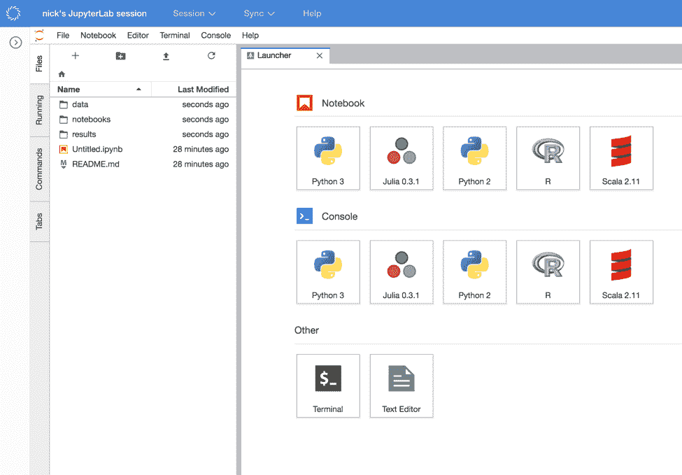

# Domino 现在支持 JupyterLab——等等

> 原文：<https://www.dominodatalab.com/blog/domino-now-supports-jupyterlab>

您现在可以在 Domino 中运行 JupyterLab，使用一个新的 Domino 特性，让数据科学家指定他们想要在 Domino 平台上运行的任何基于 web 的工具。

## 介绍

Domino 是一个数据科学平台，支持整个数据科学生命周期，从探索性分析到实验，一直到部署。在这些工作阶段中，Domino 允许数据科学家在可伸缩的自助式基础设施上工作，同时支持可再现性和协作等最佳实践。

从一开始，我们的理念就是成为一个支持最新开源工具的开放平台。大多数使用 Domino 的数据科学家都使用 Python、R、Jupyter 和 RStudio，尽管我们也支持各种其他语言。今天，我们很高兴地宣布支持 JupyterLab，以及一个灵活的插件框架，允许数据科学家添加他们自己的工具，在 Domino 平台上运行。

## 如何在 Domino 中使用 JupyterLab

1)从“笔记本”下拉菜单中，选择“JupyterLab”

2)当绿色的“打开会话”按钮出现时，点击它


你将置身于一个 JupyterLab 环境中，在那里你可以尽情发挥它的所有功能。请注意，这是通过 Domino 的执行层运行的:我们已经在您可以选择的硬件层上启动了它，并且我们已经设置了所有必要的网络配置，以便将您放入环境中。如果保存您的工作，您的更改将被提交回 Domino 项目，以便您的同事可以使用它们。



#### JupyterLab 还在阿尔法。你可以在它的 Github 页面上了解更多信息。

我们在 Domino 中设置的 JupyterLab 的配置支持 Python、Julia 和 Scala 内核；*目前 R 内核不会正常工作*。

## Why JupyterLab

Jupyter 笔记本非常适合交互式探索性分析。不过，通常情况下，数据科学家需要在包含许多不能交互使用的文件和脚本的项目中工作。他们想要一个合适的 IDE，而不仅仅是一个笔记本，这样他们就可以编辑源文件、使用多个选项卡、浏览文件等等。对于这样的工作，数据科学家在他们的桌面上使用丰富的编辑器，如 PyCharm、Sublime，甚至 emacs 或 vim。JupyterLab 提供了这些工具的许多功能，同时还提供了笔记本电脑体验的好处。

Github 上的 [JupyterLab 项目将自己描述为:](https://github.com/jupyterlab/jupyterlab)

“JupyterLab 是 Jupyter 项目的下一代用户界面。它提供了经典 Jupyter 笔记本的所有熟悉的构建模块(笔记本、终端、文本编辑器、文件浏览器、丰富输出等)。)在一个灵活而强大的用户界面中，可以通过访问我们的公共 API 的第三方扩展进行扩展。最终，JupyterLab 将取代经典的 Jupyter 笔记本。”

你可以观看 2017 年西雅图 PyCon 上关于 JupyterLab 的精彩演讲。在笔记本之外的各种功能中，我们最喜欢的有:

*   灵活的键绑定，因此您可以使用 vim 或 emacs 快捷键


*   可配置的窗口窗格排列，让你可以并排编辑和预览 markdown


*   以表格形式查看 CSV 文件


## 可插拔的交互式工具

Domino 支持 JupyterLab 的方式有些特别:我们没有对 JupyterLab 进行硬编码支持，而是构建了一个扩展点，允许数据科学家在 Domino 平台上运行他们想要的任何工具。

在过去几年与数据科学团队的合作中，我们收到了支持各种交互式工具的请求，例如 Zeppelin、Hue、Beaker 等。所以我们在 Domino 中构建了一个插件点，这样您就可以指定自己要使用的工具。这建立在我们的计算环境功能之上，它允许您通过 Docker 指定包和配置——Domino 保持您的环境的构建、缓存、可复制、可修改和可共享。

现在，Domino 计算环境还允许您指定哪些交互式工具应该可用。这使用了一种 [YAML](https://en.wikipedia.org/wiki/YAML) 配置格式。例如，在我们的一个计算环境中，JupyterLab 的定义如下:

```py
jupyterlab:

    title: "JupyterLab"

    start: [  /usr/local/bin/launch-jupyterlab.sh ]

    httpProxy:

        internalPath: ////

        port: 8888

        rewrite: false

```

这是它在我们为这个演示项目定义的计算环境中的样子。注意，环境的定义包含安装 JupyterLab *和*YAML 的指令，以告诉 Domino 如何启动该工具。Domino 中的计算环境是可修订的和可共享的，因此如果这些定义中的一个发生了变化，使用该环境的任何人都可以使用该变化；如果出现问题，您可以恢复旧版本来恢复功能。


当您将这样的工具添加到您的计算环境中时，Domino 让任何人都可以通过我们的 UI 使用它们。我们会将您的定制工具添加到我们的标准工具中，包括 Jupyter 笔记本和 RStudio。当您使用这些工具之一启动一个工作空间时，Domino 将在您选择的任何硬件上运行它，在一个容器中有一组一致的包，并且加载了所有的项目文件。这使您可以轻松地与同事协作，并按需扩展您的基础架构。


有什么有趣的基于 web 的数据科学工具您希望在 Domino 上运行吗？请告诉我们，我们会在博客上展示它是如何工作的。

## 关于 Domino 的更多信息

这篇文章的重点是如何使用 Domino 运行 JupyterLab。完整平台提供更多功能，包括:

*   在可扩展的基础设施上运行其他交互式工具，包括 Jupyter 笔记本电脑和 RStudio
*   运行批量实验，如跨弹性计算资源的模型训练任务，以更快地开发突破性研究
*   在一个中心位置跟踪工作，以促进协作和可重复性
*   部署或生产数据科学工作的简单方法，无论是作为计划作业、生产级 API，还是面向业务利益相关方的自助服务应用和仪表盘

[查看多米诺](https://www.dominodatalab.com?utm_source=blog&utm_medium=post&utm_campaign=domino-now-supports-jupyterlab)了解更多信息。