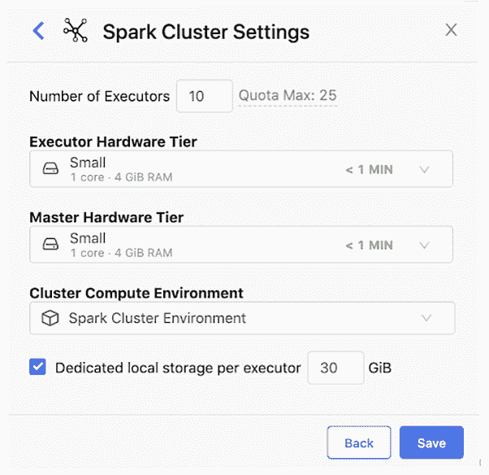
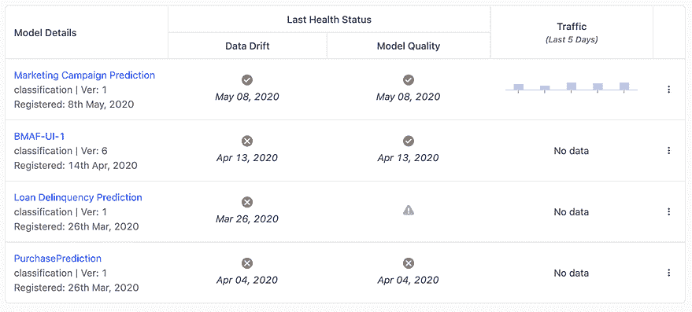
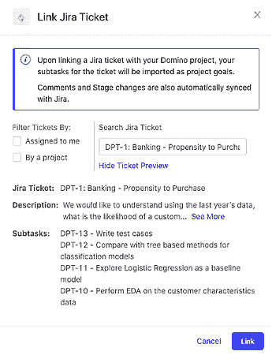

# Domino 的最新版本为企业数据科学的未来铺平了道路

> 原文：<https://www.dominodatalab.com/blog/domino-paves-the-way-for-the-future-of-enterprise-data-science-with-latest-release>

今天，[我们宣布了](https://www.dominodatalab.com/news/domino-expands-leading-enterprise-data-science-platform-with-groundbreaking-new-technology-announces-43m-in-new-funding/)Domino 数据科学平台的最新版本，这代表着企业数据科学团队向前迈进了一大步。我们正在推出突破性的新功能，包括按需 Spark 集群、增强的项目管理和导出模型的能力，这些功能为企业提供了前所未有的力量，通过解决常见问题来扩展其数据科学能力。

我也很自豪地宣布一个激动人心的新产品:[多米诺模型监视器](https://www.dominodatalab.com/news/domino-data-labs-model-monitoring-is-enhanced-in-domino-4.6) (DMM)。DMM 创建了一个“单一控制台”来监控整个组织中所有模型的性能，甚至是在 Domino 之外构建或部署的模型。您可以识别数据漂移、缺失信息和其他问题，并在更大的问题发生之前采取纠正措施。

我们邀请您参加我们即将举办的关于 [Domino 4.2](https://go.dominodatalab.com/domino4.2) 和 [DMM](https://go.dominodatalab.com/dmm-monitor-the-health-of-all-your-models) 的网络研讨会，亲自了解新功能，并继续阅读以了解更多信息。

## 对于数据科学家来说，Domino 的同类最佳工作台现在更加强大了

[工作台](https://www.dominodatalab.com/product/integrated-model-factory)是 Domino 平台的核心，支持数据科学团队使用他们已经知道并信任的工具和语言进行协作研发&。数据科学团队喜欢 Workbench 组件，因为它帮助他们创建知识飞轮，通过自动化 DevOps 工作、使工作可重复和可重用以及跟踪和组织 ML 实验来加速研究过程。

Domino 4.2 为数据科学家和数据科学领导者提供了几个改变游戏规则的 Workbench 体验。

*   **按需 Spark 集群:**数据科学家现在只需点击一下鼠标，就可以构建他们自己的 Spark 集群，用于快速、分布式地处理 Domino 中运行的分析。他们选择所需的集群大小，Domino 负责后端的 DevOps 工作，以确保包和依赖项在集群中正确分布。这提高了数据科学家的工作效率，并减少了 IT 组织的难题。借助 Domino 中的按需 Spark，数据科学团队可以将 Spark 和非 Spark 工作负载整合到一个统一的平台中。
*   **工作空间用户体验**经过重新设计，使数据科学家在进行交互式探索性分析时更有效率。现在，当您在 Domino 中启动 Jupyter 或 RStudio 之类的工具时，可以更容易地在一个地方看到您的文件更改、资源(CPU、内存)使用情况和日志。因为我们有一个开放的架构，这些 UX 改进适用于您在 Domino 中使用的任何类型的工具，包括像 SAS Studio 或 [MATLAB](/why-choose-matlab-for-data-science-and-machine-learning) 这样的商业工具。
*   Domino 4.2 还包括一个功能预览，用于与外部 git 存储库(例如 Github、Bitbucket、Gitlab)进行更深入的**集成。**

## 我们的开放平台现已获得运行微软 AKS 的认证，并且可以将模型导出到亚马逊 SageMaker。

我们致力于提供一个开放的数据科学平台，允许数据科学家将正确的工具应用于手头的任务，无论是专有的还是开源的。Domino 与跨越端到端数据科学管理生命周期的技术相结合，从数据准备和清理到模型可视化和利用，为数据科学提供了一个整体的、同类最佳的解决方案。我们认为 IT 团队应该能够选择最适合其组织的可扩展性、企业标准化和生态系统集成需求的数据科学基础架构。

这就是为什么我们最近将 Domino 重新平台化为[Kubernetes-native](https://www.dominodatalab.com/blog/kubernetes-native-domino-sets-the-foundation-for-the-future/)——为支持当今日益流行的多云策略奠定基础。我们插入到客户现有的单租户或多租户 Kubernetes 集群中，使数据科学工作负载能够更高效地利用底层计算资源。

Domino 4.2 支持额外的 Kubernetes 发行版和多租户。特别是，该平台现已获得运行微软 Azure Kubernetes 服务(AKS)的认证，对 Red Hat OpenShift 的支持即将推出。这建立在平台对开源 Rancher、亚马逊弹性 Kubernetes 服务(EKS)、谷歌云 Kubernetes (GKE)和 VMWare Pivotal 容器服务(PKS)的现有支持之上。

我们还很高兴为数据科学团队添加了导出完整模型的功能，以便在 Amazon SageMaker 中部署。今天，许多财富 100 强公司(我们自豪地称之为客户)使用 Domino 中的模型托管功能来支持他们不同的业务和运营需求。但一些客户更喜欢使用 Amazon SageMaker，因为它拥有高可伸缩性和低延迟的托管功能。Domino 4.2 增加了将 SageMaker 兼容的 Docker 映像与您的模型一起导出的能力，包括所有的包、代码等等，以便直接在 SageMaker 中部署模型。

## Domino Model Monitor 将端到端的模型管理过程与模型操作和治理统一起来。

一旦模型投入生产，监控它们的性能是至关重要的，以防现实世界的数据发生变化，需要对模型进行重新训练或调整。在许多组织中，这项责任要么落在 IT 团队身上，因为他们没有足够的工具来评估模型性能，要么落在数据科学团队身上，因为他们占用了重要的新研究的时间。我们相信模型驱动的企业需要更好的方法来管理对核心业务流程越来越重要的模型。

为此，我们激动地宣布[多米诺模型监视器(DMM)](//www.dominodatalab.com/product/domino-model-monitor/) 。DMM 允许公司监控他们的模型，以检测漂移并预测性能问题，以免造成财务损失或降低客户体验。

DMM 允许公司在单个门户中查看整个组织中所有部署的模型，而不管语言、部署基础设施或它们是如何创建的。它为跨团队和模型的监控建立了一致的方法，因此您可以打破部门孤岛，消除不一致或不频繁的监控实践，并为整个组织的模型健康指标建立标准。

它首先监控作为模型输入提供的生产数据，并将单个特征与最初用于训练模型的对应特征进行比较。这种对数据漂移的分析是一种很好的方式，可以确定客户偏好是否发生了变化，经济或竞争因素是否影响了您的业务，或者数据管道是否出现了故障，以及是否有空值正在提供给期望更多有用信息的模型。

您还可以上传实时预测数据，或者任何真实数据，以便分析预测准确性。如果 DMM 使用您控制的阈值检测到数据漂移或模型准确性下降，它可以提供警报，以便数据科学家可以评估模型并决定最佳纠正措施。通过让数据科学团队专注于监控潜在的“风险”模型，他们有更多的时间进行实验和解决问题。IT 团队可以高枕无忧，因为他们知道在一个易于理解的仪表板中，他们拥有深入了解模型性能所需的一切。

## 安全和项目管理的改进反映了我们对企业坚定不移的承诺。

我们的使命是将数据科学强化为企业级业务能力，以最大限度地发挥数据科学团队的影响力。除了上面强调的产品改进之外，Domino 4.2 还包括额外的安全更新和强大的新产品管理功能，这些对于赢得信任和提高企业团队的可见性至关重要。

Domino 内部的[知识中心](//www.dominodatalab.com/product/knowledge-center/)是一个组织的数据科学知识集中的地方，以便数据科学家可以找到、重用、复制和协作，从而实现更高效的实验。

在 Domino 4.2 中，我们增加了数据科学领导者更有效地管理他们的数据科学团队和工作的能力。他们可以为项目设定目标，定义自定义阶段以评估他们的研究过程，并深入项目以查看最近的活动、阻碍因素和实现目标的进度。数据科学领导者可以了解团队中的项目和工作负载，提高所有利益相关方的透明度。这也有助于数据科学领导者展现最佳实践，改善沟通和协作，最终为更快的研究铺平道路。

对于许多组织来说，这种项目管理方法足以管理大规模构建和部署数据科学项目的端到端流程。然而，许多组织已经标准化使用吉拉来管理数据科学团队，我们很高兴能够在 Domino 4.2 中实现我们的吉拉集成承诺。项目目标和阶段可以直接链接到吉拉任务，以便与已建立的工具和流程集成。

## 总结

Domino 的团队在这个最新版本中投入了大量精力，我们很高兴将这些新的创新带给数据科学团队，他们正在推动他们所在的所有行业的创新。我们感谢客户和朋友在整个开发过程中不断的反馈，并鼓励我们继续改进 Domino，使其成为企业中最好的研究记录系统。

下面是一些额外的资源，可以帮助您更多地了解 Domino 以及 Domino 4.2 和 Domino Model Monitor 中提供的最新功能:

*   [了解 Domino 数据科学平台。](https://www.dominodatalab.com/product/)
*   试试多米诺骨牌。
*   [参加 6 月 25 日的在线研讨会](https://go.dominodatalab.com/domino4.2)，了解更多关于 Domino 4.2 的信息。
*   [参加 7 月 14 日的在线研讨会](https://go.dominodatalab.com/dmm-monitor-the-health-of-all-your-models)，了解更多关于模型监控最佳实践和 Domino 模型监控器的信息。