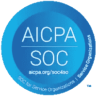

# Domino 获得 SOC 2 Type II 认证

> 原文：<https://www.dominodatalab.com/blog/domino-receives-soc-2-type-ii-certification>

By Thomas Robinson, VP of Strategic Partnerships & Initiatives, Domino on May 28, 2020 in [Product Updates](/blog/product-updates/)

对于成熟的企业来说，数据科学是一项至关重要的能力，它可以利用关于运营、客户、服务和产品的最敏感数据。如果不访问和使用这些核心数据来构建模型，数据科学工作的成果就没有多大价值。此外，一旦开发出来，编码在这些模型中的知识产权是一种非常有价值的资产，需要得到保护。

95%的首席信息官预计网络安全威胁会增加并影响他们的组织，因此确保数据和模型的安全是 IT 部门最关心的问题。¹

Domino 非常重视我们的操作和技术安全。因此，我们很高兴地宣布，一家独立的第三方审计机构已经认证我们的平台为 SOC 2 Type II，符合信息安全行业最佳实践。

## SOC 2 信任服务标准

系统和组织控制(SOC)框架由[美国注册会计师协会(AICPA)](https://www.aicpa.org/) 开发。它概述了组织的一系列安全控制措施，不仅涵盖技术，还涵盖组织流程。其标准或“信托服务”包括五个可以评估的关键领域:

*   **安全性:**公司必须采取适当的措施来防止对其系统、数据等的未授权访问。双因素身份验证、入侵检测和防火墙是常见的做法。
*   **可用性:**公司必须做出合理的努力来保持其系统的高可用性和容错性。他们必须有记录在案的灾难恢复和事件处理计划。
*   **处理完整性:**所有交易必须快速、准确地处理，不得进行未经授权的处理。
*   **保密性:**必须根据服务协议中记录的标准保护机密或专有数据。在许多情况下，这意味着数据必须在传输中加密和/或在不再需要时销毁。
*   **隐私:**所有个人信息必须按照强制性隐私法规(例如欧洲的 GDPR、巴西的 LGPD)以及服务协议或隐私声明中的规定进行处理。

SOC 报告有两种类型。类型 I 报告描述了供应商的系统在某个时间点如何符合上述相关的信任服务。第二类报告(对潜在客户来说更全面、更有用)详细描述了信托服务在实践中的实际表现。

SOC 2 Type II 认证由注册会计师的独立审计师进行。审核员对供应商实施的控制措施的描述以及这些控制措施在一段时间内(通常是几个月或一年)的操作有效性进行详细审查。这确保了控制措施是全面的，并且在操作上是合理的，而不是简单的“打勾”。

## SOC 2 认证为什么重要？

SOC2 Type II 遵从性意味着 Domino 拥有符合行业标准的、定义良好的安全策略、程序和实践。获得认证的过程发生在过去的一年中，这使我们能够断言我们现有的安全实践已经足够强大，同时收到了使我们的过程更加强大的建议。

依靠软件供应商的数据科学平台比自己构建平台有很多好处。Domino 经历了多种用例以及各种业务问题，经过多年的产品开发，我们的产品中已经包含了解决方案。构建您自己的解决方案很可能仅仅触及您的总体需求，并且会花费大量的时间和金钱来开发。

更重要的是，构建自己的软件的安全幻觉很吸引人，但却被误导了。同样，我们开发了一个全面的解决方案，Domino 花了几年时间致力于我们产品和开发组织的安全性。如果不知道您可以依靠解决方案来实施适当的安全措施，您可能会在无意中受到数据泄露、恶意软件和不良行为者的攻击。

通过与通过 SOC 2 Type II 认证的供应商开展业务，IT 团队可以放心地与具备安全控制和实践的供应商合作，以确保其数据、知识产权和品牌的安全性。

对于 Domino 客户，您的客户成功经理可以提供我们的审计员出具的证明我们 SOC 2 Type II 认证的信函。

* * *

¹[Gartner 2019 年首席信息官议程](https://www.gartner.com/smarterwithgartner/cio-agenda-2019-take-a-hard-and-soft-approach-to-cybersecurity/)

[Twitter](/#twitter) [Facebook](/#facebook) [Gmail](/#google_gmail) [Share](https://www.addtoany.com/share#url=https%3A%2F%2Fwww.dominodatalab.com%2Fblog%2Fdomino-receives-soc-2-type-ii-certification%2F&title=Domino%20Receives%20SOC%202%20Type%20II%20Certification)