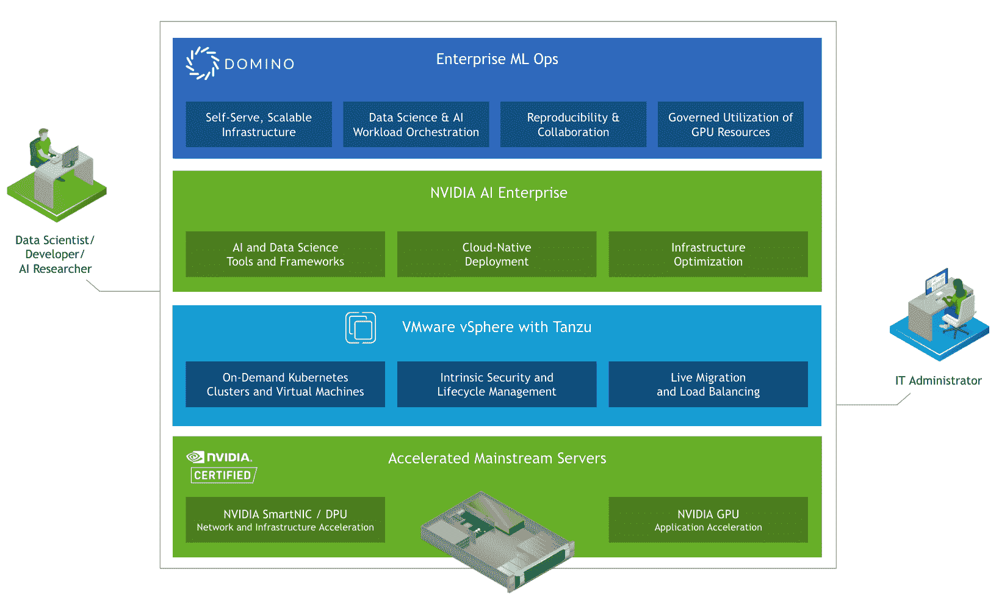

# 数据中心就绪 MLOps: Domino 现已通过 NVIDIA AI Enterprise 验证

> 原文：<https://www.dominodatalab.com/blog/domino-validated-for-nvidia-ai-enterprise>

今天，Domino Data Lab [宣布验证整合了](https://blogs.nvidia.com/blog/2022/01/19/ai-enterprise-release/)[NVIDIA AI Enterprise](https://www.nvidia.com/en-us/data-center/products/ai-enterprise-suite/)和[VMware VSP here with Tanzu](https://www.vmware.com/products/vsphere/vsphere-with-tanzu.html)的 Domino Enterprise MLOps 平台 ，帮助全球企业使用主流服务器管理数据科学和 AI 工作负载。Domino 是 NVIDIA 通过 NVIDIA AI 企业软件套件验证的第一款 MLOps 软件，可在领先服务器提供商 的 NVIDIA 认证系统上提供最高的性能和兼容性 [。](https://www.nvidia.com/en-us/data-center/products/certified-systems/)

## GPU 加速带来了希望，但也带来了挑战

从 [自然语言处理为模型驱动的政策审批](https://www.dominodatalab.com/customers/topdanmark) 到 [生物技术中的图像分类](https://www.dominodatalab.com/customers/janssen) 到 [供应链风险与异常检测](/resources/how-lockheed-martin-is-pushing-the-boundaries-of-rocket-science-with-data-science/) 在先进制造业中，来自 GPU 加速的模型训练的竞争优势显而易见。数据科学工作负载的强度，尤其是模型开发和深度学习的强度，导致不同的计算基础架构要求，峰值利用率比平均利用率高几个数量级。

然而，由于将这些人工智能解决方案与现有企业基础设施相集成的复杂性，企业经常难以采用人工智能。数据科学家需要在整个数据科学生命周期中灵活地使用工具，这导致了数据科学家和 IT 之间的 [孤立环境。](https://www.dominodatalab.com/resources/operationalize-ai-at-scale-with-mlops-ventana-research)

## 打破数据科学家和 IT 之间的孤岛

Domino Data Lab 的企业 MLOps 平台现已通过验证，并与 NVIDIA AI Enterprise 集成，NVIDIA AI Enterprise 是一种针对 AI 工作负载优化的端到端企业平台软件套件。NVIDIA、VMware 和 Domino Data Lab 之间的这一联合解决方案通过将强大的人工智能解决方案引入主流服务器上的企业数据中心，标志着人工智能的快速创新、规模和扩展进入了一个新阶段。

在 IT 已经熟悉的基础设施上，数据科学团队现在可以轻松完成一些项目，例如使用 TensorFlow 训练图像识别模型，使用 [NVIDIA RAPIDS](https://www.nvidia.com/en-us/deep-learning-ai/software/rapids/) 执行文本分析，或者使用 Triton 推理服务器部署智能聊天机器人。[打破数据科学和 IT 领域的孤岛](/resources/operationalize-ai-at-scale-with-mlops-ventana-research)为更多企业打开了大门，让它们通过在整个业务中嵌入模型来建立竞争优势。

## 数据中心就绪型企业 MLOps

NVIDIA AI Enterprise 针对业界领先的虚拟化平台[VMware VSP here with Tanzu](https://blogs.vmware.com/vsphere/2021/11/vmware-nvidia-gtc21-updates.html)进行了优化和认证。这提供了由 NVIDIA 支持的 AI 开发人员框架和工具，以及数据科学和 AI 工作负载所需的 kubernetes 操作员、驱动程序和企业支持的容器。

Domino 的企业 MLOps 平台工作在 VMware vSphere 之上，将 NVIDIA AI 企业容器与 VMware Tanzu 提供的 Kubernetes 层集成在一起。这为数据科学和人工智能工作负载的研究、开发和部署提供了端到端的平台。NVIDIA AI Enterprise validation 意味着整个解决方案可以部署在来自 HPE、戴尔、联想、思科和 Hitachi Vantara 等服务器供应商和集成商的 NVIDIA 认证系统上。

## 用合适的工具和基础架构提升数据科学家的技能

Domino 通过提供端到端的企业 MLOps 平台，即数据科学工作的记录系统，独特地增强了 NVIDIA AI 企业软件套件。只需点击一下鼠标，就可以在经 NVIDIA 认证的系统上，利用针对 NVIDIA RAPIDS、TensorFlow 和 PyTorch 框架优化的图像，启动研究环境，同时自动加载数据、代码和先前的工作，并访问 NVIDIA GPUs。这种自动化允许数据科学家 [专注于创新研究和模型开发](https://www.dominodatalab.com/blog/our-100m-series-f-funding-round) 而不是繁重的 devops 工作。

类似地，Domino 处理所有的模型托管和推理，因此一旦数据科学家创建了一个模型，就可以很容易地在环境中托管和维护它。

## 简化管理并减轻 IT 支持负担

对于 IT 部门来说，这种集成通过提供虚拟化的云状“数据科学平台”大大简化了数据科学家的支持请求，所有这些都托管在运行非人工智能应用程序的熟悉的弹性 VMware VSP here enterprise infra structure 环境中。它可以使用分配的 GPU 资源按需快速配置预配置的容器，减少数据科学家对基础架构和许可证的服务台请求数量。Domino 为数据科学家提供了一个自助式解决方案——包括 IT 的报告和治理。

## 日益增长的伙伴关系

随着 NVIDIA AI 企业验证的加入，Domino 拥有了许多不同的 NVIDIA 和 NVIDIA 合作伙伴网络(NPN)的产品和服务。我们继续扩大我们的 [NVIDIA DGX 就绪软件合作伙伴](https://www.dominodatalab.com/news/domino-data-lab-joins-nvidia-as-dgx-ready-software-program-partner) ，最近 [宣布了基于 NVIDIA 的托管服务产品和 TCS](https://www.dominodatalab.com/news/domino-data-lab-expands-collaboration-with-nvidia-and-tcs-with-new-enterprise-mlops-solutions-for-modern-it-stacks) ，并继续在主要云提供商上支持 NVIDIA 加速计算。我们的使命是为世界上最重要的企业释放数据科学的力量——普及 GPU 访问是这一使命的重要支柱。

#### 额外资源

*   [1 月 26 日加入 Domino](https://go.dominodatalab.com/unleashing-exceptional-performance)参加虚拟活动，了解 Domino 5.0，这是我们在帮助企业释放数据科学力量的使命上迈出的重要一步。
*   了解更多关于 [Domino 和 NVIDIA 的合作](//www.dominodatalab.com/nvidia) ，包括客户使用案例和技术资源。
*   [下载 Domino & NVIDIA AI 企业部署指南](https://f.hubspotusercontent40.net/hubfs/6816846/Domino%20+%20NVIDIA%20AI%20Enterprise%20Deployment%20Guide%20Version%201.1.pdf) 了解技术细节。
     

[Twitter](/#twitter) [Facebook](/#facebook) [Gmail](/#google_gmail) [Share](https://www.addtoany.com/share#url=https%3A%2F%2Fwww.dominodatalab.com%2Fblog%2Fwhy-kubernetes-is-great-for-data-science-workloads%2F&title=Why%20Kubernetes%20is%20Great%20for%20Data%20Science%20Workloads)