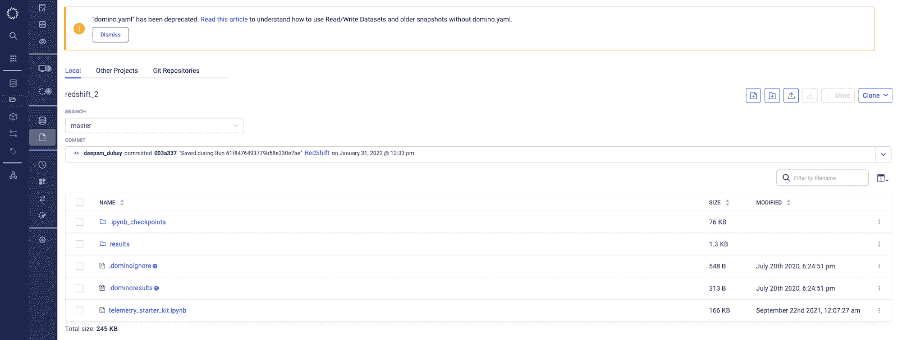

# Domino 5.0:提升您的“云中笔记本”体验，实现两全其美

> 原文：<https://www.dominodatalab.com/blog/durable-workspaces-checkpoints>

## 在 Domino 5.0 中引入带检查点的持久工作区

为了加快数据科学的参与和生产力，再现性至关重要。它不仅能促进探索，还能通过构建一个经过验证的模型或提供与其他人共同开发模型的能力来提高模型的速度。

持久工作区是在 Domino 4.4 中引入的 [，是可以启动、停止和重启的持久开发环境。每个工作区都有一个永久卷来保存您的文件，并且您的更改会从一个工作区会话保存到下一个工作区会话，以便您可以决定何时将更改提交到版本控制。](https://www.dominodatalab.com/blog/domino-4-4-liberates-data-scientists-to-maximize-productivity)

在 [Domino 5.0](https://www.dominodatalab.com/resources/introducing-domino-5.0) 中，每当用户在工作区内同步时，都会创建一个“检查点”。这让我们的“云上笔记本电脑”体验更上一层楼。现在有了这些检查点，您可以浏览过去的工作、恢复和新方向的分支实验，或者促进组织内的协作。

**好处:**

*   通过查看会话和提交历史，从所需的点创建工作区会话。
*   轻松查看工作区会话历史以及从特定检查点重新创建工作的提交。
*   从发布的模型中快速重新创建工作区，以便能够调试生产问题并快速重新部署模型。

### 它是如何工作的

*注意:关于带检查点的持久工作区的一些* [*先决条件*](https://docs.dominodatalab.com/en/5.0/reference/workspaces/checkpoints.html?highlight=checkpoints#prerequisites) *，请参见 Domino 文档。*

#### **重新访问并从工作空间的先前状态开始**

除了[工作区会话](https://docs.dominodatalab.com/en/latest/reference/workspaces/workspace-sessions.html)之外，您还可以查看每个会话的检查点。检查点是您可以在任何时候返回的提交，以便查看您的工作历史，和/或在新的方向上分支您的工作。每当您在一个工作区内同步对工件或代码的变更时，就会创建检查点。

您可以预览来自任何提交的工件或代码，以识别您想要从中重新创建工作空间的检查点。

当您从以前的提交中重新创建一个工作区时，Domino 会创建一个新的分支，您可以在其中执行新的模型开发或培训。重新创建的工作区基本上与现有的工作区行为相似。您可以在 处找到关于此工作流程 [的详细信息。](https://docs.dominodatalab.com/en/latest/reference/workspaces/checkpoints.html?highlight=checkpoints#recreate-a-workspace-from-a-previous-checkpoint)

#### **修复漂移或衰退的模型**

Domino 5.0 中新增的 [集成模型监控](https://www.dominodatalab.com/blog/integrated-model-monitoring) 功能，可以自动识别 [数据漂移和模型质量](https://docs.dominodatalab.com/en/latest/reference/model-monitoring/10-data-drift-and-model-quality/index.html) **的问题。**您可以使用 [自动化洞察](https://www.dominodatalab.com/blog/automated-model-insights) 探究原因，确定是否需要模型修复。在这种情况下，您可以重新创建用于部署模型的工作区，这样您就可以更新模型代码或者用最新的生产数据重新训练它。该工作流程类似于前面所述的 [在现有工作空间内创建工作空间](https://docs.dominodatalab.com/en/latest/reference/workspaces/checkpoints.html?highlight=checkpoints#recreate-a-workspace-from-a-previous-checkpoint) 的工作流程。

一旦您完成了修复或补救，您可以轻松地 [重新部署](https://docs.dominodatalab.com/en/latest/reference/model-monitoring/30-remediation/index.html) 您的模型的改进版本。

### 结论

开放性和可复制性是 Domino 的核心产品。随着检查点被添加到持久的工作空间中，我们期望组织培养一种协作环境，在这种环境中他们可以重用过去的返工并提高用户的生产率。此外，模型驱动的企业可以利用 Domino 使他们能够根据不断发展的业务的需要主动监控和修复模型。

Domino 是 [企业 MLOps](https://www.dominodatalab.com/resources/a-guide-to-enterprise-mlops/) 平台，它无缝集成了代码驱动的模型开发、部署和监控，以支持快速迭代和最佳模型性能，因此公司可以确保从其数据科学模型中实现最大价值。

