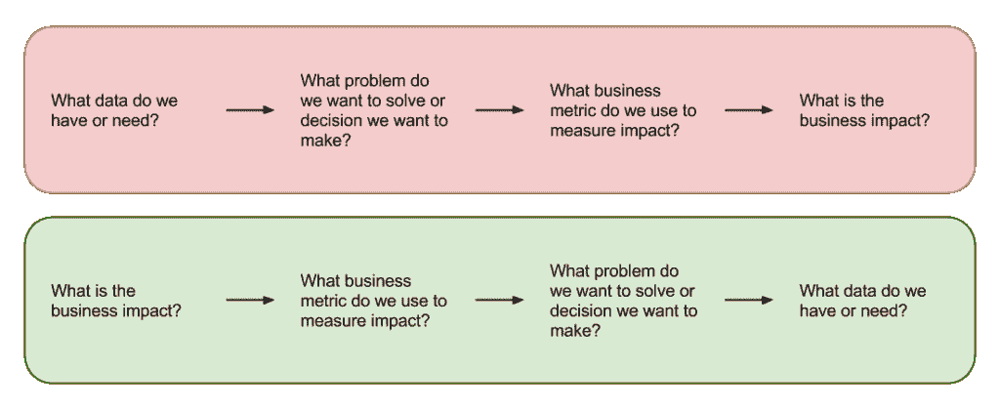

# 数据科学团队的情商

> 原文：<https://www.dominodatalab.com/blog/emotional-intelligence-data-science-teams>

我们调查并采访了一些最成功的客户，以了解他们如何将数据科学团队与其业务相结合。涉及的挑战不是技术性的，这就是为什么解决方案对数据科学从业者和管理者来说可能不容易。

根据我们最成功的客户的说法，这里有三条关于如何让和*展示*给你的组织带来更大商业影响的经验:

## 1.数据科学的标题中有科学是有原因的。

数据科学的生命周期是迭代的，这意味着您在不断学习和尝试新事物。但是你尝试的东西通常有一半以上都不起作用。这是因为它实际上是一门科学，就像任何科学研究一样，在你尝试之前，你不知道什么会起作用。因此你不能给它设定一个时间线；你必须继续试验。这可能是为什么大多数科学研究都是在实验室环境中进行的，在那里，研究的生命周期是众所周知和公认的。

当您开始将这种工作方式与快节奏的业务需求相结合时，可能会产生摩擦，从而阻碍数据科学团队的参与。

我们最成功的客户通过他们推动数据科学项目的方式，找到了将*科学*与*商业*概念融合的方法。他们的第一个建议是要有一套明确的程序和你要尝试的目标。这消除了对项目成功的期望，并把焦点放在实现商定的里程碑上，不管它是成功还是失败。

第二条建议是避免从左到右工作的常见错误，即“这是我们所有的数据，我们可以用它做什么有趣的事情？”

无论何时你从数据开始，它都会引入范围蔓延，并且没有清晰的方法来衡量成功。这是赢得从事抽象科学项目并让企业不理解你或你的团队在做什么的声誉的一个万无一失的方法。*永远*从业务问题开始，然后向后推进。问一些问题，比如“我们试图产生什么样的业务影响？”“我们试图改变什么标准？”“我们试图影响什么决策？”这将提供您需要的数据，还将帮助您清楚地定义成功是什么样的，并让利益相关者参与整个过程。

## 2.情商比技术能力更重要。

数据科学最性感的部分是建模——尝试不同的算法，试验不同的功能，探索大量不同的数据。大多数数据科学家希望将大部分时间花在这一块是有道理的。不幸的是，[在将数据科学与业务结合起来时，这并不是最需要关注的领域](//blog.dominodatalab.com/building-model-least-important-part/)。我们所有最成功的客户都详细谈论了这一斗争。是时候提升你的情商了。

我们听到的一条建议是努力培养移情技能。你正与高级管理人员一起工作，以获得接受实验文化的认同。这意味着让他们适应快速失败和迭代，并且没有明确的需求，可以“项目管理”到交付。你如何做到这一点？先做业务人员，再做技术人员。业务主管必须交付成果，而过度的技术化会让他们认为你不了解业务。

另一个建议是对组织中的人过去如何做决策和运作保持敏感——他们是各自领域的专家，这是他们谋生的方式。你的工作是帮助企业做出更好的决策，而不是为结果邀功。例如，不要使用“数据科学团队的工作为销售团队节省了 20%的成本”这样的短语，而是使用“数据科学团队的工作为销售团队节省了 20%的成本”或“销售团队和数据科学团队共同节省了 20%的成本”这样的短语

如果您希望企业与您合作，并利用您的模型的输出，重要的是丰富他们的直觉，而不是取代它。以他们仍能做出决策的方式呈现输出和结果。

## 3.用“政治资本”作为货币来衡量投资回报率。

获得业务部门的认可至关重要，尤其是在组建数据科学团队的早期阶段。有可能一位高层领导已经大胆地投资建设你的团队，并需要很快评估这项投资的投资回报率。您的团队在这些早期阶段选择进行的项目可能比您想象的更能决定您的团队未来的成功。

想想拿小胜在银行积累政治资本。如果你在低风险的小项目上保持稳定的成功流，你将积累足够的政治资本来“资助”更大的风险更高的项目。你想建立梦想，但不要先做最复杂的事情。展示进步会让你在未来接受更高风险的投资。

对于非常早期的团队，我们听到的建议是用来自整个组织中其他高级赞助商的政治资本来衡量 ROI。在早期，即使是小项目也很难衡量投资回报率，但是你可以通过确保利益相关者对你正在做的事情“感觉良好”来创造跑道。

最大的一条建议是，**数据科学项目应该总是产生建议*做某事*或*不做某事*** 的输出。避免“嘿，这很有趣”这样的问题。

如果您将项目与产出挂钩，那么它们是可以衡量的。衡量仍应考虑政治资本，因为你不想因影响而邀功，因为这侵犯了企业利益相关者的专业领域，并损害了这种关系。相反，根据以下五个影响领域之一来衡量项目:

1.  推动收入增长
2.  降低成本
3.  降低风险
4.  优化资产负债表
5.  更有效地管理人力资本

* * *

要了解其他数据科学团队如何根据业务目标调整工作，请阅读我们的案例研究。