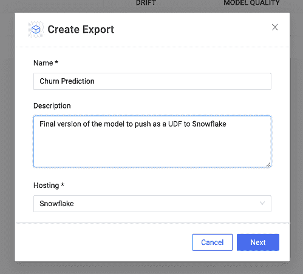

# 在雪花中构建、部署和监控模型

> 原文：<https://www.dominodatalab.com/blog/end-to-end-data-science-workflows-in-snowflake>

## 利用雪花 Snowpark 引入端到端数据科学

达美乐高级产品经理维奈·斯里达尔于 2022 年 6 月 13 日在 [发布产品更新](/blog/tag/product-updates)

数据科学团队构建模型以改善决策和推动业务成果的压力越来越大，这意味着数据科学家的游戏时间结束了。建立模型驱动的竞争优势始于数据，雪花现在是规范的数据存储。

当数据科学团队专注于构建、部署和监控突破性模型，快速迭代以最大限度地提高预测准确性时，他们的创新最多。数据和基础架构访问令人分心的复杂性造成了孤岛，妨碍了有效的协作。

编排数据的移动需要定制开发工作并引入手动变通方法，增加了数据科学家和 ML 工程师的风险。此外，如果生产数据与模型不在同一位置，性能下降会产生瓶颈。

Domino 和雪花通过将 Domino 中企业 MLOps 的灵活性与雪花的数据库内计算平台的可伸缩性和强大功能结合起来，解决了这些挑战。客户可以在 Domino 中开发模型，使用 Snowpark 在 Snowflake 中训练它们，然后将模型直接从 Domino 部署到 Snowflake 数据云中，进行数据库内评分，从而加快价值实现。

数据库内评分的兴起带来了许多优势，即通过跨 IT 和数据科学团队的通用平台简化了企业基础架构，从而实现了:

*   **简单。**典型的雪花用例在大规模、高数据量的情况下运行。将数据从雪花移动到部署模型的位置并将预测写回到雪花需要复杂的数据管道，这可能难以构建和管理。
*   **更好的性能。**将如此大量的数据移入和移出雪花服务器成本高昂，并且会影响整体性能。像雪花这样的复杂数据库引擎针对可在 ML 推断期间使用的专有数据格式进行了优化，从而提供了优于通用计算平台的性能优势。

#### 如何用雪花和多米诺建立模型

Domino 提供了与雪花的本机集成，因此 Domino 用户可以选择雪花作为数据源。这是比直接在 Domino 工作区中使用环境变量或用户凭证更新的功能。

选择雪花作为数据源后，用户可以选择 1)输入他们的雪花凭据，或者 2)选择 OAuth，这是一种开放标准协议，允许受支持的客户端授权访问雪花，而无需存储用户登录凭据。注意:OAuth 必须由 Domino 管理员预先配置，以便用户可以选择它。

一旦 Domino 连接到雪花的数据云，数据科学家就可以利用 Snowpark 库快速构建模型。 [Snowpark](https://www.snowflake.com/snowpark/) 让用户构建应用程序(使用 Python、Scala 或 Java 之类的高级语言)，优化运行于雪花计算环境——数据驻留的地方。

#### 如何使用 Snowpark UDF 部署 Domino 中构建的模型

Snowpark 中的核心抽象是 DataFrame，所以除了使用 Snowpark 库中的内置功能，Domino 用户还可以使用本机 Domino 接口为 ML 推理创建用户定义函数(UDF)。DataFrame 和 UDF 都被优化为在雪花服务器上异步执行。

通过一个简单的 UI，您可以选择调用 Domino 内置模型的文件和预测函数。这是一个将注册为 Snowpark UDF 的函数，可以在 Snowflake 应用程序内部或 SQL 查询中使用，以运行批量评分。

一旦指定了雪花服务器设置，Domino 就在雪花中持久化模型、包依赖项和必要的文件，并注册 UDF。

您可以在 Domino 的导出目录中查看所有导出的模型。通过单一控制台，除了包括主机设置、元数据和监控信息(如果已配置)在内的大量其他详细信息之外，还会显示所有导出及其模型性能指示器。

您可以从雪花 SQL 查询中调用 Snowpark UDFs。在本例中，该命令通过推理代码调用客户流失预测模型——两者都内置于 Domino 中——作为雪花中的 UDF 导出。

#### 如何配置 Domino 模型监控

回到 Domino，您可以通过几个简单的步骤来配置模型监控。一旦选择了训练数据集，并通知 Domino 包含预测输出的表，Domino 就会在每次进行新的一批预测时自动从该表中获取数据，并计算漂移度量。

您还可以在每个特性的基础上配置漂移测试和阈值，Domino 会定期通知用户任何已经漂移的特性。您还可以设置一个表来包含基本事实数据，并以同样的方式为连续摄取设置它。Domino 然后计算模型质量度量，并在违反阈值时提醒用户。

### 

### 

### 结论

最新的 Domino 和雪花集成通过跨 IT 和数据科学团队的通用平台简化了企业基础架构。数据科学家现在可以在 Snowflake 中即时、安全地访问他们需要的数据。他们拥有在 Domino 中构建模型的灵活性，以及用于数据库内计算的雪花平台的可伸缩性和强大功能。最后，他们可以为部署到雪花数据云的模型自动设置预测数据捕获管道，确保预测准确性和最大的业务影响。

达美乐是 2022 年雪花峰会的骄傲赞助商。欢迎参观我们的展位#2028，或参加我们 6 月 15 日星期三中午 12:30 的会议:[端到端数据科学模型开发、部署、&监控](https://www.snowflake.com/summit/agenda/?agendaPath=session/909293)。

错过了雪花峰会？加入我们于 6 月 22 日举办的 [*突破性创新秘诀*](https://www.dominodatalab.com/resources/breakthrough-innovations-rev-3?utm_source=hp_banner) 虚拟活动，您将看到这些整合的实际应用。您还将听到来自威瑞森和强生公司的数据科学创新者。

在 dominodatalab.com/snowflake 的 [了解更多关于达美乐和雪花的合作。](https://www.dominodatalab.com/partners/snowflake)

### 关于作者

|  | 维奈·斯里达尔是达美乐公司的高级产品经理。他专注于模型生产和监控，目的是帮助 Domino 客户从他们的 ML 研究工作中获得商业价值。他拥有多年开发利用 ML 和云技术的产品的经验。 |