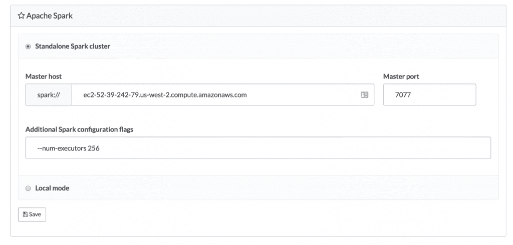
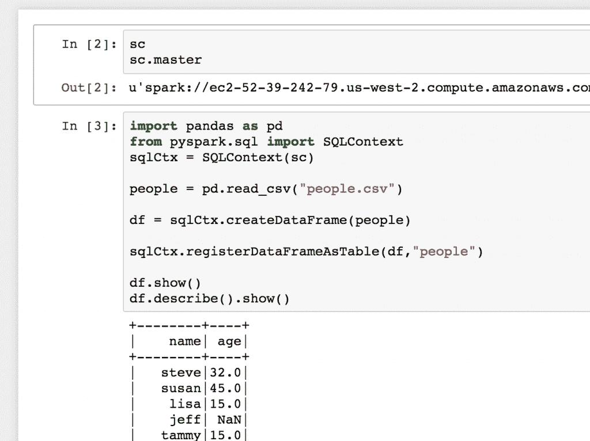

# 宣布增强 Apache Spark 支持

> 原文：<https://www.dominodatalab.com/blog/enhanced-apache-spark-integration>

Domino 现在为数据科学家提供了一种使用 Apache Spark 进行定量工作的简单但非常强大的方法。

Apache Spark 已经俘获了数据专业人员的心。Spark 是一项最初由伯克利 AMP 实验室开发的技术，它提供了一系列工具来应对整个数据生态系统的巨大挑战。Spark 支持通过流式传输摄取实时数据，支持大规模分布式 ETL，甚至支持使用 MLLib 和新添加的数据帧 API 进行分析和建模。

在 Domino，我们认为现代数据科学团队基本上是多语言生态系统，其中许多具有不同哲学和架构方法的不同工具发挥着重要作用。虽然 Domino 早就有能力运行触发 Spark 作业并连接到 SparkSQL 数据源的代码，但我们自豪地宣布显著增强了 Spark 支持:

*   广泛的部署和配置支持，目前提供本地模式和独立集群模式，未来几周将提供 YARN 支持。
*   项目级 Spark 配置，允许单个项目访问不同的 Spark 集群，甚至不同的 Spark 版本，所有这些都可以从一个下拉菜单中完成。所有依赖项都会自动安装，无需进一步配置。
*   Python 内核的 Jupyter 笔记本是自动预配置的，SparkContext 对象可用于您的代码。

这一技术预览版将在未来几个月内得到进一步增强，SparkR 支持和企业认证很快就会推出。

## 简单配置

如上所述，单个项目可能会启用自己的 Spark 集成。这使得组织在决定数据科学家应该如何与数据交互时具有相当大的灵活性。我们的许多客户都在评估使用 Spark 的方法，并且经常在试验多种不同的配置。通过将每个项目连接到不同的 Spark 集群，组织可以使用 Domino 快速迭代调查。

## 简单的环境管理

许多组织使用许多不同的 Spark 版本。Domino 通过我们的 Domino 环境功能帮助管理这种复杂性。Domino 环境允许客户重用提供的或定制的 docker 映像，而无需管理任何基础设施，这可以通过一个简单的下拉菜单实现。用户可以通过选择正确的环境来配置项目的目标 Spark 版本。

在 Spark 已经成为成熟技术的组织中，默认的 Domino 环境可能预装了所有必需的库。

## 无配置笔记本电脑

数据科学家现在可以启动 Jupyter 笔记本，并通过 PySpark 或 SparkSQL 立即与 Spark 集群进行交互。不需要进一步的配置和身份验证，SparkContext 对象就可以立即使用了。

如上所述，我们将很快发布对 SparkR 的支持，以及对使用企业认证的更复杂的 Spark 配置的支持。

## 我们希望收到您的来信！

Apache Spark 拥有一个庞大、复杂且快速发展的生态系统。我们很高兴能与我们的客户合作，共同探索如何将 Spark 集成到现代数据科学实践中。我们很想听听您如何认为我们应该改进 Domino 的 Spark 支持来实现这一目标。