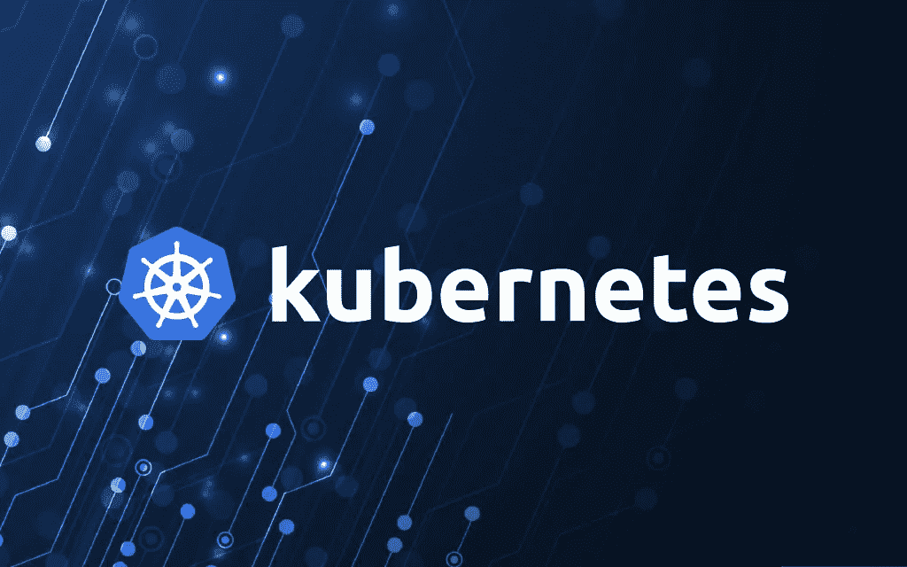
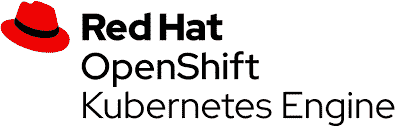

# 用 Domino 4.3 扩展 Kubernetes 支持

> 原文：<https://www.dominodatalab.com/blog/expanding-kubernetes-support-with-domino-4-3>

By Bob Laurent, Senior Director, Product Marketing, Domino on September 02, 2020 in [Product Updates](/blog/product-updates/)

Kubernetes (K8s)正迅速成为 IT 的通用计算基础，以及应用程序可移植性和基础设施面向未来的共识 API。Kubernetes 为容器化应用程序带来了一系列全新的好处，包括高效的硬件利用。K8s 能够在容量达到峰值时自动扩大规模，并在峰值后再次缩小规模。这是一笔巨大的资产，尤其是在云环境中，成本是基于消耗的资源的。

向上或向下扩展集群既快速又简单，因为只需在集群中添加或删除虚拟机(VM)即可。这种动态资源分配对于数据科学工作负载尤其有益；在训练模型或工程功能时，对高性能 CPU、GPU 和 RAM 的需求可能会非常强烈，但随后需求会很快再次下降。

就像不同的供应商提供 Linux 内核的发行版一样，今天有超过 90 种不同的 Kubernetes 发行版得到了[云本地计算基金会](https://www.cncf.io/)的认证。每个经过认证的发行版都提供了一定程度的互操作性，以及对一致接口的一致性(通过 API)，但是不同产品之间的细节可能会有所不同。承诺支持 Kubernetes 的厂商数量凸显了这个开源编排系统的开放性和成熟性，类似于支持 Linux 的厂商数量。

## 增加对最流行的 Kubernetes 发行版的支持

IT 团队希望基础架构既能支持当今的需求，又能灵活支持未来的扩展，而不会局限于一家供应商。我们致力于将 Domino 数据科学平台的开发与其在下一代基础设施(包括 Kubernetes)上的投资相结合。

Domino 支持所有主要云提供商各自风格的托管 Kubernetes，包括:

*   [亚马逊弹性立方服务(EKS)](https://aws.amazon.com/eks/)
*   [谷歌 Kubernetes 引擎(GKE)](https://cloud.google.com/kubernetes-engine)
*   [微软 Azure Kubernetes 服务(AKS)](https://azure.microsoft.com/en-us/services/kubernetes-service/)

Domino 还支持用于内部部署的最流行的 Kubernetes 发行版，包括[VMware Tanzu Kubernetes Grid](https://tanzu.vmware.com/kubernetes-grid)(以前的 Pivotal Container Service，或 PKS)和[开源牧场主](https://rancher.com/)。

随着 Domino 4.3 的发布，Domino 增加了对 [Red Hat OpenShift Kubernetes 引擎](https://www.openshift.com/products/kubernetes-engine)的支持，用于 OpenShift 集群上的智能 Kubernetes 编排。Red Hat OpenShift 是 IT 团队进行内部 Kubernetes 部署的热门选择，我们很高兴能为我们的客户带来这一功能。

## 增加对多租户 Kubernetes 集群的支持

大多数投资于内部 Kubernetes 安装的公司都会购买大型、集中的高性能硬件集群。为了收回投资并最大限度地提高利用率，IT 部门需要能够将多个应用程序分配到一个集群。

为了全面支持这些客户，Domino 宣布支持多租户 Kubernetes 集群。一个本地 Kubernetes 集群现在可以支持多个应用程序(租户)，包括 Domino。Domino 4.3 支持多租户集群，遵循一组原则，确保它不会干扰其他应用程序或可能存在的其他集群范围的服务。它还使拥有多余 Kubernetes 容量的公司能够运行 Domino，而无需购买额外的高端硬件。

## 总结

凭借 Kubernetes 的受欢迎程度、编排能力及其跨云和内部系统的互操作性，它提供了无与伦比的管理能力和可移植性。它确保您的系统可以与任何云供应商或内部基础架构协同工作。它还能有效管理数据科学工作负载的突发性。

Domino 的团队在这个最新版本中投入了大量精力，我们很高兴将这些新的创新带给数据科学和 IT 团队，他们正在以资源高效的方式利用 Kubernetes 扩展企业数据科学。

## 额外资源

*   阅读数据库趋势和应用中的故事: [Domino 4.3 增加了 Red Hat OpenShift Kubernetes](https://www.dbta.com/Editorial/News-Flashes/Domino-43-Adds-Red-Hat-OpenShift-Kubernetes-142641.aspx)
*   阅读应用程序开发趋势中的故事:[最新的 Domino 数据实验室版本支持 Red Hat OpenShift](https://adtmag.com/articles/2020/09/01/domino-data-lab.aspx)
*   查看 Domino 数据科学平台的 IT 评估指南

[Twitter](/#twitter) [Facebook](/#facebook) [Gmail](/#google_gmail) [Share](https://www.addtoany.com/share#url=https%3A%2F%2Fwww.dominodatalab.com%2Fblog%2Fexpanding-kubernetes-support-with-domino-4-3%2F&title=Expanding%20Kubernetes%20Support%20with%20Domino%204.3)