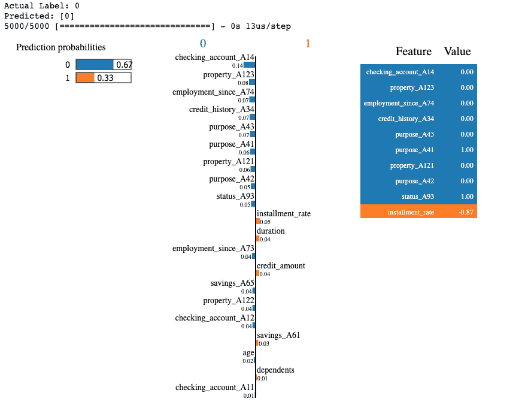

# 使用属性重要性、PDP 和 LIME 解释黑盒模型

> 原文：<https://www.dominodatalab.com/blog/explaining-black-box-models-using-attribute-importance-pdps-and-lime>

在本文中，我们讨论了黑盒模型的可解释性，并展示了如何使用 Skater 框架中的不同方法来深入了解一个简单的信用评分神经网络模型的内部工作原理。

在过去的十年中，对机器学习的解释的兴趣一直在快速增长。这可以归因于机器学习算法，更具体地说，深度学习，在各个领域越来越受欢迎。

完全理解深度神经网络的推理过程并证明它会如预期的那样一般化是不可能的。

根据 Fox 等人的说法，对可解释人工智能的需求主要由以下三个原因驱动:

*   对**信任**的需求——如果医生根据神经网络的预测推荐治疗方案，这个医生必须对网络的能力有绝对的信任。当人的生命受到威胁时，这种信任是最重要的。
*   对**交互**的需求——复杂的决策系统通常依赖于人类自主团队(HAT)，其结果是由一个或多个人类和一个或多个自主代理共同努力产生的。这种形式的合作要求操作员能够与模型进行交互，以便更好地理解或改进自动推荐。
*   透明的需要——如果一个网络提出了不恰当的建议或者不同意人类专家的意见，它的行为必须是可以解释的。应该有一些机制允许我们检查模型决策过程的内部工作，并了解这个决策是基于什么。

此外，监管机构正在引入有关自动化决策制定的法律要求。例如,《一般数据保护条例》 (GDPR)第 22 条引入了解释权----个人有权要求解释基于模型的决定背后的原因，并在该决定对个人造成负面影响时提出质疑。美国国防高级研究计划局(DARPA)正在支持一项旨在促进人工智能可解释性的重大努力(见图雷克，DARPA XAI)。

上面概述的要求很难满足——人工神经网络(ann)能够产生高度精确的结果，但它们通常具有成千上万的参数，并且极其复杂。它们被简单地视为黑盒，因为尽管它们是通用近似器，但它们不能提供关于如何模拟近似函数或什么决定其行为的见解。这就引出了一个重要的问题——模型性能的提高是否超过了其他重要的标准，而这些标准应该作为决策过程的一部分加以考虑。

## 解释深度学习的方法

谢等人(2020)提出了以下一套基本方法，对解释深度人工神经网络的各种方法进行分类。

*   **可视化方法** -这种方法使用科学的可视化来突出某些输入对模型输出的影响。例如，我们可以根据训练阶段通过网络的梯度大小来判断某些输入特征的相关性(Erhan 等人，2009 年)。
*   **模型提炼**——这种方法建立了一个独立的可解释模型，模拟深层网络的输入输出行为。因为这个独立的模型本质上是一个白盒，它可以用于提取解释人工神经网络背后的决策的规则。参见 Ribeiro 等人(2016)关于该技术(石灰)的示例。
*   **内在方法** -这种技术基于人工神经网络，它被设计成在标准预测的同时输出一个解释。由于其结构，内在可解释人工神经网络不仅可以优化其预测性能，还可以优化其可解释性度量。例如，联合训练为原始问题增加了一个额外的“解释任务”，并训练系统“联合”解决这两个问题(参见 Bahdanau，2014)

在本文中，我们将使用一个免费的模型解释框架 [Skater](https://oracle.github.io/Skater/overview.html) 来说明上面的一些关键概念。Skater 提供了广泛的算法，可用于视觉解释(例如，逐层相关性传播)、模型提取(例如，LIME)，并且它还支持本机可解释的模型。

此外，Skater 支持本地和全局模型。它可以解释可直接访问的模型(例如脚本中的 Python 对象)，但它也可以通过 API 接入操作化的模型，并为生产中运行的模型提供解释(参见 [DeployedModel](https://oracle.github.io/Skater/tutorial.html#operationalized-model-deployedmodel) 类)

## 用滑冰者解释信用卡违约

对于这个演示，我们将使用免费的 Statlog(德国信用数据)数据集，可以从 [Kaggle](https://archive.ics.uci.edu/ml/datasets/statlog+(german+credit+data)) 下载。该数据集根据一组属性将客户分为两个信用风险组——好的或坏的。这个数据集中的大多数属性都是分类的，并且它们被符号化编码。例如，属性 1 表示现有支票账户的状态，可以取下列值之一:

A11:...< 0 德国马克

A12 : 0 <=...< 200 德国马克

A13:...> = 200 德国马克/至少一年的薪金分配

A14:没有支票账户

原始数据集附带的[文档](https://archive.ics.uci.edu/ml/machine-learning-databases/statlog/german/german.doc)中给出了所有属性和符号代码的综合列表。

我们首先加载数据，为所有属性设置有意义的名称，并显示前 5 个条目。

```py
%matplotlib inline
import pandas as pd
import matplotlib.pyplot as plt
from imblearn.over_sampling import SMOTE
from sklearn.preprocessing import StandardScaler #OneHotEncoder,
from sklearn.preprocessing import LabelEncoder
from sklearn.model_selection import train_test_split
from collections import defaultdict
from sklearn.metrics import f1_score
from sklearn.metrics import accuracy_score
from sklearn.model_selection import StratifiedKFold
from sklearn.model_selection import cross_val_score
from skater.core.local_interpretation.lime.lime_tabular import LimeTabularExplainer
from skater.model import InMemoryModel
from skater.core.explanations import Interpretation
from keras.models import Sequential
from keras import regularizers
from keras import optimizers
from keras.layers import Dense, Dropout
from keras.wrappers.scikit_learn import KerasClassifier
seed = 1234 # set for reproducibility

col_names = names = ["checking_account", "duration", "credit_history", "purpose", "credit_amount",
"savings", "employment_since", "installment_rate", "status", "debtors_guarantors",
"residence", "property", "age", "other_installments", "housing",
"credits", "job", "dependents", "telephone", "foreign_worker", "credit"]
data_df = pd.read_csv("german.data",names = col_names, delimiter=' ')
data_df.head()
```


接下来，我们继续进行一些轻量级的[特征工程](https://www.dominodatalab.com/data-science-dictionary/feature-engineering)。我们首先将类别标签重新编码为 1(信用良好)和 0(信用不良)。然后，我们提取数字属性并对它们进行规范化。

```py
# Remap the target attribute:  - good credit, 0 - bad credit

data_df["credit"].replace([1,2], [1,0], inplace=True)
num_attr_names = ["duration", "credit_amount", "installment_rate", "residence",
"age", "credits", "dependents"]
cat_attr_names = ["checking_account", "credit_history", "purpose", "savings", "employment_since",
"status", "debtors_guarantors", "property", "other_installments", "housing",
"job", "telephone", "foreign_worker"]
num_attr_norm = pd.DataFrame(StandardScaler().fit_transform(data_df[num_attr_names]),
columns=num_attr_names)
num_attr_norm.head()
```


然后我们使用一个 [LabelEncoder](https://scikit-learn.org/stable/modules/generated/sklearn.preprocessing.LabelEncoder.html) 用虚拟变量替换所有分类变量:

```py
dd = defaultdict(LabelEncoder)
cat_attr = data_df[cat_attr_names].apply(lambda col: dd[col.name].fit_transform(col))
cat_attr_dummy = pd.get_dummies(data_df[cat_attr_names])
cat_attr_dummy.head()
```


最后，我们将标准化的数值变量和虚拟变量合并在一起，得到一个完整的全数值数据集。

```py
clean_df = pd.concat([cat_attr_dummy, num_attr_norm, data_df["credit"]], axis = 1)
```

然后，我们将训练特征分成矩阵 X，将类别变量分成向量 y。注意，我们的特征工程和建模方法相当幼稚。这是因为在这篇文章中，我们不是在追求一个最先进的分类器，而是想把重点放在对样本数据集拟合的黑盒模型的解释上。

```py
X = clean_df.loc[:, clean_df.columns != "credit"]

y = clean_df["credit"]
```

在形成 X 和 y 变量之后，我们将数据分成训练集和测试集。

```py
X_train, X_test, y_train, y_test = train_test_split(X, y, test_size=0.2, random_state=seed)

y_train.value_counts()
```

```py
1    570

0    230

Name: credit, dtype: int64
```

查看训练子集中的目标向量，我们注意到我们的训练数据非常不平衡。这是意料之中的，因为没有理由对好的和坏的信用风险进行完全 50:50 的分离。为了补救这一点，我们可以应用像 [SMOTE](https://blog.dominodatalab.com/smote-oversampling-technique/) 这样的过采样技术，产生一个完美平衡的训练集:

```py
oversample = SMOTE(random_state=seed)

X_train, y_train = oversample.fit_resample(X_train, y_train)

y_train.value_counts()
```

```py
1    570

0    570

Name: credit, dtype: int64
```

准备好训练数据后，我们现在继续使用 Keras 训练一个简单的 ANN 模型。我们首先定义网络架构，这是一个简单的前馈人工神经网络，具有一个使用双曲正切激活的 50 个神经元的全连接层、一个漏失正则化层和一个由 sigmoid 函数激活的单位输出。使用学习率为 0.01 的简单随机梯度下降来优化网络，训练被限制为 50 个时期，并且使用包含 30 个样本的小批量来应用更新。

```py
def create_model():
sgd = optimizers.SGD(lr=0.01, decay=0, momentum=0.9, nesterov=False)
model = Sequential()
model.add(Dense(units=50, activation="tanh", input_dim=61, kernel_initializer="glorot_normal", bias_initializer="zeros"))
model.add(Dropout(0.1))
model.add(Dense(units=1, activation="sigmoid", kernel_initializer="glorot_normal", bias_initializer="zeros"))

model.compile(loss="binary_crossentropy", optimizer=sgd, metrics=["accuracy"])
return model

nn = KerasClassifier(build_fn=create_model, epochs=10, batch_size=20, verbose=1)
nn.fit(X_train, y_train, validation_data=(X_test, y_test))
y_pred = nn.predict(X_test)
```

```py
Train on 1140 samples, validate on 200 samples

Epoch 1/10

1140/1140 [==============================] - 0s 274us/step - loss: 0.6147 - acc: 0.6535 - val_loss: 0.5452 - val_acc: 0.7400

Epoch 2/10

1140/1140 [==============================] - 0s 53us/step - loss: 0.5040 - acc: 0.7526 - val_loss: 0.5175 - val_acc: 0.7550

Epoch 3/10

1140/1140 [==============================] - 0s 51us/step - loss: 0.4563 - acc: 0.7904 - val_loss: 0.5124 - val_acc: 0.7500

Epoch 4/10

1140/1140 [==============================] - 0s 51us/step - loss: 0.4303 - acc: 0.8061 - val_loss: 0.5144 - val_acc: 0.7400

Epoch 5/10

1140/1140 [==============================] - 0s 47us/step - loss: 0.4188 - acc: 0.8053 - val_loss: 0.5250 - val_acc: 0.7400

Epoch 6/10

1140/1140 [==============================] - 0s 47us/step - loss: 0.4012 - acc: 0.8219 - val_loss: 0.5222 - val_acc: 0.7450

Epoch 7/10

1140/1140 [==============================] - 0s 46us/step - loss: 0.3858 - acc: 0.8237 - val_loss: 0.5250 - val_acc: 0.7450

Epoch 8/10

1140/1140 [==============================] - 0s 46us/step - loss: 0.3794 - acc: 0.8333 - val_loss: 0.5096 - val_acc: 0.7500

Epoch 9/10

1140/1140 [==============================] - 0s 46us/step - loss: 0.3793 - acc: 0.8193 - val_loss: 0.5477 - val_acc: 0.7150

Epoch 10/10

1140/1140 [==============================] - 0s 46us/step - loss: 0.3726 - acc: 0.8325 - val_loss: 0.5239 - val_acc: 0.7450

200/200 [==============================] - 0s 107us/step
```

## 通过特征重要性进行解释

现在我们已经有了黑盒模型，我们可以尝试几种技术来了解模型决策背后的关键驱动因素。因为这个模型是本地可访问的，所以我们只需要创建一个 InMemoryModel 对象。InMemoryModel 的唯一强制参数是预测生成函数。在我们的例子中，这是来自 Keras ANN 的 *predict_proba* 。

然后，我们创建一个解释对象，将数据传递给预测函数。为了计算重要性，我们将我们的解释限制在 5000 个样本，并且我们还要求按照重要性以升序对特征进行排序。

属性重要性计算的实现基于可变重要性分析(VIA)。Skater 根据模型的类型使用不同的技术(例如回归、多类分类等。)，但它通常依赖于在给定特征扰动的情况下测量预测变化的熵。更多详细信息，请参见 Wei 等人(2015 年)。

```py
model_nn = InMemoryModel(nn.predict_proba,

                         target_names=["bad credit","good credit"],

                         examples=X_train[:5])
interpreter = Interpretation(X_train, feature_names=list(X.columns), training_labels=y_train)
nn_importances = interpreter.feature_importance.feature_importance(model_nn, n_jobs=1, ascending=True, n_samples=5000)
```

```py
5/5 [==============================] - 0s 72us/step

5/5 [==============================] - 0s 63us/step

...

1140/1140 [==============================] - 0s 12us/step

[61/61] features ████████████████████ Time elapsed: 11 seconds
```

完成计算后，我们可以绘制出影响模型决策的前 25 个最重要的特征。请注意，要素重要性计算的结果是一个已排序的熊猫系列，其中包含属性及其重要性分数。

```py
nn_importances.tail(25).plot.barh(figsize=(10,12));
```


我们看到对预测影响最大的前 5 个特征是:

*   支票账户 A14:没有支票账户
*   状态 _A93:个人状态和性别-单身男性
*   property_A123:拥有不同于房地产、储蓄协议或人寿保险的财产(如汽车)
*   就业 _ 自 _A73:连续全职就业 1 至 4 年
*   用途 _A43:贷款用途是购买电视/音响设备

上述特征直观上是有意义的，但它们也凸显了一个问题——该模型可能会歧视单身男性。这些类型的洞察力不容易从黑盒模型中获得，这个例子强调了通过某种解释过程运行训练模型的重要性。

### 部分相关图

部分依赖图是另一种可视化方法，它是模型不可知的，可以成功地用于深入了解像深度人工神经网络这样的黑盒模型的内部工作原理。PDP 是评估一个或两个特征变化对模型结果影响的有效工具。它们显示了目标和一组输入要素之间的依赖性，同时忽略了所有其他要素的值。下图是一个 PDP 示例，显示了温度、湿度和风速等特性的变化对自行车租赁预测数量的影响。


PDPs for the bicycle count prediction model (Molnar, 2009)

为我们的模型创建 PDP 相当简单。我们只需要从我们的解释器调用*plot _ partial _ dependency*函数，传递以下参数:

*   feature_ids -我们希望了解其对预测的影响的要素
*   n_samples -计算重要性时使用的样本数
*   n _ jobs——用于计算的当前进程的数量(设置时必须考虑可用 CPU 的数量，设置为 1 将禁用多处理)

我们选择持续时间和年龄作为我们感兴趣的特征，这产生了 3D PDP。

```py
interpreter.partial_dependence.plot_partial_dependence([("duration", "age")],

                                                      model_nn,

                                                      n_samples=500,

                                                      figsize=(14, 12),

                                                      n_jobs=1,

                                                      grid_resolution=30);
```

```py
500/500 [==============================] - 0s 16us/step

500/500 [==============================] - 0s 14us/step

500/500 [==============================] - 0s 14us/step

...

500/500 [==============================] - 0s 15us/step

500/500 [==============================] - 0s 14us/step

[609/609] grid cells ████████████████████ Time elapsed: 142 seconds
```


因为我们正在处理一个分类问题，并且模型输出概率，所以 PDP 显示随着持续时间和年龄值的变化，具有良好信用的概率(Z 轴)的变化。非常清楚的是，随着信贷期限的增加和申请人年龄的降低，这种贷款变成违约的可能性增加(即良好的信用可能减少)。另一方面，年龄较大的申请人的短期贷款有更高的机会成为良好的信贷决策。

请注意，PDP 生成和检查在全局范围内起作用——这种方法考虑了所有数据样本，并在给定整个数据集的情况下，提供了关于所选自变量和目标之间关系的见解。

## 使用本地代理解释模型(LIME)

局部可解释的模型不可知解释(LIME，Ribeiro，2016)是另一种模型不可知方法，可用于黑盒模型，以解释模型决策背后的基本原理。然而，与 PDP 不同的是，LIME 是在本地范围内运作的，其背后的想法相当简单。我们可能有一个分类器，它在全局上有一个非常复杂的决策边界，但是如果我们聚焦于单个样本，那么这个模型在这个特定位置的行为通常可以用一个简单得多的、可解释的模型来解释。


Toy example to present intuition for LIME from Ribeiro (2016). The black-box model’s complex decision function (unknown to LIME) is represented by the blue/pink background, which cannot be approximated well by a linear model. The bold red cross is the instance being explained.

选择感兴趣的样本后，LIME 使用所选样本属性的扰动来训练代理模型。用一些噪声干扰独立变量并监测对目标变量的影响通常足以提供良好的局部解释。代理模型通常是简单的线性模型或决策树，它们天生是可解释的，因此从扰动和相应的类输出中收集的数据可以很好地表明是什么影响了模型的决策。

Skater 提供了 LIME 的一个实现，可以通过 LimeTabularExplainer 类访问它。我们需要做的就是实例化 LimeTabularExplainer，并让它访问训练数据和独立的特性名称。

```py
explainer = LimeTabularExplainer(X, feature_names=list(X.columns), discretize_continuous=False, mode="classification")
```

接下来，我们选择一个我们想要得到解释的样本，比如说测试数据集中的第一个样本(样本 id 0)。我们从解释器中调用 explain_instance 函数，查看实际的和预测的类，以及各个属性对预测的相应影响。

```py
id = 0

print("Actual Label: %s" % y_test.iloc[id])

print("Predicted: %s" % y_pred[id])

explainer.explain_instance(X_test.iloc[id].values, nn.predict_proba, labels=(y_pred[id][0], ), num_features=20).show_in_notebook()
```


我们观察到，对于这个特定的样本，模型非常确信这是一个好的信用。有许多具有相关值的属性将决策“拉”向 1 类(例如贷款目的、信用记录、现有储蓄等。)

对于测试集中的样本 23，模型倾向于不良信用预测。

```py
id = 23

print("Actual Label: %s" % y_test.iloc[id])

print("Predicted: %s" % y_pred[id])

explainer.explain_instance(X_test.iloc[id].values, nn.predict_proba, labels=(y_pred[id][0], ), num_features=20).show_in_notebook()
```



同样，我们可以看到影响 0/1 预测的所有属性及其相应的值。

注意:我们使用的模型不是很准确，因为这篇文章的目的是展示黑盒人工神经网络的不同解释方法，而不是在这个特定的数据集上获得 SOTA 性能。你不应该过多地解读模型基于什么属性做出决定，因为它有大量的假阴性和假阳性。相反，您应该关注如何使用 PDP 和 LIME 等技术来深入了解模型的内部工作，以及如何将这些技术添加到您的数据科学工具箱中。

### 参考

玛丽亚福克斯，德里克龙，和丹尼尔马加泽尼。[可说明的策划](https://arxiv.org/pdf/1709.10256.pdf)。在 IJCAI 2017 年可解释人工智能研讨会(XAI)，第 24-30 页，澳大利亚墨尔本，2017 年。国际人工智能联合会议。

马特·图雷克，可解释的人工智能(XAI)，DARPA，2021 年 7 月 6 日检索自[https://www . DARPA . mil/program/可解释的人工智能](https://www.darpa.mil/program/explainable-artificial-intelligence)

谢宁、加布里埃尔·拉斯、马塞尔·范格文、德里克·多兰，《可解释的深度学习:外行人的实地指南》，CoRR，2020 年，[https://arxiv.org/abs/2004.14545](https://arxiv.org/abs/2004.14545)

D.埃尔汉、约舒阿·本吉奥、亚伦·c·库维尔、帕斯卡尔·文森特，《深层网络高层特征可视化》，2009 年

我为什么要相信你？:解释任何分类器的预测，第 22 届 ACM SIGKDD 国际会议录

知识发现和数据挖掘会议，第 1135-1144 页，ACM，2016

Bahdanau，d .，Cho，k .，& Bengio，y .，[联合学习对齐和翻译的神经机器翻译](https://arxiv.org/pdf/1409.0473.pdf)，ICLR，2015 年

、陆、、宋，[变重要性分析:综合评述](https://www.sciencedirect.com/science/article/pii/S0951832015001672)，可靠性工程&系统安全，2015 年第 142 卷，第 399-432 页，ISSN 0951-8320

[可解释的机器学习](https://christophm.github.io/interpretable-ml-book/pdp.html)，Christoph Molnar，第 5.1 节，2009 年