# 用 Python 探索美国房地产价值

> 原文：<https://www.dominodatalab.com/blog/exploring-us-real-estate-values-with-python>

*本帖涵盖了使用机器学习和交互式绘图的数据探索。如果对运行示例感兴趣，有一个[补充 Domino 项目可用](https://try.dominodatalab.com/u/domino-johnjoo/real_estate_ml/overview)。*

## 介绍

[模型是数据科学的核心](https://www.dominodatalab.com/blog/what-is-modeling)。数据探索对模型开发至关重要，在任何[数据科学项目](/blog/adopting-the-4-step-data-science-lifecycle-for-data-science-projects)的开始阶段尤为重要。可视化工具有助于使数据的形状更加明显，表面模式可以很容易地隐藏在数百行数据中，甚至可以帮助建模过程本身。在 Domino 寻求帮助数据科学家加快他们的工作时，我们联系了 AWP·皮尔森，请求他允许我们从诺亚·吉福特的《实用人工智能:基于云的机器学习简介 一书中摘录“房地产”一章。非常感谢 AWP·皮尔森提供了摘录作品的许可，并使我们能够用 Python 提供一个[补充 Domino 项目。](https://try.dominodatalab.com/u/domino-johnjoo/real_estate_ml/overview)

[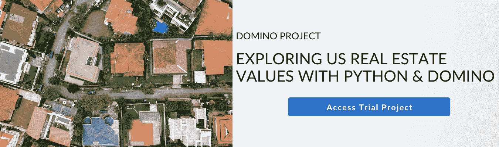](https://cta-redirect.hubspot.com/cta/redirect/6816846/c70e8092-5354-44de-909d-8eb375fda6be) 

## 第一章介绍:房地产

你知道有什么好的数据集可以探索吗？这是我作为讲师或教授工作坊时被问得最多的问题之一。我的答案之一是 Zillow 房地产数据集:[https://www.zillow.com/research/data/](https://www.zillow.com/research/data/)。美国的房地产市场是每个生活在这个国家的人都必须面对的问题，因此，它成为了谈论 ML 的一个很好的话题。

## 探索美国的房地产价值

住在旧金山湾区会让人经常思考房价问题。这是有充分理由的。海湾地区的房价中值正以惊人的速度上涨。从 2010 年到 2017 年，旧金山单户住宅的中值价格从大约 77.5 万美元上升到 150 万美元。这些数据将用 Jupyter 笔记本[和 Domino 项目]进行探索。整个项目及其数据可以在[https://github.com/noahgift/real_estate_ml](https://github.com/noahgift/real_estate_ml)【和[互补多米诺项目](https://try.dominodatalab.com/u/domino-johnjoo/real_estate_ml/overview)中查看。

在笔记本的开始，几个库被导入，Pandas 被设置为显示浮点数和科学记数法。

```py
import pandas as pd
pd.set_option("display.float_format", lambda x: "%.3f" % x)
import numpy as np
import statsmodels.api as sm
import statsmodels.formula.api as smf
import matplotlib.pyplot as plt
import seaborn as sns
sns.set(color_codes=True) 

from sklearn.cluster import KMeans
color = sns.color_palette()

from IPython.core.display import display, HTML 
display(HTML("{ width:100% !important; }"))
%matplotlib inline
```

接下来，[来自 Zillow 的单户家庭数据](https://www.zillow.com/research/data/)被导入并描述。

```py
df.head()
df.describe()
```

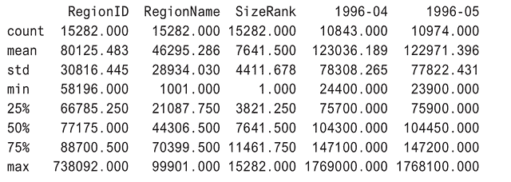

接下来，进行清理以重命名列并格式化列类型。

```py
df.rename(columns={"RegionName":"ZipCode"}, inplace=True)
df["ZipCode"]=df["ZipCode"].map(lambda x: "{:.0f}".format(x))
df["RegionID"=df["RegionID"].map(lambda x: "{:.0f}".format(x))
df.head()
```

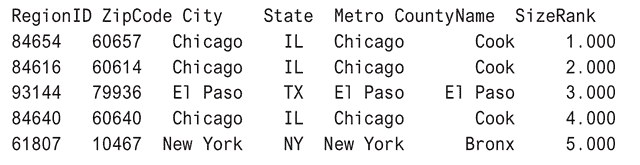

获取整个美国的中值将有助于本笔记本中许多不同类型的分析。在以下示例中，聚合了与地区或城市匹配的多个值，并为它们创建了中位数计算。创建了一个名为`df_comparison`的新数据帧，将与 [Plotly](https://www.dominodatalab.com/data-science-dictionary/plotly) 库一起使用。

```py
median_prices = df.median()
median_prices.tail()
```

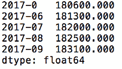

```py
marin_df = df[df["CountyName"] == "Marin"].median()
sf_df = df[df["City"] == "San Francisco"].median()
palo_alto = df[df["City"] == "Palo Alto"].median()
df_comparison = pd.concat([marin_df, sf_df, palo_alto, median_prices], axis=1)
df_comparison.columns = ["Marin County","San Francisco", "Palo Alto", "Median USA"]
```

## Python 中的交互式数据可视化

Python 中有几个常用的交互式数据可视化库: [Plotly](https://github.com/plotly/plotly.py) 和 [Bokeh](https://bokeh.pydata.org/en/latest/) 。在这一章中，Plotly 将用于数据可视化，但散景也可以做类似的绘图。Plotly 是一家商业公司，既可以在离线模式下使用，也可以通过导出到公司网站来使用。Plotly 还有一个开源的 Python 框架，叫做 [Dash](https://dash.plotly.com/) ，可以用来构建分析性的 web 应用程序。这一章的很多情节可以在[这里](https://chart-studio.plotly.com/~ngift#/)找到。

在这个例子中，一个名为 *[袖扣](https://plot.ly/ipython-notebooks/cufflinks/)* 的库被用来使直接从熊猫数据帧到 Plotly 的绘图变得简单。袖扣被描述为熊猫的“生产力工具”。该库的一个主要优势是能够像熊猫一样进行绘图。

```py
import cufflinks as cf
cf.go_offline()
df_comparison.iplot(title="Bay Area MedianSingle Family Home Prices 1996-2017", 
    xTitle="Year", ,yTitle="Sales Price",#bestfit=True, bestfit_colors=["pink"],
    #subplots=True,
    shape=(4,1),
    #subplot_titles=True, fill=True,)
    fill=True)
```

图 10.1 显示了没有打开交互的绘图视图。帕洛阿尔托看起来像一个真正可怕的地方，作为一个买家进入房地产市场。

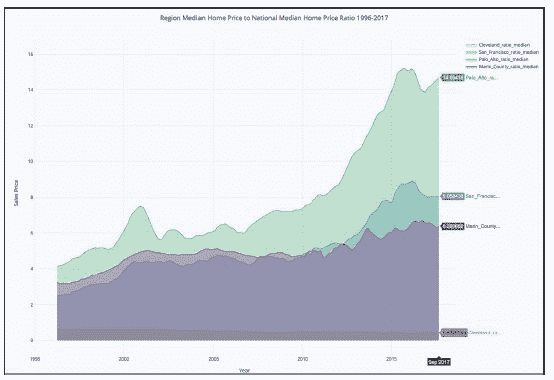Figure 10.1 Can Palo Alto Grow Exponentially Forever?

在图 10.2 中，鼠标悬停在 2009 年 12 月，它显示了上一次房地产崩盘底部附近的一个点，帕洛阿尔托的房价中值为 120 万美元，旧金山的中值约为 75 万美元，整个美国的中值为 17 万美元。

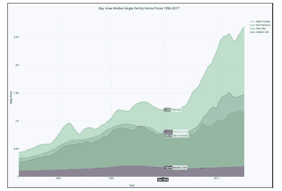Figure 10.2 Housing Market Bottom in December 2009

通过滚动图表，可以看到 2017 年 12 月，帕洛阿尔托的价格约为 270 万美元，8 年内翻了一倍多。另一方面，美国其他地区的房价中值仅上涨了约 5%。这个绝对值得多探讨。

## 根据大小等级和价格进行聚类

为了进一步探索正在发生的事情，可以使用 sklearn 和 Plotly 创建 k-means 集群 3D 可视化。首先，使用 MinMaxScaler 对数据进行缩放，这样离群值就不会扭曲聚类的结果。

```py
from sklearn.preprocessing import MinMaxScaler
columns_to_drop = ["RegionID", "ZipCode", "City", "State", "Metro", "CountyName"]
df_numerical = df.dropna()
df_numerical = df_numerical.drop(columns_to_drop, axis=1)
```

接下来，快速描述一下。

```py
df_numerical.describe()
```

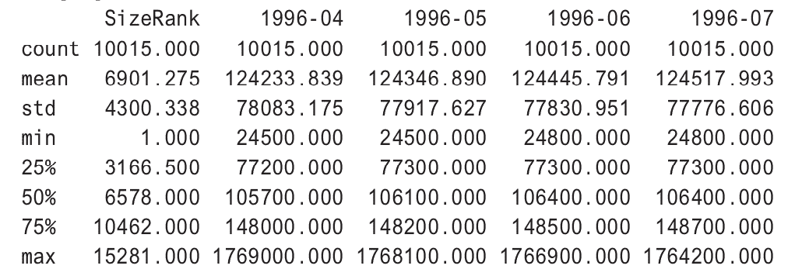

在删除丢失的值后执行聚类时，大约有 10，000 行。

```py
scaler = MinMaxScaler()
scaled_df = scaler.fit_transform(df_numerical)
kmeans = KMeans(n_clusters=3, random_state=0).fit(scaled_df)
print(len(kmeans.labels_))
10015
```

增加了升值比例栏，可视化前对数据进行了清理。

```py
cluster_df = df.copy(deep=True)
cluster_df.dropna(inplace=True)
cluster_df.describe()
cluster_df['cluster'] = kmeans.labels_
cluster_df['appreciation_ratio'] =round(cluster_df["2017-09"]/cluster_df["1996-04"],2)
cluster_df['CityZipCodeAppRatio']=cluster_df["City"].map(str) + "-" + cluster_df['ZipCode'] + "-" +
cluster_df["appreciation_ratio"].map(str)
cluster_df.head()
```

接下来，在离线模式下使用 Plotly(即，它不会被发送到 Plotly 服务器)，绘制三个轴: *x* 是升值比率， *y* 是 1996 年，z 是 2017 年。集群是阴影的。在图 10.3 中，一些模式会立即突出出来。泽西城在过去 30 年中升值幅度最大，从 14.2 万美元的低点涨到了 134.4 万美元的高点，增长了 9 倍。

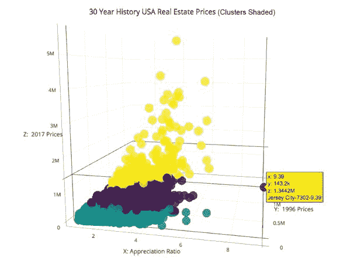Figure 10.3 What the Heck Is Going on With Jersey City Appreciation?

一些其他可见的东西是帕洛阿尔托的几个邮政编码。它们的价值也增加了大约 6 倍，考虑到这些房子一开始有多贵，这就更令人吃惊了。在过去的 10 年里，包括脸书在内的帕洛阿尔托初创公司的崛起导致了定价的扭曲，甚至将整个湾区都计算在内。

另一个有趣的可视化是这些相同的列的增值率，看看这种趋势在帕洛阿尔托是否可以进一步观察到。代码看起来类似于图 10.3 中的代码。

```py
from sklearn.neighbors import KNeighborsRegressor
neigh = KNeighborsRegressor(n_neighbors=2)

df_comparison.columns = ["Marin County", "San Francisco", "Palo Alto", "Median USA"]
cleveland = df[df["City"] == "Cleveland"].median()
df_median_compare = pd.DataFrame()
df_median_compare["Cleveland_ratio_median"] = cleveland/df_comparison["Median USA"]
df_median_compare["San_Francisco_ratio_median"] = df_comparison["San Francisco"]/df_comparison["Median USA"]
df_median_compare["Palo_Alto_ratio_median"] = df_comparison["Palo Alto"]/df_comparison["Median USA"]
df_median_compare["Marin_County_ratio_median"] = df_comparison["Marin County"]/df_comparison["Median USA"]
```

```py
import cufflinks as cf
cf.go_offline()
df_median_compare.iplot(title="Ratio to National Median Region Median Home Price to National Median Home Price Ratio 1996-2017",
    xTitle="Year",
    yTitle="Ratio to National Median",
    #bestfit=True, bestfit_colors=["pink"],
    #subplots=True,
    shape=(4,1),
    #subplot_titles=True,
    fill=True)
```

在图 10.4 中，自 2008 年房地产崩盘以来，帕洛阿尔托的中值升值看起来呈指数增长，然而旧金山湾区的其他地方似乎波动较小。一个合理的假设可能是，在帕洛阿尔托的湾区内存在泡沫，这可能是不可持续的。最终，指数增长会停止。

另一件要看的事情是看租金指数，看看是否有进一步的模式梳理出来。

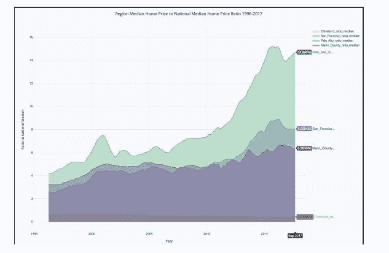Figure 10.4 Palo Alto Went From Having Home Prices 5 Times Higher Than National Median to 15 Times Higher in About 10 Years

初始数据导入被清除，Metro 列被重命名为 City 列。

```py
df_rent = pd.read_csv("../data/City_MedianRentalPrice_Sfr.csv")
df_rent.head()
median_prices_rent = df_rent.median()
df_rent[df_rent["CountyName"] == "Marin"].median()
df_rent.columns
```

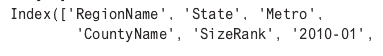

```py
df_rent.rename(columns={"Metro":"City"}, inplace=True)
df_rent.head()
```

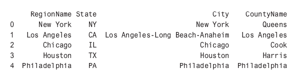

接下来，在新的数据帧中创建中间值。

```py
median_prices_rent = df_rent.median()
marin_df = df_rent[df_rent["CountyName"span>] == "Marin"].median()
sf_df = df_rent[df_rent["City"] == "San Francisco].median()
cleveland = df_rent[df_rent["City"] == "Cleveland"].median()
palo_alto = df_rent[df_rent["City"] == "Palo Alto"].median()
df_comparison_rent = pd.concat([marin_df, sf_df, palo_alto, cleveland, median_prices_rent], axis=1)
df_comparison_rent.columns = ["Marin County","San Francisco,"Palo Alto", "Cleveland", "Median USA"]
```

最后，袖扣再次被用于绘制租金中位数。

```py
import cufflinks as cf
cf.go_offline()
df_comparison_rent.iplot(
title="Median Monthly Rents Single Family Homes",
    xTitle="Year",
    yTitle="Monthly",
    #bestfit=True, bestfit_colors=["pink"],
    #subplots=True,
    shape=(4,1),
    #subplot_titles=True,
    fill=True)
```

在图 10.5 中，趋势看起来不太明显，部分原因是数据分布在较短的时间段内，但这并不是全貌。虽然帕洛阿尔托不在这个数据集中，但旧金山湾区的其他城市看起来更接近租金中位数，而俄亥俄州的克利夫兰似乎只有美国租金中位数的一半左右。

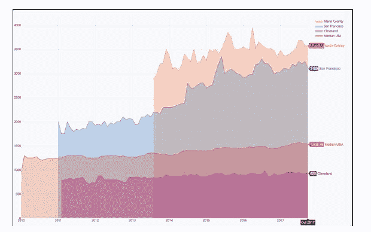Figure 10.5 Rents in the San Francisco Bay Area since 2011 Have Almost Doubled While the Rest of the US Has Stayed Flat

最后一项分析是，在全美范围内寻找类似的租金比率。在这段代码中，租金比率是用一个新的空数据框架创建的，然后再次插入到 Plotly 中。

```py
df_median_rents_ratio = pd.DataFrame()
df_median_rents_ratio["Cleveland_ratio_median"] = df_comparison_rent["Cleveland"]/df_comparison_rent["Median USA"]
df_median_rents_ratio["San_Francisco_ratio_median"] = df_comparison_rent["San Francisco"]/df_comparison_rent["Median USA"]
df_median_rents_ratio["Palo_Alto_ratio_median"] = df_comparison_rent["Palo Alto"]/df_comparison_rent["Median USA"]
df_median_rents_ratio["Marin_County_ratio_median"] = df_comparison_rent["Marin County"]/df_comparison_rent["Median USA"]
```

```py
import cufflinks as cf
cf.go_offline()
df_median_rents_ratio.iplot(title="Median Monthly Rents Ratios Single Family Homes vs National Median"
    xTitle="Year",
    xTitle="Year",
    yTitle="Rent vs Median Rent USA",
    #bestfit=True, bestfit_colors=["pink"],
    #subplots=True,
    shape=(4,1),
    #subplot_titles=True,
    fill=True)
```

图 10.6 显示了一个不同于升值比率的故事。在旧金山，租金中位数仍然是美国其他地区中位数的两倍，但远不及房价中位数的 8 倍。在查看租赁数据时，在 2018 年买房之前仔细检查一下可能会有好处，特别是在帕洛阿尔托地区。租房，即使价格很高，也可能是一笔好得多的交易。

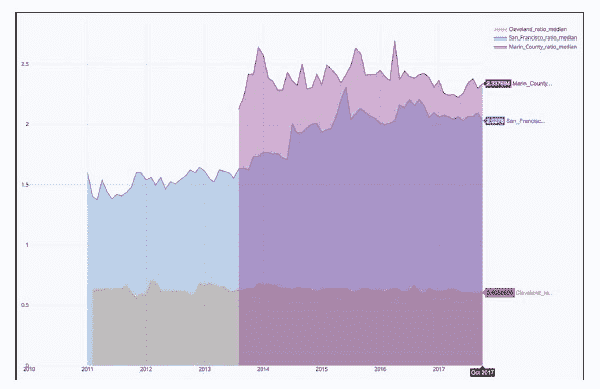Figure 10.6 Monthly Rents in the San Francisco Bay Area Versus National Median Have Exploded

## 摘要

在这一章中，我们对一个公共的 Zillow 数据集进行了数据探索。Plotly 库用于在 Python 中创建交互式数据可视化。k-means 聚类和 3D 可视化被用来从相对简单的数据集中梳理出更多的信息。这些发现包括一个想法，即 2017 年旧金山湾区，特别是帕洛阿尔托，可能存在房地产泡沫。通过为美国的每个地区创建一个何时销售、何时购买的分类模型，对这个数据集做进一步的探索是值得的。

这个示例项目的其他未来方向是查看更高级别的 API，如 [House Canary](https://api-docs.housecanary.com/#getting-started) 提供的 API。也许你的组织可以通过使用他们的预测模型作为基础来构建一个人工智能应用程序，然后在其上层叠其他人工智能和 ML 技术。

*^(编辑注:已经实现了一些小的更改，以增加在线可读性，并反映补充 Domino 项目中预安装的组件。)*