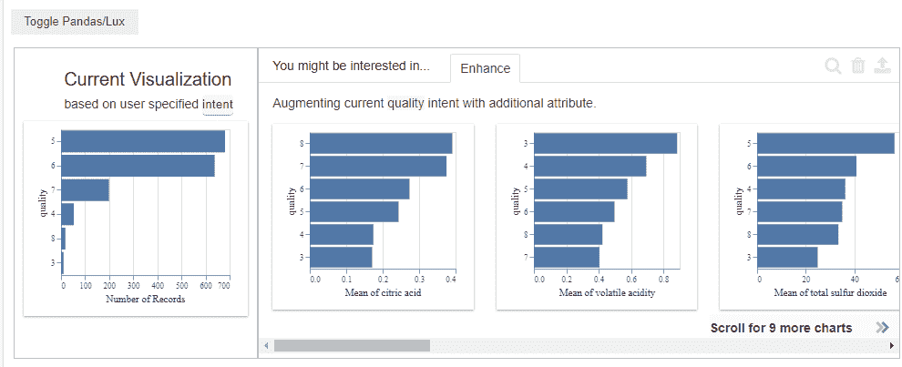

# 通过 lux 在木星上进行更快的数据探索

> 原文：<https://www.dominodatalab.com/blog/faster-data-exploration-in-jupyter-through-the-lux-widget>

笔记本已经成为许多数据科学家的主要工具之一。它们提供了一种清晰的方式，在数据探索、特征工程和模型拟合的整个过程中与其他人进行协作，并且通过利用[一些清晰的最佳实践](https://blog.dominodatalab.com/the-importance-of-structure-coding-style-and-refactoring-in-notebooks/)，还可以成为代码如何运行的活文档。

笔记本电脑让用户能够选择他们所选择的语言和库，这提供了很大的灵活性，但另一方面，它们在执行某些任务(如数据分析和分析)时可能会非常耗费代码。这通常会导致数据科学家利用 Tableau 或 PowerBI 等其他工具来减少他们需要编写的总代码量，但这通常意味着他们的探索性分析与寻求解决问题的代码脱节。

## 莱克丝是什么？

Lux 是一个 Jupyter 库，集成了一个交互式小工具，可以在笔记本中自动生成可视化数据。这使得数据科学家能够快速浏览一系列可视化结果，找出相关性和有趣的趋势。Lux 还支持指定特定的意图，然后进一步切片、切割和过滤图表，以找到最适合您正在处理的问题的图表。

这篇博客给出了一个快速设置指南，以及一个项目和一个在[Domino Enterprise MLOps platform](https://www.dominodatalab.com/product/domino-data-science-platform/)中的环境，您可以亲自尝试一下。

## 安装和配置

Lux 需要 Scipy，Altair，Pandas 和 Scikit-学习安装。一旦这些配置完成，安装 Lux 可以通过控制台中的 pip install 命令来完成。

```py
pip install git+https://github.com/lux-org/lux.git

pip install lux-api
```

安装完库之后，您需要从您的控制台中安装 Lux 小部件作为 Jupyter 的扩展。

```py
jupyter nbextension install --py luxwidget

jupyter nbextension enable --py luxwidget
```

为了让 Lux 工作，Jupyter 笔记本需要设置为“可信”,目前只支持基于 Chrome 的浏览器。

## 验证 Lux 的安装

一旦你设置了 Lux，你可以通过在你的笔记本上运行下面的命令来确保它被正确配置。

```py
!jupyter nbextension enable --py luxwidget
```

这将返回以下内容

```py
Enabling notebook extension luxwidget/extension...
- Validating: OK
```

## 操作勒克斯

为了操作 Lux，我们将 Lux 和熊猫导入到我们的笔记本中。

```py
import lux

import pandas as pd
```

一旦调用 dataframe 对象，Lux 就会作为切换按钮出现在 Jupyter 笔记本中。在下面的例子中，我们将一些葡萄酒质量数据加载到 dataframe 对象中，然后在 Jupyter 中调用它。

```py
df = pd.read_csv("/mnt/data/wine_red.csv",sep=';')

df
```

一旦我们调用了数据框，Jupyter 就会显示通常的数据表格格式，但是我们现在可以按下切换按钮来生成我们的自动化可视化。


默认情况下，Lux 会跨数据框对象创建相关性、分布和发生图表。这些可以用来快速识别感兴趣的模式；但是，您可以通过指定意图(即您想要分析的属性)来进一步定制这些图表的显示。

这里，我们将质量分数指定为一个意图，并再次调用 dataframe。

```py
df.intent = ["quality"]

df
```



Lux 现在根据我们指定的意图显示图表，其中包含一系列图表，旨在显示其他属性与“增强”选项卡中质量分数的相关性。如果我们单击这些图形中的任何一个，并单击放大镜，Lux 会自动将新属性作为一个意图包括进来，并基于这两个意图生成图形。


如果选择了两个以上的属性，Lux 允许您过滤或概化数据集。这允许进一步定制图表。过滤器允许您设置特定属性的范围，而概化允许您从已建立的意图中移除属性，这意味着您可以执行其他切片和切片分析。

## 以勒克斯为单位保存可视化效果

除了执行切片和切块分析之外，Lux 还允许您使用导出的属性为某些可视化添加书签。要为可视化添加书签，请在 Lux 中选择它们，然后点击导出按钮。这将把对象保存到 dataframe 对象上存储的导出属性中。


我们现在可以通过在 Jupyter 中调用这个属性来回调任何保存的图表。

```py
df.exported
```


## 结论

Lux 为数据科学家提供了一种快速的方法，通过 Jupyter 笔记本中的自动化可视化，轻松探索模式并描绘他们的数据。无需大量代码即可快速分割数据集的能力提高了效率，并有助于加快分析新数据集的端到端流程。

该库还包括以多种方式导出图表的能力，包括导出到可以在 Lux 小部件本身外部调用的代码中，从而为数据科学家提供了一种快速而简单的方法来共享他们的分析。

有关 Lux 的更多信息，请查看 Lux [入门指南。](https://lux-api.readthedocs.io/en/latest/)

想亲自尝试 Lux，在[https://try.dominodatalab.com](https://try.dominodatalab.com)报名免费试用，复制[https://try.dominodatalab.com/workspaces/david/lux_demo](https://try.dominodatalab.com/workspaces/david/lux_demo)项目即可上手。