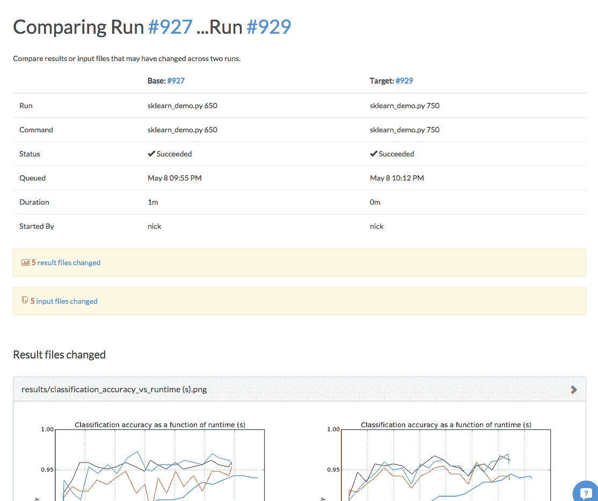

# 更快的模型调整和实验

> 原文：<https://www.dominodatalab.com/blog/faster-model-tuning-experimentation>

Domino 通过让您在强大的硬件上并行运行许多实验并自动跟踪它们的结果，提供了一种迭代分析模型的好方法。最近，我们增加了两个强大的新功能，使工作流程更加简单:**运行比较**和**诊断统计**。

## 动机

软件工程的许多原则(如版本控制)对于良好的分析工作至关重要，但标准软件工具(如 Github、持续集成系统)并不总是能很好地移植到分析工作流程中。其中一个原因是，虽然源代码是软件系统的关键组成部分，但分析工作涉及代码以及数据、参数、统计和可视化结果。

典型的迭代模型开发工作流程包括测试不同的技术或参数，然后比较视觉结果(例如，图表)或模型统计数据(例如，AUC)，并在检查时，确定哪些源代码更改导致了更好的结果。软件工程工具不能促进这一工作流程。

# #运行比较

运行比较可以很容易地找出两个实验在输入方面的不同，以及这些变化如何影响生成的结果。

比较两次跑步很简单:只需选择您感兴趣的两次跑步，然后点击“比较”按钮:


这将生成一个报告，总结这两次运行之间的差异:



有三个部分:(1)差异摘要(2)两次运行生成的结果之间的差异，以及(3)输入代码和数据之间的差异。

请记住，Domino 在运行开始之前拍摄项目中所有文件的状态快照(“输入”)，并在运行完成之后拍摄项目快照(“输出”)。在输入和输出之间添加或修改的任何文件都被视为“结果”

要在各部分之间快速导航，您可以使用位于顶部运行比较表正下方的这些链接:


Domino 将尽可能明智地向您展示不同之处。对于文本，我们将突出显示文件中不同的行:


对于我们知道如何渲染的文件，我们将并排渲染这些文件，以便您可以轻松直观地进行比较:


对于 Domino 不知道如何呈现的文件，我们会给你一些简单的元数据和链接来下载确切的版本，这样你就可以在自己的计算机上查看它们了:


### 诊断统计

了解特定模型的性能可能非常复杂，通常在所有运行中快速查看关键指标(如曲线下面积、F1 分数、对数似然)是非常有用的，这样可以让您快速预修剪哪些实验值得进一步研究。

Domino 的诊断统计功能允许您这样做！

为此，在项目目录的根目录下编写一个文件 dominostats.json，其中包含您想显示的诊断统计信息。下面是 R 中的一个例子:

```py
diagnostics = list("R^2" = 0.99, "p-value" = 0.05, "sse" = 10.49)
library(jsonlite)
fileConn<-file("dominostats.json")
writeLines(toJSON(diagnostics), fileConn)
close(fileConn)
```

在 Python 中:

```py
import json
with open('dominostats.json', 'wb') as f:
    f.write(json.dumps({"R^2": 0.99, "p-value": 0.05, "sse": 10.49}))
```

如果 Domino 检测到这个文件，它将解析出这些值，并将它们显示在 Runs 仪表板上:


此外，运行比较还会在表格中显示这些统计数据，以便更容易地比较它们的性能:


你可以从今天开始用[多米诺](//www.dominodatalab.com?utm_source=blog&utm_medium=post&utm_campaign=faster-model-tuning-experimentation)运行[更快的分析实验](https://www.dominodatalab.com/blog/horizontal-scaling-parallel-experimentation)。