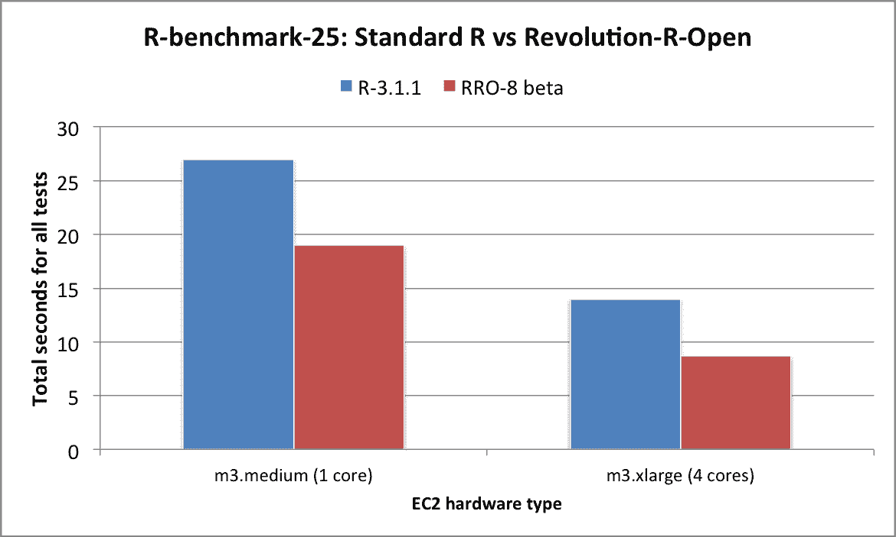

# 速度提高 40 %,无需任何代码更改

> 原文：<https://www.dominodatalab.com/blog/faster-r-without-any-code-changes>

从今天开始，**任何在 Domino 上运行 R 代码的人都可以使用 Revolution R Open，在不修改任何代码的情况下显著提高他们的性能**。

## 介绍

上周，我们与 Revolution Analytics 的人进行了一次很好的交谈，以了解更多关于他们新的 [Revolution R Open](http://revolutionanalytics.com/revolution-r-open) 产品(简称 RRO)的信息。对于那些不知道的人来说，RRO 是 R 的股票发行版的 100%兼容的替代产品，具有几个显著的性能增强。这意味着它可以与您现有的所有 R 包一起工作——它只是运行您的代码要快得多。而且是开源的！

## 基准

我们在默认的 [Domino](https://www.dominodatalab.com?utm_source=blog&utm_medium=post&utm_campaign=faster-r-without-any-code-changes) 环境中安装了 RRO，因此我们可以轻松地将项目切换到使用 RRO 而不是 stock R。然后我们使用 [R-Benchmark-25](http://r.research.att.com/benchmarks/R-benchmark-25.R) 脚本进行了一些基准测试。结果令人印象深刻:

在单核机器上， **RRO 比 stock R** 快近 30%。在一台 4 核机器上， **RRO 快了将近 40%**。同样，这些改进发生在完全相同的 R 代码上，并且不需要更新任何包。



### 差异与革命的基准

Revolution 在他们的博客和网站上发布了一些他们自己的基准测试。虽然我们上面的结果看起来令人印象深刻，但 Revolution 显示了比我们看到的更显著的加速。我们没有调查过这个。可能是因为他们运行在 Windows 上，英特尔 MKL 支持给了他们很大的推动，而因为我们运行在 Linux 上，我们已经为我们的 stock R 安装有了一个很好的底层数学库(BLAS)。或者有可能我们没有充分利用一些配置选项。老实说，我们不知道。

## RRO 安装

在 Ubuntu 上安装很简单，按照 Revolution 自己的[指令](http://mran.revolutionanalytics.com/documents/rro/installation):

```py
wget http://mran.revolutionanalytics.com/install/RRO-8.0-Beta-Ubuntu-14.04.x86_64.tar.gz

tar -zxf RRO-8.0-Beta-Ubuntu-14.04.x86_64.tar.gz

./install.sh

# RRO will be installed in '/usr/lib64/RRO-8.0' -- update your $PATH accordingly

```

## Domino 上的 RRO

Domino 项目现在可以选择设置使用 RRO 而不是 stock R。如果您想在您的项目中试用它，只需[发电子邮件给我们的服务台](mailto:support@dominodatalab.com?utm_source=blog&utm_medium=post&utm_campaign=faster-r-without-any-code-changes)让我们知道。