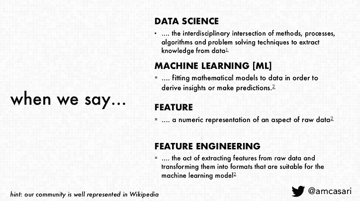

# 特征工程:框架和技术

> 原文：<https://www.dominodatalab.com/blog/feature-engineering-framework-techniques>

*这份 Domino 现场笔记提供了来自 [Amanda Casari](https://www.linkedin.com/in/amcasari/) 的“[机器学习的特征工程](https://youtu.be/6AxJlcosmng)”在圣保罗 QCon 上演讲的亮点和节选幻灯片。Casari 是 Concur Labs 的首席产品经理兼数据科学家。卡萨里也是《机器学习的特征工程:数据科学家的原则和技术》一书的合著者。演讲的完整视频可在[此处](https://youtu.be/6AxJlcosmng)获得，特别感谢 Amanda 允许 Domino 在本 Domino 现场笔记中摘录[演讲的幻灯片](https://www.slideshare.net/AmandaCasari/feature-engineering-for-machine-learning-at-qconsp?)。*

## 介绍

在演讲《机器学习的[特征工程](https://youtu.be/6AxJlcosmng)》中，卡萨里给出了特征工程的定义；思考机器学习的框架；以及包括将原始数据转换成矢量、在特征空间中可视化数据、二进制化和宁滨(量化)的技术。这份 Domino 现场笔记提供了关于这些主题的谈话的精华。对于更多深度，包括对特征缩放的覆盖，以及文本数据的技术，包括单词袋、基于频率的过滤和词类分块，[甲板](https://www.slideshare.net/AmandaCasari/feature-engineering-for-machine-learning-at-qconsp?)和[完整会议视频](https://youtu.be/6AxJlcosmng)公开提供。

## 为什么要考虑特征工程

卡萨瑞将“特征”定义为数字表示，“特征工程”定义为“从原始数据中提取这些特征，然后将其转化为我们可以用于机器学习模型的东西的行为”。她指出“正确的特征只能在模型和数据的上下文中定义”。

这一点很重要，因为数据科学家通过特征工程，“可以做出更明智的选择，理解[他们的]过程，然后有望节省[他们的]时间”，并获得“对结果的更大透明度，并能够具有可解释性”。Casari 还指出，特征工程使数据科学家能够“更周到地考虑我们构建的数据和特征……由此，我们如何最大限度地利用这些功能，而不是仅仅试图收集更多的数据…从原始数据到特征，以便思考模型和(我们)试图解决的问题”。

## 特征工程框架

卡萨瑞在她的演讲中还提供了一个特征工程框架。目的是为数据科学家提供一种思考过程和技术的方法。该框架的四个方面包括:

*   把你的问题框起来。 Casari 建议以机器学习有可能有用的方式来构建这个问题。然后，数据科学家将能够通过机器学习镜头基于框架问题进行数学建模。这可能使人们能够确定问题，以及“我们是否可以使用我们现在拥有的或我们创建的软件来解决这个问题，以便做到这一点”。
*   了解你的数据(或你可能拥有的数据)。这使数据科学家能够评估什么是最有用的，可用的数据是否足以解决他们试图解决的问题，以及未来解决问题需要什么。此外，需要考虑的是系统将如何“随着时间的推移而适应和调整”
*   设定你的特色目标。 Casari 指出“我们需要考虑我们在优化什么……这些年来，特性工程给我的最大礼物是真正降低了迭代速度”。虽然利用处理许多数据类型的库很容易，但 Casari 提倡如何“使用一些更稀疏的数字表示比使用那些更丰富的数据框更有效，这些数据框周围有很多元数据”，“迭代速度至关重要，因为这真的会帮助你前进。另一部分要考虑的是模型性能。你所选择的模型，你所构建的功能，都是为了优化特定类型的模型。”这有助于避免模型上的压力和潜在的无用结果。
*   **测试，迭代，再测试。**在提议框架的最后一个方面，Casari 指出，数据科学家将测试选择的稳健性，验证选择，并认识到，由于系统或模型周围的现实发生变化，结果也会发生变化。卡萨瑞主张让过程和心态都到位，这样你就可以继续为此进行调整。"

## 一些技巧的背景

Casari 会议的大部分时间集中在提供数学背景(即原理、它将如何影响工作、用例等。)关于一些不同的技术，在[GitHub 报告](https://github.com/alicezheng/feature-engineering-book)中可以找到这些技术的应用版本。本笔记涵盖矢量空间到特征空间、二值化和宁滨的高级概述。视频和书中还深入介绍了更多计数、特征缩放、单词袋、基于频率的过滤和分块等技术。

## 向量和空间

卡萨瑞指出，在计算机科学中，定标器是

*”是一个单一的数字特征，当我们有一个有序的标量列表时，这就是所谓的向量。所以现在我们要讨论向量空间，这样我们就可以表示这些向量，就像二维向量 V，可以用我们现在称之为向量空间来表示。”*

这很重要，因为

*“在大多数机器学习应用中，模型的输入通常表示为数字向量。所以，如果你在努力或者出错，或者试图做一些事情，要真正理解那个模型需要这个表示…如果你没有这份礼物，那么你将从一开始就遇到一些问题。”*

Casari 还指出，“当我们从向量空间或数据空间转移到特征空间时，我们谈论的更多的是它应该意味着什么，而不仅仅是一个数字向量。”向量能够承载信息和意义。

这提供了对以下内容的理解

“我们如何获取信息，并将其表示为一个人的偏好和歌曲……我们的想法是，如果这首歌是我们想要得到的特征，那么我们可以将其表示为有人喜欢它的优点，或者表示为有人不喜欢这首歌的缺点……然后我们可以开始从数据和特征空间…然后将特征返回到数据空间。”

她还指出，“这里的区别将是点的表示以及它所代表的轴”。

## 计数:二值化和宁滨

卡萨瑞表示，要计数的数据比*原始计数*多。虽然 Casari 涵盖了许多方面，但这篇博文将重点介绍二值化和宁滨是如何处理计数数据的有用技术。二进制化是将原始数据转换成二进制值的过程，以“有效地将原始数据表示为存在”。例如，当推荐歌曲时，这可能是有用的。与其专注于原始计数或某人听一首歌的次数，倒不如考虑一下“尺度的有效性”以及如何“更有效地理解某人喜欢或不喜欢一首歌，然后你可以用 0 或 1 来表示它”。这种技术提供了“更有效的原始计数表示以及更稳健的原始计数测量”。

宁滨(或称量化)是一种将计数分组到多个“箱”中以移除计数值的技术。这种技术有助于控制规模，因为“许多机器学习模型在处理这些长尾分布方面面临着真正的挑战，因此当您试图处理的变量中存在跨越几个数量级的原始计数时，最好开始考虑如何转换这一特征，以及如何通过量化计数来控制规模”。

为了确定每个仓的宽度，有两个类别:固定宽度宁滨和自适应宁滨。固定宽度的宁滨是“每个容器现在将包含特定范围内的数据…所以实际上只需将数据与其他类似的数据放入桶中，并降低空间中存在的复杂性”。卡萨瑞注意到固定宽度的宁滨在

*“对健康的评估或试图理解如疾病建模。更有意义的是，我们可以看到生命的不同阶段，在这种情况下，你可能会有几个月、几年或几十年的弯曲。要明白，当你看宁滨时，你真的应该试着更多地看它下面的变量的上下文。*

然而，当空箱子里没有数据时会发生什么呢？卡萨瑞指出，“适应性宁滨更关注分位数或十分位数。因此，用 10%、20%、30%实际观察分布情况，并按这种方式分组,“这样可以更容易理解，并从较高的层面捕捉更清晰的不对称情况。

## 结论

这篇 Domino 数据科学领域笔记提供了 Casari 演讲的精华部分，“机器学习的[特征工程](https://youtu.be/6AxJlcosmng)”。这篇博文的亮点包括一个特征工程框架，以及二值化和宁滨的概述。有关包括特征缩放、单词袋、基于频率的过滤和词类分块在内的技术的更多报道和深度，请访问[资料](https://www.slideshare.net/AmandaCasari/feature-engineering-for-machine-learning-at-qconsp?)和[视频](https://youtu.be/6AxJlcosmng)。

*^(Domino 数据科学领域笔记提供数据科学研究、趋势、技术等亮点，支持数据科学家和数据科学领导者加快工作或职业发展。如果您对本博客系列中涉及的数据科学工作感兴趣，请发送电子邮件至 writeforus(at)dominodatalab(dot)com。)*