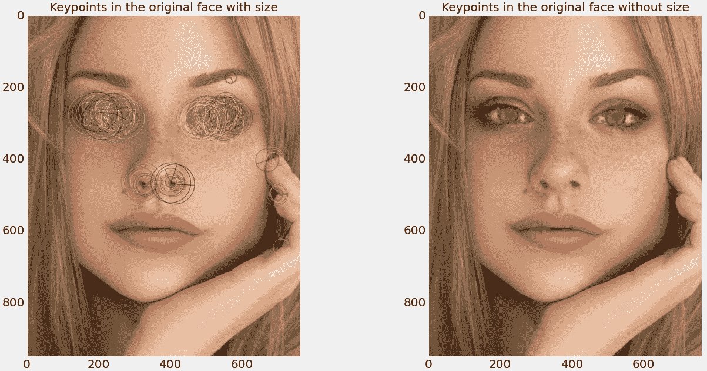

# 基于深度神经网络和 OpenCV 的特征提取和图像分类

> 原文：<https://www.dominodatalab.com/blog/feature-extraction-and-image-classification-using-deep-neural-networks>

*在[之前的一篇博文](/getting-started-witn-open-cv)中，我们谈到了计算机视觉的基础、OpenCV 框架的历史和功能，以及如何用 Python 和 OpenCV 迈出访问和可视化图像的第一步。在这里，我们更深入地使用 OpenCV 和 DNNs 进行特征提取和图像分类。*

## 图像分类和目标检测

图像分类是机器学习最有前景的应用之一，旨在提供能够以接近人类的准确度识别和分类图像内容的算法。

图像分类方法通常分为基于图像特征的提取及其在分类中的效用的传统方法，或者利用深度神经网络的优势的更高级的方法。

### 特征提取的传统方法

使用不同的机器学习算法可以潜在地提取各种特征。Lowe 等人(2004)开发了尺度不变特征变换(SIFT)，旨在解决特征匹配中的亮度、视点变化和图像旋转问题[1]。SIFT 允许估计尺度空间极值，随后是关键点定位、定向，并随后计算每个关键点的局部图像描述符。此外，SIFT 提供了给定图像中对象的有效识别，然而，其实现在计算上是昂贵且耗时的。

SIFT 启发了其他变体的开发，特别是为了克服复杂性和相关的计算需求。一个这样的变体是加速稳健特征(SURF)，据报道，它优于 SIFT，而对检测点的稳健性和整体模型准确性没有负面影响[2]。SIFT 的另一个替代方案是健壮的独立基本特征(BRIEF ),以显著更低的复杂度提供相似的性能[3]。此外，Rublee 等人(2011)报告称，面向快速和旋转的摘要(ORB)提供了更高效的性能[4]。

此外，梯度方向直方图(HOG) HOG 用于各种任务，包括允许测量边缘方向出现的对象检测。原则上，该描述符代表关键点的图像梯度方向的局部统计。简单地说，每个描述符可以被认为是一个直方图的集合，这些直方图由梯度指定的像素方向组成[5]。

#### 撒

尺度不变特征变换最初由 David Lowe 于 2004 年提出，作为一种从图像中提取区别性不变特征的方法，用于图像间的特征匹配。这是一种特别有用的方法，因为它可以检测图像特征，而与方向和大小无关[1]。下面我们提供从上一步显示的“人脸”图像中提取 SIFT 所需的步骤(参见[上一篇博文](/getting-started-witn-open-cv)中的“打开和显示图像文件”一节)。

```py
sift = cv2.xfeatures2d.SIFT_create()

original_keypoints, original_descriptor = sift.detectAndCompute(gray_face, None)

query_keypoints, query_descriptor = sift.detectAndCompute(query_face_gray, None)

keypoints_without_size = np.copy(original_face)

keypoints_with_size = np.copy(original_face)

cv2.drawKeypoints(original_face, original_keypoints, keypoints_without_size, color = (0, 255, 0))

cv2.drawKeypoints(original_face, original_keypoints, keypoints_with_size, flags = 

cv2.DRAW_MATCHES_FLAGS_DRAW_RICH_KEYPOINTS)

```


图一。分别在左右图像中检测到有/无尺寸的关键点

#### 快的

加速分割特征测试(FAST)是一种提取特征点的角点检测方法，最初由 Edward Rosten 和 Tom Drummond 于 2006 年提出。这种方法非常高效，因此适用于包括实时视频处理在内的资源密集型应用[6]。下面我们将提供从上一步显示的“人脸”图像中提取 SIFT 所需的步骤。

```py
fast = cv2.FastFeatureDetector_create() 

keypoints_with_nonmax = fast.detect(gray_face, None)

fast.setNonmaxSuppression(False)

keypoints_without_nonmax = fast.detect(gray_face, None)

image_with_nonmax = np.copy(original_face)

image_without_nonmax = np.copy(original_face)

cv2.drawKeypoints(original_face, keypoints_with_nonmax, image_with_nonmax, color=(0,255,0),

flags=cv2.DRAW_MATCHES_FLAGS_DRAW_RICH_KEYPOINTS)

cv2.drawKeypoints(original_face, keypoints_without_nonmax, image_without_nonmax, color=(0,255,0), 

flags=cv2.DRAW_MATCHES_FLAGS_DRAW_RICH_KEYPOINTS)
```


图二。使用/不使用非最大抑制检测到关键点。

#### 球

定向快速旋转简报(ORB)最初是由 Ethan Rublee、Vincent Rabaud、Kurt Konolige 和 Gary R. Bradski 在 2011 年提出的(OpenCV 实验室)。该方法具有旋转不变性和抗噪性。主要的基本原理是提供一个比筛选和冲浪更有效的替代品，它可以免费使用，没有任何限制[4]。然而，SIFT 和 SURF 仍然是专利算法。我们将使用相同的图像来提取 ORB 描述符。

```py
orb = cv2.ORB_create()

original_keypoints, original_descriptor = orb.detectAndCompute(gray_face, None)

query_keypoints, query_descriptor = orb.detectAndCompute(query_face_gray, None)

keypoints_without_size = np.copy(original_face)

keypoints_with_size = np.copy(original_face)

cv2.drawKeypoints(original_face, original_keypoints, keypoints_without_size, color = (0, 255, 0))

cv2.drawKeypoints(original_face, original_keypoints, keypoints_with_size, flags = 

cv2.DRAW_MATCHES_FLAGS_DRAW_RICH_KEYPOINTS)
```



图 3。分别在左右图像中检测到有/无尺寸的关键点。

```py
brute_force = cv2.BFMatcher(cv2.NORM_HAMMING, crossCheck = True)

matches = brute_force.match(original_descriptor, query_descriptor)

matches = sorted(matches, key = lambda x : x.distance)

result = cv2.drawMatches(original_face, original_keypoints, query_face_gray, query_keypoints, matches, 

query_face_gray, flags = 2)

print("The number of matching keypoints between the original and the query image is {}\n".format(len(matches)))

```


图 4。匹配在原始(主)和查询(顶部)图像中检测到的关键点。

### 使用 OpenCV DNN 和预训练的 DenseNet 进行分类

OpenCV 可以用来解决图像分类问题。OpenCV 库提供了深度神经网络(DNN)模块，这有助于在 OpenCV 中使用深度学习相关的功能。该模块在 OpenCV 版本 3 中引入，本教程使用 OpenCV 版本 4 . 5 . 2。DNN 模块的主要功能是允许迁移学习和使用预训练模型。请注意，DNN 模块不能用于训练模型，但可用于使用其他流行的[神经网络框架](/tensorflow-pytorch-or-keras-for-deep-learning)训练的模型，包括 PyTorch、TensorFlow、Caffe、Darknet 和 ONNX。

仅使用 OpenCV DNN 进行推理有几个优点。将模型训练卸载到其他库并使用预先训练的模型会产生简单明了的代码。这使得不一定对 DNNs 有深刻理解的 CV 概念和机载用户更容易采用。此外，这种方法除了支持基于 CUDA 的 NVIDIA CPUs 之外，还支持基于 OpenCL 的英特尔 GPU，从而实现更高的性能。

在本教程中，我们将使用预训练的 DenseNet121 模型，该模型使用 ImageNet 数据库上的 Caffe 框架进行训练，该数据库包含 1000 个图像类。DenseNet 是一种卷积神经网络(CNN ),它使用层之间的密集连接(通过密集块)。具有匹配的要素地图大小的所有图层直接相互连接。为了使用预训练的 DenseNet 模型，我们将使用 OpenCV 来加载模型架构和预训练的权重。在此过程中，我们将执行以下步骤:

1.  图像预处理
2.  加载类别标签
3.  初始化模型
4.  分类和可视化输出

这些图片来自于提供免费图片的 Unsplash。所提供的图像可用于商业和非商业目的，使用不需要许可。在将图像输入模型之前，需要进行一些预处理。这些包括根据模型的要求将图像的大小调整为 224x224，设置比例，并在必要时裁剪图像。预处理由 OpenCV 的 cv2.dnn.blobFromImage()函数处理。

接下来，我们加载 ImageNet 图像类，创建一个标签列表，并初始化 DNN 模块。OpenCV 能够分别使用 cv2.dnn.readNetFromCaffe 初始化 Caffe 模型，使用 cv2.dnn.readNetFromTensorFlow 初始化 TensorFlow 模型，使用 cv2.dnn.readNetFromTorch 初始化 PyTorch 模型。这种选择是由模型接受训练的原始框架决定的。DenseNet121 使用 Caffe 进行训练，因此我们将使用 cv2.dnn.readNetFromCaffe 初始化 DNN 模块。预处理后的图像被输入网络，并在正向传递阶段进行一系列计算。

```py
def image_classification(model_weights, model_architecture, image):

    blob = cv2.dnn.blobFromImage(image, 0.017, (224, 224), (103.94,116.78,123.68))

    global model, classes

    rows = open('Resources/model/denseNet/synset_words.txt').read().strip().split("\n")

    image_classes = [r[r.find(" ") + 1:].split(",")[0] for r in rows]

    model = cv2.dnn.readNetFromCaffe(model_architecture, model_weights)  

    model.setInput(blob)    

    output = model.forward()    

    new_output = output.reshape(len(output[0][:]))   

    expanded = np.exp(new_output - np.max(new_output))

    prob =  expanded / expanded.sum()    

    conf= np.max(prob)    

    index = np.argmax(prob)

    label = image_classes[index]   

    text = "Label: {}, {:.2f}%".format(label, conf*100)

    cv2.putText(image, "{}: {:.2f}% confidence".format(label, conf *100), (5, 40), cv2.FONT_HERSHEY_COMPLEX, 1, (255, 255, 255), 2)

model_architecture ='Resources/model/denseNet/DenseNet_121.prototxt.txt'

model_weights = 'Resources/model/denseNet/DenseNet_121.caffemodel'

image1 = cv2.imread('Resourcimg/persian_cat.jpg')

classify1 = image_classification(model_weights, model_architecture, image1)

image2 = cv2.imread('Resourcimg/dog.jpg')

classify2 = image_classification(model_weights, model_architecture, image2)

```


图 5。使用 OpenCV DNN 模块和预训练的 DenseNet 模型进行图像分类。对于该图中使用的图像，波斯猫和哈巴狗分类的正确率分别为 98.7%和 91%。

## 目标检测

对于目标检测，我们将使用两种方法:哈尔级联和 OpenCV DNN 模块以及 MobileNet SSD 预训练模型。

由 Viola 和 Jones 在 2001 年[7]提出的 Haar cascades 是一种可以检测图像中的对象的方法，而不管这些对象在图像中的比例和位置。作者主要关注人脸检测，尽管他们的方法可以适用于检测其他对象。与更先进的方法相比，这是一种快速的方法，但因此 Haar 级联的精度较低。在许多情况下，它会产生大量的假阳性。

*OpenCV DNN 模块，带 MobileNet SSD 预训练模型。*该方法接收预处理的图像，并将它们提供给预训练的模型。我们将展示它的作用，然后可视化两个不同图像的输出。我们将使用 MobileNet Single Shot Detector(SSD ),它最初是使用 TensorFlow 深度学习框架在 COCO 数据集上训练的。与其他替代方案相比，SSD 模型通常在计算时间方面提供更高的性能，因此更适合本教程。

#### 使用哈尔级联的目标检测

为了说明哈尔级联的使用，我们将展示如何检测人类的眼睛和面部以及猫的面部。实现如下。

```py
face_cascade = cv2.CascadeClassifier("Resources/model/haarcascades/haarcascade_frontalface_default.xml")

eye_cascade = cv2.CascadeClassifier("Resources/model/haarcascades/haarcascade_eye.xml")

img = cv2.imread("Resourcimg/group.jpg")

gray = cv2.cvtColor(img, cv2.COLOR_BGR2GRAY)

faces = face_cascade.detectMultiScale(gray, 1.3, 5)

for (x,y,w,h) in faces:

    img1 = cv2.rectangle(img,(x, y),(x + w, y + h),(255,255,0),2)

    roi_gray = gray[y: y + h, x: x + w]

    roi_color = img[y: y + h, x: x + w]

    eyes = eye_cascade.detectMultiScale(roi_gray)

    for (ex, ey, ew, eh) in eyes:

        cv2.rectangle(roi_color,(ex, ey), (ex + ew, ey + eh), (0,255,0),2)

cat_face_cascade = cv2.CascadeClassifier("Resources/model/haarcascades/haarcascade_frontalcatface.xml")

img = cv2.imread("Resourcimg/cats.jpg")

img_rgb = cv2.cvtColor(img, cv2.COLOR_BGR2RGB)

faces = cat_face_cascade.detectMultiScale(img_rgb, 1.1, 4)

for (x,y,w,h) in faces:

    img2 = cv2.rectangle(img_rgb,(x, y),(x + w, y + h),(255,255,0),5)

```


图 6。基于 Haar 级联分类器的目标检测。左边的图像是人类眼睛和面部检测的结果，右边的图像是猫面部检测的输出。

#### 使用 OpenCV DNN 和预训练的 MobileNet 进行目标检测

我们的目标是使用下面的代码检测图 7 中描绘的两幅图像中的对象。

```py
def detect_objects(model_architecture, config, framework, image):

    image_height, image_width, _ = image.shape

    blob = cv2.dnn.blobFromImage(image, size=(300, 300), mean=(104, 117, 123), swapRB=True)

    global model, classes    

    with open('Resources/model/mobileNet/object_detection_classes_coco.txt', 'r') as f:

        class_names = f.read().split('\n')    

    model = cv2.dnn.readNet(model_architecture, config, framework)

    model.setInput(blob)   

    output = model.forward()

    colours = np.random.uniform(0, 255, size=(len(class_names), 3))

    for detection in output[0, 0, :, :]:

       confidence = detection[2]

       if confidence > .4:

           class_id = detection[1]

           class_name = class_names[int(class_id)-1]

           color = colours[int(class_id)]

           box_x = detection[3] * image_width

           box_y = detection[4] * image_height

           box_width = detection[5] * image_width

           box_height = detection[6] * image_height

           cv2.rectangle(image, (int(box_x), int(box_y)), (int(box_width), int(box_height)), color, 2)

           cv2.putText(image, class_name, (int(box_x), int(box_y - 5)), cv2.FONT_HERSHEY_SIMPLEX, 1, color, 2)

model_architecture = 'Resources/model/mobileNet/frozen_inference_graph.pb'

config = 'Resources/model/mobileNet/ssd_mobilenet_v2_coco_2018_03_29.pbtxt'

framework='TensorFlow'

image1 = cv2.imread('Resourcimg/dogcats.jpg')

detect1 = detect_objects(model_architecture, config, framework, image1)

image2 = cv2.imread('Resourcimg/dogs_humans.jpg')

detect2 = detect_objects(model_architecture, config, framework, image2)

```


图 7。使用 OpenCV 和预训练的 MobileNet 进行对象检测。在两幅图像中，左边的图像上是动物的混合，右边的图像上是动物和人的混合，这种对象检测方法产生了对象的精确标记，在对象周围有适当的对应边界框。

## 结论

OpenCV 是计算机视觉中使用的主要库之一。在这里，我们简要介绍了这个强大的库的背景，并描述了特征提取、图像分类和对象检测所需的步骤。

神经网络和深度学习在过去 10 年中的深刻进步导致了计算机视觉的重大进展。OpenCV 是使这一旅程成为可能的库之一，我们希望提供足够的信息来鼓励我们的读者寻求 OpenCV 在解决他们的计算机视觉问题方面提供的许多功能的进一步培训。

## 额外资源

您可以查看以下附加资源:

*   阅读我们关于[OpenCV](/getting-started-witn-open-cv)入门的博客
*   OpenCV-【https://opencv.org/opencv-free-course/ 上的免费在线课程
*   OpenCV 官方文档-【https://docs.opencv.org/4.x/ 
*   有一个附带的项目，其中包含本文的所有代码，您可以通过注册免费的 Domino MLOps 试用环境来访问它:

[](https://cta-redirect.hubspot.com/cta/redirect/6816846/810a435d-b16b-4415-a383-e5328cc61067) 

## 参考

[1] D. G. Lowe，“来自尺度不变关键点的区别性图像特征”，国际计算机视觉杂志，第 60 卷，第 2 期，第 91-110 页，2004 年。

[2] H. Bay，A. Ess，T. Tuytelaars 和 L. Van Gool，“加速的鲁棒特征(SURF)”，计算机视觉和图像理解，第 110 卷，第 3 期，第 346-359 页，2008 年。

[3] M. Calonder、V. Lepetit、C. Strecha 和 P. Fua，“简介:二进制鲁棒独立基本特征”，欧洲计算机视觉会议，2010 年:Springer，第 778-792 页。

[4] E. Rublee，V. Rabaud，K. Konolige 和 G. Bradski，“ORB:SIFT 或 SURF 的有效替代方案”，2011 年计算机视觉国际会议，2011 年:Ieee，第 2564-2571 页。

[5] D. Monzo、A. Albiol、J. Sastre 和 A. Albiol，“使用 HOG 描述符的精确眼睛定位”，机器视觉和应用，第 22 卷，第 3 期，第 471-480 页，2011 年。

[6] E. Rosten 和 T. Drummond，“用于高速角点检测的机器学习”，欧洲计算机视觉会议，2006 年:Springer，第 430-443 页。

[7] P. Viola 和 M. Jones，“使用简单特征的增强级联的快速对象检测”，2001 年 IEEE 计算机学会关于计算机视觉和模式识别的会议记录。CVPR 2001，2001，第 1 卷:Ieee，第 I-I 页