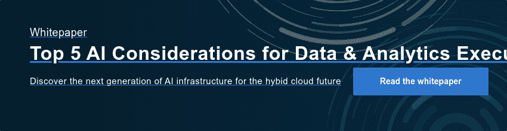

# 混合/多云中的金融服务人工智能:利用混合 MLOps 控制数据重力

> 原文：<https://www.dominodatalab.com/blog/financial-services-ai-in-the-hybrid-cloud>

您如何平衡 FSI 的创新和效率需求与合规和善治需求？这是金融服务和保险行业需要回答的一个关键问题，因为人工智能、人工智能和混合/云计算是我们这个时代最重要的技术趋势。

他们已经彻底改变了我们的生活和工作方式，他们的潜力在 FSI 才刚刚开始实现。 根据彭博 最近的一项研究，从 2021 年到 2028 年，全球金融服务和保险市场的人工智能(AI)预计将产生 843 亿美元的收入，CAGR 将增长 21.4%。目前，金融服务公司通过增强人类决策，使其更快、更准确、更高效，来利用人工智能获得竞争优势。

然而，希望利用这两种趋势的公司通常会发现，他们需要在创新的竞争动力与治理和合规性需求之间取得平衡。过多的创新会导致混乱，而过多的治理会扼杀创新。关键是找到正确的平衡，有足够的治理来确保稳定性和问责制，但也有足够的创新来推动模型驱动的竞争优势。

最近的一份 Ventana Research 白皮书， *[首席数据的 5 大 AI 考虑事项&分析高管](/resources/top-5-ai-considerations-for-data-and-analytics-executives)、* 注意到类似的挑战。虽然人工智能/人工智能的好处得到了广泛认可，97%的金融服务机构报告称人工智能/人工智能对于检测和防止欺诈非常重要，但各行业中十分之八的机构也指出了治理人工智能/人工智能的重要性，这凸显了数据和分析高管面临的创新与治理之间的艰难平衡。

这不一定非黑即白，因为头条新闻经常报道各自领域的市场领导者未能找到这种平衡。 例如，2017 年，Equifax [的一次数据泄露导致了 7 亿美元的结算](https://www.cnbc.com/2019/07/22/what-you-need-to-know-equifax-data-breach-700-million-settlement.html) ，最近一次“小故障”导致了消费者的信用评分报告不正确——数据科学行业专家推测，这可能是由人工智能模型“数据漂移”引起的 [，如 VentureBeat](https://venturebeat.com/data-infrastructure/did-data-drift-in-ai-models-cause-the-equifax-credit-score-glitch/) 所报道。达美乐的托马斯·罗宾逊说，关键领域非常需要良好的监控

> “数据科学的游戏时间结束了。更具体地说，对于那些创建产品模型的组织来说，如果这些模型的决策会影响人们的财务生活、健康结果和隐私，那么现在这些模型不与适当的监控和控制相结合就是不负责任的。”

金融服务公司的数据和分析高管面临着通过证明数据科学计划来从数据中提取价值的挑战，同时还要平衡治理，以确保他们的公司不会因为错误的原因而登上头条。

## 管理数据科学的卓越分析中心的崛起

为了在混合云环境中更好地治理数据科学，许多金融服务和保险公司正在转向“数据科学卓越中心(CoE)”战略，以推动整个企业中数据科学计划的创新最佳实践和治理。

有效的治理需要所有人工智能/人工智能活动的单一窗口显示，而创造模型驱动的竞争优势的金融服务公司正在实施各种形式的“分析/人工智能/人工智能卓越中心(CoE)”来推动人工智能/人工智能的采用。 [DBRS](https://www.dominodatalab.com/customers/dbrs) 部署 Domino 作为所有数据项目组的中心平台，包括财务、研究和模型治理。同样， [S & P Global](https://towardsdatascience.com/data-science-literacy-for-the-enterprise-fadaf9268494) 使用 Domino 作为“胶水”支撑程序，对 17，000 名分布在各地的员工进行数据科学教育。

CoE 策略在保险业中也很常见。好事达的 [卓越分析中心](https://www.dominodatalab.com/resources/allstates-analytics-coe-pushes-data-science-innovation) 帮助他们将模型置于其业务的核心，利用数据作为转型企业资产。 [纽约人寿的](https://www.dominodatalab.com/resources/data-science-innovators-playbook) 数据科学和人工学习中心也完全沉浸在公司的核心业务中，能够在整个公司范围内进行实时的、基于模型的决策。 [Topdanmark 的](https://www.dominodatalab.com/resources/topdanmark-scales-mlops) 机器学习卓越中心在欺诈检测、政策批准和风险管理的整个运营过程中注入模型，所有这些都是为了改善客户体验。 [SCOR 的](https://www.dominodatalab.com/resources/scor-s-creation-of-data-science-center-of-excellence-to-enhance-model-deployment/) 数据科学卓越中心极大地促进了数据科学的采用，并帮助业务部门开发模型，以比以前快 75%的速度满足客户需求。

## 管理分布式敏感数据的激增

数据是有效机器学习计划的驱动力，跨环境(多种云、混合云和内部部署)的敏感分布式数据为金融服务数据和分析高管在 CoE 战略中集中和管理 AI/ML 带来了独特的挑战。

Ventana Research 最近发布的白皮书《首席数据和分析主管的 5 大人工智能考虑事项》指出，73%的组织报告称，不同的数据源和系统是实施数据科学治理政策时面临的最大挑战，数据科学家需要来自公司防火墙之外的大量数据加剧了这一挑战。

金融服务公司需要来自分支机构、在线和移动设备的数据。收购和合并也扩大了数据足迹，数据通常分布在云区域、提供商和内部数据源之间。根据同一份 Ventana Research 白皮书，32%的组织报告使用 20 个以上的数据源，而 58%的组织自我报告使用“大数据”——Pb 大小的数据库变得越来越普遍。

此外，最近的一篇 [《华尔街日报》文章指出，医疗保险公司 Anthem](https://www.wsj.com/articles/anthem-looks-to-fuel-ai-efforts-with-petabytes-of-synthetic-data-11652781602) 产生 1.5 到 2 Pb 的合成数据，旨在训练模型以检测欺诈并向会员提供个性化服务，凸显了这种分布式数据的“巨大”。Ventana Research 指出，“到 2025 年，超过四分之三的企业将把数据分散到多个云提供商和内部数据中心，这需要对跨多个位置的数据管理产品进行投资。”

这反映了 Domino 在我们自己的客户端中观察到的类似模式，将数据源与高级机器学习技术相结合，以获得模型驱动的竞争优势。在 [Coatue](https://www.dominodatalab.com/customers/coatue) ，替代数据源和新计算技术的激增产生了对识别可告知投资决策的信号的需求。 [穆迪分析](https://www.dominodatalab.com/customers/moodys-analytics) 通过基于独特的金融数据集创建分析并应用它们来解决客户的业务挑战，建立了竞争优势。

## 通过混合/多云策略利用数据重力

谈到大数据，尤其是“分布式”大数据，数据引力是需要理解的最重要的概念之一。数据引力是指大数据将其他数据、系统和服务/应用拉向它的趋势。因为人工智能和数据科学需要大量数据，所以制定收集、存储、处理和分析这些数据的策略非常重要。

性能只是一个重要的数据重心考虑因素——通过将数据和计算放在一起，可以减少模型延迟。 虽然托管云数据库在管理这种数据激增方面提供了一些希望，但流入和流出成本会极大地阻碍数据科学的努力——根据 Ventana Research 的数据，提取和分析 1pb 的数据可能需要高达 5 万美元。

除了性能考虑之外，数据驻留和数据主权法规进一步使数据收集和处理复杂化，通常将数据集锁定在单个地理位置、云或云区域。[欧盟的数字运营弹性法案(DORA)](https://www.aima.org/regulation/keytopics/digital-operational-resilience-act.html)“旨在确保金融系统中的所有参与者都有必要的安全措施来减轻网络攻击和其他风险”，并对供应商集中和供应商锁定提出了具体要求。更具体地说，对于 AI/ML， [GDPR 有关于自动化决策和分析的规定](https://www.sas.com/en_us/insights/articles/data-management/gdpr-and-ai--friends--foes-or-something-in-between-.html) ，强调了混合和多云配置的重要性，以确保适当的数据管理和地理围栏。根据 Ventana 的研究:

> “到 2026 年，几乎所有跨国组织都将投资本地数据处理基础设施和服务，以降低与数据传输相关的风险。”

考虑到数据传输成本、安全性、法规和性能，设计具有灵活性的 AI/ML 平台通常更有意义，它提供了将数据处理背后的计算与数据本身放在一起的选择，而不是跨云或地理位置传输或复制数据集。在分析卓越中心战略要求对治理的数据科学计划有一个整体的、企业范围的看法的背景下，数据和分析高管在构建其数据和分析基础架构时面临困难的决策。

## 针对混合/多云 MLOps 的数据科学平台考虑事项

寻求采用人工智能平台的金融服务和保险公司应专注于支持其混合企业 IT 战略的平台。这一战略包括平衡开放性、敏捷性和灵活的计算能力，以使业务面向未来。提供这些功能的平台将能够帮助企业快速决策，快速响应市场变化，并快速适应新技术或立法。

随着我们最近的 [Nexus 混合云数据科学平台](/nexus) 的发布，Domino 数据实验室处于人工智能工作负载混合支持的前沿。一个真正的混合数据科学平台使数据科学家能够在公司运营的每个环境中以一种安全且管理良好的方式访问数据、计算资源和代码。我们与 NVIDIA 的深度 [合作以及对](https://www.dominodatalab.com/partners/nvidia) [更广泛的数据和分析生态系统的支持](https://www.dominodatalab.com/partners) 为数据和分析高管提供了培养 AI/ML 创新所需的信心，同时还提供了企业范围治理所需的灵活性。

Ventana Research 强调开放、灵活的数据科学平台的重要性；“面对不断发展的混合战略和不断变化的数据科学创新，让您的数据科学实践面向未来；以及从专门构建的人工智能基础设施(内部或云中)中实现价值最大化。”

要了解更多关于在企业中扩展人工智能的首要考虑因素，请查看 Domino 和 NVIDIA 委托的新 Ventana Research 白皮书。

