# 在 Python 中拟合高斯过程模型

> 原文：<https://www.dominodatalab.com/blog/fitting-gaussian-process-models-python>

一个常见的应用统计学任务包括建立回归模型来描述变量之间的非线性关系。通过采用特定的非线性函数形式，如正弦函数、指数函数或多项式函数来描述一个变量对另一个变量的变化的响应，来拟合这种模型是可能的。然而，除非这种关系从一开始就很明显，否则它可能涉及大量的[模型选择](/data-science-dictionary/model-selection)程序，以确保保留最合适的模型。或者，可以通过定义变量空间上的一组结来采用非参数方法，并使用样条或核回归来描述任意非线性关系。然而，结布局程序有些*特别*，也可能涉及变量选择。第三种选择是采用**贝叶斯非参数**策略，直接对未知的基础函数建模。为此，我们可以采用高斯过程模型。

将贝叶斯过程描述为“非参数的”有点用词不当。建立贝叶斯模型的第一步是为手头的问题指定一个*全概率模型*，为每个模型变量分配概率密度。因此，在不使用概率函数的情况下，很难指定一个完整的概率模型，因为概率函数是参数化的！事实上，贝叶斯非参数方法并不意味着没有参数，而是参数的数量随着数据集的大小而增长。相反，贝叶斯非参数模型是*无限*参数化的。

## 用高斯模型构建模型

如果我们选择使用高斯分布来模拟我们的数据会怎么样？

$$

p(x \mid \pi，\ sigma)=(2\pi)^{-k/2}|\sigma|^{-1/2} \ exp \ left \ {-\ frac { 1 } { 2 }(x-\mu)^{\prime}\sigma^{-1}(x-\mu)\ right \ }
$ $

这样做似乎没有任何好处，因为正态分布本身并不是特别灵活的分布。然而，采用一组高斯分布(多变量法向向量)有许多优点。首先，多元正态分布中任何元素子集的边际分布也是正态的:

$$
p(x，y)= \ mathcal { n } \ left(\ left[{
\ begin { array } { c }
{ \ mu _ x } \ \
{ \ mu _ y } \ \
\ end { array }
} \ right]，\ left[{
\ begin { array } { cc }
{ \ sigma _ x }&{ \ sigma _ { xy } } \ \
{\sigma_{xy}^t}&{ \ sigma _ y }
\ end

$$
p(x) = \int p(x，y) dy = \mathcal{N}(\mu_x，\适马 _x)
$$

此外，多元正态分布的元素子集的条件分布(取决于剩余元素)也是正态的:

$ $
p(x | y)= \ mathcal { n }(\ mu _ x+\sigma_{xy}\sigma_y^{-1}(y-\mu_y)，
\sigma_x-\sigma{xy}\sigma_y^{-1}\sigma{xy}^t)
$ $

高斯过程将多元常态推广到无限维度。它被定义为随机变量的无限集合，任何边缘子集都具有高斯分布。因此，边缘化属性在其定义中是明确的。另一种思考无限向量的方式是作为一个 T2 函数 T3。当我们编写一个将连续值作为输入的函数时，我们实际上是在暗示一个无限的向量，它只在函数被调用时返回值(由输入索引)。同样，无限维高斯表示为函数的概念允许我们通过计算来处理它们:我们从来不需要存储高斯过程的所有元素，只需要在需要时计算它们。

因此，我们可以将高斯过程描述为函数上的**分布。正如多元正态分布完全由均值向量和协方差矩阵指定一样，GP 完全由均值*函数*和协方差*函数*指定:**

$$
p(x) \sim \mathcal{GP}(m(x)，k(x,x^{\prime}))
$$
正是这种边缘化特性使得使用高斯过程变得可行:我们可以边缘化我们不感兴趣或没有观察到的无限多的变量。

例如，GP 的一个规格可能是:

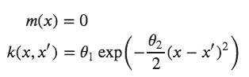

这里，协方差函数是一个**的平方指数**，对于它，靠近的[latex]x[/latex]和[latex]x^{\prime}[/latex]的值导致[latex]k[/latex]的值更接近于 1，而远离的值返回更接近于 0 的值。简单地采用零函数来表示高斯过程的均值函数似乎有些奇怪——当然我们可以做得更好！事实证明，GP 中的大部分学习涉及协方差函数及其超参数，因此在指定复杂的均值函数时获得的收益很少。

对于有限数量的点，GP 成为多元正态，均值和协方差分别作为在这些点上评估的均值函数和协方差函数。

## 从高斯过程中取样

为了使“函数分布”的概念更加具体，让我们快速演示如何从高斯过程中获得实现，这导致对一组点上的函数的评估。我们在这里要做的是来自*之前*高斯过程的样本，所以在引入任何数据之前。我们首先需要的是我们的协方差函数，它将是指数的平方，以及一个在给定点评估协方差的函数(产生一个协方差矩阵)。

```py
import numpy as np
def exponential_cov(x, y, params):
    return params[0] * np.exp( -0.5 * params[1] * np.subtract.outer(x, y)**2)

```

我们将利用多元高斯分布的可爱的条件属性，逐点依次生成实现。这是有条件的:

$ $
p(x | y)= \ mathcal { n }(\ mu _ x+\sigma_{xy}\sigma_y^{-1}(y-\mu_y)，
\sigma_x-\sigma{xy}\sigma_y^{-1}\sigma{xy}^t)
$ $

这是实现它的函数:

```py
def conditional(x_new, x, y, params):
    B = exponential_cov(x_new, x, params)
    C = exponential_cov(x, x, params)
    A = exponential_cov(x_new, x_new, params)
    mu = np.linalg.inv(C).dot(B.T).T.dot(y)
    sigma = A - B.dot(np.linalg.inv(C).dot(B.T))
    return(mu.squeeze(), sigma.squeeze())

```

我们将从超参数σ_0=1，σ_1=10 的高斯过程开始。我们还将假设一个零函数作为平均值，因此我们可以绘制一个代表平均值的一个标准差的波段。

```py
import matplotlib.pylab as plt
θ = [1, 10]
σ_0 = exponential_cov(0, 0, θ)
xpts = np.arange(-3, 3, step=0.01)
plt.errorbar(xpts, np.zeros(len(xpts)), yerr=σ_0, capsize=0)
```

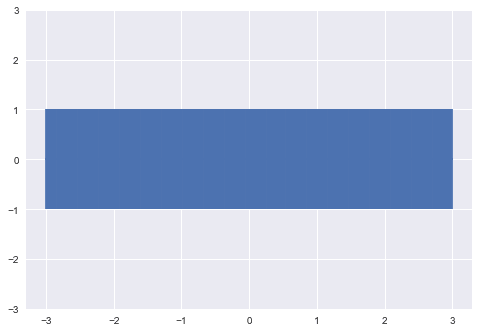

让我们选择一个任意的采样起点，比如 x=1。由于没有先前的点，我们可以从一个无条件的高斯样本:

```py
x = [1.]
y = [np.random.normal(scale=σ_0)]
print(y)
```

```py
[0.4967141530112327]
```

我们现在可以更新我们的置信带，给定我们刚刚采样的点，使用协方差函数生成新的逐点区间，条件是值[x_0，y_0]。

```py
σ_1 = exponential_cov(x, x, θ)
```

```py
def predict(x, data, kernel, params, sigma, t):
    k = [kernel(x, y, params) for y in data]
    Sinv = np.linalg.inv(sigma)
    y_pred = np.dot(k, Sinv).dot(t)
    sigma_new = kernel(x, x, params) - np.dot(k, Sinv).dot(k)
 return y_pred, sigma_new

x_pred = np.linspace(-3, 3, 1000)
predictions = [predict(i, x, exponential_cov, θ, σ_1, y) for i in x_pred]

```

```py
y_pred, sigmas = np.transpose(predictions)
plt.errorbar(x_pred, y_pred, yerr=sigmas, capsize=0)
plt.plot(x, y, "ro")
```

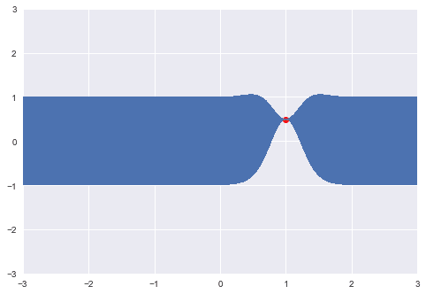

因此，根据这一点，以及我们指定的协方差结构，我们基本上限制了附加点的可能位置。现在让我们来看另一个例子:

```py
m, s = conditional([-0.7], x, y, θ)
y2 = np.random.normal(m, s)
print(y2)
```

```py
-0.1382640378102619
```

这个点被添加到实现中，并且可以用于进一步更新下一个点的位置。

```py
x.append(-0.7)
y.append(y2)
σ_2 = exponential_cov(x, x, θ)
predictions = [predict(i, x, exponential_cov, θ, σ_2, y) for i in x_pred]
```

```py
y_pred, sigmas = np.transpose(predictions)
plt.errorbar(x_pred, y_pred, yerr=sigmas, capsize=0)
plt.plot(x, y, "ro")
```

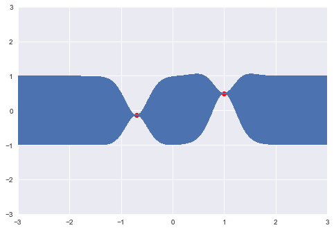

当然，顺序采样只是演示协方差结构如何工作的一种启发式方法。我们可以很容易地一次采样几个点:

```py
x_more = [-2.1, -1.5, 0.3, 1.8, 2.5]
mu, s = conditional(x_more, x, y, θ)
y_more = np.random.multivariate_normal(mu, s)
print(y_more)
```

```py
array([-1.5128756 , 0.52371713, -0.13952425, -0.93665367, -1.29343995])
```

```py
x += x_more
y += y_more.tolist()
σ_new = exponential_cov(x, x, θ)
predictions = [predict(i, x, exponential_cov, θ, σ_new, y) for i in x_pred]
y_pred, sigmas = np.transpose(predictions)
plt.errorbar(x_pred, y_pred, yerr=sigmas, capsize=0)
plt.plot(x, y, "ro")
```

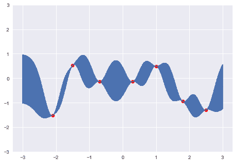

因此，随着点的密度变高，它导致了来自先前 GP 的实现(样本函数)。

## 在 Python 中拟合高斯过程

尽管完全有可能扩展上面的代码来引入数据并手动拟合高斯过程，但是有许多库可用于以更自动化的方式指定和拟合 GP 模型。我将演示和比较三个包含专门为 GP 建模定制的类和函数的包:

*   [scikit-learn](http://scikit-learn.org/stable/modules/gaussian_process.html)
*   [GPflow](https://github.com/GPflow/GPflow)
*   [PyMC3](https://docs.pymc.io/en/stable/)

特别是，这些软件包中的每一个都包括一组协方差函数，可以灵活地组合以充分描述数据中的非线性模式，以及拟合 GP 参数的方法。

我们将使用一些模拟数据作为测试用例来比较每个包的性能。实际上，我不记得我是在哪里找到这些数据的，所以我不知道这些数据是如何产生的。然而，它清楚地显示了某种类型的非线性过程，受到一定量的观察或测量误差的破坏，因此它应该是高斯过程方法的合理任务。

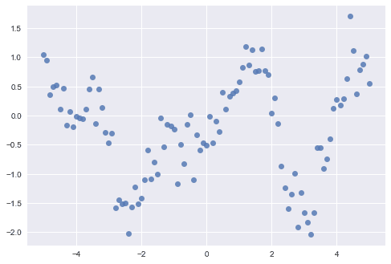

### scikit-learn

`scikit-learn`是 Python 的绝世机器学习库。它提供了一套全面的[监督和非监督学习算法](/supervised-vs-unsupervised-learning)，在一致、简单的 API 下实施，使您的整个建模管道(从数据准备到输出汇总)尽可能无摩擦。它的工具库中包括一个 Gaussian 流程模块，该模块最近经历了一次完整的修订(从版本 0.18 开始)。

与`scikit-learn`中其他机器学习方法的实现一致，使用 GPs 的适当接口取决于它所应用的任务类型。对于回归任务，我们预测一个连续的响应变量，通过指定一个适当的协方差函数应用一个`GaussianProcessRegressor`，或**核**。拟合通过最大化边际似然的对数进行，这是一种高斯过程的便利方法，避免了通常用于选择模型最佳超参数的计算密集型[交叉验证策略](/blog/building-robust-models-with-cross-validation)。`GaussianProcessRegressor`不考虑均值函数的规格，总是假设它是零函数，强调了均值函数在计算后验概率中的作用减弱。

对于输出变量为二进制或分类的分类任务，使用`GaussianProcessClassifier`。使用正态分布来拟合分类数据，这似乎是不协调的，但通过使用潜在的高斯响应变量，然后将其转换为单位区间(或者更一般地，对于两个以上的结果类，一个单纯形)，可以适应这种情况。其结果是一种软的概率分类，而不是机器学习算法中常见的硬分类。与回归设置类似，用户选择适当的核来描述数据集中预期的协方差类型。因为这个 GP 的后验概率是非正态的，所以使用拉普拉斯近似来获得解，而不是最大化边际可能性。

```py
from sklearn import gaussian_process
from sklearn.gaussian_process.kernels import Matern, WhiteKernel, ConstantKernel
```

`scikit-learn`提供了一个大约十几个协方差函数的库，他们称之为*核*，以供选择。一个灵活的选择是从 Matèrn 协方差开始。

$ $
k _ { m }(x)= \frac{\sigma^2}{\Gamma(\nu)2^{\nu-1}} \左(\ frac { \ sqrt { 2 \ nu } x}{l}\right)^{\nu} k _ { \ nu } \左(\ frac { \ sqrt { 2 \ nu } x } { l } \右)
$
其中$\Gamma$是 gamma 函数，$K$是修正的贝塞尔函数。从该函数采样的协方差矩阵的形式由三个参数控制，每个参数控制协方差的一个属性。

*   **振幅** ($\sigma$)控制输出沿 y 轴的缩放。该参数只是一个标量乘数，因此通常不包含在 Matèrn 函数的实现中(*即*设置为 1)
*   **lengthscale** ($l$)通过缩放 x 轴上的实现来补充振幅。较大的值会将点沿此轴推得更近。
*   **粗糙度** ($\nu$)控制协方差函数中脊的锐度，最终影响实现的粗糙度(平滑度)。

虽然一般来说，所有参数都是非负实值的，但是当整数值$p$的$\nu = p + 1/2$时，该函数可以部分地表示为$p$阶的多项式函数，并且生成$p$次可微的实现，因此{3/2，5/2}$中的值$ \ nu \是最常见的。

GP 核可以简单地通过使用 sum 运算符指定为`scikit-learn`中的加性分量之和，因此我们可以包括 Matèrn 分量(`Matern`)、振幅因子(`ConstantKernel`)以及观察噪声(`WhiteKernel`):

```py
kernel = ConstantKernel() + Matern(length_scale=2, nu=3/2) + WhiteKernel(noise_level=1)
```

如前所述，`scikit-learn` API 在不同的学习方法中非常一致，因此，所有函数都期望一组表格形式的输入变量，要么是二维数字`array`要么是熊猫`DataFrame`。由于这里只有一个输入变量，我们可以使用`reshape`方法添加第二个维度:

```py
X = x.reshape(-1, 1)
print(X.shape)

```

```py
(101, 1)
```

最后，我们用自定义内核实例化一个`GaussianProcessRegressor`对象，并调用它的`fit`方法，传递输入(`X`)和输出(`y`)数组。

```py
gp = gaussian_process.GaussianProcessRegressor(kernel=kernel)
gp.fit(X, y)

GaussianProcessRegressor(alpha=1e-10, copy_X_train=True,
kernel=1**2 + Matern(length_scale=2, nu=1.5) + WhiteKernel(noise_level=1),
n_restarts_optimizer=0, normalize_y=False,
optimizer='fmin_l_bfgs_b', random_state=None)
```

为了方便起见，`scikit-learn`在每次实例化拟合算法的一个类时，显示用于拟合算法的配置。这很有用，因为它显示了隐藏的设置，如果用户没有指定，这些设置将被赋予默认值；这些设置通常会强烈影响最终的输出，所以我们理解`fit`代表我们假设了什么是很重要的。在这里，例如，我们看到 L-BFGS-B 算法已经被用于优化超参数(`optimizer='fmin_l_bfgs_b'`)，并且输出变量还没有被标准化(`normalize_y=False`)。当在边际可能性中存在找到局部最大值而不是全局最大值的危险时，可以为`n_restarts_optimizer`指定一个非零值，它将使用随机选择的起始坐标运行优化算法指定的次数，希望可以发现一个具有全局竞争力的值。

`fit`方法赋予返回的模型对象与拟合过程相关的属性；这些属性的名称后面都有一个下划线(`_`)。例如，`kernel_`属性将返回用于参数化 GP 的内核，以及它们相应的最佳超参数值:

```py
gp.kernel_
0.00316**2 + Matern(length_scale=1.11, nu=1.5) + WhiteKernel(noise_level=0.0912)
```

除了`fit`方法，每个监督学习类都保留一个`predict`方法，该方法在给定一组新的预测器($X^{\ast}$)的情况下生成预测结果($y^{\ast}$ ),这些预测器不同于用于拟合模型的预测器。对于高斯过程，这是通过*后验预测分布*来实现的，后验预测分布是高斯过程，其均值和协方差函数在拟合后更新为后验形式。

$$
p(y^{\ast}|y，x，x^{\ast})= \mathcal{gp}(m^{\ast}(x^{\ast})，k^{\ast}(x^{\ast}))
$$
其中后验均值和协方差函数计算如下:

$ $
m^{\ast}(x^{\ast})= k(x^{\ast},x)^t[k(x,x)+\sigma^2i]^{-1}y $ $

$ $ k^{\ast}(x^{\ast})= k(x^{\ast},x^{\ast})+\sigma^2-k(x^{\ast},x)^t[k(x,x)+\sigma^2i]^{-1}k(x^{\ast},x)
$ $

```py
x_pred = np.linspace(-6, 6).reshape(-1,1)
y_pred, sigma = gp.predict(x_pred, return_std=True)
```

注意，我们可以计算任意输入$X^*$.的预测为了在一系列可能的输入上获得后验形式的感觉，我们可以像上面所做的那样传递一个线性空间给它。`predict`可选地返回后验标准差和期望值，因此我们可以使用它来绘制期望函数周围的置信区域。

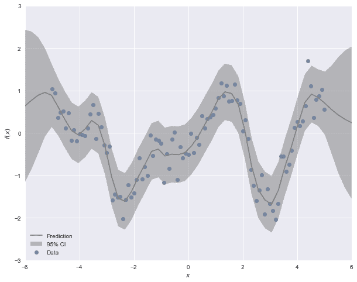

## GPflow

谢菲尔德机器学习小组的 [GPy](http://sheffieldml.github.io/GPy/) 是早期的项目之一，它提供了一个独立的包来拟合 Python 中的高斯过程。与`scikit-learn`的`gaussian_process`模块非常相似，GPy 提供了一组用于指定和拟合高斯过程的类，拥有一个大型内核库，可以根据需要进行组合。GPflow 是 GPy 库的重新实现，使用谷歌广受欢迎的 [TensorFlow](https://www.tensorflow.org) 库作为其计算后端。对于大多数用户来说，这种变化的主要优势在于，它允许使用更现代的方法来拟合更大的 GP 模型，即变分推断和马尔可夫链蒙特卡罗。

让我们通过拟合模拟数据集来演示 GPflow 的使用。API 比`scikit-learns`更通用，因为它期望预测器(特征)和结果的表格输入。因此，我们必须将`y`重塑为表格格式:

```py
Y = y.reshape(-1,1)
```

为了反映我们的`scikit-learn`模型，我们将再次指定 Matèrn 协方差函数。GPflow 有两个面向用户的子类，一个将粗糙度参数固定为 3/2 ( `Matern32`)，另一个固定为 5/2 ( `Matern52`)。振幅是一个包含的参数(`variance`，所以我们不需要包含一个单独的常数内核。

```py
import GPflow
k = GPflow.kernels.Matern32(1, variance=1, lengthscales=1.2)
```

有六种不同的 GP 类，根据协方差结构(完全与稀疏近似)和模型的似然性(高斯与非高斯)进行选择。GPflow 的主要创新在于，非共轭模型(*即*具有非正态可能性的模型)可以使用马尔可夫链蒙特卡罗或通过变分推理的近似来拟合。

由于我们的模型涉及一个简单的共轭高斯似然，我们可以使用`GPR`(高斯过程回归)类。

```py
m = GPflow.gpr.GPR(X, Y, kern=k)
```

我们可以简单地通过打印回归模型对象来访问参数值。

```py
print(m)
```

```py
model.likelihood.[1mvariance[0m transform:+ve prior:None
[ 1.]
model.kern.[1mvariance[0m transform:+ve prior:None
[ 1.]
model.kern.[1mlengthscales[0m transform:+ve prior:None
[ 1.2]
```

请注意，除了 Matèrn 核的超参数之外，还有一个与正态似然相关的方差参数。我们可以通过直接赋值将其设置为非默认值。

```py
m.likelihood.variance = 0.01
```

该模型使用`optimize`方法拟合，该方法对模型似然性运行梯度上升算法(它使用 SciPy 的`minimize`函数作为默认优化器)。

```py
m.optimize()
```

```py
fun: 54.247759719230544
hess_inv:
jac: array([ 3.09872076e-06, -2.77533999e-06, 2.90014453e-06])
message: b'CONVERGENCE: NORM_OF_PROJECTED_GRADIENT_<=_PGTOL'
nfev: 16
nit: 15
status: 0
success: True
x: array([-2.3496958, 0.3208171, 0.6063578])
```

```py
print(m)
```

| 名字 | 价值观念 | 在先的；在前的 | 限制 |
| --- | --- | --- | --- |
| 模型.可能性.方差 | [ 0.09111893] | 没有人 | +ve |
| 模型.内核.方差 | [ 0.86636739] | 没有人 | +ve |
| 型号.内核.长度刻度 | [ 1.04159852] | 没有人 | +ve |

模型对象包含一个`predict_y`属性，我们可以用它来获得任意输入值网格上的期望值和方差。

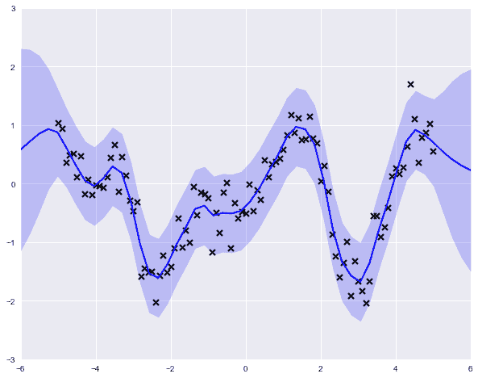

你可能已经注意到，我们在这里所做的没有什么特别的贝叶斯理论。没有指定先验，我们只是执行了最大似然法来获得解决方案。然而，priors 可以被分配为变量属性，适当地使用 GPflow 的一组分布类中的任何一个。

```py
m.kern.variance.prior = GPflow.priors.Gamma(1,0.1)
m.kern.lengthscales.prior = GPflow.priors.Gamma(1,0.1)
```

除了指定超参数的先验，如果我们有信息证明这样做是正确的，我们也可以固定值。例如，我们可能知道数据采集仪器的测量误差，因此我们可以将该误差值指定为常数。

```py
m.likelihood.variance = 0.1
m.likelihood.variance.fixed = True
m.optimize()
```

```py
fun: 63.930638821012721
hess_inv:
jac: array([ -3.35442341e-06, 8.13286081e-07])
message: b'CONVERGENCE: NORM_OF_PROJECTED_GRADIENT_<=_PGTOL'
nfev: 8
nit: 6
status: 0
success: True
x: array([-0.75649791, -0.16326004])
```

虽然我们可能对自己有一个合适的贝叶斯模型感到满意，但最终结果是一样的。我们所做的只是将先验的对数概率添加到模型中，并再次进行优化。这一次，结果是最大*后验* (MAP)估计。

```py
print(m)
```

```py
model.likelihood.[1mvariance[0m transform:+ve prior:None [FIXED]
[ 0.1]
model.kern.[1mvariance[0m transform:+ve prior:Ga([ 1.],[ 0.1])
[ 0.38479193]
model.kern.[1mlengthscales[0m transform:+ve prior:Ga([ 1.],[ 0.1])
[ 0.6148462]
```

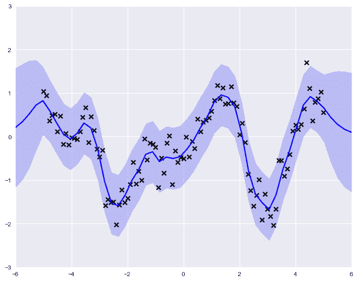

为了执行“完全贝叶斯”分析，我们可以使用更通用的`GPMC`类，它对参数和函数进行联合采样。为此，我们需要指定核参数的似然性和先验性。我们稍微改变一下模型，用一个学生的 T 似然，对极值的影响会更稳健。

```py
l = GPflow.likelihoods.StudentT()
m = GPflow.gpmc.GPMC(X, Y, kern=k, likelihood=l)
m.kern.variance.prior = GPflow.priors.Gamma(1,1)
m.kern.lengthscales.prior = GPflow.priors.Gamma(1,1)
```

我们使用`sample`方法来拟合`GPMC`模型，而不是`optimize`。这将采用[哈密尔顿蒙特卡罗](https://arxiv.org/pdf/1206.1901.pdf) (HMC)，一种有效形式的马尔可夫链蒙特卡罗，利用梯度信息来改善后验采样。TensorFlow 库提供自动微分功能，允许为任意模型计算梯度。HMC 算法需要确定超参数值的规范，这些值决定了采样过程的行为；这些参数是可以调整的。

```py
trace = m.sample(1000, verbose=True, epsilon=0.03, Lmax=15)
```

```py
Iteration: 100 Acc Rate: 94.0 %
Iteration: 200 Acc Rate: 88.0 %
Iteration: 300 Acc Rate: 96.0 %
Iteration: 400 Acc Rate: 93.0 %
Iteration: 500 Acc Rate: 97.0 %
Iteration: 600 Acc Rate: 94.0 %
Iteration: 700 Acc Rate: 96.0 %
Iteration: 800 Acc Rate: 92.0 %
Iteration: 900 Acc Rate: 96.0 %
Iteration: 1000 Acc Rate: 91.0 %
```

我们最终得到一个包含来自核参数的采样值的轨迹，在得到数据信息后，可以绘制该轨迹来了解其值的后验不确定性。

```py
parameter_samples = m.get_samples_df(trace)
```

for col in parameter _ samples . columns . sort _ values()[1:]:
parameter _ samples[col]。hist(label=col.split(' . '))[-1]，alpha=0.4，bin = 15)
[/code]

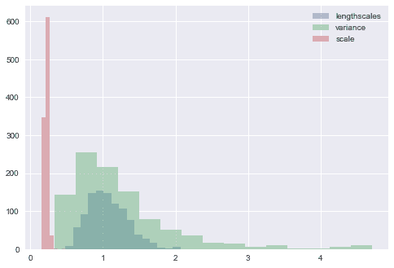

然后，我们可以回过头来从后验 GP 生成预测，并绘制其中的几个来了解预测的基本函数。

```py
realizations = []
for sample in trace[-100:]:
    m.set_state(sample)
    realizations.append(m.predict_f_samples(xx, 1).squeeze())
    realizations = np.vstack(realizations)
```

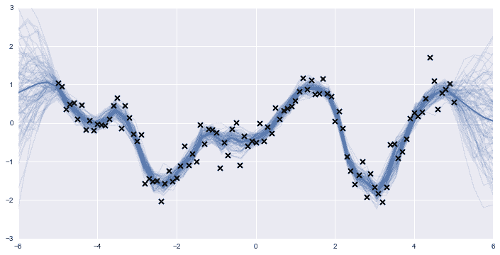

因此，使用 GPflow 代替`scikit-learn`可能有利于具有异常似然函数的模型或难以使用梯度上升优化方法拟合的模型的用户。此外，如果关于 GP 超参数的推断是令人感兴趣的，或者如果存在将有助于获得更精确估计的先验信息，则诸如由 GPflow 的模型类提供的完全贝叶斯方法是必要的。

## PyMC3

PyMC 项目是一个用于概率编程的非常通用的 Python 包，几乎可以用于任何贝叶斯模型(*披露*:自从 PyMC 创建以来，我一直是它的开发者)。与 GPflow 类似，当前版本(PyMC3)从早期版本重新设计，以依赖现代计算后端。PyMC3 不是 TensorFlow，而是构建在 Theano 之上，Theano 是一个用于计算根据张量运算定义的表达式的引擎。至少从表面上看，它的工作方式与 TensorFlow 非常相似，提供了自动微分、并行计算和高效编译代码的动态生成。

```py
import pymc3 as pm
import theano.tensor as tt
```

PyMC3 是一个贝叶斯建模*工具包*，提供均值函数、协方差函数和概率分布，可以根据需要组合起来构建高斯过程模型。通过声明变量和变量的函数来指定模型，以指定完全贝叶斯模型。声明是在一个`Model`上下文中进行的，该上下文自动将它们添加到模型中，为拟合做准备。让我们首先实例化一个模型，并添加一个 Matèrn 协方差函数及其超参数:

```py
with pm.Model() as gp_fit:
    ρ = pm.Gamma('ρ', 1, 1)
    η = pm.Gamma('η', 1, 1)
    K = η * pm.gp.cov.Matern32(1, ρ)
```

我们可以通过指定均值函数(这在这里是多余的，因为在未指定时假设零函数)和观测噪声变量来继续构建我们的模型，我们将给出半柯西先验:

```py
with gp_fit:
    M = pm.gp.mean.Zero()
    σ = pm.HalfCauchy('σ', 2.5)
```

高斯过程模型封装在`GP`类中，由上面指定的均值函数、协方差函数和观测误差参数化。由于 GP 的结果已经被观察到，我们将该数据作为字典提供给`observed`参数中的`GP`的实例。这些被提供给潜在的多元正态似然。

```py
with gp_fit:
    y_obs = pm.gp.GP('y_obs', mean_func=M, cov_func=K, sigma=σ, observed={'X':X, 'Y':y})
```

在`Model`上下文中调用的`sample`函数符合使用 MCMC 采样的模型。默认情况下，PyMC3 使用 HMC 的自动调整版本，称为[无掉头采样器](https://arxiv.org/abs/1111.4246) (NUTS)，它为路径长度和步长参数选取适当的值，我们在 GPflow 的`sample`调用中看到了这些值。此外，为了将采样器初始化为合理的起始参数值，在 NUTS 之前运行变分推理算法，以产生所有参数的近似后验平均值。

```py
with gp_fit:
    trace = pm.sample(2000, n_init=20000)

Auto-assigning NUTS sampler...
Initializing NUTS using advi...
Average ELBO = -61.619: 100%|██████████| 20000/20000 [00:53<00:00, 376.01it/s]
Finished [100%]: Average ELBO = -61.55
100%|██████████| 2000/2000 [00:54<00:00, 36.69it/s]
```

```py
pm.traceplot(trace[-1000:], varnames=['ρ', 'σ', 'η']);
```

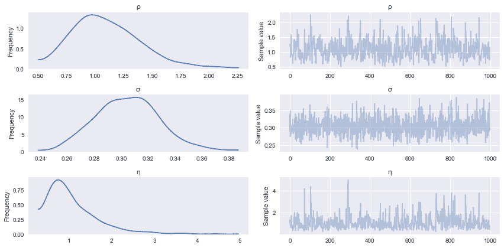

除了拟合模型，我们还希望能够生成预测。这意味着从后验预测分布中取样，如果你还记得的话，这只是一些线性代数:

\ begin { aligned }
m^{\ast}(x^{\ast})&= k(x^{\ast},x)^t[k(x,x)+\sigma^2i]^{-1}y \ \
k^{\ast}(x^{\ast})&= k(x^{\ast},x^{\ast})+\sigma^2-k(x^{\ast},x)^t[k(x,x)+\sigma^2i]^{-1}k(x^{\ast},x)
\ end { aligned }

PyMC3 允许在模型拟合后进行预测采样，使用模型参数的记录值来生成样本。`sample_gp`函数实现上面的预测 GP，用样本轨迹、GP 变量和生成实现的网格点调用:

```py
Z = np.linspace(-6, 6, 100).reshape(-1, 1)
with gp_fit:
    gp_samples = pm.gp.sample_gp(trace[1000:], y_obs, Z, samples=50)
```

```py
100%|██████████| 50/50 [00:06<00:00, 7.91it/s]
```

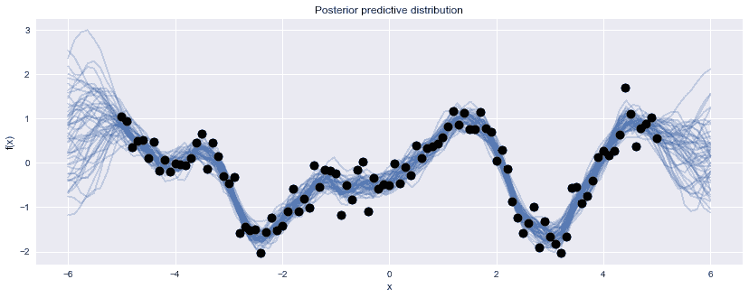

对于适合非常大的数据集的模型，人们经常发现 MCMC 拟合非常慢，因为需要在采样算法的每次迭代中评估模型的对数概率。在这些情况下，使用变分推断方法可能是值得的，这种方法用更简单的近似值代替真实的后验概率，并使用优化将近似值参数化，使其尽可能接近目标分布。因此，后验概率只是一个近似值，有时是一个不可接受的粗略值，但对于许多问题来说是一个可行的替代方案。更新的变分推理算法正在出现，它们提高了近似的质量，这些算法最终会进入软件。同时，[变分高斯近似](http://www.mitpressjournals.org/doi/abs/10.1162/neco.2008.08-07-592#.WKNwR9aZOu4)和[自动微分变分推理](https://arxiv.org/abs/1603.00788)现在分别在 GPflow 和 PyMC3 中可用。

## 结论

Python 用户非常幸运，拥有如此多的选项来构建和拟合非参数回归和分类模型。我展示了使用`scikit-learn`将 GP 模型拟合到连续值数据的简单性，以及如何使用 GPflow 或 PyMC3 将这种模型扩展到更一般的形式和更复杂的拟合算法。鉴于在如此多的环境中变量之间普遍存在非线性关系，高斯过程应该出现在任何应用统计学家的工具包中。我经常发现自己，而不是建立独立的 GP 模型，将它们作为一个更大的层次模型中的组件，以充分考虑非线性混杂变量，如生物统计学应用中的年龄效应，或强化学习任务中的函数逼近。

这篇文章远不是对 Python 中拟合高斯过程的软件工具的全面调查。我选择这三个库是因为我自己对它们很熟悉，并且因为它们在自动化和灵活性之间的权衡中占据不同的位置。你可以使用 GPy、 [Stan](http://mc-stan.org) 、 [Edward](http://edwardlib.org) 和 [George](https://github.com/dfm/george) 来轻松实现这样的模型，这里仅举几个比较流行的包。我鼓励您尝试其中的几种，以了解哪一种最适合您的数据科学工作流程。

* * *