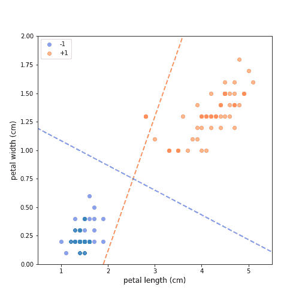
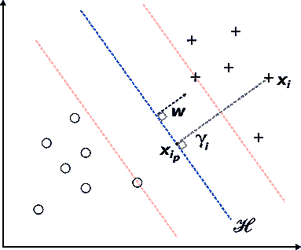
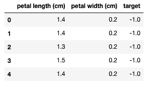
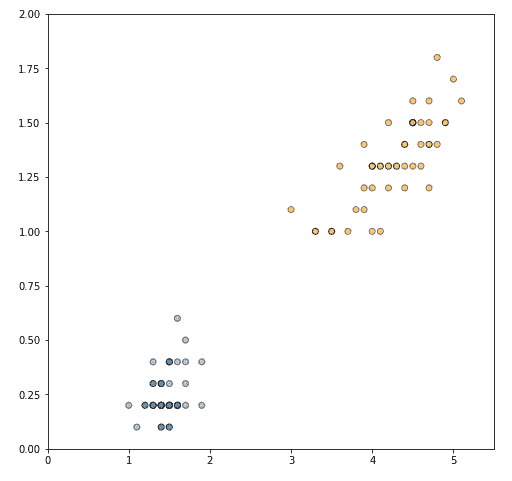
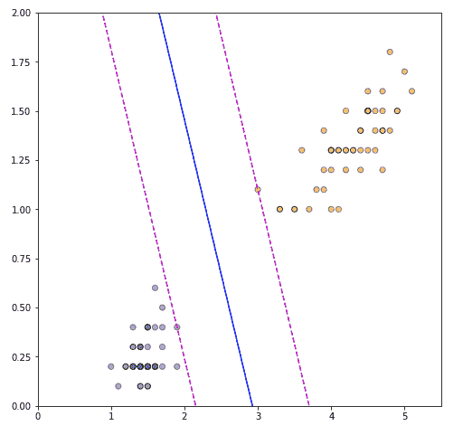

# 基于二次规划的支持向量机拟合

> 原文：<https://www.dominodatalab.com/blog/fitting-support-vector-machines-quadratic-programming>

在这篇博文中，我们深入探讨了支持向量机的内部原理。我们导出了一个线性 SVM 分类器，解释了它的优点，并展示了通过 cvx opt(Python 的凸优化包)求解时的拟合过程。

支持向量机(SVM)是一种监督学习模型，在文本分类(Joachims，1998)、图像识别(Decoste 和 schlkopf，2002)、图像分割(Barghout，2015)、异常检测(schlkopf 等人，1999)等领域有着广泛的应用。



Figure 1 - There are infinitely many lines separating the two classes, but a good generalisation is achieved by the one that has the largest distance to the nearest data point of any class.

图 1 显示了 Fisher 虹膜数据集的样本(Fisher，1936)。该示例包含两个类的所有数据点，即*鸢尾* (-1)和*鸢尾* (+1)，并且只使用了四个原始特征中的两个，即*花瓣长度*和*花瓣宽度*。这种选择产生了一个明显可线性分离的数据集，并且很容易确认存在无限多的超平面来分离这两个类。然而，选择最佳决策边界并不是一个简单的过程。红色和蓝色虚线将两个类别完全分开。然而，红线距离两个集群太近，这样的决策边界不太可能很好地概括。如果我们添加一个新的“看不见的”观察值(红点)，该观察值显然在类+1 的邻域内，则使用红色虚线的分类器会将其错误分类，因为该观察值位于决策边界的负侧。然而，使用蓝色虚线的分类器将没有问题地将新的观察值分配给正确的类。这里的直觉是，在类别之间留有更大间隔的决策边界更具普遍性，这将我们引向支持向量机的关键属性——它们以这样的方式构建超平面，使得两个类别之间的分离间隔最大化(Haykin，2009)。这与感知器形成鲜明对比，在感知器中，我们无法保证感知器将找到哪个分离超平面。

## 线性 SVM 的推导

我们来看一个二元分类数据集\(\ mathcal { d } = \ { \ bold symbol { x } _ I，y_i\}_{i=1}^N\)，其中\(\ bold symbol { x _ I } \在\mathbb{R}^2\)和\(y \in \{-1，+1\}\)。注意，我们发展了在二维欧几里得空间中拟合线性 SVM 的过程。这样做是为了简洁，因为推广到更高的维度是微不足道的。

现在，我们可以从分离超平面的一个方程开始，把这个问题正式化:

$ $ \ begin { eq:SVM-hyperplane }
\ mathcal { h } _ { \ bold symbol { w }，b } = {\boldsymbol{x}:\boldsymbol{w}^t \ bold symbol { x }+b = 0 } \；\;\;\text{(1)}
\end{equation}$$

其中\(\boldsymbol{x}\)是输入向量，\(\boldsymbol{w}\)是可调权重向量，\(b\)是偏差项。我们可以进一步定义以下可用于分配类别标签的决策规则:

$ $ \ begin { equation }
\ begin { aligned }
\boldsymbol{w}^t \ bold symbol { x }&+b \ geq 0 \ text {，for } y _ I =+1 \；\;\;\ text {(2)} \ \
\boldsymbol{w}^t \ bold symbol { x }&+b<0 \ text {，for } y _ I =-1
\ end { aligned }
\ end { equation } $ $

我们现在引入*边缘*的概念——从分离超平面观察的距离。在我们的情况下，从任意数据点到最佳超平面的距离由下式给出

$ $ \ begin { equation }
\ bold symbol { x } _ { I _ p } = \ bold symbol { x } _ I-\ gamma _ I(\ bold symbol { w }/\ | \ bold symbol { w } \ |)
\ end { equation } $ $

其中\(\boldsymbol{x}{i_p}\)是\(\boldsymbol{x}_i\)到\(\mathcal{H}\)的法线投影，而\(\gamma_i\)是边缘的代数度量(参见杜达和哈特，1973)。这里的关键思想是连接\(\boldsymbol{x}_i\)和\(\boldsymbol{x}{i_p}\)的线段平行于\(\boldsymbol{w}\)，并且可以表示为标量\(\gamma_i\)乘以单位长度矢量\(\ bold symbol { w }/\ | \ bold symbol { w } \ | \)，指向与\(\boldsymbol{w}\)相同的方向。

因为\(\boldsymbol{x}_{i_p}\)位于\(\mathcal{H}\)上，所以它满足(1)

$ $ \ begin { align } \boldsymbol{w}^t \ bold symbol { x } _ { I _ p }+b = 0 \ \
\boldsymbol{w}^t(\ bold symbol { x } _ I-\ gamma _ I(\ bold symbol { w }/\ | \ bold symbol { w } \ |)+b = 0 \ end { align } $ $

求解\(\γ_ I \)得到

$ $ \ begin { align }
\ gamma _ I =(\boldsymbol{w}^t \ bold symbol { x } _ I+b)/\ | \ bold symbol { w } \ | \；\;\;\text{(3)}
\end{align}$$

我们对(3)应用进一步的修正，以使该度量也能够处理超平面负侧上的数据点:

$ $ \ begin { align } \ label { eq:SVM-margin-final }
\ gamma _ I = y _ I[(\boldsymbol{w}^t \ bold symbol { x } _ I+b)/\ | \ bold symbol { w } \ |]\；\;\;\text{(4)}
\end{align}$$

这个新的定义对正例和负例都有效，产生的\(\gamma\)值总是非负的。这很容易看出，因为忽略了\(\boldsymbol{w}\)的范数并参考了我们得到的判定规则(2)

$ $ \ begin { equation }
\ begin { aligned }
y _ I =+1 \；\;\;&\ gamma _ I =(+1)(\boldsymbol{w}^t \ bold symbol { x } _ I+b \ geq 0)\ \ \
y _ I =-1 \；\;\;&\ gamma _ I =(-1)(\boldsymbol{w}^t \ bold symbol { x } _ I+b<0)\ end { aligned }
\ end { equation } $ $

这使得在两种情况下\(\gamma_i > 0\)。最后，我们将整个数据集的裕度定义为

$ $ \ begin { equation }
\ gamma = \ min _ { I = 1，\dots，N} \gamma_i
\end{equation}$$

我们现在把注意力转向寻找最佳超平面的问题。直观上，我们希望为\(\boldsymbol{w}\)和\(b\)找到这样的值，使得生成的超平面最大化正样本和负样本之间的分离裕度。如果我们试图直接最大化\(\gamma\)，我们可能会得到一个远离阴性和阳性样本的超平面，但不会将两者分开。因此，我们引入以下约束:

$ $ \ begin { eq:SVM-constraints } \ begin { aligned } \boldsymbol{w}^t \ bold symbol { x }+b \ geq 1 \ text {，for } y _ I =+1 \ \ \boldsymbol{w}^t \ bold symbol { x }+b \ leq-1 \ text {，for } y _ I =-1 \ end { aligned } \ end { equation } $ $

满足上述带有等号的约束条件的特定数据点称为*支持向量* -这些数据点位于红色虚线上(图 2)，并且最接近最佳超平面。请注意，如果(2)成立，我们总是可以以约束也成立的方式重新调整\(\boldsymbol{w}\)和\(b\)。换句话说，重新缩放\(\boldsymbol{w}\)和\(b\)不会影响\(\mathcal{H}\)。



Figure 2 - Two linearly separable classes and an optimal separating hyperplane. The distance between an arbitrary point and the hyperplane is obtained using the normal projection of the point onto the hyperplane. There are also two support vectors present --- one on the positive and one on the negative side of the hyperplane.

如果我们现在关注一个支持向量\(\{\boldsymbol{x}_s，y_s\}\)，那么将约束的结果代入等式(4)会发现支持向量和\(\mathcal{H}\)之间的最佳距离为

$ $ \ begin { equation }
\ gamma _ s = y _ s[(\boldsymbol{w}^t \ bold symbol { x } _ s+b)/\ | \ bold symbol { w } \ |]=(\ pm 1)[\ pm 1/\ | \ bold symbol { w } \ |]= 1/\ | \ bold symbol { w } \ |
\ end { equation } $ $

因此，这两个类之间的最佳间隔是

$ $ \ begin { equation }
2 \ gamma _ s = 2/\ | \ bold symbol { w } \ |
\ end { equation } $ $

然而，最大化\(1 / \|\boldsymbol{w}\|\)相当于最小化\(\|\boldsymbol{w}\|\)。因此，在约束条件下最大化利润相当于

$ $ \ begin { equation }
\ begin { aligned }
\ min _ { \ bold symbol { w }，b } \ quad&\ | \ bold symbol { w } \ | \；\;\;\ text {(5)} \ \
\ textrm {这样} \ quad&y _ I(\boldsymbol{w}^t \ bold symbol { x } _ I+b)\ geq 1 \ text {，for } \forall \{\boldsymbol{x}_i，y _ I \ } \ in \ mathcal { d }
\ end { aligned }
\ end { equation } $

现在的问题是:我们如何解决这个优化问题？

## 用二次规划学习线性 SVM

二次规划(QP)是一种优化受某些线性约束的二次目标函数的技术。有大量的 QP 求解器可用，例如 GNU Octave 的 qp，MATLAB 的优化工具箱，Python 的 [CVXOPT](https://cvxopt.org/) 框架等等。，它们都可以在 Domino 数据科学平台中获得。对于本教程，我们将使用 CVXOPT。为了使用凸优化，我们首先需要构造约束优化问题的拉格朗日函数(5)我们将拉格朗日乘数\(\boldsymbol{\alpha}\)分配给约束，并构造以下函数

$ \ begin { equation } \ begin { aligned } \ t1]j(\ \ boldssymbol { w }、b，\ boldssymbol { alpha })&=-\ alpha _ I[y _ I](符号{ x } _ I+b)-1]\
&=(1/2)--\；\；(6)
\ end { align }
\ end { equation } $。

我们现在寻找\(J(\boldsymbol{w}，b，\boldsymbol{\alpha})\)的最小最大点，其中拉格朗日函数相对于\(\boldsymbol{w}\)和\(b\)最小化，并且相对于\(\boldsymbol{\alpha}\)最大化。这是一个*拉格朗日对偶问题*的例子，标准方法是从求解最小化目标(\(\boldsymbol{w}\)和\(b\))的*原始变量*开始。该解决方案提供\(\boldsymbol{w}\)和\(b\)作为拉格朗日乘数(*对偶变量*)的函数。下一步是在对偶变量的约束下最大化目标。

假定\(J(\boldsymbol{w}，b，\boldsymbol{\alpha})\)是凸的，最小化问题可以通过对\(\boldsymbol{w}，b，\boldsymbol{\alpha})\)相对于\(\boldsymbol{w}\)和\(b\)求微分，然后将结果设置为零来解决。

$ $ \ begin { align } \ partial j(\ bold symbol { w }，b，\ bold symbol { \ alpha })/\ partial \ bold symbol { w } = 0 \ text {，得出} \ bold symbol { w } = \sum_{i=1}^n \ alpha _ I y _ I \ bold symbol { x } _ I \ label { eq:SVM-dual-const 1 } \ \ \ partial j(\ bold symbol { w }，b，\ bold symbol { \ alpha })/\ partial b = 0 \ text {，得出} \sum_{i=1}^N \alpha_i y_i\;\;\text{(7)}\end{align}$$

扩展(6)和堵塞 w 和 b 产量的解决方案

$ \ begin { align } t0]j(\ \ boldssymbol { w }、b，\ boldssymbol { \ alpha })【T4 =(1/2)\ alpha _ I \ alpha _ j y _ I y _ j } \ boldssymbol { x } _ j-\ alpha _ I \ alpha _ j y _ I y _ j } \ boldssymbol { x } _ j+b \ alpha _ I y _ I+)\；\；\ text {(8)}
\ end { align }
$。

(8)中的第二项因为(7)而为零，这给了我们问题的最终提法。

$ $ \ begin { eq:SVM-qp-min-final }
\ begin { aligned }
\ max _ { \ bold symbol { \ alpha } } \ quad&\sum_{i=1}^n \ alpha _ I-(1/2)\sum_{i=1}^n \sum_{j=1}^n \ alpha _ I \ alpha _ j y _ I y _ j \boldsymbol{x}_i^t \ bold symbol { x } _ j \；\;\;\ text {(9)} \ \
\ textrm {这样} \ quad&(1)\；\sum_{i=1}^n \ alpha _ I y _ I = 0 \ \
&(2)\；\ alpha _ i \ geq 0 \\ for all I
\ end { aligned }
\ end { equation } $ $

现在，让我们看看如何在实践中应用这一点，使用修改后的虹膜数据集。让我们从加载所需的 Python 库开始，加载和采样数据，并对其进行绘图以便进行可视化检查。

```py
import matplotlib
import matplotlib.pyplot as plt

import pandas as pd

import numpy as np
from cvxopt import matrix, solvers
from sklearn.datasets import load_iris
iris = load_iris()
iris_df = pd.DataFrame(data= np.c_[iris["data"], iris["target"]], columns= iris["feature_names"] + ["target"])
# Retain only 2 linearly separable classes
iris_df = iris_df[iris_df["target"].isin([0,1])]
iris_df["target"] = iris_df[["target"]].replace(0,-1)
# Select only 2 attributes
iris_df = iris_df[["petal length (cm)", "petal width (cm)", "target"]]
iris_df.head()

```



让我们将数据转换成 NumPy 数组，并绘制两个类。

```py
X = iris_df[["petal length (cm)", "petal width (cm)"]].to_numpy()

y = iris_df[["target"]].to_numpy()

plt.figure(figsize=(8, 8))

colors = ["steelblue", "orange"]

plt.scatter(X[:, 0], X[:, 1], c=y.ravel(), alpha=0.5, cmap=matplotlib.colors.ListedColormap(colors), edgecolors="black")

plt.xlim(x_min, x_max)

plt.ylim(y_min, y_max)
plt.show()
```



回想一下，为了找到最佳超平面，我们使用(9)中给出的对偶拉格朗日公式。然而，CVXOPT 期望问题以下面的形式表达

$ $
\ begin { equation }
\ begin { aligned }
\ min \ quad&(1/2)\boldsymbol{x}^t p \ bold symbol { x }+\boldsymbol{q}^t\boldsymbol{x}\\
\ textrm { subject to } \ quad&a \ bold symbol { x } = b \ \
\ quad&g \ bold symbol { x } \ precurlyeq \ bold symbol { h }
\ end { aligned }
\ end { equation }
$ $

我们需要重写(9)来匹配上面的格式。让我们定义一个矩阵\(\mathcal{H}\)使得\(H_{ij} = y_i y_j x_i \cdot xj\)。然后我们可以用向量的形式重写原来的问题。我们还将目标和约束都乘以-1，这就变成了最小化任务。

$ $
\ begin { aligned }
\ min _ { \ alpha } \ quad&(1/2)\boldsymbol{\alpha}^t h \ bold symbol { \ alpha } -1^t \ bold symbol { \ alpha } \ \
\ textrm {这样} \ quad&\ bold symbol { \ alpha } = 0 \ \
\ quad&-\ alpha _ I \ leq 0 \；\ for all I
\ end { aligned }
$ $

从那里，我们获取训练样本的数量(n)并构造矩阵(H)。

```py
n = X.shape[0]

H = np.dot(y*X, (y*X).T)

```

这是目标的第一项。对于第二项，我们只需要一个-1 的列向量。

```py
q = np.repeat([-1.0], n)[..., None]

```

对于第一个约束，我们将\(A\)定义为包含标签\(\boldsymbol{y}\)的\(1 \乘以 n\)矩阵，并将\(b\)设置为 0。

```py
A = y.reshape(1, -1)

b = 0.0

```

对于第二个约束，我们构造了一个矩阵\(n \u 乘 n \u\u\u\u\u\u\u\u\u\u\u\u\u\u\u\u\u\u\\( G \\\\\\\\\\\\\)在对角线上为负 1，其他地方为 0，以及一个零向量\\\\\\\\\\\\\\\\

```py
G = np.negative(np.eye(n))

h = np.zeros(n)

```

最后，我们将所有东西转换成 CVXOPT 对象

```py
P = matrix(H)

q = matrix(q)

G = matrix(G)

h = matrix(h)

A = matrix(A)

b = matrix(b)

```

打电话给 QP 求解器。

```py
sol = solvers.qp(P, q, G, h, A, b)

alphas = np.array(sol["x"])

```

```py
     pcost       dcost       gap    pres   dres

 0: -5.8693e+00 -1.1241e+01  3e+02  1e+01  2e+00

 1: -5.9277e+00 -3.6988e+00  4e+01  2e+00  3e-01

 2: -1.0647e+00 -1.9434e+00  5e+00  2e-01  2e-02

 3: -6.5979e-01 -1.1956e+00  6e-01  6e-03  8e-04

 4: -8.3813e-01 -1.2988e+00  5e-01  3e-03  4e-04

 5: -1.1588e+00 -1.1784e+00  2e-02  8e-05  1e-05

 6: -1.1763e+00 -1.1765e+00  2e-04  8e-07  1e-07

 7: -1.1765e+00 -1.1765e+00  2e-06  8e-09  1e-09

 8: -1.1765e+00 -1.1765e+00  2e-08  8e-11  1e-11

Optimal solution found.

```

我们现在可以使用\(\boldsymbol{w}\)

$ $ \ begin { equation }
\ bold symbol { w } = \ sum \ alpha _ I y _ I \ bold symbol { x } _ I
\ end { equation }
$ $

```py
w = np.dot((y * alphas).T, X)[0]

```

接下来，我们确定支持向量，并使用以下公式计算偏差

$ $
\ begin { equation }
b =(1/| s |)\ sum _ { s \ in s }(y _ s-\ sum _ { I \ in s } \ alpha _ I y _ I \boldsymbol{x}_i^t \ bold symbol { x } _ s)
\ end { equation }
$ $

```py
S = (alphas > 1e-5).flatten()

b = np.mean(y[S] - np.dot(X[S], w.reshape(-1,1)))

```

让我们看看最佳的\(\boldsymbol{w}\)和\(b\)值。

```py
print("W:", w)

print("b:", b)

```

```py
W: [1.29411744 0.82352928]

b: [-3.78823471]

```

接下来，我们绘制分离超平面和支持向量。
该代码基于 scikit-learn 文档中的 [SVM 利润示例](https://scikit-learn.org/stable/auto_examples/svm/plot_svm_margin.html)。

```py
x_min = 0

x_max = 5.5

y_min = 0

y_max = 2

xx = np.linspace(x_min, x_max)

a = -w[0]/w[1]

yy = a*xx - (b)/w[1]

margin = 1 / np.sqrt(np.sum(w**2))

yy_neg = yy - np.sqrt(1 + a**2) * margin

yy_pos = yy + np.sqrt(1 + a**2) * margin

plt.figure(figsize=(8, 8))

plt.plot(xx, yy, "b-")

plt.plot(xx, yy_neg, "m--")

plt.plot(xx, yy_pos, "m--")

colors = ["steelblue", "orange"]

plt.scatter(X[:, 0], X[:, 1], c=y.ravel(), alpha=0.5, cmap=matplotlib.colors.ListedColormap(colors), edgecolors="black")

plt.xlim(x_min, x_max)

plt.ylim(y_min, y_max)

plt.show()
```



该图非常令人满意，因为解决方案完美地识别了使分离裕度最大化的支持向量，并且分离超平面正确地位于两者之间。最后，我们还可以通过使用 scikit-learn SVM 实现拟合 SVM 来验证我们解决方案的正确性。

```py
from sklearn import svm
```

#使用线性内核并将 C 设置为较大的值，以确保硬边界拟合

```py
clf = svm.SVC(kernel="linear", C=10.0)
clf.fit(X, y.ravel())
w = clf.coef_[0]
b = clf.intercept_

print("W:", w)
print("b:", b)

W: [1.29411744 0.82352928]

b: [-3.78823471]

```

我们得到了相同的\(\boldsymbol{w}\)和\(b\)(由于具体的实现，在预期的误差范围内)，这证实了我们的解决方案是正确的。

## 摘要

在本文中，我们回顾了支持向量机的数学知识及其相关的学习算法。我们使用 CVXOPT 在 Python 中做了一个“从头开始”的实现，并且我们展示了它产生了与 sklearn.svm.SVC 实现相同的解决方案。

理解支持向量机的内部结构使我们对算法对于各种任务的适用性有了额外的了解，并使我们能够为更复杂的用例编写定制的实现。

## 参考

*   巴尔古特大学(2015 年)。用于图像分割的迭代模糊决策的空间分类信息颗粒。在 W. Pedrycz 和 s-m . Chen(编辑。)、粒度计算和决策制定:交互式和迭代方法(第 285-318 页)。斯普林格国际出版公司。https://doi.org/10.1007/978-3-319-16829-6_12
*   德科斯特博士和舍尔科夫学士(2002 年)。训练不变支持向量机。机器学习，46(1-3)，161–190。
*   杜达，R. O .，，哈特，P. E. (1973)。模式分类和场景分析。约翰·威利父子公司。
*   费希尔(1936 年)。分类问题中多重测量的使用。优生学年鉴，
    7(2)，179–188。https://doi . org/https://doi . org/10.1111/j . 1469-1809.1936 . TB 02137 . x
*   Haykin，S. S. (2009 年)。神经网络和学习机(第三)。皮尔森教育。
*   t .约阿希姆(1998 年)。用支持向量机进行文本分类:用许多相关特征进行学习。在 C. Nédellec & C. Rouveirol(编辑。)，机器学习:Ecml-98(第 137–142 页)。施普林格柏林海德堡。
*   库恩，H. W .，&塔克，A. W. (1951)。非线性规划。第二届伯克利数理统计和概率研讨会会议录，1950 年，481-492。
*   schlkopf，b .，Williamson，r .，Smola，a .，Shawe-Taylor，j .，和 Platt，J. (1999 年)。新颖度检测的支持向量方法。第 12 届国际神经信息处理系统会议录，582-588。