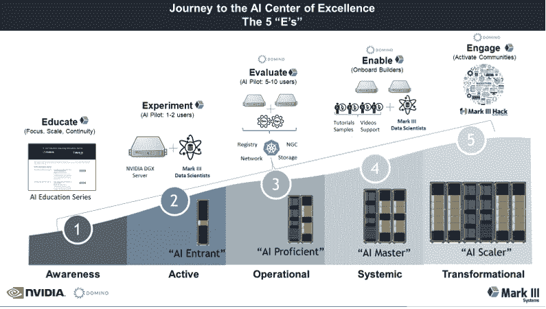

# 建立人工智能卓越中心的五个步骤

> 原文：<https://www.dominodatalab.com/blog/five-steps-to-building-the-ai-center-of-excellence>

由战略&创新副总裁[林振](https://dominodatalab.com/blog/author/andy-lin)和 [Mark III 系统](https://www.markiiisys.com/)首席技术官[大卫舒尔曼](https://dominodatalab.com/blog/author/david-schulman)合著，后者是多米诺数据实验室的合作伙伴营销主管。

通过数据科学获得竞争优势的最具创新性的组织正在创建数据科学的卓越中心(CoE)模型。 [麦肯锡指出，在高级分析领域，60%](https://www.mckinsey.com/industries/financial-services/our-insights/building-an-effective-analytics-organization) 的顶级公司都遵循 CoE 方法。 [例如，Bayer Crop Science](https://www.dominodatalab.com/blog/do-you-need-a-center-to-be-excellent) 将许多优势归功于 CoE 方法，例如跨团队更好地共享知识、提高数据科学计划的效率、更好地协调数据科学和业务战略，以及改善人才获取。

## 建设欣欣向荣的人工智能卓越中心(CoE)的路径是什么？

在 Mark III，我们在过去几年里有幸与 NVIDIA 和几十个组织一起在[工作，以支持他们的 AI CoE 之旅。在 9 月 19 日至 22 日的 NVIDIA GTC 大会上，我们](https://www.markiiisys.com/blog/mark-iii-recognized-as-nvidia-npn-americas-rising-star-partner-of-the-year/)[宣布了新的 AI CoE 解决方案](/news/domino-data-lab-announces-new-ecosystem-solutions-with-nvidia-to-accelerate-hybrid-and-multi-cloud-mlops-journey)，采用了 NVIDIA 和 Domino 数据实验室的最新技术。

尽管每个故事和道路都略有不同，但我们注意到，它们在成熟时大多遵循相同的五个一般步骤或阶段。多米诺数据实验室的企业 MLOps 平台 [集成了英伟达的产品线](https://www.dominodatalab.com/partners/nvidia) 的基础设施，如[英伟达 DGX 系统](/news/domino-data-lab-joins-nvidia-as-dgx-ready-software-program-partner)，来自领先原始设备制造商的英伟达认证系统，以及[英伟达 AI 企业](/blog/domino-validated-for-nvidia-ai-enterprise)软件套件。我们还帮助像[【Allstate】](https://www.dominodatalab.com/resources/allstates-analytics-coe-pushes-data-science-innovation)[【SCOR】](https://www.dominodatalab.com/resources/scor-s-creation-of-data-science-center-of-excellence-to-enhance-model-deployment/)[Topdanmark](https://www.dominodatalab.com/resources/topdanmark-scales-mlops)这样的组织扩展他们的 Coe。尽管每个故事和道路都略有不同，但我们注意到，它们在成熟时大多遵循相同的五个一般步骤或阶段。

但在我们描述我们观察到的这些步骤是什么之前，我们可能应该定义什么是人工智能卓越中心(至少是我们对人工智能卓越中心的看法)。

## 什么是人工智能卓越中心？

很简单，人工智能卓越中心是一个集中的数据科学和人工智能/人工智能计算资源，在某一点上由一个团队管理，但可以服务于一个、五个、十个、一百个甚至数千个数据科学家，每个人都有自己独特的关于 ide、框架、工具集、库、模型、应用程序的需求，他们在其中工作的团队，都可以“用脚投票”在哪里构建和运行他们的模型。

简而言之，即使你成功地构建了技术栈来服务于你的数据科学社区，如果你不同时保持对团队、文化、人员、用户体验和教育方面的高度关注，他们也不会喜欢它，他们会转向其他东西(甚至拒绝使用它)，你的 AI CoE 也不会成功。

因此，通往人工智能卓越中心的旅程确实一半是技术，一半是非技术(教育/文化/团队)。你会发现这个想法在下面有显著的特征。

构建人工智能 CoE 的五个步骤是什么(根据与几十个机构和组织的合作观察),我们如何合作以确保它的成功？

## 教育

甚至在关于技术的任何讨论以及关于集中式平台或 MLOps 的任何想法之前，我们已经发现，最成功的组织已经在教育他们的数据科学社区，为将来某一天的集中式 AI CoE 技术堆栈做准备。在任何给定的时间点，我们已经注意到至少 70%的与会者要么开始，要么试图加强基本的 AI/ML 基础，所以持续的实践教育在开始和持续的基础上都是重要的。

Mark III 帮助填补了这一空白，它在早期阶段对组织内的社区进行教育，并通过其 [人工智能教育系列](https://trending.markiiisys.com/aieducationseries) 提供所有阶段的继续教育，这是一套为不同地理位置的受众设计的实时虚拟教程/实验室，专为实用的人工智能教育理念而设计。焦点完全集中在术语、实用概念和实验室 — 上，可以被与会者立即“带回家”，让他们插入自己的数字、数据和用例，并立即开始迭代。

Domino 已经在组织中看到了类似的例子，不仅是数据科学家，还有商业领袖。好事达采用教育计划，专注于向业务领导者传授数据科学知识，通过为业务领导者和数据科学家提供“共同语言”来促进跨职能部门的沟通，以解决棘手的业务问题(在 43:00 的 [了解更多信息，这是一个点播小组](https://www.dominodatalab.com/resources/allstates-analytics-coe-pushes-data-science-innovation) )。

我们看到的培养这种文化并为 AI CoE“摆好桌子”的其他教育示例包括交互式用户驱动的研讨会、跨职能团队建设以及围绕共同挑战的“快速构建”。

## 实验

我们通常看到的下一个阶段，通常与“教育”阶段(一旦开始，实际上总是在进行中)重叠，是“实验”阶段，数据科学家和“构建者”从阴影中出现，告诉你他们正在做什么，以及他们如何使用或考虑使用数据科学和人工智能模型在整个组织中做改变游戏规则的事情。

Domino 已经看到组织为数据科学家实验和创新留出有意的时间——，这可能超出了“自上而下”的业务目标。好事达分配了一部分数据科学家的时间来从事任何感兴趣的项目，促进跨团队实验和协作来推动创新。更多详情，请查看 [本点播面板](https://www.dominodatalab.com/resources/allstates-analytics-coe-pushes-data-science-innovation) )。

在过去的 5-10 年里，人工智能的开源本质和历史令人难以置信的是，几乎任何人都可以从他们的笔记本电脑或工作站开始，无论是在办公室内还是办公室外。围绕数据科学对社区进行正式教育的官方努力几乎就像是为这些构建者走出来展示他们一直在做的工作开了绿灯。在这一点上，组织有机会鼓励社区在他们各自的组中继续并加速他们的工作，方法是让他们在他们习惯的工作流中访问更好的平台和工具。

## 评价

有了足够的教育和鼓励，组织将很难跟踪所有正在构建的模型以及所有孤岛和小组中发生的所有数据科学活动。相反，数据科学家开始遇到真正的挑战，例如模型漂移、无法跟踪数据集版本、无法获得模型所需的最佳数据集、模型从训练到生产推理的速度缓慢等等。好的一面是，整个组织有很多活动和讨论，但这些是真正的问题，如果不解决，可能会破坏所有的势头。

这个转折点是“评估”和审视 MLOps 平台的最佳时机，如果操作得当，该平台可以作为人工智能卓越中心向前发展的技术核心，并允许组织在某一点管理 CoE，而不会在组织扩展时侵犯每个数据科学家的独特需求和偏好。

开放性和灵活性是数据科学创新的关键，这就是为什么它是 Domino 平台的核心支柱。数据科学工具和技术的前景是异构的，并且不断发展，处于 CoE 核心的平台必须提供灵活性、敏捷性和可伸缩性。 [拜耳](https://www.dominodatalab.com/customers/bayer) 将此视为评估 Domino 的关键因素，数据科学家使用了许多工具，如 RStudio、Jupyter、Flask 等。拜耳数据科学卓越中心负责人 Naveen Signla 指出，“Domino 使全球企业中使用不同工具、具有不同背景和技能的用户更容易相互合作，利用过去的工作，并快速协作。"

我们在这一阶段使用的词是“评估”，因为它不仅需要试验和“推广”由 Domino 的企业 MLOps 平台和 Kubernetes 基金会支持的 MLOps 技术堆栈的能力，还需要确保任何试验中的数据科学家都有培训、部署和运行他们的模型的出色体验。总之是真实的评价。如果你的早期数据科学用户没有很好的体验，你的 AI CoE 可能无法进入下一阶段。

## 使能够

如果组织取得成功，通往人工智能卓越中心之旅的第四步是“启用”阶段，该阶段的中心是将人工智能卓越中心的成功试点推广到早期生产中，确保数据科学用户的数量增加，并与 IT 运营团队合作，以确保环境保持正常运行。

Mark III 发现，将 AI CoE 几乎像软件即服务产品 — 一样对待和支持，并将管理它的团队视为产品管理团队 — 是构建团队和战略的有效视角。Domino 已经看到了类似的侧重于支持数据科学家和业务的方法，其中 [S & P Global](https://towardsdatascience.com/data-science-literacy-for-the-enterprise-fadaf9268494) 使用 Domino 作为“粘合剂”,支持一项对全球 17，000 名员工进行数据科学教育的计划。SCOR 将数据科学家嵌入业务中，以更好地培养理念、实践、技术和文档，从而推动数据科学的采用。此外，他们的数据科学专家使用 Domino 作为工具来 [分享最佳实践和模板](https://www.dominodatalab.com/blog/data-science-at-scor-governing-data-science-by-example-instead-of-edict) 。

Mark III 帮助组织完成了从建立知识库和入门教程到与 IT 运营团队“合作指导”的各种工作，以保持整体 AI CoE 环境的运行和优化。

## 从事

通往人工智能卓越中心的旅程的第五步也是最后一步是“参与”阶段，这是关于激活数据科学社区的剩余部分来加入人工智能卓越中心的。如果你从技术采用曲线的角度考虑，这将包括早期多数用户和后期多数用户。

到这个时候，组织的 AI CoE 和 MLOps 平台正在运行，大多数组都充分意识到了，并且入职和用户体验应该运行顺利，即使对于非专家用户也是如此。

此时，AI CoE 应该像一台运转良好的机器一样运行。重点是提高大众的参与度，鼓励他们更多地参与 AI CoE。在 Mark III，我们经常在“参与”阶段联合举办黑客马拉松，不仅提高整个组织的意识，还帮助建立与外部组织的合作伙伴关系，包括行业和公共部门。

类似地，Domino 通常是黑客马拉松中使用的 MLOps 平台，提供参与者所需的基础设施、数据和工具。强生公司 [举行了一次内部黑客马拉松](https://blogs.nvidia.com/blog/2021/09/02/johnson-and-johnson-domino-data-science-mlops/) 来提高视力保健业务的预测能力，利用达美乐的平台让几十个团队提出最佳模式。 [BNP Paribas Cardif 举办了一次虚拟数据科学黑客马拉松](https://www.dominodatalab.com/blog/what-can-100-data-scientists-do-in-one-week-answer-a-lot) ，来自大学和合作公司的 100 多名数据科学家参加，使用 Domino Data Lab 使每个团队能够访问他们需要的基础设施资源。

## 如何构建人工智能 CoE:英伟达 GTC 发布新解决方案

通往人工智能卓越中心的旅程对每个组织来说都是不同的，但我们认为，如果规划并遵循这五个步骤，它将有可能导致成功，无论确切的路径如何。如上所述，这一旅程基于一半技术、一半文化/团队/教育，并且我们的集体团队可以通过我们的共同学习来提供帮助。

企业 MLOps 在通往人工智能卓越中心的道路上至关重要，因为它构成了卓越中心的技术核心，但请不要忽视这条道路上的其他关键步骤和环节。

毕竟，人工智能卓越中心的成功在于过程，而不是目的地。了解更多关于我们 AI CoE 解决方案的信息，[NVIDIA 于 9 月 19 日至 22 日](/news/domino-data-lab-announces-new-ecosystem-solutions-with-nvidia-to-accelerate-hybrid-and-multi-cloud-mlops-journey)在 GTC 宣布。