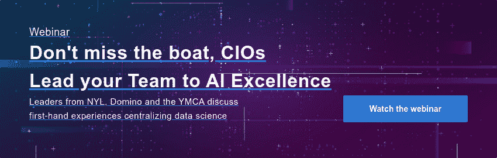

# 将您的数据科学职能引向 MLOps 卓越的五个技巧

> 原文：<https://www.dominodatalab.com/blog/five-tips-on-leading-your-data-science-function-to-mlops-excellence>

*编者按:这是分享开发企业数据科学战略的公司最佳实践的系列文章的一部分。一些文章将包含关于他们使用 Domino 的信息。*

在我毕业后的 15 年职业生涯中，我有幸为金融和保险行业的公司开发数据科学团队。我最近被要求思考哪些行动有助于使数据科学团队成功融入组织。以下是我提供给任何踏上构建企业数据科学功能之旅的人的五个技巧。

### 雇佣多样化的技能组合

当我五年前加入纽约人寿时，我的任务是将一个由七名成员组成的数据科学团队发展成为一个企业范围的集中式数据科学中心，并在全公司范围内提供具有新水平的服务、专业知识和效率的人工智能解决方案。

如今，数据科学和人工智能中心(CDSAi)是一个 50 人的团队，拥有在我们的财富 100 强人寿保险公司中成功提供数据科学和人工智能专业知识、解决方案和教育所需的各种技能。CDSAi 不仅包括数据科学家，还包括机器学习工程师、数据工程师、项目和产品经理、运营和变革管理负责人、建立外部合作伙伴关系的开发经理以及数据科学社区负责人。

我们的数据科学家参与模型开发生命周期的每个方面。他们由负责模型部署和我们各种技术平台的项目经理和 ML/Ops 工程师提供支持。我们的变革经理、产品经理和开发经理携手合作，构思和整合新业务合作伙伴的数据科学。

### 促进透明度和数据科学教育

关于揭开数据科学神秘面纱的重要性已经说了很多，我参与的每个组织都是如此。我们的业务合作伙伴越是见多识广，他们就越会兴奋地将数据科学纳入他们的决策流程。为此，我们为公司创造了多种学习和参与数据科学的方式。

感谢纽约人寿的大力支持，我们已经成功建立了一个包容性的数据科学社区，通过各种计划覆盖所有领域、职业、级别和数据科学经验水平。其中包括:

*   关于项目、方法和数据的每月“午餐和学习”
*   年度数据科学博览会
*   数据科学论坛
*   外部嘉宾扬声器

通过这些活动，我们的内部数据科学家可以继续相互学习，公司内感兴趣的员工可以接触到数据科学在不同业务领域的应用。

此外，通过我们的数据科学学院，我们为纽约人寿的所有员工创造了机会，让他们以最舒适的方式学习数据科学。这包括技术和非技术认证途径以及文章和视频系列。我们举办了一系列研讨会，涵盖的主题从如何开始使用 Python 到我们的高级管理人员如何充分利用我们的数据科学能力。

通过这些活动、学习机会和纽约人寿的内部网，我们提高了对数据科学的理解水平，并强调了它可以提供的巨大价值。这有助于我们与现有业务伙伴、潜在的新业务伙伴以及其他利益相关方的关系。

### 经常有意义地联系

继续这个主题，您的业务合作伙伴知识越丰富，他们就越愿意将数据科学纳入他们的决策过程，我们非常鼓励 CDSAi 团队经常与我们的业务合作伙伴联系。

对于我们的数据科学家来说，这意味着每周或每两周与利益相关者会面。可能并不总是有重大的更新，但是在这些会议中，我们继续了解业务的细微差别以及棘手问题，他们也了解我们的流程。这对双方都有利，而且从个人层面来说，令人愉快和有益。其他团队成员也参与这些定期安排的会议。项目里程碑一起庆祝。虚拟工作当然也没有阻止我们承认项目中的所有重要时刻。

除了这些会议，我们的团队成员还会定期与公司的其他人进行互动。这有助于了解更多的业务以及我们如何提供帮助，同时，在有意义的层面上了解他人也是工作中令人满意的一部分。找到我们与同事的联系点对于个人参与和确保项目顺利进行都很重要。

### 与所有利益相关方保持一致

我们认为，确保我们与所有利益相关方有效协调我们的工作至关重要，包括:

*   ***业务领导*** -我们经常与销售、营销、财务、产品、服务和其他业务团队的业务领导交谈，讨论机会并确保我们保持一致。CDSAi 经理与我们所服务的业务部门中的同行非常一致。
*   *技术-我们需要在技术方面保持敏捷，特别是当我们迅速将新平台、库和工具引入我们的数据科学生态系统，以帮助我们的团队推动创新时。为此，与我们的技术合作伙伴进行良好的沟通至关重要。对于每一个请求，我们都分享为什么我们需要一种特定的技术，以及它如何从技术和业务的角度推动我们前进。此外，我们的数据工程师积极与技术合作，以确定数据优先级以及数据将如何流入分析开发。然后，CDSAi 团队处理“最后一英里”的数据处理，将数据输入到我们的模型中。*
**   ***【治理团队】-*** 作为一家公司，我们有广泛的治理流程。对于更大的项目，我们有各种各样的治理团队。因此，在我们所有的项目计划中，我们有流程来确保我们的团队在我们需要决策之前几个月就开始这些对话，这样我们就可以确保我们在开发的早期解决任何需求。*

 *### 投资技术基础设施

我们投资于有助于加速模型开发和部署的基础设施。例如，我们已经使用 Python 和 R 栈以及模型开发创建了一个计算环境。最近，我们在 Domino 平台的帮助下创建了模型部署的基础设施。我们使用 Domino 来消除将模型转移到生产环境中的手工工作，这需要大量的质量保证(QA)工作来保证它的正确性。现在，有了 Domino 平台和底层的 Kubernetes 集群，我们消除了数月的重新编码工作，可以直接将 Python 和 R 代码投入生产。我们的模型现在可以通过 API 从公司的任何生产平台访问。实现、运行和管理 Domino 平台以及部署模型在很大程度上是 CDSAi 和我们的技术团队之间的协作。

### 最终反射

我对 CDSAi 在帮助纽约人寿多元化团队做出模型驱动的决策方面所发挥的影响感到无比自豪。仅举几个例子，销售、营销、核保和代理等职能部门都在利用数据科学来自动化关键流程和改进决策，以便更好地为我们的客户服务。该团队已经建立了一个强大的基础—跨越人员、流程和技术—并在帮助高效和协作地实现这一影响方面发挥了关键作用。

随着我们进一步扩展纽约人寿的数据科学能力，我们将在许多方面继续努力。例如，最近的一项工作是增强我们的数据流，并创建一个[特征库](https://blog.dominodatalab.com/an-introductory-guide-to-feature-stores)，该库记录并制度化了用于特定模型的最佳特征的知识。功能工程是一个耗时的过程，这项工作将使我们的团队能够不断地建立在彼此的知识之上，并更快地解决复杂的业务问题。

以上五个建议来自我的经验，这个旅程当然还会继续。

*