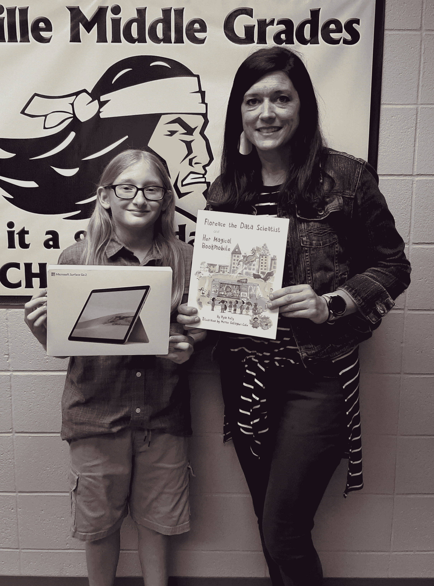

# 祝贺我们佛罗伦萨数据科学家抽奖活动的获胜者

> 原文：<https://www.dominodatalab.com/blog/florence-book-sweepstakes-winner>

By Domino Data Lab on June 01, 2021 in [Company Updates](/blog/company-updates/)

为了庆祝全国数学意识月，我们在 Domino 数据实验室的团队最近出版了世界上第一本关于数据科学的儿童书籍[数据科学家 Florence 和她的神奇移动图书](/childrens-book-florence-the-data-scientist/)。我们还为这本书的读者提供了赢得一台笔记本电脑和 5000 美元大学学费的机会。我们很兴奋地宣布，威廉·布拉顿，阿肯色州波茨维尔中学的五年级学生，赢得了我们的抽奖！

威廉有幸阅读了这本书，并从他学校的图书管理员梅丽莎·穆迪那里了解了抽奖活动。

威廉的母亲克里斯蒂娜·津内尔说:“这不仅让我的儿子开心，也让他对自己和自己的梦想更有信心。”“他学校的每个人都以他为荣！”

津内尔补充说，虽然威廉喜欢这本书，但他尤其喜欢书中的主角如何利用科学来获得她想要的东西。

数据科学家弗洛伦斯和她的神奇的流动图书车围绕着一个名叫比阿特丽斯的好奇的孩子展开。当一辆神秘的流动图书车在她住的街道上行驶时，比阿特丽斯被这辆车后面的人所吸引。司机叫弗洛伦斯，算是一名图书管理员，他确切地知道哪些书会让附近的每个孩子开心。

随着这本书的展开，比阿特丽斯被迫决定是否有“魔法”这种东西，或者这个“图书管理员”是否知道一些世界上其他人不知道的事情。Beatrice 花了一整天的时间记录和分析她的每个朋友对 Florence 问题的回答，发现并爱上了数据科学的预测能力。

“有些人可能认为她作弊了，但她没有，”威廉说。“她运用自己的技能，观察其他孩子的结果，找到一种模式，这样她就能得到她想要的东西。那不是作弊，那是数据科学。"

此外，威廉说他喜欢书中动物的生活方式。他还认为这本书很好地解释了如何在日常生活中使用数据科学。

“威廉想成为一名兽医，”津内尔说。“他不仅想让动物——家养的和野生的——健康安全，他还想在动物和社区之间架起一座桥梁。”

威廉补充说，拥有数据科学技能可以帮助他开发更好的更持久的解决方案，以改善动物福利。

“我知道波特斯维尔中学也会以他为荣，”齐塞尔说。"尤其是他的图书管理员穆迪女士，她努力帮助她的学生取得成功."

“我希望我们能提供给威廉的大学基金能帮助他追随他的激情，”莱恩·凯利说，她是《数据科学家弗洛伦斯和她的神奇的移动图书》的作者。“以同样的方式激励他，我希望这本书也能丰富许多其他孩子的梦想，让他们对解决问题充满热情，这样他们就可以继续让这个世界变得更好。”

数据科学家利用过去的数据建立模型，预测未来可能发生的事情。他们用笔记本、表格和图表彻底记录数据，然后用他们的数学和推理技能寻找模式。

想帮助孩子了解记录和分析数据的模式如何有助于预测未来吗？加入比阿特丽斯的行列，她会通过[下载一本电子书](/childrens-book-florence-the-data-scientist/#bring-home-a-copy-today)或者从[亚马逊](https://www.amazon.com/Florence-Data-Scientist-Magical-Bookmobile/dp/1735971901)订购一份硬拷贝。

[Twitter](/#twitter) [Facebook](/#facebook) [Gmail](/#google_gmail) [Share](https://www.addtoany.com/share#url=https%3A%2F%2Fwww.dominodatalab.com%2Fblog%2Fflorence-book-sweepstakes-winner%2F&title=Congratulations%20to%20the%20Winner%20of%20our%20Florence%20the%20Data%20Scientist%20Sweepstakes)