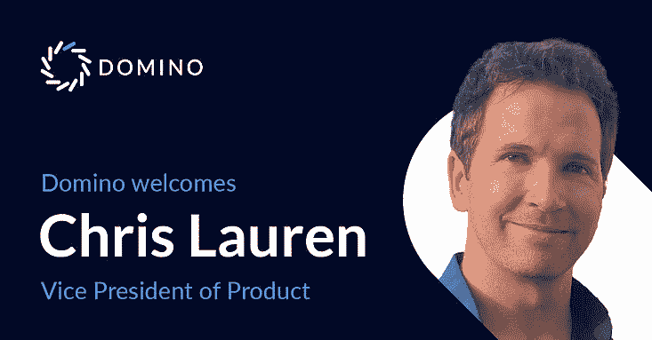
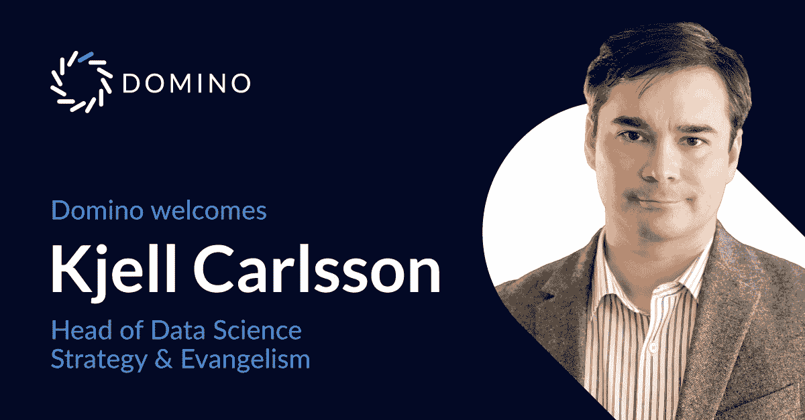

# 前微软 Azure ML 高管和 Forrester 分析师加入 Domino 数据实验室

> 原文：<https://www.dominodatalab.com/blog/former-microsoft-azure-ml-exec-and-forrester-analyst-join-domino-data-lab>

*克里斯·劳伦(Chris Lauren)和杰尔·卡尔松(Kjell Carlsson)博士* *帮助达美乐的客户群战略性地扩展他们对数据科学的使用*

Domino Data Lab 自豪地宣布，来自企业技术领域两个最大品牌的 MLOps 专家已加入其团队。Chris Lauren 已经加入 Domino，担任微软产品副总裁，在那里他领导 Azure 机器学习产品团队；前 Forrester 分析师 Kjell Carlsson 博士加入该公司，担任数据科学战略负责人&布道者。

Lauren 将领导 Domino 的产品团队进一步定义和执行 Domino Enterprise MLOps 平台的愿景和战略，以更好地帮助客户利用机器学习的力量加速数字化转型。

在他的新角色中，Carlsson 将为 Domino 客户和潜在客户提供人工智能转型战略方面的建议；就企业如何大规模释放数据科学的商业价值提供战略建议。他还将在提高人们对 Domino 市场领先能力的认识方面发挥重要作用，并在战略和开发方面与 Lauren 的产品团队密切合作。

Domino Data Lab 的首席执行官兼联合创始人 Nick Elprin 表示:“Chris 和 Kjell 拥有广泛的行业知识，这对我们的团队和客户来说是一笔不可思议的财富。“Chris 是云计算和机器学习方面的专家，拥有数十年为企业客户提供产品的经验。随着数据科学和机器学习的成熟，Kjell 有幸为各行各业的数百家组织提供建议。丰富的经验使他非常适合宣传我们释放数据科学的使命。他们的加入让我激动不已。”

“在帮助许多企业大规模采用机器学习的同时，我看到了 MLOps 在加快模型速度以增加业务影响方面的关键作用，”劳伦说。Domino 是唯一一个以开放和灵活的方式满足最苛刻的企业工作负载需求的 MLOps 平台。我希望将 Domino 打造成适用于所有云和内部环境的市场领先企业 MLOps 平台，并在支持医疗保健、保险和金融服务等关键监管行业的客户方面取得成功。"

Carlsson 说:“Domino 是唯一一家真正支持现代专业数据科学家的公司，也是让企业能够扩展并推动其数据科学团队在整个组织中的影响力的最佳选择。与这样伟大的企业合作是一种荣幸，这些企业正在彻底转变自己，并使用 Domino 的 enterprise MLOps 平台实施最新的机器学习创新。”

**拥有数十年大规模交付产品经验的真正的云 MLOps 专家**

Lauren 在微软工作了 20 多年，利用大数据和机器学习的力量，领导团队交付产品并大规模赢得企业客户。他是云计算领域的专家，有能力与工程、设计、研究、营销、销售、客户和合作伙伴密切合作，推动产品定义和上市战略。

最近，他一直在 Azure Machine Learning 领导一个产品管理团队，以加速企业客户的增长，MAU 和 NPS 主要专注于使 ML 专业人员和工程师能够在云和大规模边缘培训、打包、部署和管理机器学习模型，并集成监控、警报和再培训，以促进完整的 MLOps 生命周期。

**推动 Domino 客户迈向模型驱动业务的数据科学社区倡导者**

卡尔森撰写了数十份报告，主题涵盖对话智能、MLOps、计算机视觉和 autoML，以及增强智能、下一代人工智能技术和数据科学最佳实践。他在无数的主题演讲、小组讨论和网络研讨会上发表过演讲，并被媒体频繁引用。

在加入 Domino 之前，Carlsson 是专注于 NLU 的初创公司 Stratifyd 的产品和战略副总裁，他在那里领导产品团队并重新设计公司战略。此前，Kjell 是 Forrester Research 的首席分析师，他领导了人工智能、人工智能、数据科学和高级分析方面的研究，就推动业务成果所需的技术、战略、能力和最佳实践向企业和供应商提供建议。卡尔松在哈佛商学院获得商业经济学博士学位。