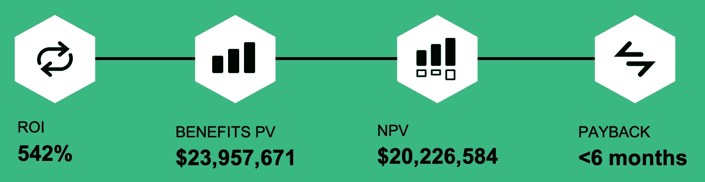

# Forrester TEI 研究:Domino 在 6 个月内实现了 542%的投资回报率和投资回报

> 原文：<https://www.dominodatalab.com/blog/forrester-tei-study-domino-delivers-542-roi-and-payback-within-6-months>

Forrester 最近调查了数千名业务和技术决策者，以深入了解他们对数据和分析的使用，以及影响他们购买决策的因素。当被问及他们的组织在使用人工智能(AI)技术时期望获得什么好处时:

*   30%的受访者预计会“增加收入增长”
*   30%的受访者期望“提高运营效率和有效性”
*   30%的人希望“提高内部流程的自动化程度”
*   27%的人希望“提高员工的工作效率”

不幸的是，15%的受访者还表示，“对人工智能的明确投资回报没有统一的信念”是阻碍他们公司采用人工智能技术的最大挑战之一。21%的人最关心“他们人工智能投资的机会成本”。显然，组织对人工智能有很高的期望(他们应该如此)，但难以量化人工智能投资对其业务的深远好处。难怪有 17%的人认为“缺乏高管支持来推动人工智能的使用”是他们组织面临的最大挑战之一。

Forrester 就组织如何实现采用人工智能和数据科学的好处提供了许多建议。例如，根据 Forrester Wave[:基于笔记本的预测分析和机器学习，2020 年第三季度](https://www.dominodatalab.com/resources/forrester-wave-notebook-based-predictive-analytics-machine-learning-q3-2020/?utm_campaign=Forrester%20Wave%20Q3%202020&utm_source=PR&utm_medium=corp_blog)，“基于笔记本的 PAML 产品通过使个人数据科学家显著提高生产力，特别是通过为团队提供协作能力，将基于笔记本的数据科学推向了一个新的水平。”

我们很早就知道 Domino 使数据科学团队更有生产力。我们记录了他们的许多不可思议的故事，在某些情况下，已经能够衡量令人印象深刻的好处。例如，洛克希德·马丁公司将[每年节省的 2000 万美元的成本](https://www.dominodatalab.com/customers/lockheed-martin/)归功于他们使用我们的平台，这要归功于降低的 IT 成本、提高的入职效率以及 10 倍的数据科学家工作效率。

但有些人看到这样不可思议的数字，自然会产生怀疑。其他人不确定在数据科学和 MLOps 解决方案上投资什么，因为目前市场上存在着混乱的[状态](https://www.dominodatalab.com/blog/thinking-outside-the-box-and-quadrant-where-domino-is-focused-within-the-noisy-and-crowded-data-science-landscape/),许多供应商推出了针对不同类型用户的截然不同的方法，并有着不同的规模目标。我们认为，购买者必须权衡企业 MLOps 的潜在影响和他们在人员、流程和技术方面的投资，然后衡量投资回报，这一点至关重要。

## 量化 Domino 的商业价值

为了消除一些疑虑和困惑，我们委托了一项独立的 Forrester Consulting 研究:[Domino Enterprise MLOps 平台的总体经济影响(TEI)](https://www.dominodatalab.com/domino-business-impact-forrester-tei-report)。Forrester 对几个 Domino 客户进行了详细的采访，以了解他们如何使用我们的平台，并深入了解他们获得的好处。基于这些采访，他们建立了一个由 50 名数据科学家组成的复合组织，预计团队增长与我们的许多客户在使用 Domino 的前三年中的经历一致。

结果不言自明:Forrester 预测，使用 Domino 的组织在三年时间内实现了近 3000 万美元的总经济效益，投资回报率为 542%，T2 为 542%。他们还得出结论，在 T4 投资多米诺不到六个月就收回了成本。

> “如果我们没有投资 Domino，首先，我根本不可能建立一个团队，因为如果不为他们提供最先进的工作环境，你就无法雇用高技能的数据科学家。”–保险首席分析官

综合组织在三年内实现的平台预期收益包括:

## 减少了 980 万美元的计算资源配置时间

根据客户访谈，Domino 通过提供对基础架构和托管环境的自动化访问，允许数据科学家几乎立即开始研究新模型，平均每个实例节省 70 个小时。受访者报告说，以前调配基础架构、创建环境以及安装/维护单个软件包的过程通常需要几天到几周的时间，具体取决于构建的复杂程度。综合组织的净时间节省估计为三年 980 万美元。

对强大计算资源的自助式访问也减少了对工程部门的支持呼叫；管理人员估计，工程师在响应数据科学家的请求上节省了大约 30%的时间。

> “在 Domino 出现之前，可能需要两到三周的时间来了解和启动基础架构，然后开始工作。有了 Domino，这需要几周时间，只需点击一下按钮。”–制药行业数据平台和隐私总监

## 运营效率提高了 850 万美元

数据科学经理报告说，使用 Domino，他们的数据科学团队可以利用更多的工具，花更少的时间等待模型和实验运行，并利用高级协作和可视化功能以新的方式与他人分享他们的工作。

管理人员估计每个数据科学家每年可以节省 200 个小时，对于复合组织来说，三年可以节省 510 万美元。

组织还实现了与新团队成员更快入职、更高效的模型验证、部署和维护相关的好处。对于综合组织而言，这些节省总计增加了 340 万美元。

> “我们当然正在实施更精确的模型，甚至是我们以前在更复杂的工作流程中无法实现的模型。这可能比我们可能达到的水平提高了约 20%。”–金融服务首席顾问

## 520 万美元的增量利润

Domino 客户报告说，能够在开发周期中更有效地协作已经产生了更好地符合业务需求的数据科学解决方案，并且可以直接影响收入。他们能够生产更强大的模型，并受益于更高的模型部署成功率，从而对底线产生重大影响。对于本研究中使用的复合组织，增量利润估计接近 520 万美元。

> “我们使用 Domino 对收入产生了巨大的影响，收入高达数百万美元，实际上是数千万美元。”–金融服务首席顾问

## 了解弗雷斯特·TEI 研究的详细信息

这些数字和报价只是您将在[Domino Enterprise MLOps Platform](https://www.dominodatalab.com/domino-business-impact-forrester-tei-report)的总体经济影响(TEI)中找到的细节的开始。查看这项研究，了解受访者在实施 Domino 之前面临的挑战，并深入了解 Domino 为他们带来的好处。

 

**2021 年 6 月 7 日更新:**我刚刚主持了一场网络研讨会，Forrester 首席分析师 Kjell Carlsson 博士和《TEI》的作者 Mary Barton 出席了会议。Kjell 描述了组织在扩展数据科学时面临的一些关键挑战，我们就 TEI 结果本身以及他们的访谈和 Domino 案例研究中的实际例子进行了热烈的讨论。你现在可以[观看网上研讨会](https://www.dominodatalab.com/resources/forrester-tei-webinar-driving-542-roi-with-the-domino-enterprise-ml-ops-platform/)的重播。

* * *

基数:美国、加拿大、英国、法国和德国的 2，456 名数据和分析决策者；来源:Forrester Analytics 商业技术图表数据和分析调查，2020 年。

[Twitter](/#twitter) [Facebook](/#facebook) [Gmail](/#google_gmail) [Share](https://www.addtoany.com/share#url=https%3A%2F%2Fwww.dominodatalab.com%2Fblog%2Fforrester-tei-study-domino-delivers-542-roi-and-payback-within-6-months%2F&title=Forrester%20TEI%20Study%3A%20Domino%20Delivers%20542%25%20ROI%20and%20Payback%20within%206%20Months)