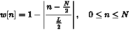

# 信号处理基础

> 原文：<https://www.dominodatalab.com/blog/fundamentals-of-signal-processing>

## 数字信号处理基础

信号被定义为任何随时间、空间或任何其他独立变量而变化的物理量。此外，科学和工程中遇到的大多数信号本质上都是模拟信号。也就是说，信号是连续变量的函数，例如时间或空间，并且通常取连续范围内的值。为了以数字方式执行处理，需要模拟信号和数字处理器之间的接口。这个接口被称为模数转换器。

通过以称为采样周期的特定间隔对信号进行采样，将模拟信号转换为数字信号。采样周期的倒数称为采样率(赫兹；秒^(-1) )，并且必须至少两倍于模拟信号中的最大频率，以防止混叠([参考奈奎斯特-香农采样定理](https://en.wikipedia.org/wiki/Nyquist%E2%80%93Shannon_sampling_theorem))。实际上，采样率要高得多。常见的采样频率有 8kHz、16kHz、32kHz。

### 特征抽出

音频信号，特别是语音信号，通常在时域、频域和倒谱域进行分析。信号的频域表示由 DFT(离散傅立叶变换)完成。假设信号 X[N]具有范围在 0nN-1 之间的 N 个样本，信号 X[k]的 DFT 由 bey 给出

这里 k 是离散化的频率变量，跨度从 0kN-1。

快速傅立叶变换(FFT)是一种高效的 DFT 计算方法(请参考 cp-algorithms 的[文档)。考虑到语音信号的随机特性，FFT 很少一次应用于整个信号，而是以帧为单位。通常，一种称为短时傅立叶变换(STFT)的傅立叶变换被应用于每个单独的帧。](https://cp-algorithms.com/algebra/fft.html)

下面示出了对信号 x[n]的样本的 FFT 算法

*来源:* [维基百科](https://en.wikipedia.org/wiki/Fast_Fourier_transform)

假设表示语音信号的信号 x[n]和窗口函数 w[n]

人类的语言几乎总是在框架中被分析。语音信号碰巧是非平稳信号，但是在跨度为 20-40 毫秒长的帧中，假设信号是平稳的。原因是在这段时间内，声道特性不会发生太大的变化。这一点很重要，因为只有当信号稳定时，才能假设先验分布。在说话人确认的情况下，分布是高斯分布。

每帧之间有 10ms 的重叠。出现这种重叠是因为三角形窗口被应用于每一帧

(请参考[这篇关于信号语音处理的文章](https://www.programmersought.com/article/65024126639/))。

窗口可以被认为是索引上的非零值的数组，其中帧的样本在别处是 1 和 0。当该帧的每个帧样本乘以 1 时，它是一个矩形窗口。对于三角形窗口，靠近帧末端的样本被“去加重”(即乘以 0 和 1 之间的数字)，而位于中心的样本由于窗口的三角形形状而被加重。执行帧的重叠，以便补偿在每帧结束时样本的去加重。(请参考[栈交换提出的问题](https://dsp.stackexchange.com/questions/36509/why-is-each-window-frame-overlapping))

此外，几乎从不使用矩形窗口。在矩形窗口的情况下，信号的样本乘以 1。因为时域中两个信号的相乘等于频域中信号的卷积。矩形窗口的傅立叶变换是正弦函数。该函数在 x=0 处有一个主瓣，在π的整数倍处有旁瓣，随着 x x 的绝对值不断增加，旁瓣值不断减小。

*(资料来源:* [【维基百科】](https://en.wikipedia.org/wiki/Sinc_function) *)*

当这个函数乘以语音信号的傅立叶变换时，在旁瓣处发生频谱泄漏，这是不理想的。当非整数数量的信号周期被发送到 DFT 时，发生频谱泄漏。频谱泄漏使单音信号在 DFT 操作后分散在几个频率上。

*(来源:* [DSP 图文并茂](https://dspillustrations.com/pages/posts/misc/spectral-leakage-zero-padding-and-frequency-resolution.html) *)*

在上图中，我们假设一个目标信号，即左边的三角周期信号乘以红色矩形窗口。这些信号的卷积如上图右侧所示。两个信号卷积由下式给出

简而言之，两个信号的卷积是指其中一个信号反转，另一个信号乘以样本。为了理解信号

正如你所看到的，在上面的蓝色图中，“窗口”信号(卷积的结果)在旁瓣上有频谱泄漏。红色信号是矩形窗口的变换。

为了减少频谱泄漏，使用三角形窗口，如汉宁窗口、汉明窗口和三角形窗口。

*(资料来源:* [【维基百科】](https://en.wikipedia.org/wiki/Window_function) *)*

汉宁窗函数由下式给出

三角形窗口由下式给出

语音信号的成帧可以如下图所示:

*(来源:* [阿尔托大学](https://wiki.aalto.fi/display/ITSP/Windowing) *)*

## 梅尔频率倒谱系数

MFCCs 顾名思义就是倒谱域的系数和特征。(ceps 反过来是“spec”)这些特性在语音处理和 MIR(音乐信息检索)应用中无处不在。与 DFT 不同，频率是对数标度或 mel 标度。梅尔标度类似于人的听觉标度。低频的毛细胞数量远远高于高频。因此，随着年龄的增长，我们辨别更高频率的能力逐渐减弱。分辨率向更高频率的降低是通过 Mel 标度实现的。

简而言之，在时域信号的帧上，应用 STFT，并且对该信号应用 mel 标度中的重叠三角窗，即，应用一种对数标度。然后应用离散余弦变换，前 13 个系数称为 MFCCS。从每一帧中提取δ系数和双δ系数，一起构成 39 维数组。因此，如果一个音频信号有 100 帧，MFCC 阵列的维数将为(100，39)

mel 标度和线性标度之间的关系由下式给出

其中 f 表示以 Hz 为单位的物理频率，fMel 表示感知频率

Mel 滤波器组看起来像这样

要提取 MFCCs，需要完成以下步骤

1.  预加重-这是一个高通滤波器，用于平衡在高频区域有陡峭滚降的浊音频谱。本项目使用的系数为 0.97。该值通常在 0.9 和 1 之间变化
2.  框架和窗口——如上所述
3.  频谱的 DFT 执行信号帧的帧

Mel 谱-幅度谱 X(k)的 Mel 谱通过将幅度谱乘以每个三角形 Mel 加权滤波器来计算。

其中 M 是三角形 Mel 加权滤波器的总数。

Hm(k)是给予对第 m 个输出频带有贡献的第 k 个^个能谱箱的权重，表示为:

其中 M 的范围从 0 到(M-1)。

4.  Mel 频谱的离散余弦变换(DCT)用于将 Mel 频率系数的对数变换成一组倒谱系数。

5.  动态 MFCC 特征:倒谱系数是静态特征。从这些导出的δ系数是一阶导数，δ-δ系数是二阶导数。这些分别代表语速和语音加速度。

