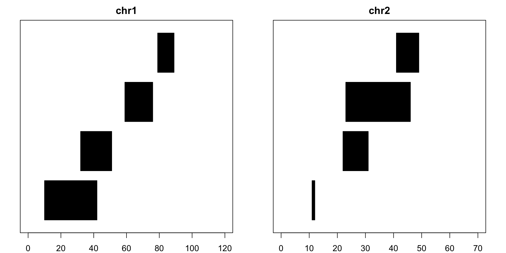

# 基因组范围:基因组数据使用简介

> 原文：<https://www.dominodatalab.com/blog/genomic-ranges-an-introduction-to-working-with-genomic-data>

基因组测序的进步甚至超过了人们对他们的高度期望。我们现在有能力以不到 1000 美元的价格对一个人的整个基因组进行测序——这要归功于 Illumina 的 HiSeq X Ten 测序仪。在这篇文章中，我将介绍 GenomicRanges 软件包，它为表示基因组数据提供了一个方便的结构，并提供了许多操作这些数据的内置函数。

## 用坐标系统表示基因组

人类基因组由大约 30 亿个碱基对组成，线性排列在 23 对染色体上。因此，表示我们基因组的直观方式是使用坐标系:“染色体 id”和“沿染色体的位置”。像 chr1:129-131 这样的注释代表 1 号染色体上的第 129 到 131 个碱基对。

让我们加载 GenomicRanges 并创建一个示例对象来表示一些基因组片段:

```py
# Installation source("https://bioconductor.org/biocLite.R") biocLite("GenomicRanges")  The code below is how to create the an example GRanges  object.  The code entered here will create 8 segments on either chr1 or chr2, each with  defined start and  end points.  Each read will also have strand information, indicating which direction the sequence is  in. seglengths informs us the maximum length of chr1 and chr2. suppressMessages(library(GenomicRanges)) example =  GRanges(seqnames=c(rep("chr1",  4), rep("chr2",  4)), ranges =  IRanges(start = c(10,  32,  59,  79,  11,  22,  23,  41),  end=c(42,  51,  76,  89,  12,  31,  46,  49)), strand = rep(c("+",  "-"),  4), seqlengths=c(chr1=120, chr2=70)  ) 
```

现在让我们来看看 R 控制台表示的例子:

```py
example
```

```py
## GRanges object with 8 ranges and 0 metadata columns:
##       seqnames    ranges strand
##          <Rle> <IRanges>  <Rle>
##   [1]     chr1  [10, 42]      +
##   [2]     chr1  [32, 51]      -
##   [3]     chr1  [59, 76]      +
##   [4]     chr1  [79, 89]      -
##   [5]     chr2  [11, 12]      +
##   [6]     chr2  [22, 31]      -
##   [7]     chr2  [23, 46]      +
##   [8]     chr2  [41, 49]      -
##   -------
##   seqinfo: 2 sequences from an unspecified genome
```

现在让我们想象一下这些作品的样子:



### 格兰奇斯物品估价员

一个 GRanges 对象可以作为一个数组和一个子集来处理，也可以这样修改:

```py
example[1]  
```

```py
## GRanges object with 1 range and 0 metadata columns:
##       seqnames    ranges strand
##          <Rle> <IRanges>  <Rle>
##   [1]     chr1  [10, 42]      +
##   -------
##   seqinfo: 2 sequences from an unspecified genome
```

该软件包还提供了访问和修改信息的功能:

```py
seqnames(example)  
```

```py
## factor-Rle of length 8 with 2 runs
##   Lengths:    4    4
##   Values : chr1 chr2
## Levels(2): chr1 chr2
```

```py
width(example)  
```

```py
## [1] 33 20 18 11  2 10 24  9
```

```py
end(example)  
```

```py
## [1] 42 51 76 89 12 31 46 49
```

```py
start(example[1])  
```

```py
## [1] 10
```

```py
start(example[1])  =  11 example 
```

```py
## GRanges object with 8 ranges and 0 metadata columns:
##       seqnames    ranges strand
##          <Rle> <IRanges>  <Rle>
##   [1]     chr1  [11, 42]      +
##   [2]     chr1  [32, 51]      -
##   [3]     chr1  [59, 76]      +
##   [4]     chr1  [79, 89]      -
##   [5]     chr2  [11, 12]      +
##   [6]     chr2  [22, 31]      -
##   [7]     chr2  [23, 46]      +
##   [8]     chr2  [41, 49]      -
##   -------
##   seqinfo: 2 sequences from an unspecified genome
```

还可以将每个部分的附加信息存储到 GRanges 对象中:

```py
example$exon_id =  1:8 example 
```

```py
## GRanges object with 8 ranges and 1 metadata column:
##       seqnames    ranges strand |   exon_id
##          <Rle> <IRanges>  <Rle> | <integer>
##   [1]     chr1  [11, 42]      + |         1
##   [2]     chr1  [32, 51]      - |         2
##   [3]     chr1  [59, 76]      + |         3
##   [4]     chr1  [79, 89]      - |         4
##   [5]     chr2  [11, 12]      + |         5
##   [6]     chr2  [22, 31]      - |         6
##   [7]     chr2  [23, 46]      + |         7
##   [8]     chr2  [41, 49]      - |         8
##   -------
##   seqinfo: 2 sequences from an unspecified genome
```

### 单个范围的操作

GenomicRanges 还提供了许多有用的方法来对范围进行“算术运算”:

#### 移位:

要将所有 10 个碱基对的片段移向染色体末端，可以这样做:

```py
shift(example,  10)  
```

```py
## GRanges object with 8 ranges and 1 metadata column:
##       seqnames    ranges strand |   exon_id
##          <Rle> <IRanges>  <Rle> | <integer>
##   [1]     chr1  [21, 52]      + |         1
##   [2]     chr1  [42, 61]      - |         2
##   [3]     chr1  [69, 86]      + |         3
##   [4]     chr1  [89, 99]      - |         4
##   [5]     chr2  [21, 22]      + |         5
##   [6]     chr2  [32, 41]      - |         6
##   [7]     chr2  [33, 56]      + |         7
##   [8]     chr2  [51, 59]      - |         8
##   -------
##   seqinfo: 2 sequences from an unspecified genome
```

要将所有片段向染色体的起始端移动 5 个碱基对，可以使用:

```py
shift(example,  -5)  
```

```py
## GRanges object with 8 ranges and 1 metadata column:
##       seqnames    ranges strand |   exon_id
##          <Rle> <IRanges>  <Rle> | <integer>
##   [1]     chr1  [ 6, 37]      + |         1
##   [2]     chr1  [27, 46]      - |         2
##   [3]     chr1  [54, 71]      + |         3
##   [4]     chr1  [74, 84]      - |         4
##   [5]     chr2  [ 6,  7]      + |         5
##   [6]     chr2  [17, 26]      - |         6
##   [7]     chr2  [18, 41]      + |         7
##   [8]     chr2  [36, 44]      - |         8
##   -------
##   seqinfo: 2 sequences from an unspecified genome
```

要单独移动每一块，可以使用一个矢量:

```py
shift(example,  1:8)  
```

```py
## GRanges object with 8 ranges and 1 metadata column:
##       seqnames    ranges strand |   exon_id
##          <Rle> <IRanges>  <Rle> | <integer>
##   [1]     chr1  [12, 43]      + |         1
##   [2]     chr1  [34, 53]      - |         2
##   [3]     chr1  [62, 79]      + |         3
##   [4]     chr1  [83, 93]      - |         4
##   [5]     chr2  [16, 17]      + |         5
##   [6]     chr2  [28, 37]      - |         6
##   [7]     chr2  [30, 53]      + |         7
##   [8]     chr2  [49, 57]      - |         8
##   -------
##   seqinfo: 2 sequences from an unspecified genome
```

#### 侧面

侧翼用于恢复输入集旁边的区域。对于示例上游的 3 个碱基延伸:

```py
flank(example,  3)  
```

```py
## GRanges object with 8 ranges and 1 metadata column:
##       seqnames    ranges strand |   exon_id
##          <Rle> <IRanges>  <Rle> | <integer>
##   [1]     chr1  [ 8, 10]      + |         1
##   [2]     chr1  [52, 54]      - |         2
##   [3]     chr1  [56, 58]      + |         3
##   [4]     chr1  [90, 92]      - |         4
##   [5]     chr2  [ 8, 10]      + |         5
##   [6]     chr2  [32, 34]      - |         6
##   [7]     chr2  [20, 22]      + |         7
##   [8]     chr2  [50, 52]      - |         8
##   -------
##   seqinfo: 2 sequences from an unspecified genome
```

输入负值表示向下游看，值可以是向量。注意，上游和下游是相对于每个片段的链信息而言的。

#### 调整大小

resize 方法从相对于股方向的最上游位置开始，将片段调整到所需的输入长度:

```py
resize(example,  10)  
```

```py
## GRanges object with 8 ranges and 1 metadata column:
##       seqnames    ranges strand |   exon_id
##          <Rle> <IRanges>  <Rle> | <integer>
##   [1]     chr1  [11, 20]      + |         1
##   [2]     chr1  [42, 51]      - |         2
##   [3]     chr1  [59, 68]      + |         3
##   [4]     chr1  [80, 89]      - |         4
##   [5]     chr2  [11, 20]      + |         5
##   [6]     chr2  [22, 31]      - |         6
##   [7]     chr2  [23, 32]      + |         7
##   [8]     chr2  [40, 49]      - |         8
##   -------
##   seqinfo: 2 sequences from an unspecified genome
```

还有许多其他方法非常有用。看到了吗？格兰奇

#### 对一组范围的操作

GenomicRanges 还包括聚合特定 GRanges 实例中所有片段的信息的方法。以下 3 种方法最有用:

#### 分离

Disjoin 将范围缩减为组成原始集合的唯一的、不重叠的片段的最小集合。默认情况下，它是链特异性的，这意味着第一个和第二个片段不被认为是重叠的，除非另有说明:

```py
disjoin(example)  
```

```py
## GRanges object with 8 ranges and 0 metadata columns:
##       seqnames    ranges strand
##          <Rle> <IRanges>  <Rle>
##   [1]     chr1  [11, 42]      +
##   [2]     chr1  [59, 76]      +
##   [3]     chr1  [32, 51]      -
##   [4]     chr1  [79, 89]      -
##   [5]     chr2  [11, 12]      +
##   [6]     chr2  [23, 46]      +
##   [7]     chr2  [22, 31]      -
##   [8]     chr2  [41, 49]      -
##   -------
##   seqinfo: 2 sequences from an unspecified genome
```

```py
disjoin(example, ignore.strand=T)  
```

```py
## GRanges object with 11 ranges and 0 metadata columns:
##        seqnames    ranges strand
##           <Rle> <IRanges>  <Rle>
##    [1]     chr1  [11, 31]      *
##    [2]     chr1  [32, 42]      *
##    [3]     chr1  [43, 51]      *
##    [4]     chr1  [59, 76]      *
##    [5]     chr1  [79, 89]      *
##    [6]     chr2  [11, 12]      *
##    [7]     chr2  [22, 22]      *
##    [8]     chr2  [23, 31]      *
##    [9]     chr2  [32, 40]      *
##   [10]     chr2  [41, 46]      *
##   [11]     chr2  [47, 49]      *
##   -------
##   seqinfo: 2 sequences from an unspecified genome
```


#### 减少

类似地，reduce 创建唯一的、不重叠的片段的最小合并集合，这些片段覆盖了原始集合所覆盖的所有碱基。默认情况下也会考虑线束信息，并且可以将其关闭:

```py
reduce(example)  
```

```py
## GRanges object with 8 ranges and 0 metadata columns:
##       seqnames    ranges strand
##          <Rle> <IRanges>  <Rle>
##   [1]     chr1  [11, 42]      +
##   [2]     chr1  [59, 76]      +
##   [3]     chr1  [32, 51]      -
##   [4]     chr1  [79, 89]      -
##   [5]     chr2  [11, 12]      +
##   [6]     chr2  [23, 46]      +
##   [7]     chr2  [22, 31]      -
##   [8]     chr2  [41, 49]      -
##   -------
##   seqinfo: 2 sequences from an unspecified genome
```

```py
reduce(example, ignore.strand=T)  
```

```py
## GRanges object with 5 ranges and 0 metadata columns:
##       seqnames    ranges strand
##          <Rle> <IRanges>  <Rle>
##   [1]     chr1  [11, 51]      *
##   [2]     chr1  [59, 76]      *
##   [3]     chr1  [79, 89]      *
##   [4]     chr2  [11, 12]      *
##   [5]     chr2  [22, 49]      *
##   -------
##   seqinfo: 2 sequences from an unspecified genome
```


#### 新闻报道

如果一个人需要知道每个碱基被一个阅读/片段覆盖了多少次，覆盖函数是非常有用的:

```py
coverage(example)  
```

```py
## RleList of length 2
## $chr1
## integer-Rle of length 120 with 9 runs
##   Lengths: 10 21 11  9  7 18  2 11 31
##   Values :  0  1  2  1  0  1  0  1  0
## 
## $chr2
## integer-Rle of length 70 with 9 runs
##   Lengths: 10  2  9  1  9  9  6  3 21
##   Values :  0  1  0  1  2  1  2  1  0
```

```py
coverage(example)$chr1 
```

```py
## integer-Rle of length 120 with 9 runs
##   Lengths: 10 21 11  9  7 18  2 11 31
##   Values :  0  1  2  1  0  1  0  1  0
```

### 范围集合之间的运算

#### 发现重叠

GenomicRanges 还提供了一种有用的方法来查找两组范围之间的重叠。让我们假设我们感兴趣的任何部分与我们感兴趣的目标部分重叠:

```py
target =  GRanges(seqnames="chr1", range=IRanges(start=5,  40)) ol = findOverlaps(target, example) ol 
```

```py
## Hits object with 2 hits and 0 metadata columns:
##       queryHits subjectHits
##       <integer>   <integer>
##   [1]         1           1
##   [2]         1           2
##   -------
##   queryLength: 1
##   subjectLength: 8
```

为了查看示例中与目标重叠的部分，我们访问了存储在 ol:

```py
example[subjectHits(ol)]  
```

```py
## GRanges object with 2 ranges and 1 metadata column:
##       seqnames    ranges strand |   exon_id
##          <Rle> <IRanges>  <Rle> | <integer>
##   [1]     chr1  [11, 42]      + |         1
##   [2]     chr1  [32, 51]      - |         2
##   -------
##   seqinfo: 2 sequences from an unspecified genome
```

为了查看示例中与目标重叠的部分，我们访问了存储在 ol:

```py
example[subjectHits(ol)]  
```

```py
## GRanges object with 2 ranges and 1 metadata column:
##       seqnames    ranges strand |   exon_id
##          <Rle> <IRanges>  <Rle> | <integer>
##   [1]     chr1  [11, 42]      + |         1
##   [2]     chr1  [32, 51]      - |         2
##   -------
##   seqinfo: 2 sequences from an unspecified genome
```

### 应用示例-检测基因组缺失

现在，让我们把这篇文章中看到的所有内容汇总起来，看看我们能否在一些更真实的生成数据中检测到删除的存在。

利用现代测序技术，整个基因组并不是一片一片的测序。DNA 通常在随机过程中准备好并切成更小的片段，以便对整个序列进行测序。然后，这些小片段被送入一台机器，从这些片段的随机位置开始产生读数。在最流行的 Illumina 机器的情况下，产生的读数是 100 个碱基对长。这些读数被映射回参考基因组，以找到它们的来源，位置信息可以通过 GenomicRanges 加载到 R 中进行评估。

如果基因组中有一个缺失，人们可能会发现没有来自某个特定区域的读数。让我们看一下 GRanges 对象，它包含来自个人的 2000 次模拟读取的位置信息。这类似于在对参考文献中长度为 1000 个碱基对的虚构染色体 Z 进行测序后可能存储在 GRanges 对象中的内容:

```py
set.seed(1337)  # Ensure reproducibility starts = floor(runif(2000)*900)+1 reads =  GRanges(seqname="chrZ", ranges=IRanges(start=starts,  end=starts+99)) reads 
```

```py
## GRanges object with 2000 ranges and 0 metadata columns:
##          seqnames     ranges strand
##             <Rle>  <IRanges>  <Rle>
##      [1]     chrZ [519, 618]      *
##      [2]     chrZ [509, 608]      *
##      [3]     chrZ [ 67, 166]      *
##      [4]     chrZ [409, 508]      *
##      [5]     chrZ [336, 435]      *
##      ...      ...        ...    ...
##   [1996]     chrZ [181, 280]      *
##   [1997]     chrZ [224, 323]      *
##   [1998]     chrZ [499, 598]      *
##   [1999]     chrZ [ 63, 162]      *
##   [2000]     chrZ [ 15, 114]      *
##   -------
##   seqinfo: 1 sequence from an unspecified genome; no seqlengths
```

我们可以使用 reduce 来查看读取覆盖了 chrZ 的哪些部分:

```py
reduce(reads)  
```

```py
## GRanges object with 1 range and 0 metadata columns:
##       seqnames    ranges strand
##          <Rle> <IRanges>  <Rle>
##   [1]     chrZ  [1, 999]      *
##   -------
##   seqinfo: 1 sequence from an unspecified genome; no seqlengths
```

让我们也看看这组读数中每个碱基的覆盖范围

```py
plot(coverage(reads)$chrZ, ty="l", main="Coverage of Reads of ChrZ", xlab="Coordinates along ChrZ", ylab="Coverage")  
```


请注意 chrZ 沿线相对稳定的覆盖范围。这似乎表明沿 chrZ 没有删除。现在让我们看看另一个数据集 reads_2，它来自一个单独的个体:

```py
starts = c(floor(runif(1000)*300), floor(runif(1000)*400)+500)+1 reads_2 =  GRanges(seqname="chrZ", ranges=IRanges(start=starts,  end  = starts+99)) reduce(reads_2)  
```

```py
## GRanges object with 2 ranges and 0 metadata columns:
##       seqnames     ranges strand
##          <Rle>  <IRanges>  <Rle>
##   [1]     chrZ [  1, 399]      *
##   [2]     chrZ [501, 999]      *
##   -------
##   seqinfo: 1 sequence from an unspecified genome; no seqlengths
```

```py
plot(coverage(reads_2)$chrZ, ty="l", main="Coverage of Reads_2 of ChrZ", xlab="Coordinates along ChrZ", ylab="Coverage")  
```


请注意图中低覆盖到无覆盖的区域以及序列中来自 reduce 的间隙-这似乎表明在第二个受试者中碱基 400 和 500 之间删除了一段 chrZ。现在我们希望发现这种缺失是否与参考基因组中的任何注释区域重叠。这可以使用 findOverlaps 和包含注释信息的 GRanges 对象来实现。已经创建了许多这样的注释，可以加载到 r 中。对于我们的示例，我们可以使用下面的 annotation GRanges 对象注释:

```py
annotation 
```

```py
## GRanges object with 4 ranges and 1 metadata column:
##       seqnames     ranges strand |     Gene_id
##          <Rle>  <IRanges>  <Rle> | <character>
##   [1]     chrZ [100, 150]      * |      Gene_1
##   [2]     chrZ [200, 250]      * |      Gene_2
##   [3]     chrZ [400, 550]      * |      Gene_3
##   [4]     chrZ [700, 750]      * |      Gene_4
##   -------
##   seqinfo: 1 sequence from an unspecified genome; no seqlengths
```

```py
ol = findOverlaps(GRanges(seqnames="chrZ", ranges=IRanges(start=500,  end=600)), annotation) annotation[subjectHits(ol)]  
```

```py
## GRanges object with 1 range and 1 metadata column:
##       seqnames     ranges strand |     Gene_id
##          <Rle>  <IRanges>  <Rle> | <character>
##   [1]     chrZ [400, 550]      * |      Gene_3
##   -------
##   seqinfo: 1 sequence from an unspecified genome; no seqlengths
```

因此，在第二个受试者中，Gene_3 似乎被删除了——这一信息可以传递给下游的实验室科学家进行验证和一般编目。

祝贺您学习了使用 GenomicRanges 在 R 中处理基因组读取数据的基础知识。在以后的文章中，我将更详细地回顾一些已经报道的需要调整的测序技术工件。例如，基因组产生的读数在整个基因组中并不一致。此外，我们将研究一些更先进的方法来检测基因读取数据中的突变。