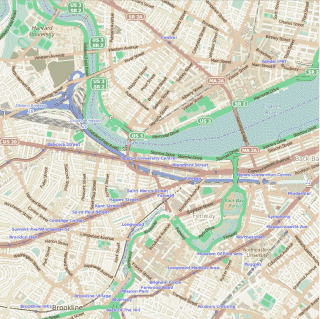
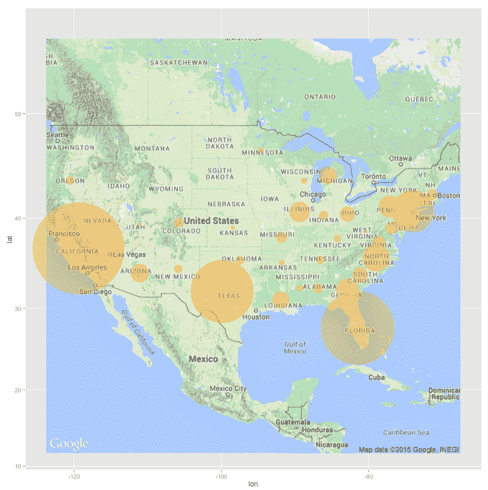
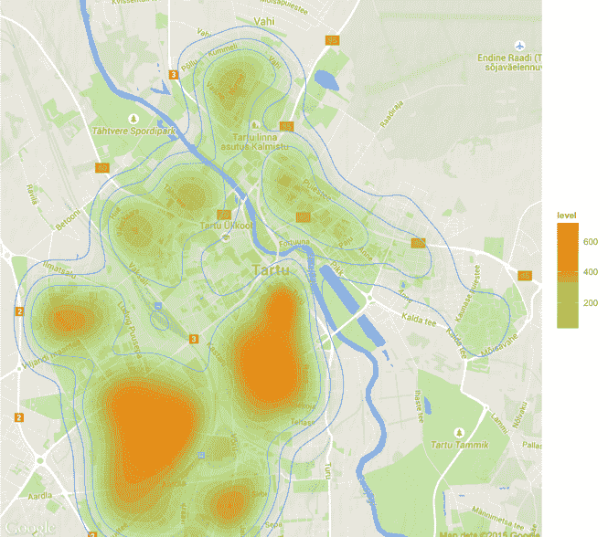

# 用 R 的 ggmap 实现地理可视化

> 原文：<https://www.dominodatalab.com/blog/geographic-visualization-with-rs-ggmaps>

你曾经处理过一些涉及空间位置的数据吗？如果答案是否定的，那么男孩，你错过了！要分析的空间数据如此之多，而时间却如此之少。

因为您的时间很宝贵，所以您知道尝试用 Matlab 等语言或 Excel 等应用程序创建空间图可能是一个冗长乏味的过程。令人欣慰的是，有许多新的 R 库正在被创建，以使空间数据可视化成为一项更令人愉快的工作。在这些新选项中，一个有用的包是 [ggmap](http://cran.r-project.org/web/packages/ggmap/index.html) :

## ggmap 入门

```py
install.packages("ggmap")
library(ggmap)
```

就是这样。

最快的方法是使用`qmap`类，它代表“快速地图绘制”。使用不同类型的参数调用来渲染不同的绘图类型。

以下是一些例子:

```py
qmap(location = "boston university")
qmap(location = "boston university", zoom = 14)
qmap(location = "boston university", zoom = 14, source = "osm")
```



它是这样工作的:qmap 是`get_map`和 ggmap 的包装器。`get_map`是一个智能包装器，它查询您选择的地图服务器——Google Maps、OpenStreetMap 或 Stamen Maps——并返回指定位置的地图。(抱歉，苹果和必应地图的粉丝们，目前还不支持这些 API。)

如上例所示，没有必要添加特定的纬度或经度。创建地图时，ggmap 接受带有“位置”参数的文本搜索输入。

## 可视化集群

空间绘图功能对于那些在某些精算行业(如医疗或汽车保险)中运行分析的人很有帮助。

例如，让我们直观地调查各州的机动车碰撞数量。首先，我从死亡分析报告系统(FARS)百科全书中找到了 2012 年致命车祸的 Excel 文件。

(一个[干净。数据集](https://try.dominodatalab.com/u/joshpoduska/ggmap/view/data/vehicle-accidents.csv)的 csv 版本可在[Domino 的](https://try.dominodatalab.com/u/joshpoduska/ggmap/overview)[数据科学平台](https://www.dominodatalab.com?utm_source=blog&utm_medium=post&utm_campaign=geographic-visualization-with-rs-ggmaps)上的这个公共项目中获得。)

加载完 ggmap 库之后，我们需要加载和清理数据。以下代码行加载一个 CSV 文件，将 State 列转换为字符数据类型，并将机动车碰撞量从整数变为双精度。最后，我们删除夏威夷和阿拉斯加，以获得更紧密的地图视图。(抱歉！)

```py
mydata = read.csv("vehicle-accidents.csv")
mydata$State <- as.character(mydata$State)
mydata$MV.Number = as.numeric(mydata$MV.Number)
mydata = mydata[mydata$State != "Alaska", ]
mydata = mydata[mydata$State != "Hawaii", ]
```

接下来，我们使用 geocode 通过 Google Maps API 查找纬度和经度，只使用`mydata$State`中的字符串。

下面是一个简单的 for 循环，它遍历每个州并返回纬度/经度坐标:

```py
for (i in 1:nrow(mydata)) {
latlon = geocode(mydata[i,1])
mydata$lon[i] = as.numeric(latlon[1])
mydata$lat[i] = as.numeric(latlon[2])
}
```

由于我们不考虑数据的其他方面，如非机动或修复对象碰撞，因此我们可以创建一个新的数据框来简化数据集:

```py
mv_num_collisions = data.frame(mydata$MV.Number, mydata$lon, mydata$lat)

colnames(mv_num_collisions) = c('collisions','lon','lat')
```

现在让我们用不同大小的圆来画出每个州的碰撞次数，看看最大的机动车碰撞肇事者。

我们获得美国的地理编码，然后创建一个覆盖从东海岸到西海岸的谷歌地图:

```py
usa_center = as.numeric(geocode("United States"))

USAMap = ggmap(get_googlemap(center=usa_center, scale=2, zoom=4), extent="normal")
```

我们使用`+`操作符在地图上添加 ggplot2 几何对象和其他样式选项。

将 ggmap 和 ggplot2 功能相结合的能力对于使用热点图、等值线图或其他空间绘图类型可视化数据来说是一个巨大的优势。这种叠加功能大部分源于 ggplot2 的 geoms 或几何对象，它们决定了所创建的地块的形状。

接下来，我们将 geom_point geom 添加到地图中，并使用 aes 生成美学映射，描述数据中的变量如何映射到 geom 的视觉属性(美学)。

最后，每个圆的大小和比例基于每个状态的碰撞量的最小和最大值范围。

```py
USAMap +
geom_point(aes(x=lon, y=lat), data=mv_num_collisions, col="orange", alpha=0.4, size=mv_num_collisions$collisions*circle_scale_amt) +
scale_size_continuous(range=range(mv_num_collisions$collisions))
```

运行 **ggmap-demo-circles。多米诺骨牌中的 r**脚本产生了一张罪犯最多的漂亮地图:加州、佛罗里达州、得克萨斯州和纽约州。



震撼？不好玩吗？是啊！

## 热图

让我们尝试另一种绘图类型——热图。继续以保险洞察的数据可视化为主题，下一个数据集着眼于一个地区的住宅集中度以及这些住宅的建造时间。

我们可以用`get_map`下载底图，然后在上面画一个`gg_map`。然后我们加上:

*   `geom_density2d`:使用 kde2d 进行 2D 核密度估计，并用等高线显示结果。
*   `stat_density2d` : 2D 密度估计
*   `scale_alpha`:设置透明度的 alpha 值。

运行 [ggmap-demo-heat。R](https://try.dominodatalab.com/u/joshpoduska/ggmap/view/ggmap-demo-heat.R) 脚本给出了结果:



#### 额外资源

*   如果你想了解更多，请参见 [ggmap 参考手册](http://cran.r-project.org/web/packages/ggmap/ggmap.pdf)并阅读由利兹大学研究人员编写的[R 空间数据可视化简介](http://cran.r-project.org/doc/contrib/intro-spatial-rl.pdf)。还可以看到其他令人惊叹的软件包，如 [tmap](https://github.com/mtennekes/tmap) ，它可以创建有用的专题地图。
*   Plotly 在 ggplot2 的基础上拥有自己的[增强地图功能。](https://plot.ly/ggplot2/maps/)
*   2015 年 7 月 14 日，Jack Parmer(plotly 首席执行官)将在[波士顿数据挖掘会议](http://www.meetup.com/Boston-Data-Mining/events/223250633/?a=ea1_grp&rv=ea1)上讨论 plotly 的制图能力。
*   最后但同样重要的是，您可以使用 [Domino](https://www.dominodatalab.com?utm_source=blog&utm_medium=post&utm_campaign=geographic-visualization-with-rs-ggmaps) 在大规模数据集上运行这样的分析，而不需要等待缓慢的计算时间，也不需要下载包。