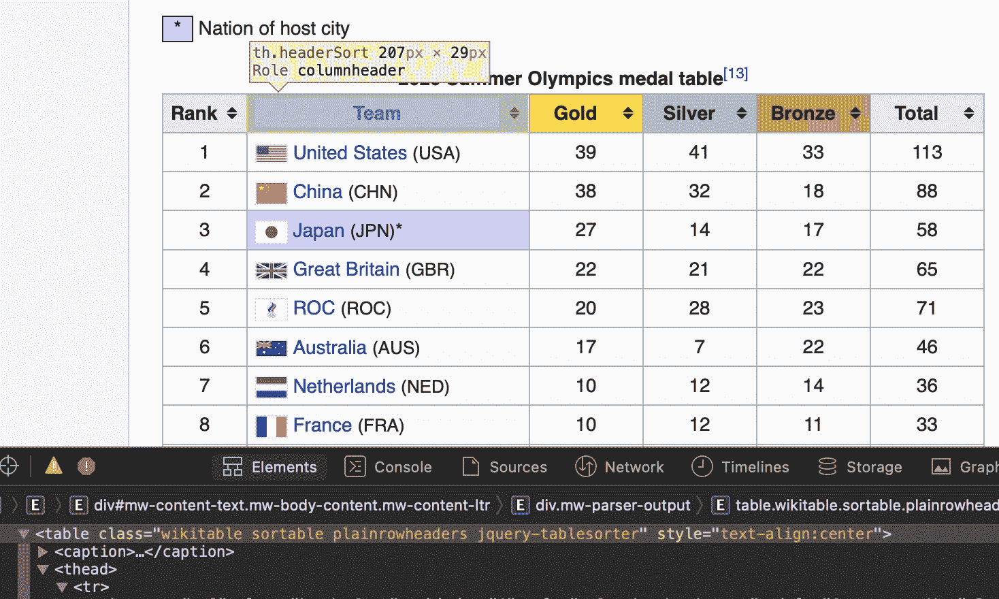
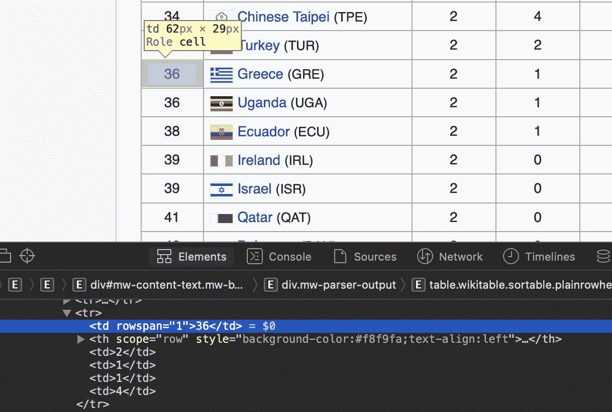

# 用美汤获取数据

> 原文：<https://www.dominodatalab.com/blog/getting-data-with-beautiful-soup>

数据无处不在，从我们每天分析的电子表格，到我们每天早上依赖的天气预报或我们阅读的网页。很多时候，我们消费的数据只是简单的给了我们，简单的一瞥就足以做出决定。比如，知道今天全天下雨的几率是 75%，就让我带上伞。在许多其他情况下，提供的数据是如此丰富，我们需要卷起袖子，我们可能会使用一些探索性的分析来解决这个问题。我们已经在  [的前一篇文章](https://blog.dominodatalab.com/data-exploration-with-pandas-profiler-and-d-tale)中讨论了一些有用的包来进行这种探索。

然而，我们需要的数据可能并不总是以一种适合于立即操作的格式提供给我们。可能的情况是，数据可以从应用编程接口(API)获得。或者我们可以直接连接到数据库来获取我们需要的信息。

另一个丰富的数据来源是网络，你可能已经从中获得了一些有用的数据。只要访问你最喜欢的维基百科页面，你就会发现每个国家在最近的东京奥运会上获得了多少枚金牌。网页也有丰富的文本内容，虽然你可以复制和粘贴这些信息，甚至输入到你选择的文本编辑器中，网络抓取可能是一种可以考虑的方法。在之前的另一篇文章中，我们谈到了自然语言处理，并从一些网页中提取了文本。在本帖中，我们将使用一个名为 [Beautiful Soup](https://www.crummy.com/software/BeautifulSoup/) 的 Python 模块来简化数据采集过程。

## 网页抓取

我们可以创建一个程序，使我们能够抓取我们感兴趣的页面并获得我们想要的信息。这就是所谓的网络抓取，我们编写的代码要求我们获取包含信息的网页的源代码。换句话说，我们需要解析组成页面的 HTML 来提取数据。简单地说，我们需要完成以下步骤:

1.  用我们需要的信息识别网页
2.  下载源代码
3.  识别包含我们需要的信息的页面元素
4.  提取和清理信息
5.  格式化并保存数据以供进一步分析

请注意，并不是所有的页面都让你抓取它们的内容，其他的也不会提供一个清晰的观点。我们建议您检查您正在寻找的页面的条款和条件，并遵守它们。可能有这样一种情况，您可以使用一个 API 来获取数据，使用它而不是直接抓取数据通常会有额外的好处。

## HTML 入门

如上所述，我们需要理解 HTML 文件的结构来找到解决方法。网页呈现其内容的方式是通过 HTML(或超文本标记语言)来描述的，HTML 提供了指示页面的格式、样式和结构的详细指令，以便浏览器可以正确地呈现内容。

HTML 使用标签来标记关键结构元素。标签通过使用`<`和`>`符号来表示。我们还需要指出标记元素的开始和结束位置。对于名为`mytag`的标签，我们用`<mytag>`表示标签内容的开始，用`</mytag>`表示结束。

最基本的 HTML 标签是`<html>`标签，它告诉浏览器标签之间的一切都是 HTML。因此，最简单的 HTML 文档被定义为:

```py
<html>
</html>
```

上面的文件是空的。让我们看一个更有用的例子:

```py
<html>

<head>

  <title>My HTML page</title>

</head>

<body>

  <p>

    This is one paragraph.

  </p>

  <p>

    This is another paragraph. <b>HTML</b> is cool!

  </p>

  <div>

    <a href="https://blog.dominodatalab.com/"

    id="dominodatalab">Domino Datalab Blog</a>

  </div>

</body>

</html>
```

我们可以看到之前的 HTML 标签。这一次，我们有其他的标签在里面。我们把另一个标签里面的标签叫做“孩子”，正如你所想象的，标签可以有“父母”。在上面的文档中，  `<head>` 和  `<body>` 是  `<html>` 的子节点，依次是兄弟节点。一个美好的家庭！

这里有几个标签:

*   `<head>` 包含网页的元数据，例如页面标题
*   `<title>` 是页面的标题
*   `<body>` 定义了页面的正文
*   `<p>` 是一段文字
*   `<div>` 是页面的一个分部或区域
*   `<b>` 表示加粗字体-粗细
*   `<a>` 是一个超链接，在上面的例子中，它包含两个属性  `href` ，表示链接的目的地和一个名为  `id`的标识符。

好了，现在让我们试着解析这一页。

## 美味的汤

如果我们保存上面描述的 HTML 文档的内容，并在浏览器中打开它，我们将看到类似这样的内容:

> 这是一个段落。
> 
> 这又是一段。**HTML**T5【酷炫！
> 
> [Domino 数据实验室博客](https://blog.dominodatalab.com/)

但是，我们有兴趣提取这些信息以供进一步使用。我们可以手动复制和粘贴数据，但幸运的是我们不需要这样做——我们有美丽的汤来帮助我们。

Beautiful Soup 是一个 Python 模块，它能够理解 HTML 和 XML 文档中的标签。你可以在这里看一下  [模块的页面。](https://beautiful-soup-4.readthedocs.io/en/latest/)

让我们用 HTML 的内容创建一个字符串。稍后，我们将看到如何从实时网页中读取内容。

```py
my_html = """

<html>

<head>

<title>My HTML page</title>

</head>

<body>

<p>

This is one paragraph.

</p>

<p>

This is another paragraph. <b>HTML</b> is cool!

</p>

<div>

<a href="https://blog.dominodatalab.com/"

id="dominodatalab">Domino Datalab Blog</a>

</div>

</body>

</html>"""

```

我们现在可以导入美丽的汤，并读取字符串如下:

```py
from bs4 import BeautifulSoup
html_soup = BeautifulSoup(my_html, 'html.parser')
```

让我们看看`html_soup`的内容，正如你所看到的，它看起来很正常:

```py
print(html_soup)
```

```py
<html>

<head>

<title>My HTML page</title>

</head>

<body>

  <p>

    This is one paragraph.

  </p>

  <p>

    This is another paragraph. <b>HTML</b> is cool!

  </p>

  <div>

    <a href="https://blog.dominodatalab.com/" id="dominodatalab">Domino Datalab Blog</a>

  </div>

</body>

</html>
```

但是，事情远比你想象的要复杂。看看 html_soup 变量的类型，可以想象，它不再是字符串。相反，它是一个漂亮的组合对象:

```py
type(html_soup)
```

```py
bs4.BeautifulSoup
```

正如我们之前提到的，Beautiful Soup 帮助我们理解 HTML 文件中的标签。它解析文档并定位相关的标签。例如，我们可以直接询问网站的标题:

```py
print(html_soup.title)
```

```py
<title>My HTML page</title>
```

或者对于 title 标签内的文本:

```py
print(html_soup.title.text)
```

```py
'My HTML page'
```

同样，我们可以看看儿童的身体标记:

```py
list(html_soup.body.children)
```

```py
['\n',

<p>

This is one paragraph.

</p>,

'\n',

<p>

This is another paragraph. <b>HTML</b> is cool!

</p>,

'\n',

<div>

<a href="https://blog.dominodatalab.com/" id="dominodatalab">Domino Datalab Blog</a>

</div>,

'\n']
```

从这里，我们可以选择第一段的内容。从上面的列表中，我们可以看到它是列表中的第二个元素。记住 Python 从 0 开始计数，所以我们感兴趣的是第 1 个元素:

```py
print(list(html_soup.body.children)[1])
```

```py
<p>

This is one paragraph.

</p>
```

这很好，但美丽的汤可以帮助我们更多。例如，我们可以通过参考如下的`p`标签找到第一段:

```py
print(html_soup.find('p').text.strip())
```

```py
'This is one paragraph.'
```

我们还可以查找所有段落实例:

```py
for paragraph in html_soup.find_all('p'):

  print(paragraph.text.strip())
```

```py
This is one paragraph.

This is another paragraph. HTML is cool!
```

让我们获得例子 HTML 中引用的超链接。我们可以通过请求所有包含一个`href`的`a`标签来做到这一点:

```py
links = html_soup.find_all('a', href = True)

print(links)
```

```py
[<a href="https://blog.dominodatalab.com/" id="dominodatalab">Domino Datalab Blog</a>]
```

在这种情况下，列表链接的内容就是标签本身。我们的列表包含一个元素，我们可以看到它的类型:

```py
print(type(links[0]))
```

```py
bs4.element.Tag
```

因此，我们可以如下请求属性`href`和`id`:

```py
print(links[0]['href'], links[0]['id'])
```

```py
('https://blog.dominodatalab.com/', 'dominodatalab')
```

## 读取网页的源代码

我们现在准备开始研究从实际的网页中请求信息。我们可以在请求模块的帮助下做到这一点。让我们来看看之前的一篇博文的内容，例如，关于“使用 Pandas Profiler 和 D-Tale 进行数据探索”的那篇

```py
import requests

url = "https://blog.dominodatalab.com/data-exploration-with-pandas-profiler-and-d-tale"

my_page = requests.get(url)
```

成功的页面请求将返回响应 200:

```py
my_page.status_code
```

```py
200
```

用`my_page.content`可以看到页面的内容。我不会展示这一点，因为这将是这篇文章的一个混乱的条目，但是你可以在你的环境中继续尝试。

我们真正想要的是将这个信息传递给 Beautiful Soup，这样我们就可以理解文档中的标签:

```py
blog_soup = BeautifulSoup(my_page.content, 'html.parser')
```

让我们看看包含页面标题的标题标签`h1`:

```py
blog_soup.h1
```

```py
<h1 class="title">

  <span class="hs_cos_wrapper hs_cos_wrapper_meta_field hs_cos_wrapper_type_text" data-hs-cos-general-type="meta_field" data-hs-cos-type="text" id="hs_cos_wrapper_name" style="">

    Data Exploration with Pandas Profiler and D-Tale

  </span>

</h1>
```

我们可以看到它有几个属性，我们真正想要的是标签内的文本:

```py
heading = blog_soup.h1.text
print(heading)
```

```py
'Data Exploration with Pandas Profiler and D-Tale'
```

博文作者在`author-link`类的`div`中标识，我们来看看:

```py
blog_author = blog_soup.find_all('div', class_="author-link")

print(blog_author)
```

```py
[<div class="author-link"> by: <a href="//blog.dominodatalab.com/author/jrogel">Dr J Rogel-Salazar </a></div>]
```

注意，我们需要引用`class_`(带下划线)以避免与 Python 保留字`class`冲突。从上面的结果中我们可以看到，`div`有一个超链接，作者的名字在那个标签的文本中:

```py
blog_author[0].find('a').text
```

```py
'Dr J Rogel-Salazar '
```

正如您所看到的，我们需要熟悉我们页面的源代码内容。你可以使用你最喜欢的浏览器提供的工具来检查网站的元素。

假设我们现在有兴趣获得博文中给出的目标列表。信息在一个无序列表的`<ul>`标签中，每个条目在一个列表项的`<li>`标签中。无序列表没有类或角色(与页面中的其他列表不同):

```py
blog_soup.find('ul', class_=None, role=None)
```

```py
<ul>

  <li>Detecting erroneous data.</li>

  <li>Determining how much missing data there is.</li>

  <li>Understanding the structure of the data.</li>

  <li>Identifying important variables in the data.</li>

  <li>Sense-checking the validity of the data.</li>

</ul>
```

好了，我们现在可以提取 HTML 列表的条目，并将它们放入 Python 列表中:

```py
my_ul = blog_soup.find('ul', class_=None, role=None)

li_goals =my_ul.find_all('li')

goals = []

for li_goal in li_goals:

 v goals.append(li_goal.   string)

print(goals)
```

```py
['Detecting erroneous data.',

'Determining how much missing data there is.',

'Understanding the structure of the data.',

'Identifying important variables in the data.',

'Sense-checking the validity of the data.']
```

如前所述，我们可能对获取博客文章的文本进行一些自然语言处理感兴趣。我们可以用`get_text()`方法一次性完成。

```py
blog_text = blog_soup.get_text()
```

我们现在可以用 spaCy 来使用早先关于[自然语言的文章中描述的一些技术。在这种情况下，我们显示每个条目、其词性(POS)、对词性的解释以及该条目是否被视为停用词。为方便起见，我们只展示第一个10 个条目。](https://blog.dominodatalab.com/natural-language-in-python-using-spacy)

```py
import spacy

nlp = spacy.load("en_core_web_sm")

doc = nlp(blog_text)

for entry in doc[:10]:

  print(entry.text, entry.pos_, 

    spacy.explain(entry.pos_), 

    entry.is_stop)
```

```py
 SPACE space False

Data PROPN proper noun False

Exploration PROPN proper noun False

with ADP adposition True

Pandas PROPN proper noun False

Profiler PROPN proper noun False

and CCONJ coordinating conjunction True

D PROPN proper noun False

- PUNCT punctuation False

Tale PROPN proper noun False
```

## 读取表格数据

最后，让我们利用目前所学的知识，得到可以用表格形式显示的数据。我们在这篇文章的开头提到，我们可能希望看到不同国家在东京奥运会上获得的金牌数量。我们可以从维基百科的相关条目中读到这些信息。

```py
url = 'https://en.wikipedia.org/wiki/2020_Summer_Olympics_medal_table'

wiki_page = requests.get(url)

medal_soup = BeautifulSoup(wiki_page.content, 'html.parser')
```

使用浏览器的 inspect 元素功能，我可以看到数据所在的表有一个类。查看我的浏览器截图:



```py
medal_table = medal_soup.find('table', 

         class_='wikitable sortable plainrowheaders jquery-tablesorter')
```

在这种情况下，我们需要遍历每一行(`tr`)，然后将它的每个元素(`td`)赋给一个变量，并将其追加到一个列表中。一个例外是含有`th`元素的表格标题。

让我们找到所有的行。我们将挑选出第一个来提取标题，并将奖牌信息存储在一个名为`allRows`的变量中:

```py
tmp = medal_table.find_all('tr')

first = tmp[0]

allRows = tmp[1:-1]
```

让我们来看一个  `first` 的排:

```py
 print(first)
```

```py
<tr><th scope="col">Rank</th><th scope="col">Team</th><th class="headerSort" scope="col" style="width:4em;background-color:gold">Gold</th><th class="headerSort" scope="col" style="width:4em;background-color:silver">Silver</th><th class="headerSort" scope="col" style="width:4em;background-color:#c96">Bronze</th><th scope="col" style="width:4em">Total</th></tr>
```

如您所见，我们需要找到所有的  `th` 标签并获取文本，此外，我们将使用  `strip()` 方法去掉标题和结尾空格。我们在一个列表理解语法中完成所有这些:

```py
 headers = [header.get_text().strip() for 

            header in first.find_all('th')]

 print(headers)
```

```py
['Rank', 'Team', 'Gold', 'Silver', 'Bronze', 'Total']
```

酷！我们现在把注意力转向奖牌:

```py
 results = [[data.get_text() for 

             data in row.find_all('td')] 

             for row in allRows]
```

```py
 print(results[:10])
```

```py
[['1', '39', '41', '33', '113'],
 ['2', '38', '32', '18', '88'],
 ['3', '27', '14', '17', '58'],
 ['4', '22', '21', '22', '65'],
 ['5', '20', '28', '23', '71'],
 ['6', '17', '7', '22', '46'],
 ['7', '10', '12', '14', '36'],
 ['8', '10', '12', '11', '33'],
 ['9', '10', '11', '16', '37'],
 ['10', '10', '10', '20', '40']]
```

坚持下去...这看起来很棒，但它没有国名。让我们看看  的内容`allRows`:

```py
allRows[0]
```

```py
<tr><td>1</td><th scope="row" style="background-color:#f8f9fa;text-align:left"> <a href="/wiki/United_States_at_the_2020_Summer_Olympics" title="United States at the 2020 Summer Olympics">United States</a> <span style="font-size:90%;">(USA)</span></th><td>39</td><td>41</td><td>33</td><td>113</td></tr>
```

啊哈！国家的名称在一个  `th` 标签中，实际上我们可以从超链接里面的字符串中提取出来:

```py
 countries = [[countries.find(text=True) for countries in 

              row.find_all('a')] 

              for row in allRows ]

countries[:10]
```

```py
[['United States'],
 ['China'],
 ['Japan'],
 ['Great Britain'],
 ['ROC'],
 ['Australia'],
 ['Netherlands'],
 ['France'],
 ['Germany'],
 ['Italy']]
```

你可以从网站的表格中看到，一些国家的金牌、银牌和铜牌数量相同，因此排名相同。例如，见给予希腊和乌干达的第 36 位。这对我们的数据搜集策略有一些影响，让我们看看条目 35 到 44 的结果:

```py
results[33:44]
```

```py
[['34', '2', '4', '6', '12'],

['35', '2', '2', '9', '13'],

['36', '2', '1', '1', '4'],

['2', '1', '1', '4'],

['38', '2', '1', '0', '3'],

['39', '2', '0', '2', '4'],

['2', '0', '2', '4'],

['41', '2', '0', '1', '3'],

['42', '2', '0', '0', '2'],

['2', '0', '0', '2'],

['44', '1', '6', '12', '19']]
```

我们的行有五个条目，但是具有相同排名的行实际上有四个条目。这些条目都有一个  `rowspan` 属性如截图所示为排名36如下:

 

让我们找到具有  `rowspan` 属性的条目，并计算具有相同等级的国家的数量。我们将记录条目编号、  `td` 编号、共享相同等级和等级分配的国家数量:

```py
 rowspan = []

for num, tr in enumerate(allRows):

  tmp = []

  for td_num, data in enumerate(tr.find_all('td')):

    if data.has_attr("rowspan"):

      rowspan.append((num, td_num, int(data["rowspan"]), data.get_text()))
```

```py
print(rowspan)
```

```py
[(35, 0, 2, '36'),

(38, 0, 2, '39'),

(41, 0, 2, '42'),

(45, 0, 2, '46'),

(49, 0, 2, '50'),

(55, 0, 2, '56'),

(58, 0, 4, '59'),

(62, 0, 3, '63'),

(71, 0, 2, '72'),

(73, 0, 3, '74'),

(76, 0, 6, '77'),

(85, 0, 8, '86')]
```

我们现在可以通过在缺少值的行中插入正确的等级来修复我们的  `results` :

```py
 for i in rowspan:

 # tr value of rowspan is in the 1st place in results

  for j in range(1, i[2]):

    # Add value in the next tr

    results[i[0]+j].insert(i[1], i[3])
```

让我们检查一下这是否有效:

```py
 print(results)[33:44]
```

```py
[['34', '2', '4', '6', '12'],

['35', '2', '2', '9', '13'],

['36', '2', '1', '1', '4'],

['36', '2', '1', '1', '4'],

['38', '2', '1', '0', '3'],

['39', '2', '0', '2', '4'],

['39', '2', '0', '2', '4'],

['41', '2', '0', '1', '3'],

['42', '2', '0', '0', '2'],

['42', '2', '0', '0', '2'],

['44', '1', '6', '12', '19']]
```

我们现在也可以插入国名:

```py
 for i, country in enumerate(countries):

  results[i].insert(1, country[0])
```

最后，我们可以用我们的数据创建一个熊猫数据框架:

```py
import pandas as pd

df = pd.DataFrame(data = results, columns = headers)

df['Rank'] = df['Rank'].map(lambda x: x.replace('\n',''))

df['Total'] = df['Total'].map(lambda x: x.replace('\n',''))

cols = ['Rank','Gold', 'Silver', 'Bronze', 'Total']

df[cols] = df[cols].apply(pd.to_numeric)

df.head()
```

|   | 军阶 | 组 | 金色的 | 银 | 青铜 | 总数 |
| --- | --- | --- | --- | --- | --- | --- |
| Zero | one | 美国 | Thirty-nine | Forty-one | Thirty-three | One hundred and thirteen |
| one | Two | 中国 | Thirty-eight | Thirty-two | Eighteen | Eighty-eight |
| Two | three | 日本 | Twenty-seven | Fourteen | Seventeen | Fifty-eight |
| three | four | 大不列颠 | Twenty-two | Twenty-one | Twenty-two | Sixty-five |
| four | five | 皇家对空观察队 | Twenty | Twenty-eight | Twenty-three | Seventy-one |

```py
 df['Gold'].mean()
```

```py
3.6559139784946235
```

```py
 df['Total'].mean()
```

```py
11.612903225806452
```

## 摘要

我们已经看到了如何解析一个 HTML 文档，并在 Beautiful Soup 的帮助下理解其中的标签。你可能想用你在这里学到的一些东西来获取一些数据，否则这些数据可能只能在网页上找到。请记住，您应该注意您正在获取的材料的权利。阅读您感兴趣的页面的条款和条件，如果有疑问，最好谨慎行事。最后一句话，网页抓取取决于你正在解析的网页的结构。如果页面发生变化，您的代码很可能会失败。在这种情况下，准备好卷起袖子，重新检查 HTML 标签，并相应地修改代码。