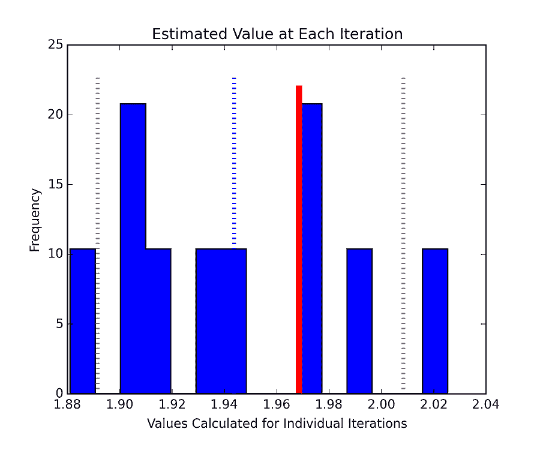
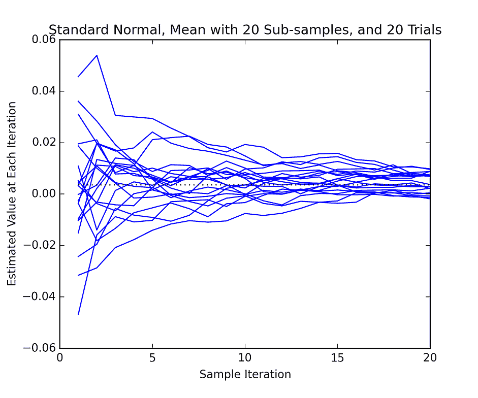
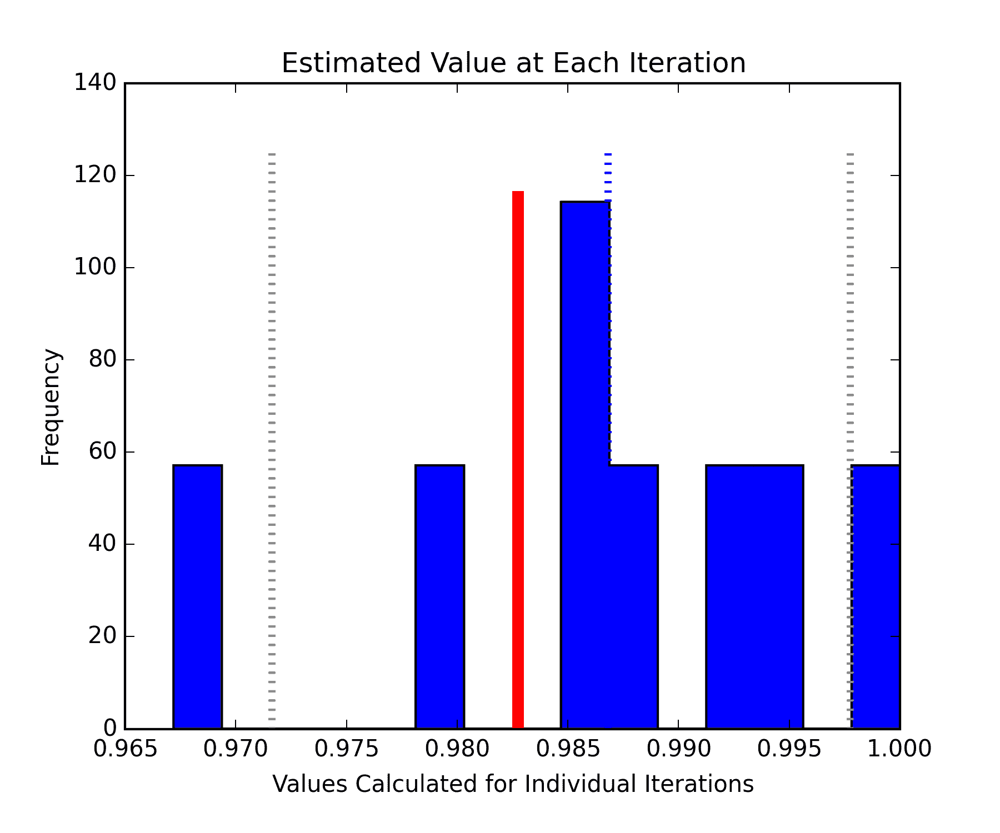
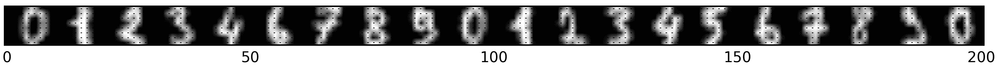
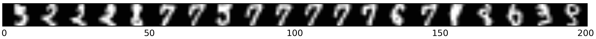

# 获取分类度量的误差界限

> 原文：<https://www.dominodatalab.com/blog/getting-error-bounds-on-classification-metrics>

## 误差范围，或缺乏误差范围

由于多种原因，计算源自非常大的数据集的度量的误差界限一直是有问题的。在更传统的统计学中，人们可以对大多数度量(例如，平均值)、参数(例如，回归中的斜率)或分类(例如，混淆矩阵和 Kappa 统计)设置置信区间或误差界限。

对于许多机器学习应用来说，误差界限可能非常重要。考虑一家公司开发获取客户的方法。关于如何继续，哪个陈述给了 CEO 更恰当的信息，是没有误差范围的答案，还是有误差范围的答案？

> “通过该渠道获得的客户的平均预期终身价值为“*”、*25 美元或“*”、【25 美元正负 75 美元。*

谢天谢地，我不是首席执行官，但我想知道分析的弱点是否表明可能存在负值。为了明确区分，有一个宽的误差范围与有一个完全错误的分析是完全不同的；误差范围不会保护你免受坏数据、坏假设或坏模型的影响。

下面我将讨论机器学习项目中通常不使用误差界限的一些原因，介绍 bootstrap，little-bag-of-bootstrap 及其优点。然后我将给出估计线性回归的 R² 和手写数字的支持向量机分类的 F1 分数周围的误差界限的例子。

## 缺少它

有几个原因我认为误差界限通常不应用在机器学习中。

1.  许多技术没有正式的方法。如果有人知道一种在神经或深度信念网络上计算置信区间的正式方法，我想知道它。
2.  大多数计算置信区间的方法都依赖于分析中的假设。除非一个人接受过一些统计培训(自我培训是可以的)，否则他们不太可能知道这些的细节。
3.  使用机器学习的项目通常以一种非正式和探索性的方式进行，这种方式不太适合计算正式的置信区间。
4.  使用大数据时，计算误差范围的额外工作量可能太大了。
5.  在某些情况下，特别是对于非常大的样本，统计显著性很容易获得，但并不意味着模型是有用的。
6.  所用数据的维度通常比统计学家在开发大多数统计方法时所设想的要大。

我怀疑在某些情况下，误差范围是可以计算出来的，但是没有报告出来，仅仅是因为这不是标准。不过，我愿意接受不同的意见。

## 拔靴带

Bootstrapping 是一种基于近似的代表性样本来推导精确度或分布测量的方法。这是一种重采样技术，从可用数据中提取带有替换的重复重采样，并用于计算所需的度量。人们可以看看 Efron (1973)的开创性论文或许多其他描述基本自举及其变体的出版物。引导是非常计算密集型的，需要对潜在的大部分数据进行多次迭代计算。

对于我们的目的来说，这是一种在我们只有一个样本的分布上计算度量和误差界的方法。

## 小自举的误差界限

[凯鹏华盈。艾尔。](#references)发表了两篇关于“Little-Bag-Of-Bootstraps”(LBOB)的论文，这是一种用于海量数据的可扩展引导。这是传统自举的一个变种，它更适合在非常大的数据集上使用，并且更容易在机器之间分发。他们将 LBOB 与更传统的自举进行了比较，并表明它比其他自举方法更快、更一致地收敛于正确的误差界限。

克莱纳等人。艾尔。使用两阶段引导技术。在第一次或外部引导中，无需替换即可获取样本。该样本被传递到第二级或内部自举，该第二级或内部自举通过替换重复采样。内部样本大小相当于完整数据集的大小。对每个内部样本计算度量或分数。该度量可以是平均值、标准偏差、R² 、F1、AUC 或许多其他度量之一。对每个内部样本计算的指标进行汇总，通常是平均。这个值被传递回外部循环。然后外部循环继续该过程。当外部循环完成时，它可能有 3 到 50 个或更多的度量估计。通常，平均值作为“真实”指标的估计值，估计值的第 5 和第 95 个百分点形成可能的界限。

提高效率的关键之一是内部样本可以使用频率加权样本。本质上，这允许用更少的实际值来表示完整的数据集。任何接受频率加权数据集的例程都可以利用这一点。许多指标或评分程序将接受这种形式的数据(例如，许多 scikit learn 的`score()`函数)。

### 博客反馈的一个激励性例子

我将使用 blog feedback 数据集的一个子集来估计可能的博客反馈。这些是由 Krisztian Buza 整理的，并从加州大学欧文分校[机器学习库](https://archive.ics.uci.edu/ml/datasets/BlogFeedback)下载(Bache & Lichman，2013)。一分钟之内，假设数据集**如此之大**，以至于我们根本无法全部处理。然而，我们想知道我们的预测器工作得有多好。最初，仅使用前 20%的数据进行回归。结果将使用小启动包进行评估，它可以估计实际值和该值的一些界限。

使用样本外测试数据估计决定系数(R² )。估计值为 0.3112，可能的范围从 0.129 到 0.5193

使用 90%的数据进行培训，10%的数据进行测试，实际得分为 0.3476

虽然结果是随机的，但是完整数据集中的“真实”R² 总是在小部分数据确定的范围内，至少在我运行它的时候是这样。如果有的话，默认情况下使用的第 5 和第 95 个百分点的界限有点松。这很容易改变。

### 算法是如何工作的

在内部，这个小小的引导程序生成它将要计算的分数的重复样本。使用`lbob.scores()`运行评估后，可以访问这些分数。分数的数量将等于子样本的数量。通常，人们会使用这些的平均值作为估计值，并将第 5 个和第 95 个百分位数作为界限。

下面的直方图显示了从每个外部引导或子样本中得出的各个估计值(`l.scores`)的分布。使用了具有 100，000 个点的标准正态分布，并且估计的度量是第 97.5 百分位。因为只有 10 个子样本，所以结果有点不完整。蓝色虚线显示了估计值。估计的界限是灰色虚线。根据完整数据集计算的真正的 97.5%由较粗的红线给出。



内部采样的平均值收敛于一个适当的值。收敛速度取决于样本大小和分布的良好表现。下图显示了一些预测先前生成的标准正态分布平均值的试验。通常使用的平均值是每行的最后一个。请注意，该值存在一些差异。随着取样越来越多，回报也越来越少。



### 评分功能

该软件允许您定义任意评分或度量函数。虽然它默认计算平均值，但也可以在运行自举之前分配其他函数。

许多 scikit-learn 评分函数可以采用频率或权重向量。在这种情况下，您可以在运行引导之前使用类似下面的语句。

```py
#Define classifier

clf = linear_model.MultiTaskLasso(alpha=0.1)

<h1>Assign its score func</h1>

lbob.score_func = lambda x, y, freq: clf.score(x, y, freq)

#Run the bootstrap

lbob_big_bootstrap(lbob)

#You can certainly define your own scoring function and use it. 
#When the arguments match the order and count expected, you can skip the lambda function.

# Define score func

def my_scoring_func(x, y, weights):
    return score

# Assign score func

lbob.score_func = my_scoring_func
```

### 最后一个例子

这个例子使用了一个由 Alpaydin 和 Kaynak 组装的[手写数字数据集](https://archive.ics.uci.edu/ml/datasets/Optical+Recognition+of+Handwritten+Digits)。它是 scikit 中数据的超集——通过运行`sklearn.datasets.load_digits()`可以了解到这一点。这些数据将手写数字表示为灰度图像的向量。

使用具有参数网格搜索的支持向量机来分类字符。使用 F1 分数评估结果。首先对完整的训练数据集(N=3823)进行分类，以获得“真”F1。然后在不同大小的子集上执行。网格搜索是对每组数据分别进行的。这个例子的一个缺点是基本分类太好了，以至于在它的自举估计中没有太多的方差。

下面的直方图显示了使用 20%的数据进行训练时 F1 分数的估计值(蓝色条)。红色条显示“真实”F1，它完全在灰色线所示的估计范围内。



我觉得有趣的是，大多数错误分类的数字似乎并不难阅读。下面的第一张图是正确分类的数字，第二张图是错误分类的数字。





```py
In the lists below, the top row shows how each digit was classified and the bottom row shows the true class.

Classification [9 1 1 1 1 9 5 9 9 9 9 9 9 8 9 8 1 0 3 8]

True Value [5 2 2 2 8 7 7 5 7 7 7 7 7 6 7 1 8 6 9 9]
```

## 使用项目

整个项目都可以在 Domino 上获得。要克隆整个项目:

1.  下载并安装 [Domino 客户端](https://support.dominodatalab.com/hc/en-us/articles/204856475-Installing-the-Domino-Client-CLI-)
2.  在命令提示符下，运行:`domino get CassonStallings/bootstraps`

## 参考

*   Bache 和 m . lich man(2013 年)。 [UCI 机器学习知识库](https://archive.ics.uci.edu/ml)。加州欧文:加州大学信息与计算机科学学院。
*   埃夫龙，B. (1979)自助方法:对折刀法的另一种看法。统计年鉴，7(1):1–26。
*   Kaynak，C. (1995)组合多分类器的方法及其在手写数字识别中的应用。博加齐齐大学科学与工程研究生院硕士论文。([这个相关的出版物](https://www.cs.cuhk.hk/~lxu/papers/journal/IEEEsmc92.PDF)可能更容易接触到。)
*   Kleiner，a .，Talwalkar，a .，Sarkar，p .，和 Jordan，M. I. (2012)大数据引导，第 29 届年会会议录。马赫上。学习，苏格兰爱丁堡。
*   Kleiner，A .、Talwalkar，A .、Sarkar，p .和 Jordan，M. I. (2012)海量数据的可扩展引导，2012 年 5 月。https://arxiv.org/pdf/1112.5016v2.pdf