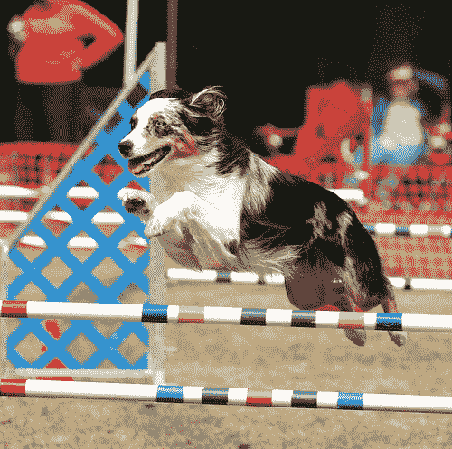
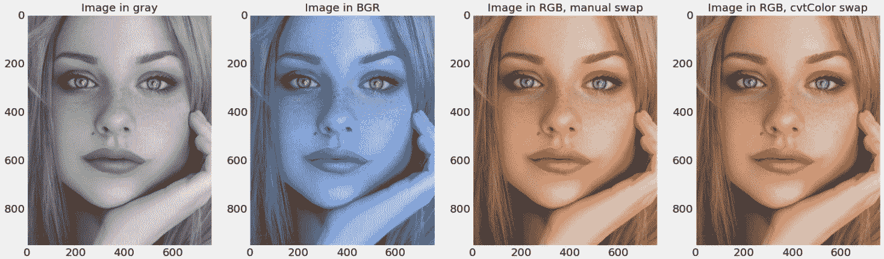
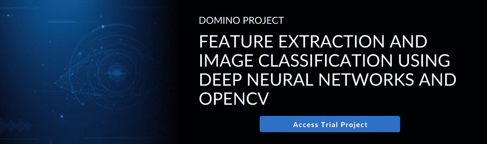

# OpenCV 入门

> 原文：<https://www.dominodatalab.com/blog/getting-started-witn-open-cv>

在本文中，我们将讨论计算机视觉的基础、OpenCV 框架的历史和功能，以及如何使用 Python 和 OpenCV 迈出访问和可视化图像的第一步。

## 介绍

人工智能的最终目标之一是获得理解物理世界状态的能力，并具有与人类相似的对周围环境刺激做出反应的能力。在人类中，这些反应是包括视觉在内的认知功能的产物。这些功能允许人类观察周围环境，并理解和解码视觉感知为上下文信息。

[计算机视觉](https://www.dominodatalab.com/blog/what-is-computer-vision) (CV)，作为人工智能的一个跨学科子领域，旨在模仿人类的认知功能，提供类似人类视觉的能力。这些包括理解数字图像的内容、对象的类型以及它们之间的关系。我们认为这个领域是跨学科的，因为不同的学科对 CV 的发展都有贡献。例如，神经科学一直是一个关键的贡献者，因为它能够解码人类的视觉。CV 本质上是计算机科学的一部分，因为机器学习方法和算法理论对于 CV 开发也是必不可少的。

作为人类，我们可以瞬间并以高精度从图像中理解和提取信息。人类可以识别物体及其关系，并可以通过语言交流他们对视觉世界的感知。例如，在检查图 1 中描绘的图像时，我们可以识别出一只狗和所描绘的动作，即这只狗正在跳过一个有条纹的跨栏。我们能识别颜色(黑、白、蓝、黄等)。)和组成对象的特征(形状、边缘等)。).另外，背景中有两个人，一个站着，一个坐着。

根据不同的物体和相关的动作，我们可以推断这张照片可能是一场狗展。然而，对于人工智能算法来说，获取和应用这种看似简单的人类能力存在一系列困难，特别是对于需要上下文理解的复杂图像[1]。

简而言之，视觉系统中有两个主要组件:a)感测/捕捉和 b)解释/转换组件。在人类中，我们的眼睛充当着传感装置，通过捕捉从物体反射的光，通过虹膜接收，并投射到视网膜上。从那里，专门的细胞将通过神经元向大脑传输信息。这些信息随后被大脑的视觉皮层解码成意义。



图一。人类对图像的视觉感知导致对物体及其关系的即时检测。来源:Flickr8K 数据集

我们可以识别出这个图像包含许多对象，并描绘了一个活动(狗跳过一个障碍)。这些信息也让我们推断这可能是一场狗展。

对于计算机，相机可以充当传感/捕捉组件，以像素的形式存储和传输图像信息。CV 环境中的解释组件是一个 AI 代理，这就是 CV 仍然落后于自然视觉系统的地方。将像素转换为意义是 CV 对于计算机来说仍然是一项艰巨任务的首要原因。例如，图 1 中的图像是 500 x 497 像素，具有红色、绿色和蓝色(RGB)通道。将这些像素转换成有意义的信息和准确的图像描述对于人工智能代理来说仍然是一项艰巨的任务。

人类视觉系统可以快速感知和解释图像，据报道可以在 150 毫秒内将动物从自然场景中分类出来[3]。人类也可以自然地在解释图像时涉及上下文。例如，我们可以使用我们的先验知识推断，图 1 中的图像可能说明了一个狗展事件。这是一个显著的优点，但是很难结合到 CV 算法中。我们视觉系统中内置的注意力机制也是有利的，但这也意味着我们的大脑不倾向于集中注意力的图像部分的修改可能不会被捕捉和注意到。

计算机视觉在许多领域提供了不同的应用。它允许娱乐行业中的特殊效果，并为图像分类、对象识别和跟踪、人脸检测、基于内容的图像检索、自动驾驶汽车、机器人、医疗、安全和教育提供能力。

深度学习的最新进展，加上这些方法利用图形处理单元(GPU)进行加速训练的能力，以及大型标签数据集的可用性，彻底改变了简历的前景。他们利用神经网络的优势来解决传统机器学习无法有效解决的 CV 任务。传统的方法依赖于提取图像特征来解决包括图像分类在内的各种任务。这个特征提取步骤是费力且有偏见的，因为它可能无法提取准确结果所需的所有足够的特征。深度学习方法通过自动和无偏见地提取图像特征来绕过这一步。

有多种 Python 工具可用于 CV 相关任务，其中之一是[开源计算机视觉](https://opencv.org/)(OpenCV)；一个免费的开源库，广泛应用于学术和商业领域，包括谷歌、英特尔、微软和 IBM。OpenCV 由 Intel 于 2000 年 6 月在 BSD 许可下发布，用 C++编写，具有对不同编程语言的 API 支持，包括 Python、Java 和 MATLAB [4]。

OpenCV-Python 是 OpenCV 的一个 API，利用 Python 和 OpenCV C++ API 的优势。对于 Python 来说，这是一个绑定库，旨在解决以 CV 为中心的任务。它利用 NumPy 及其数组结构，允许与其他库(包括 SciPy 和 Matplotlib)无缝集成。它支持不同的平台，允许它在 Windows、Linux 和 macOS 以及移动操作系统上运行。

OpenCV 已用于图像预处理、对象检测、分割、人脸检测和识别、人脸姿态估计和对准、增强现实、导航和跟踪等各种领域支持应用[5-12]。此外，OpenCV 包括丰富的预定义函数，并提供了一系列机器学习库，包括 boosting、决策树、 [KNN](https://www.dominodatalab.com/blog/knn-with-examples-in-python) 、朴素贝叶斯、随机森林、支持向量机和深度神经网络。

在下面的章节中，我们将介绍 OpenCV 提供的一些功能，包括对象检测、特征提取和分类。

## 安装 OpenCV

第一步是安装 OpenCV-Python。最初的要求是安装 Python 和 *pip* (一个包管理系统)。要安装 OpenCV，请运行以下命令行命令:

```py
pip install opencv-python
```

要在 Jupyter 笔记本中成功运行这段代码，需要一个感叹号(！)需要在 pip 之前使用:

```py
!pip install opencv-python
```

这将启动下载 OpenCV 和安装依赖项(NumPy)。完成后，将显示确认成功安装的消息。随后可以导入该库:

```py
import cv2
```

### 打开并显示图像文件

OpenCV 允许读取不同类型的图像(JPG，PNG 等)，可以是灰度或彩色图像。读取图像的内置函数是 *cv2.imread()* ，语法结构如下:

```py
image = cv2.imread(filename, flags)
```

在上面的例子中，“image”是存储“filename”信息的变量。我们可以看到有两个输入:“文件名”和“标志”:

1.  *filename* :必需的参数和图像的位置，可以作为相对或绝对路径提供。
2.  *flags* :这是一个可选参数，用于读取特定格式的图像。例如，灰度、彩色或 alpha 通道。默认值为 cv2。IMREAD_COLOR 或 1，它将图像加载为彩色图像，下面更详细地描述了这些标志:

*   cv2。im read _ gray 或 0:以灰度模式加载图像。
*   cv2。IMREAD_COLOR 或 1:加载彩色图像的默认标志。图像的任何透明度都将被忽略。
*   cv2。IMREAD_UNCHANGED 或-1:加载包含 alpha 通道的图像。

为了显示一个图像文件，我们可以利用 *imshow()* 内置函数来显示 NumPy 2D 数组的表示，该数组是在使用 *imread()* 函数读取图像后产生的。需要强调的是，OpenCV 库使用不同的格式来存储频道信息；BGR 而不是 RGB 顺序。为了正确地显示 RGB 中的原始彩色图像，我们需要交换通道的顺序。这可以通过 NumPy 切片或者 *cv2.cvtColor()* 内置函数来实现。下面的代码块演示了整个过程，输出图像如图 2 所示。

```py
f = plt.figure(figsize=(25, 20))

f.add_subplot(1, 4, 1)

# The return from imread is numpy 2D array representing the image

img_gray = cv2.imread("Resourcimg/face.jpg", 0)

# We can use imshow to display a representation of the numpy 2D array. To display an image defining an appropriate colormap is required. For grascale image the colormap is "gray"

plt.imshow(img_gray, cmap="gray");

plt.grid(None)

plt.title("Image in gray");

# OpenCV library uses different format for storing channel information; BGR order convention instead of RGB order. To properly show the original colour image in RGB, we need to swap the order of channels.

f.add_subplot(1, 4, 2)

img_bgr = cv2.imread("Resourcimg/face.jpg", 1)

plt.imshow(img_bgr);

plt.grid(None)

plt.title("Image in BGR");

# A way to reorder the channels to RGB:

f.add_subplot(1, 4, 3)

img_rgb = img_bgr[:, :, ::-1]

plt.imshow(img_rgb);

plt.grid(None)

plt.title("Image in RGB, manual swap");
```



图二。使用 OpenCV 内置函数读取和显示 RGB 格式的图像。

## 摘要

在这篇文章中，我们讨论了计算机视觉——人工智能领域，使计算机能够从图像中获取有意义的信息。我们还讨论了 OpenCV 的历史和功能——这是一个免费的跨平台库，用于解决广泛的计算机视觉问题。

在本文的第二部分中，我们将探讨各种特征提取和图像分类技术(例如 SIFT、ORB 和 FAST ),并展示使用深度神经网络的对象分类。

## 额外资源

您可以查看以下附加资源:

*   OpenCV 上的免费在线课程-[https://opencv.org/opencv-free-course/](https://opencv.org/opencv-free-course/)
*   OpenCV 官方文档-[https://docs.opencv.org/4.x/](https://docs.opencv.org/4.x/)
*   有一个附带的项目，其中包含本文的所有代码，您可以通过注册免费的 Domino MLOps 试用环境来访问它:

## [](https://cta-redirect.hubspot.com/cta/redirect/6816846/810a435d-b16b-4415-a383-e5328cc61067) 

## 参考

[1] N. Sharif、U. Nadeem、S. A. A. Shah、M. Bennamoun 和 W. Liu，“从视觉到语言:方法、度量和数据集”，载于《机器学习范例:施普林格》，2020 年，第 9-62 页。

[2] C. Rashtchian、P. Young、M. Hodosh 和 J. Hockenmaier，“使用亚马逊的土耳其机器人收集图像注释”，载于 NAACL HLT 2010 年关于使用亚马逊的土耳其机器人创建语音和语言数据的研讨会会议录，2010 年，第 139-147 页。

[3] S. Thorpe、D. Fize 和 C. Marlot，“人类视觉系统的处理速度”，《自然》，第 381 卷，第 6582 期，第 520-522 页，1996 年。

[4] G. Bradski，“openCV 库”，Dobb 博士的杂志:专业程序员的软件工具，第 25 卷，第 11 期，第 120-123 页，2000 年。

[5] A. A. Chaaraoui，P. Climent-Pérez 和 F. Flórez-Revuelta，“使用关键姿势序列进行基于轮廓的人体动作识别”，《模式识别快报》，第 34 卷，第 15 期，第 1799-1807 页，2013 年。

[6] N. Marku，M. Frljak，I. S. Pandž，j .阿尔贝里和 R. Forchheimer，“决策树中组织的像素强度比较的对象检测”，arXiv 预印本 arXiv:1305.4537，2013 年。

[7] N. Marku，M. Frljak，I. S. Pandž，j .阿尔贝里和 R. Forchheimer，“用随机树集合进行瞳孔定位”，《模式识别》，第 47 卷，第 2 期，第 578-587 页，2014 年。

[8] F. Timm 和 E. Barth，“通过梯度实现精确的眼睛中心定位”，Visapp，第 11 卷，第 125-130 页，2011 年。

[9] D. S. Bolme、B. A. Draper 和 J. R. Beveridge，“合成精确滤波器的平均值”，2009 年 IEEE 计算机视觉和模式识别会议，2009 年:IEEE，第 2105-2112 页。

[10] X. Cao，Y. Wei，F. Wen，和 J. Sun，“基于显式形状回归的人脸对齐”，国际计算机视觉杂志，第 107 卷第 2 期，第 177-190 页，2014 年。

[11] M. Danelljan、g . hger、F. Khan 和 M. Felsberg，“鲁棒视觉跟踪的精确比例估计”，英国机器视觉会议，诺丁汉，2014 年 9 月 1-5 日，2014: Bmva 出版社。

[12] K. Zhang，L. Zhang，M.-H. Yang，“快速压缩跟踪”，IEEE 模式分析与机器智能汇刊，第 36 卷，第 10 期，第 2002-2015 页，2014 年。