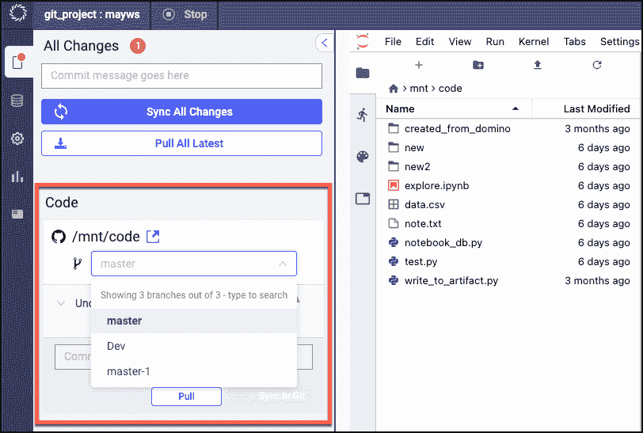
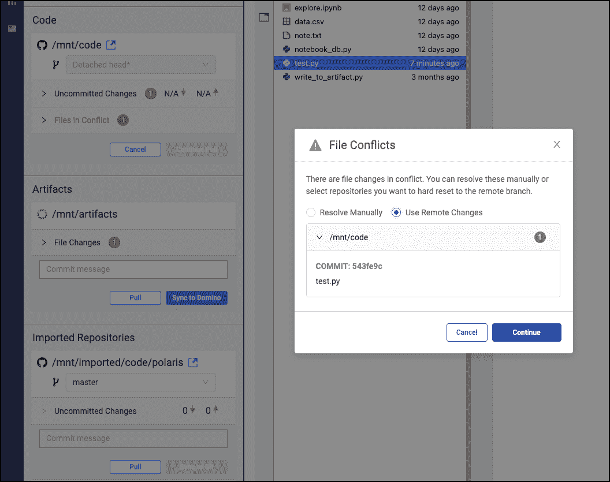
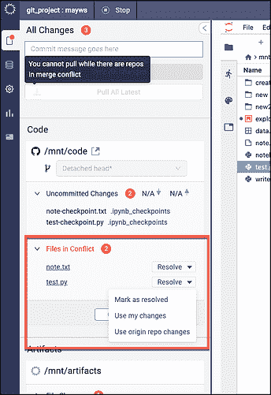
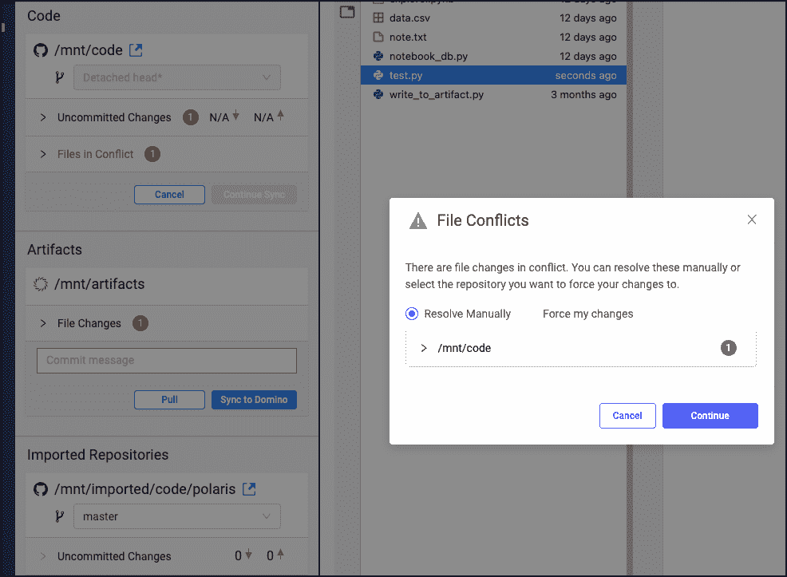

# Domino 5.0:轻松利用 Git 存储库来提高模型速度

> 原文：<https://www.dominodatalab.com/blog/git-based-projects>

## 在 Domino 5.0 中利用 Git 支持的项目

由五月胡，达美乐高级产品经理，于 2022 年 2 月 14 日在 [进行产品更新](/blog/tag/product-updates)

Domino 自动跟踪所有实验工件，因此数据科学工作是可再现的、可发现的和可重用的——提高 [模型速度](https://www.dominodatalab.com/blog/model-velocity) 并降低监管风险。这些工件可以记录为 Domino 文件系统(DFS)的一部分，但许多公司现在更喜欢使用集中式 Git 代码存储库(例如， [GitHub](https://github.com/) ， [GitLab](https://about.gitlab.com/) ， [Bitbucket](https://bitbucket.org/) )，以便数据科学代码可以与公司 CI/CD 工作流的其余部分集成，从而提高一致性和治理。

Domino 支持常见的 Git 工作流，比如拉最新内容、推送更改、浏览文件等等——所有这些都是在 Domino 工作区内与您选择的 Git 服务提供商之间进行的。这种 Git-first 的体验让用户能够更好地控制复杂工作流的同步和版本控制，并使他们能够轻松地与其他团队成员进行版本控制、基于代码的协作。

[Domino 5.0](https://www.dominodatalab.com/resources/introducing-domino-5.0) 通过简化切换分支所需的步骤，并通过指导用户通过一致的流程来解决将代码合并到他们选择的存储库时的冲突(而不是在不同环境之间手工跳转)，改进了现有的功能。

#### 切换工作区中的分支

分支允许数据科学家开发特性、修复 bug，或者在其存储库的封闭区域中安全地试验新想法。为了最大限度地提高工作效率，数据科学家可以在他们的工作区内快速切换主代码存储库和任何其他导入存储库的分支。

数据科学家可以轻松地从下拉菜单中列出的多达 10 个分支中进行选择。如果存储库有 10 个以上的分支，可以选择搜索更多的分支。

#### 解决合并冲突

当对代码行甚至整个文件进行竞争性更改(例如删除文件)时，会发生合并冲突。未能正确管理冲突会导致组织的存储库被破坏——这将需要数据科学家花费时间来确定存储库中错误的原因。

当将工作区中的更改同步到 Git 存储库，或者将最新的更改从存储库拉入工作区时，Domino 首先从远程分支获取最新的内容(git fetch)。接下来，在更新的分支之上应用变更(git rebase)。如果检测到冲突，Domino 会引导用户通过基于 UI 的工作流，在将代码合并到他们选择的存储库时一致地解决冲突。

### 它是如何工作的

#### 切换工作区中的分支

1.  遵循 [这篇文章](https://docs.dominodatalab.com/en/5.0/reference/projects/git/git_based_projects.html#create-a-git-based-project) 在 Domino 中创建一个基于 Git 的项目。
2.  使用所需的 IDE 创建并启动工作区。
3.  无需离开工作区，轻松在分支之间切换。

#### 提取文件时解决冲突

1.  为主代码库或导入的库选择“**Pull”**。
2.  如果存在合并冲突，将出现以下警告:

“使用远程更改”将放弃工作区中的更改，并用远程更改覆盖工作区中的文件。

【手动解决】将引导用户通过文件名解决冲突。对于每个有冲突的文件，用户可以选择以下选项之一:

*   **“标记为已解决”**假设文件已被编辑以解决冲突标记。
*   **“使用我的更改”**将用工作区中的更改覆盖远程文件。
*   **“使用原始存储库更改”**将放弃工作区中的更改，并用远程更改覆盖文件。

#### 同步更改时解决冲突

1.  对于主代码库或导入的库，单击“**Sync”**。
2.  如果检测到冲突，用户将收到以下警告和选项:

*   “**强制我的更改**”将用您工作区中的更改覆盖远程文件。这意味着远程上的提交历史将与您的工作区中的提交历史相匹配。
*   “**手动解决**”将引导用户通过文件名解决冲突。

### 结论

Domino 继续帮助数据科学家变得更加高效，同时帮助组织在成为模型驱动的过程中提高一致性和效率。Domino 5.0 允许数据科学家轻松地满足利用集中式代码存储库的企业级需求。由于能够在工作区的分支之间轻松切换，数据科学家可以专注于改进代码和运行实验。管理冲突的新步骤有助于数据科学家更有效地检入代码，并确保组织的存储库可以被信任和维护。

Domino 是 [企业 MLOps](https://www.dominodatalab.com/resources/a-guide-to-enterprise-mlops/) 平台，它无缝集成了代码驱动的模型开发、部署和监控，以支持快速迭代和最佳模型性能，因此公司可以确保从其数据科学模型中实现最大价值。

### 关于作者

|  | May Hu 是一名高级产品经理，在 ML 平台和云技术领域拥有多年经验。她目前领导 Domino 数据实验室的协作和自动化宪章的产品战略。 |