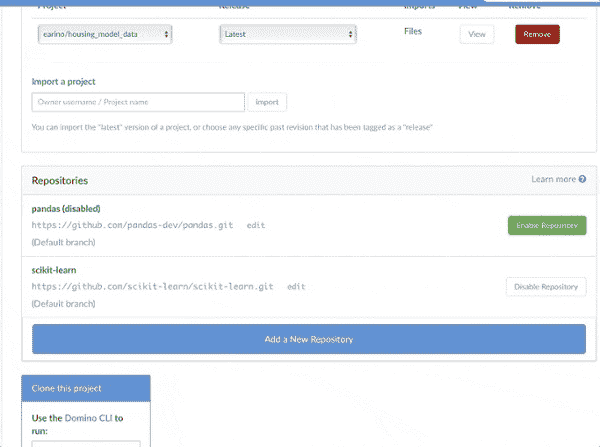
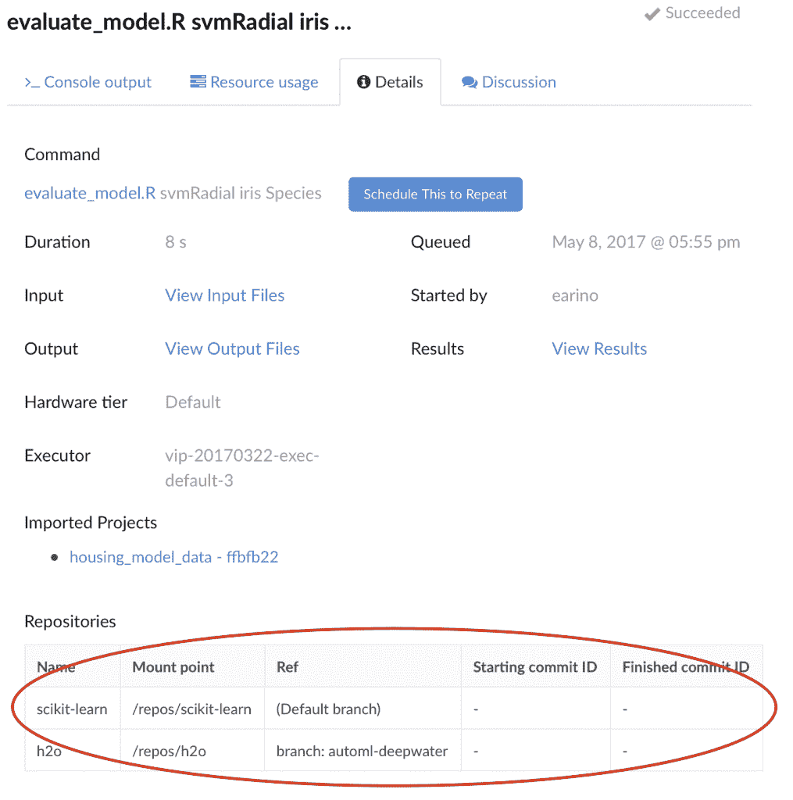
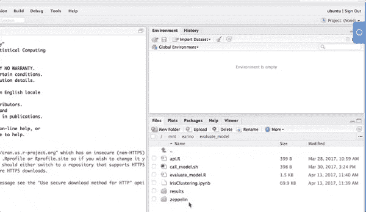

# Domino 中的 Git 集成

> 原文：<https://www.dominodatalab.com/blog/git-integration>

我们最近发布了新的功能，提供了 Domino 和 git 之间的一流集成。这篇文章描述了这个新特性，并描述了我们对数据科学(不同于软件工程)工作流环境中版本控制的独特需求的观点。

## 问题是

在一条现在很有名的推特上，[艾萨克·沃尔克斯托弗](https://www.linkedin.com/in/agnoster/)曾经说过:“一旦你有了分支是映射希尔伯特空间子流形的同胚内函子的基本概念，事情就变得简单了。”虽然他在 [Quora 的一个回答](https://www.quora.com/How-can-I-understand-git-branches-in-terms-of-homeomorphic-endofunctors-mapping-submanifolds-of-a-Hilbert-space)中澄清说，这种说法完全是在开玩笑，但通过模因的扩散和人们在搜索该字符串时找到的数千个谷歌结果，很明显答案引起了共鸣。

在最近一次对数据科学家的调查中，超过 85%的人肯定地回答说他们正在他们的工作流程中利用 git。绝大多数的数据科学家直接接触并分享了他们使用 git 的感受，但只是以一种货物崇拜的方式。命令被记忆和重复，作为对再现神的咒语，他们可能会对这个项目微笑，让结果和发现存活和茁壮成长。我们认为有更好的方法。

## Domino 的 Git 集成

Domino 数据科学平台的集成充分利用了 git 的能力和我们的再现性引擎技术。这种集成支持许多工作流，目前正被财富 50 强客户用来让他们的数据科学团队从软件、管道和 git 基础设施的现有投资中获得价值。

这一集成的三个亮点包括:

### 能够以精确的提交散列检查多个存储库

任何只让你处理单个分支或者只能检查头部的 git 集成都是非常有限的，没有实际用途。Domino 允许您添加任意数量的存储库，每个存储库都可以独立启用或禁用，并且可以在签出时指定确切的提交散列或分支。

### 与再现性引擎集成

对于您在 Domino 中执行的每一个实验，reproducibility engine 都会准确地记录启用了哪些存储库，以及它们的开始和结束提交状态。如果在项目过程中，您必须提交和推回存储库中的更改，Domino 会跟踪这些信息，并使其在实验的 details 选项卡中立即可用。

该功能扩展了我们跟踪导入到项目、环境等中的规范数据集的信息的能力。客户可以利用这些信息对他们正在使用的内部工具做出明智的决定，并且更容易地提供他们的团队每天使用的依赖项和包的鸟瞰图。

### 未保存的工作验证

如果一个项目与 git 集成，并且用户在他们的存储库中有变更，如果他们试图在没有保存和提交他们的变更的情况下关闭实验，Domino 将提供有用的提醒。

数据科学家不一定是 git 用户专家。例如，我们从与数据科学团队的合作中了解到，对于何时将工作真正保存到 git 存储库中存在混淆。

Domino 的集成不仅仅是提供一个可用的 git 存储库，它还包括理解数据科学家如何使用 git 工作，并提供工具和工作流来尽可能容易地利用企业代码库。

## 结论

数据科学家的工作很复杂，通常跨越多个学科。从软件工程到数学和统计、运筹学、物理学和许多其他领域，数据科学家都需要快速、可重复地完成工作。

版本控制系统在再现性的工具箱中提供了一个重要的工具，但是它们被设计用来跟踪软件工件。它们不足以处理数据科学家每天使用的代码、数据、环境、包以及外部和内部存储库之间的复杂交互。

数据科学家终于拥有了围绕他们工作方式设计的版本控制和再现性。无论是从事实验、管道、可视化、生产中的模型还是其他任何工作，Domino 的 reproducibility engine 及其一流的 git 集成提供了科学家信任的工具和安全数据，以保护他们自己和未来合作者的工作。