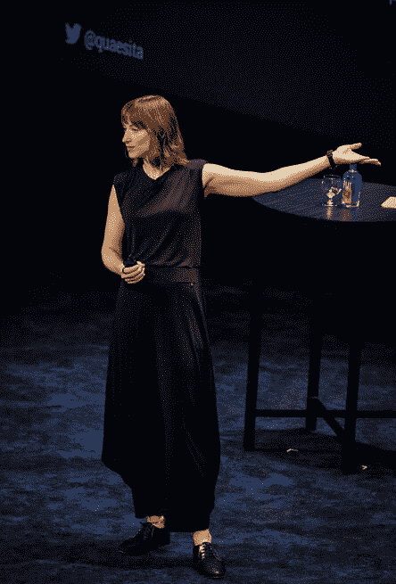

# Google 的 Kozyrkov 告诉 Rev 3,“数据科学的宇宙正在扩张”,“不可思议的”MLOps 工具正在出现

> 原文：<https://www.dominodatalab.com/blog/googles-kozyrkov-tells-rev-3-data-science-universe-is-expanding-and-incredible-mlops-tools-emerging>

在关于数据科学 及其在全球范围内改变世界的影响的 [Rev 3 会议的第二天，谷歌首席决策科学家 Cassie Kozyrkov 对 700 多名观众说:“数据科学的宇宙正在扩张，”这些观众主要由数据科学家、数据科学领导者和 IT 主管组成。如此众多的与会者——在活动的最后一个上午，会议总注册人数超过了 1000 人——证明了该行业的规模、权力和声望都在增长。](https://www.dominodatalab.com/blog/rev-3-shows-data-science-really-is-running-the-world-and-mlops-is-spurring-on-the-trend)

摇滚明星主题演讲人的名单也是如此，他们为与会者提供了各种建议，从职业发展和进步，到开发更少噪音和偏见的模型，到制药和其他行业的 IT-数据科学合作，以及如何不断改进，随着时间的推移，最终带来翻天覆地的变化。观众显然很喜欢它，在演讲结束后，演讲者们蜂拥而至，希望听到更多。

### 科济尔科夫在主题演讲后回答问题。

### 数据科学家正处于优势地位——多米诺的“不可思议的，可爱的”MLOps 支持他们

Kozyrkov 告诉热情的观众，数据科学家的优势和最近的成功导致了对他们的期望的爆炸。

“许多数据科学家有冒名顶替综合症，因为他们自己不能完成整个任务，”她说。

但是，Kozyrkov 说，一个积极的迹象是，公司正在押注于他们的数据科学团队，这是专为帮助他们获得工作所需的 MLOps 资源而设计的工具的出现。她将奥运会游泳池制造商的增长进行了类比，这些制造商最初认为，用于休闲游泳的游泳池也可以为冠军服务。随着时间的推移，随着竞技游泳运动员的数量和重要性日益增加，奥林匹克游泳池被定义并推向市场。

Kozyrkov 说，类似地，数据科学家拥有的用于提供资源和检测模型衰退等事情的原始工具相当原始，难以使用，因为它们是为其他技术职业设计的，而不是为数据科学家和他们的领导者设计的，甚至不是为试图假设他们的 IT 专业人员设计的..

但是随着数据科学变得越来越受重视，像多米诺数据实验室这样的公司正在投资工具来支持这个年轻的职业。

“我们的 Rev 3 主机，Domino 数据实验室，为数据科学家 制作了 [工具，这些工具令人难以置信，非常有用，非常可爱，”她告诉观众。"*这就是*我们数据科学社区的宣传*看起来的样子*。"](https://venturebeat.com/2022/05/05/domino-data-lab-announces-latest-mlops-platform-to-satisfy-both-data-science-and-it/)

### 卡斯·桑斯坦“督促”数据科学家实现更好的模型准确性

随着更大的权力而来的是更大的责任，哈佛大学教授卡斯·桑斯坦(Cass Sunstein)和《纽约时报》*《星球大战的世界》* 和 *敦促观众提防两个可能使他们的模型脱轨的问题:偏见和噪音。*

“偏见是错误的来源，噪音是它更安静、更年轻的兄弟，”他说。“噪音导致不公平，败坏组织的名声，成本，成本，成本，”他警告说。

例如，在医疗保健领域，Sunstein 噪音和偏见可能会导致对不需要接受心脏病等疾病测试的人进行测试，而对应该接受测试的人进行测试失败，这可能会导致负面的健康影响。

### 当好的模型变坏时

此外，桑斯坦说，当 [人工智能和人工智能模型变坏](https://www.dominodatalab.com/blog/the-principles-of-trustworthy-ai) 时的暴露会导致对*所有*人工智能和人工智能增强模型的恐惧增加。

“比起原谅模型，人们更容易原谅人为错误，”桑斯坦说。

Sunstein 建议将模型和决策分解成更小的部分以改善结果。

“超级预测者[预测高度准确的人和模型]将决策分解成组成部分，”Sunstein 说。

虽然 Sunstein 的演讲侧重于模型可能出错的方式——以及模型缓解措施的建议——但他总体上非常乐观，认为在未来几年，数据科学从业者可以比以往任何时候都更好地促进人类的最佳利益。

“在过去的 100 年里，我们有机会减少偏见和噪音，从而延长寿命，改善健康和福祉。但我们还没有看到任何东西，”桑斯坦总结道。

### 首席信息官吉姆·斯旺森:“公司押注数据科学来推动决策”

该行业的未来在其他方面看起来也很光明，整个活动的发言者都提到了过去三年需求的飞速增长。

“现在在数据科学领域有更多的机会。强生公司的首席信息官吉姆·斯旺森对听众说:“公司正押注于数据科学来推动决策。

斯旺森还承认，由此带来的对专业人士需求的增加使其成为一个热门的劳动力市场，各公司为争夺人才而激烈竞争 。在谈到科济尔科夫之前的讲话时，他提到无形资产——比如加入抗击疾病和促进人类健康的使命的愿望——往往是决定性因素。

“我不能支付凯西(在谷歌)所能支付的工资，但我可以在任务中竞争，”他对人群说，这指的是该公司作为制药和医疗保健领导者的地位。

Swanson 还表示，未来需要拥有更广泛技能的数据科学家。

“我们需要更多双语数据科学家——一部分是数据科学家，一部分是领域专家的人，”他说。

当谈到在其组织内推广数据科学时，重要的是了解公司最关心的指标，并动员数据科学的努力来支持这些目标。

“如果他们关心管道的净现值(NPV)，我们会询问一切，‘我们是否将数据科学与此相关联’，”他说。

“当他们看到对他们所关心的措施很重要的结果时，我们得到了极大的鼓舞，”Swanson 说，资源和认可更加自由地流动。这对数据科学家和整个行业都有好处。

### James Clear 建议数据科学家和他们的团队养成“原子习惯”

最后，会议以 NYT 畅销书《原子习惯》的作者 James Clear 的数据驱动的励志演讲结束。他说，考虑一下在一些相关指标上提高 1%对任何团队或个人的绩效的影响，这相当于提高了 37 倍。接下来，将它与同样时间内做了 1%的坏事进行比较；一年结束时，绩效接近于零。

Clear 说，诀窍在于建立能带来小进步的仪式，并奖励自己坚持下去。从获胜的运动队到成功的企业，Clear 说，胜利者是那些能够凭借习惯的力量保持许多小进步的人。

