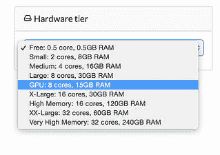
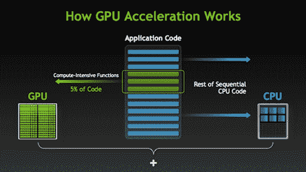
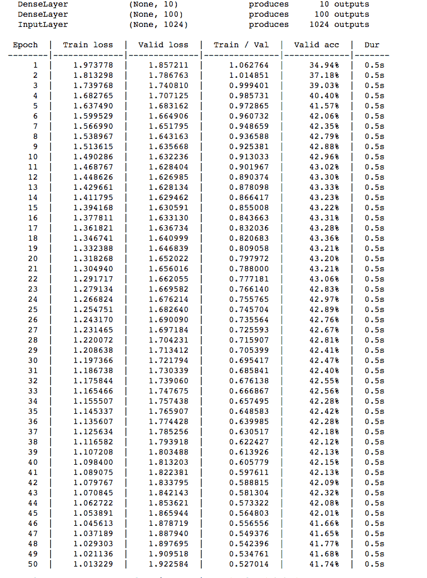
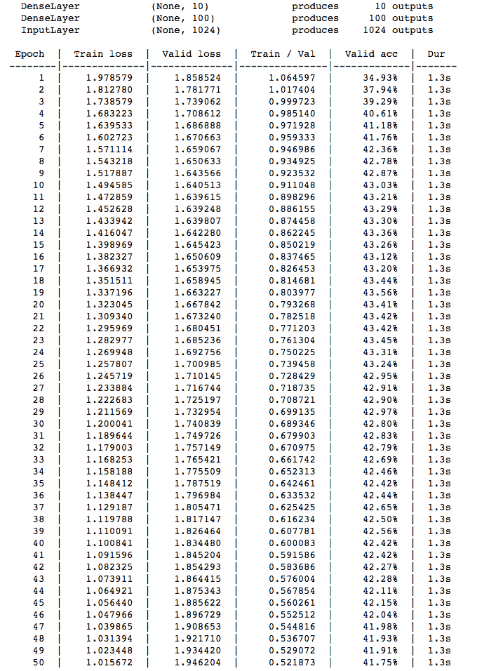
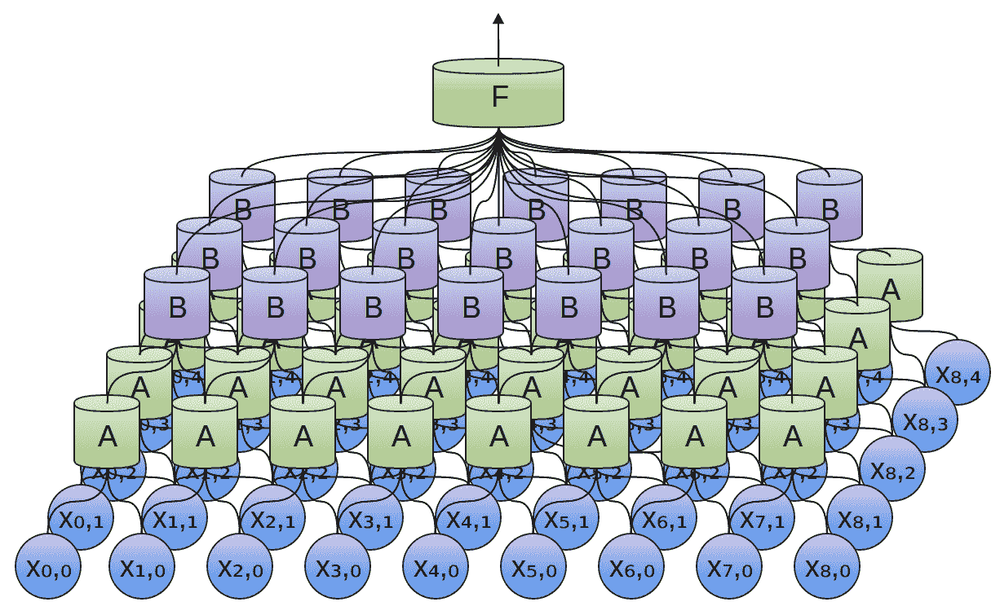
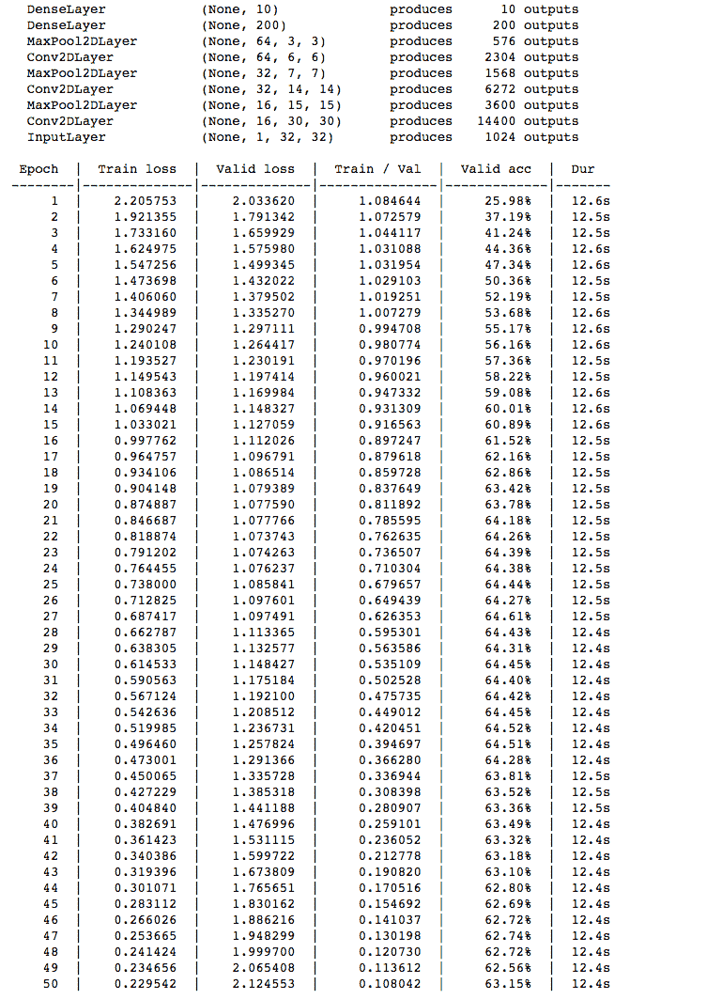
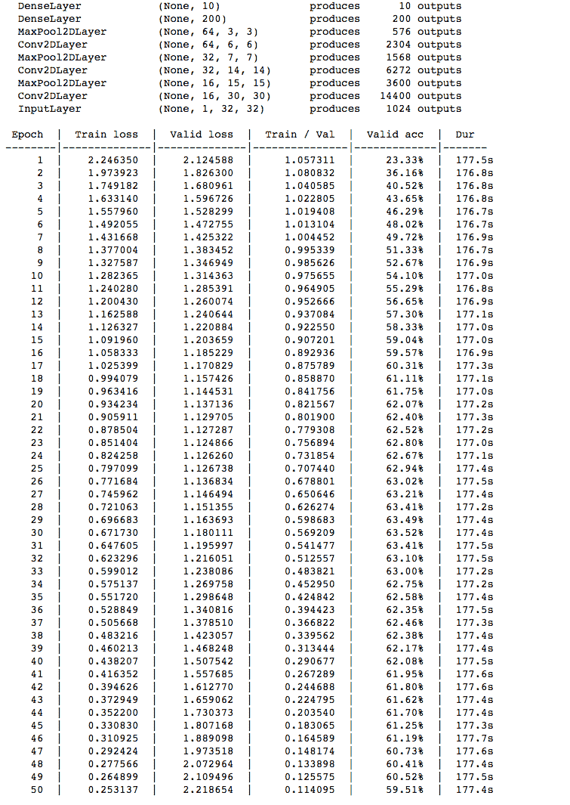

# 利用 GPU 和 Theano 实现更快的深度学习

> 原文：<https://www.dominodatalab.com/blog/gpu-computing-and-deep-learning>

Domino 最近增加了对 GPU 实例的支持。为了庆祝这一发布，我将向您展示如何:

*   配置 Python 库 Theano 来使用 GPU 进行计算。
*   用 Python 构建和训练神经网络。

使用 [GPU](https://www.dominodatalab.com/data-science-dictionary/gpu) ，我将展示我们可以比只使用 CPU 快 15 倍地训练深度信念网络，将训练时间从几小时缩短到几分钟。



## GPU 为什么有用？

当你想到高性能显卡的时候，首先想到的可能不是数据科学。然而，计算机图形学和数据科学有一个重要的共同点:矩阵！

图像、视频和其他图形被表示为矩阵，当您执行某个操作时，例如相机旋转或放大效果，您所做的只是对矩阵应用一些数学变换。

这意味着，与 CPU(中央处理器)相比，GPU 更擅长执行矩阵运算和其他高级数学转换。在某些情况下，当一个算法在 GPU 上运行时，我们会看到它有 10 倍的加速。

从基因组学到流行病学，基于 GPU 计算已经被广泛应用于各种科学领域。

最近，由于深度学习算法越来越受欢迎，机器学习中的 GPU 加速算法有所增加。深度学习是针对机器学习中的各种问题，训练基于神经网络的模型的算法集合。深度学习算法涉及计算密集型方法，如卷积、傅立叶变换和其他基于矩阵的运算，GPU 非常适合计算。占代码约 5%的计算密集型函数在 GPU 上运行，其余代码在 CPU 上运行。



*来源:[英伟达](http://www.nvidia.com/docs/IO/143716/how-gpu-acceleration-works.png)*

随着 GPU 性能和通用库中对 GPU 支持的最新进展，我建议任何对深度学习感兴趣的人都拥有一个 GPU。

现在我已经彻底激发了 GPU 的使用，让我们看看如何用它们来训练 Python 中的神经网络。

## Python 中的深度学习

Python 中实现神经网络最流行的库是 [Theano](https://github.com/aesara-devs/aesara) 。然而，严格来说，Theano 不是一个神经网络库，而是一个 Python 库，它使得实现各种各样的数学抽象成为可能。正因为如此，Theano 有很高的学习曲线，所以我将使用构建在 Theano 之上的两个神经网络库，它们的学习曲线更平缓。

第一库是[千层面](https://github.com/Lasagne/Lasagne)。这个库提供了一个很好的抽象，允许您构建神经网络的每一层，然后将这些层堆叠起来构建完整的模型。虽然这比 Theano 更好，但构建每一层然后将它们附加在另一层之上变得乏味，所以我们将使用 [Nolearn 库](https://github.com/dnouri/nolearn)，它提供了一个 [Scikit-Learn](https://www.dominodatalab.com/data-science-dictionary/sklearn) 风格的千层面 API 来轻松构建多层神经网络。

因为这些库不是 Domino 硬件的默认库，所以您需要用下面的文本创建一个 *requirements.txt* :

```py
pip install -r https://raw.githubusercontent.com/dnouri/nolearn/master/requirements.txt git+https://github.com/dnouri/nolearn.git@master#egg=nolearn==0.7.git
```

### 设置 Theano

现在，在我们可以导入千层面和 Nolearn 之前，我们需要[配置 Theano，以便它可以利用 GPU 硬件。为此，我们创建了一个*。我们的项目目录中的 anorc* 文件，内容如下:

```py
[global]

device = gpu

floatX = float32

[nvcc]
fastmath = True
```

*。文件必须放在主目录中。在您的本地机器上，这可以手动完成，但是我们无法访问 Domino 机器的主目录，所以我们将使用以下代码将文件移动到主目录:*

```py
import os
import shutil

destfile = "/home/ubuntu/.theanorc"
open(destfile, 'a').close()
shutil.copyfile(".theanorc", destfile)
```

上面的代码创建了一个空的*。主目录下的 theanorc* 文件，然后复制*的内容。将我们项目目录下的 anorc* 文件放到主目录下的文件中。

将硬件层更改为 GPU 后，我们可以使用 Theano 文档中提供的测试代码来测试 Theano 是否检测到 GPU。

```py
from theano import function, config, shared, sandbox
import theano.tensor as T
import numpy
import time

vlen = 10 * 30 * 768 # 10 x #cores x # threads per core
iters = 1000

rng = numpy.random.RandomState(22)
x = shared(numpy.asarray(rng.rand(vlen), config.floatX))
f = function([], T.exp(x))
print(f.maker.fgraph.toposort())
t0 = time.time()
for i in xrange(iters):
    r = f()
    t1 = time.time()
    print('Looping %d times took' % iters, t1 - t0, 'seconds')
    print('Result is', r)
if numpy.any([isinstance(x.op, T.Elemwise) for x in f.maker.fgraph.toposort()]):
    print('Used the cpu')
else:
    print('Used the gpu')
```

如果 Theano 检测到 gpu，上述功能将需要大约 0.7 秒的时间运行，并将显示“已使用 GPU”。否则，运行和打印“已用 cpu”将需要 2.6 秒。如果它输出这个，那么你忘了把硬件层改成 GPU。

### 数据集

对于这个项目，我们将使用包含来自 10 个不同类别的 60，000 张 32x32 彩色图像的 [CIFAR-10 图像数据集](http://www.cs.toronto.edu/~kriz/cifar.html)。


幸运的是，数据是以[腌制的](https://en.wikipedia.org/wiki/Pickle_(Python))格式来的，所以我们可以使用 helper 函数加载数据，将每个文件加载到 NumPy 数组中，以产生训练集(Xtr)、训练标签(Ytr)、测试集(Xte)和测试标签(Yte)。[以下代码]的功劳归于[斯坦福大学的 cs 231n](http://cs231n.stanford.edu/)课程工作人员。

```py
import cPickle as pickle
import numpy as np
import os
def load_CIFAR_file(filename):
    '''Load a single file of CIFAR'''
    with open(filename, 'rb') as f:
        datadict= pickle.load(f)
        X = datadict['data']
        Y = datadict['labels']
        X = X.reshape(10000, 3, 32, 32).transpose(0,2,3,1).astype('float32')
        Y = np.array(Y).astype('int32')
        return X, Y

def load_CIFAR10(directory):
    '''Load all of CIFAR'''
    xs = []
    ys = []
    for k in range(1,6):
        f = os.path.join(directory, "data_batch_%d" % k)
        X, Y = load_CIFAR_file(f)
        xs.append(X)
        ys.append(Y)
    Xtr = np.concatenate(xs)
    Ytr = np.concatenate(ys)
    Xte, Yte = load_CIFAR_file(os.path.join(directory, 'test_batch'))
    return Xtr, Ytr, Xte, Yte
```

### 多层感知器

多层感知器是最简单的神经网络模型之一。该模型由数据的输入层、应用某种数学变换的隐藏层和生成标注(分类的分类标注或回归的连续标注)的输出层组成。

在使用训练数据之前，我们需要对其进行灰度化，并将其展平为二维矩阵。此外，我们将每个值除以 255，然后减去 0.5。当我们对图像进行灰度处理时，我们将每个(R，G，B)元组转换为 0 到 255 之间的浮点值。通过除以 255，我们将灰度值归一化为区间[0，1]。接下来，我们减去 0.5 以将值映射到区间[-0.5，0.5]。现在，每个图像由一个 1024 维的数组表示，其中每个值在-0.5 和 0.5 之间。训练分类网络时，通常会将输入要素标准化为区间[-1，1]。

```py
X_train_flat = np.dot(X_train[...,:3], [0.299, 0.587, 0.114]).reshape(X_train.shape[0],-1).astype(np.float32)

X_train_flat = (X_train_flat/255.0)-0.5

X_test_flat = np.dot(X_test[...,:3], [0.299, 0.587, 0.114]).reshape(X_test.shape[0],-1).astype(np.float32)

X_test_flat = (X_test_flat/255.0)-.5
```

使用 Nolearn 的 API，我们可以很容易地创建一个具有输入、隐藏和输出层的多层感知器。 *hidden_num_units = 100* 意味着我们的隐藏层有 100 个神经元，而 *output_num_units = 10* 意味着我们的输出层有 10 个神经元，每个标签一个。在输出之前，网络应用一个 [softmax 函数](https://en.wikipedia.org/wiki/Softmax_function)来确定最可能的标签。如果网络被训练了 50 个历元，并且 *verbose = 1* ，则模型打印出每个训练历元的结果以及该历元花费的时间。

```py
net1 = NeuralNet(

    layers = [

        ('input', layers.InputLayer),

        ('hidden', layers.DenseLayer),

        ('output', layers.DenseLayer),

        ],

        #layers parameters:

        input_shape = (None, 1024),

        hidden_num_units = 100,

        output_nonlinearity = softmax,

        output_num_units = 10,

        #optimization parameters:

        update = nesterov_momentum,

        update_learning_rate = 0.01,

        update_momentum = 0.9,

        regression = False,

        max_epochs = 50,

        verbose = 1,)
```

顺便说一句，这个 API 使得构建深度网络变得很容易。如果我们想添加第二个隐藏层，我们所要做的就是将它添加到 *layers* 参数中，并指定新层中有多少个单元。

```py
net1 = NeuralNet(

	layers = [

		('input', layers.InputLayer),

		('hidden1', layers.DenseLayer),

		('hidden2', layers.DenseLayer), #Added Layer Here

		('output', layers.DenseLayer),

		],

		#layers parameters:

		input_shape = (None, 1024),

		hidden1_num_units = 100,

		hidden2_num_units = 100, #Added Layer Params Here
```

现在，正如我之前提到的 Nolearn 的 Scikit-Learn 风格 API，我们可以用 *fit* 方法来拟合神经网络。

```py
net1.fit(X_train_flat, y_train)
```

当网络在 GPU 硬件上训练时，我们看到每个训练时期通常需要 0.5 秒。



另一方面，当 Domino 的硬件设置为 XX-Large (32 核，60 GB RAM)时，每个训练周期通常需要 1.3 秒。



通过在 GPU 上训练这个网络，我们看到训练网络的速度大约提高了 3 倍。正如预期的那样，GPU 训练的网络和 CPU 训练的网络产生了类似的结果。两者都产生大约相似的 41%的验证准确率和相似的训练损失。

我们可以根据测试数据测试网络:

```py
y_pred1 = net1.predict(X_test_flat)

print("The accuracy of this network is: %0.2f" % (y_pred1 == y_test).mean())
```

我们在测试数据上取得了 41%的准确率。

### 卷积网络

卷积神经网络是一种更复杂的神经网络架构，其中一层中的神经元连接到前一层的神经元子集。因此，卷积用于汇集来自每个子集的输出。


*来源:http://colah.github.io/posts/2014-07-Conv-Nets-Modular/*

卷积神经网络由于其学习不同问题的灵活性和可扩展性，在工业和竞赛中很受欢迎。

同样，在构建卷积神经网络之前，我们必须首先对数据进行灰度转换。这一次，我们将保持图像的 32x32 形状。我修改了矩阵的行的顺序，所以每个图像现在表示为(颜色，x，y)。我再一次将特征除以 255，减去 0.5 来映射区间(-1，1)内的特征。

```py
X_train_2d = np.dot(X_train[...,:3], [0.299, 0.587, 0.114]).reshape(-1,1,32,32).astype(np.float32)

X_train_2d = (X_train_2d/255.0)-0.5

X_test_2d = np.dot(X_test[...,:3], [0.299, 0.587, 0.114]).reshape(-1,1,32,32).astype(np.float32)

X_train_2d = (X_train_2d/255.0)-0.5
```

现在我们可以构建卷积神经网络。该网络由输入层、3 个卷积层、3 个 2x2 池层、一个 200 个神经元的隐藏层以及最后的输出层组成。

```py
net2 = NeuralNet(
layers = [
    ('input', layers.InputLayer),

    ('conv1', layers.Conv2DLayer),

    ('pool1', layers.MaxPool2DLayer),

    ('conv2', layers.Conv2DLayer),

    ('pool2', layers.MaxPool2DLayer),

    ('conv3', layers.Conv2DLayer),

    ('pool3', layers.MaxPool2DLayer),

    ("hidden4", layers.DenseLayer),

    ("output", layers.DenseLayer),],

    #layer parameters:

    input_shape = (None, 1, 32, 32),

    conv1_num_filters = 16, conv1_filter_size = (3, 3), pool1_pool_size = (2,2),

    conv2_num_filters = 32, conv2_filter_size = (2, 2) , pool2_pool_size = (2,2),

    conv3_num_filters = 64, conv3_filter_size = (2, 2), pool3_pool_size = (2,2),

    hidden4_num_units = 200,

    output_nonlinearity = softmax,

    output_num_units = 10,

    #optimization parameters:

    update = nesterov_momentum,

    update_learning_rate = 0.015,

    update_momentum = 0.9,

    regression = False,

    max_epochs = 5,

    verbose = 1,

    )

```

同样，我们可以使用*拟合*方法来拟合模型。

```py
net2.fit(X_train_2d, y_train)
```

与多层感知器相比，卷积神经网络需要更长的训练时间。在启用 GPU 的情况下，大多数训练周期需要 12.8 秒才能完成。然而，卷积神经网络实现了约 63%的验证损失，击败了多层感知器的 40%的验证损失。因此，通过合并卷积层和池层，我们可以将精确度提高 20%。



在 Domino 的 XX-Large 硬件层上只有 CPU 的情况下，每个训练周期需要大约 177 秒，或者说接近 3 分钟才能完成。因此，通过使用 GPU 进行训练，我们看到训练时间加快了约 15 倍。



我们再次看到，与在 GPU 上训练的卷积神经网络相比，在 CPU 上训练的卷积神经网络具有相似的结果，具有相似的验证精度和训练损失。

当我们在测试数据上测试卷积神经网络时，我们达到了 61%的准确率。

```py
y_pred2 = net2.predict(X_test_2d)

print("The accuracy of this network is: %0.2f" % (y_pred2 == y_test).mean())
```

使用 GPU 来训练深度神经网络导致运行时加速，在这个项目中速度从 3 倍到 15 倍不等。在工业和学术界，我们经常使用多个 GPU，因为这将深度网络的训练运行时间从几周缩短到几天。

## 额外资源

[NVIDIA](http://www.nvidia.com/page/home.html) 推出了一个关于 GPU 和深度学习的[免费在线课程](https://developer.nvidia.com/deep-learning-courses)，所以那些有兴趣了解更多关于 GPU 加速的深度学习的人可以看看这个课程！

此外， [Udacity](https://www.udacity.com/) 为那些对通用 GPU 和 CUDA 编程感兴趣的人提供了一个免费的在线课程 [CUDA 编程和并行编程](https://www.udacity.com/course/intro-to-parallel-programming--cs344)。

如果你对卷积神经网络更感兴趣，*神经网络和深度学习*电子书最近发布了[关于卷积神经网络](http://neuralnetworksanddeeplearning.com/chap6.html)的一章。

我想特别感谢 Reddit 用户 sdsfs23fs，感谢他们对我在这篇博文最初版本中的错误陈述的批评和纠正。此外，这位 Reddit 用户为我提供了图像预处理步骤的代码，这大大提高了神经网络的准确性。

*编辑*:我已经更新了这个项目的 requirements.txt 文件，以克服一个由 Python 库引起的错误。新的 requirements.txt 在上面的 Python 中的*深度学习*一节中列出。