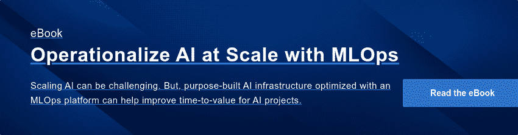

# 对 AI 认真？你需要一个 GPU 策略

> 原文：<https://www.dominodatalab.com/blog/gpu-strategy-for-ai>

当谈到扩展你的人工智能能力时，你需要更多的图形处理单元(GPU)。它们是训练你的深度学习模型的最快和最具成本效益的方式，这些模型为你的人工智能应用提供动力。GPU 的并行处理能力提升了人工智能用例的性能，从自然语言理解(NLU)——如语音识别、文本分析和虚拟代理——到计算机视觉——如缺陷检测、对象识别和面部分析。事实上，它们对于几乎所有基于非结构化和半结构化数据的人工智能应用都至关重要。

借助 GPU，您可以更快地为新的创新型人工智能应用开发更准确的深度学习模型。它们帮助您的数据科学家交付更好的业务成果，利用最新的人工智能创新，并减少在沮丧中等待模型训练工作完成的时间。然而，为了有效和大规模地利用 GPU，您需要一个 GPU 策略。这篇博客文章解释了为什么，并列出你的 GPU 策略应该解决的五个关键要素。

## 在企业范围内提供 GPU 基础设施既困难又昂贵

虽然启动云 GPU 实例和交付概念验证深度学习项目是微不足道的，但几乎所有企业都难以提供他们的数据科学团队目前需要的甚至是适度的 GPU 功能，更不用说他们在不久的将来需要的功能了。很少有数据科学家能够访问 GPU 集群，那些能够访问的科学家也陷入了耗时且容易出错的手动工作中。

公司对云供应商收取的高额 GPU 实例费和在云之间传输所需的大量数据的费用望而却步，但他们很少(如果有的话)有人才来构建和维护本地 GPU 集群。更糟糕的是，随着人工智能应用的激增、边缘计算的起飞以及非结构化数据量的指数级增长，成本和管理方面的难题将会增加。

## 高效企业 GPU 战略的五大支柱

如果这个故事听起来耳熟，那是因为它确实如此。为数据科学家提供 [GPU 基础设施的挑战类似于为应用程序开发人员提供 CPU 基础设施的历史挑战，只是难度更大。人工智能工作负载增长更快，甚至比典型的应用程序更不规则，并涉及新的硬件和软件堆栈。](https://blog.dominodatalab.com/machine-learning-gpu)

此外，该堆栈正在扩展，企业需要支持越来越多的机器学习库和分布式计算框架，以满足其数据科学家的需求。企业可以解决现有的挑战，并领先于未来的挑战，但就像人工智能本身一样，它不会自动发生。你需要一个 GPU 策略来利用 GPU 的机会。以下是您的策略应该解决的关键要素:

*   **领导力。**单个数据科学团队往往在没有 IT 支持的情况下创建 GPU 功能，这种情况屡见不鲜，要么是因为他们受实验欲望的驱使，要么是因为他们别无选择，无法完成工作。然而，这是创建孤立 GPU 功能的方法，这些功能只提供给一小部分需要它们的用户，并且在成本和工作方面是浪费的。为了构建可扩展的 GPU 能力，领导者必须拥有创建、交付和持续升级这些能力的人员、预算和责任。他们也必须得到奖励，并对结果负责。
*   **混合能力。**本地和云 GPU 各有利弊。本地 GPU 更便宜，但不灵活，而云 GPU 可以伸缩，以满足高度可变的人工智能模型训练工作。虽然访问云 GPU 一直很简单，但由于英伟达 DGX 系统等新的融合基础设施解决方案，企业现在也可以更轻松地部署和管理自己的内部 GPU 集群。迟早，每个企业都需要内部和云 GPU，并且需要实施一个集成平台来动态支持两者上的工作负载。
*   自动化和自助服务。 AI 工作负载起伏不定，项目断断续续地开始和进展。此外，用户需要的能力和环境——语言、库和框架——可能因项目而异。这足以让管理集群的人和等待其环境被调配的用户发疯。解决方案在于平台(如 Domino Data Lab ),这些平台可以自动配置和取消配置环境，并使按需访问民主化。
*   **治理和可复制性。**您的管理员需要治理工具来管理、优化您的 GPU 基础设施的使用，并防止用户无意中关闭集群或产生失控的成本。从长远来看，更重要的是通过捕获所使用的环境、数据、代码和库的所有细节来实现解决方案，以确保您的模型在部署后很长时间内都是可再现的。这些信息不仅对监管机构和客户信任至关重要，对诊断问题和持续改进也至关重要。
*   一个开放的、面向未来的建筑。在人工智能的概率世界中，没有什么是确定的，除了明天的框架、库和硬件将与今天不同。事实上，趋势不是巩固，而是向相反的方向扩散。你应该尽可能尝试并标准化你的 GPU 工具集，但你的 GPU 战略将需要一个计划来支持已经 [广泛的 AI 工具](https://blog.dominodatalab.com/tensorflow-pytorch-or-keras-for-deep-learning) ，并且需要足够开放、模块化和灵活，以便在开发新组件时进行交换。

## 速度对模型训练和竞争优势至关重要

对于每一个计划通过数据科学和人工智能实现转型的组织来说，这不是一个“如果”你的组织需要快速增长其 GPU 能力的问题，而是一个“何时”的问题。对于在人工智能应用方面走得更远的公司来说，那个“时间”已经来了又走了。这些公司要么实施战略，提供他们的数据科学团队需要的 GPU 硬件和软件，要么发现他们的人工智能雄心受到了限制。

幸运的是，现在有一些产品提供了在混合环境中利用 GPU 所必需的编排、自动化甚至自助服务功能——例如 Domino 数据实验室和 NVIDIA 之间的新 [合作。然而，为了有效地使用它们，并确保您为现在和未来的 GPU 需求建立一个面向未来的基础，您需要开始破解您的 GPU 策略。](https://www.dominodatalab.com/news/domino-data-lab-extends-enterprise-mlops-to-the-edge-with-new-nvidia-fleet-command-support)

 

*有关使用 MLOps 和 GPU 平台扩展 AI 的更多信息:*

*   下载 [利用 MLOps](https://www.dominodatalab.com/resources/operationalize-ai-at-scale-with-mlops-ventana-research) 大规模运营人工智能，了解专门构建的人工智能基础设施和 MLOps 平台的关键考虑因素。
*   阅读关于 [Domino 和 NVIDIA 2022 年春季 GTC 公告](/news/domino-data-lab-expands-collaboration-with-nvidia-and-tcs-with-new-enterprise-mlops-solutions-for-modern-it-stacks) **，**包括对 NVIDIA 舰队司令部、NVIDIA NGC 和 LaunchPad 策展实验室的新支持。
*   参见 [英伟达 2022 年春季 GTC 发布会上的多米诺会议](https://go.dominodatalab.com/gtc-march-2022) 。